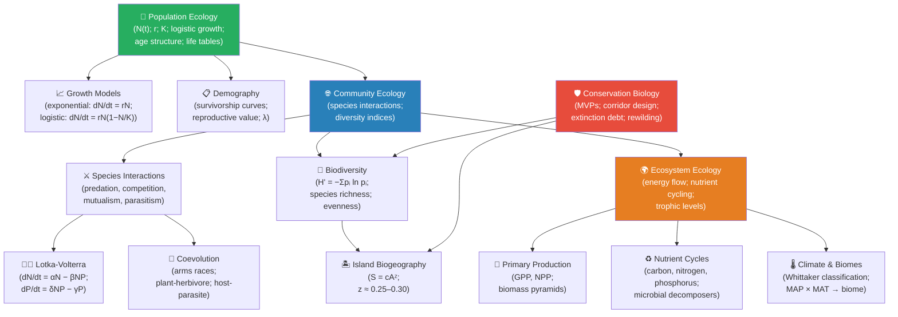

# Unit X — Ecology: Introduction {.unnumbered}


\label{sec:unit_X_unit_intro}
## Why This Unit Matters {.unnumbered}

In 1966, ecologist Robert Paine removed most sea stars (*Pisaster ochraceus*) from a stretch of rocky
intertidal shore in Washington State and waited. Within 18 months, the mussel population exploded,
crowding out barnacles, limpets, chitons, and anemones. What had been a 15-species community collapsed
to a near-monoculture of *Mytilus californianus*. The sea star was a **keystone species**: a species
whose removal from the community caused a change in biodiversity disproportionate to its own abundance.
Paine's experiment created the concept and the measurement — the ratio of effect to biomass — and it
changed how biologists think about the architecture of ecosystems (Paine, 1966, *American Naturalist*).

Ecology is the study of how organisms interact with each other and with their physical environment.
It operates across scales spanning six orders of magnitude: from the foraging decision of a single
aphid on a single leaf, to the population dynamics of wolves in Yellowstone, to the cycling of carbon
through the entire Earth system. Its models — the logistic growth equation, the Lotka-Volterra
predator-prey system, the species-area relationship — are among the most mathematically tractable in
biology, yet they govern phenomena as urgent as climate change, mass extinction, and pandemic emergence.

The 21st century has made ecology a discipline under crisis and urgent relevance. The current mass
extinction event — the sixth in Earth's history — is driven by habitat loss, overexploitation, invasive
species, pollution, and climate change. Biodiversity is losing the equivalent of tens of thousands of
species per year. Understanding population dynamics, community structure, and ecosystem function is no
longer merely academic: it is an existential scientific priority for the conservation of life on Earth.
This unit will give you the quantitative tools to understand why, and to participate in the solutions.

---

## Landmark Discoveries {.unnumbered}

| Discoverer(s) | Year | Journal / Source | Discovery | Significance |
| ------------- | ---- | ---------------- | --------- | ------------ |
| Alfred Lotka & Vito Volterra | 1925–1926 | *Elements of Physical Biology*; *Mem. Accad. Lincei* | Lotka-Volterra predator-prey ODEs | First quantitative model of species interactions; linked ecology to mathematics |
| Eugene Odum | 1953 | *Fundamentals of Ecology* | Ecosystem as unit of ecology with energy flow | Introduced energy-flow and trophic-level thinking into mainstream ecology |
| Robert Paine | 1966 | *American Naturalist* | Keystone species concept (sea star experiment) | Showed top-down regulation; single species can structure entire communities |
| Robert MacArthur & E.O. Wilson | 1967 | *The Theory of Island Biogeography* | Island biogeography: $S = cA^z$ | Connected species richness to area and isolation; foundational for conservation |
| Paul Ehrlich & Peter Raven | 1964 | *Evolution* | Coevolution between plants and butterflies | Launched chemical ecology and co-evolutionary theory |
| Intergovernmental Science-Policy Platform on Biodiversity (IPBES) | 2019 | IPBES Global Assessment | 1 million species threatened with extinction | Quantified the biodiversity crisis; policy-science interface |
| Ripple et al. | 2014 | *Science* | Trophic cascades from large predators | Wolves reintroduced to Yellowstone reshaped rivers via trophic cascade |

---

## Key Concepts and Connections {.unnumbered}


<!-- alt: Graph showing ecology concept map — green = population; blue = community; orange = ecosystem; red = conservation. -->

*Ecology concept map — green = population; blue = community; orange = ecosystem; red = conservation.*

---

## Current Evidence Thread {.unnumbered}

Read this unit as a chain of ecological evidence rather than a list of topics: population, community, ecosystem, and conservation claims are each backed by a characteristic kind of measurement — field sampling and mark-recapture, manipulative and observational experiments, remote sensing and flux networks, dynamical and statistical models, and long-term monitoring programs. Ecology and conservation decisions increasingly combine field data, remote sensing, community knowledge, model uncertainty, and explicit values. As you
move through the chapters, keep a two-column note: **claim** on the left,
**evidence that would change my confidence** on the right. By the end of the
unit, each major idea should be tied to a measurement, model, citation, or
paper-based lab decision.

## Chapter Roadmap {.unnumbered}

| Chapter | Title | Core Question | Key Equation / Model |
| ------- | ----- | ------------- | -------------------- |
| **32** | Population Ecology | How do populations grow, and what factors regulate population size? | Logistic: $dN/dt = rN(1-N/K)$; life tables; $\lambda = e^r$ |
| **33** | Community Ecology | How do species interactions structure biological communities? | Lotka-Volterra: $dN/dt = \alpha N - \beta NP$; Shannon $H'$ |
| **34** | Ecosystem Ecology | How does energy flow and how do nutrients cycle through ecosystems? | Trophic efficiency ~10%; $NEP = GPP - R_{total}$; biogeochemical cycle models |
| **35** | Biomes and Conservation Biology | What determines global patterns of biodiversity, and how do we protect them? | Species-area: $S = cA^z$; minimum viable population (MVP); extinction rate models |

---

## Connections Across the Textbook {.unnumbered}

- **Population models** (logistic growth, age structure) use the same differential equation framework as \nameref{sec:unit_VII_unit_intro} (SIR epidemiological models) — ecology and epidemiology are mathematically unified.
- **Species diversity indices** (Shannon $H'$, Simpson $D$) are computed using tools from \nameref{sec:unit_VII_unit_intro} (microbial communities) and help evaluate ecosystem health.
- **Nutrient cycling** (nitrogen, carbon, phosphorus) directly ties to \nameref{sec:unit_III_unit_intro} (carbon fixation by photosynthesis) and \nameref{sec:unit_VII_unit_intro} (microbial decomposers, nitrogen fixation by bacteria).
- **Climate change impacts** on biomes connect to \nameref{sec:unit_VIII_unit_intro} (plant responses to drought, CO₂ enrichment) and \nameref{sec:unit_VI_unit_intro} (evolution of species under selection by climate).
- **Conservation biology** uses evolutionary genetics (\nameref{sec:unit_VI_unit_intro}: effective population size, genetic rescue) and macroecology (island biogeography, keystone species).

> **Key vocabulary introduced here:** intrinsic rate of increase ($r$), carrying capacity ($K$), logistic growth, density dependence, keystone species, trophic cascade, competitive exclusion, fundamental vs. realised niche, coevolution, mutualism, parasitism, primary productivity (GPP, NPP), trophic efficiency, biogeochemical cycle, biome, species-area relationship, island biogeography, minimum viable population (MVP), extinction debt.


## Computational Toolbox — Unit X {.unnumbered}

```python
from biology.ecology import logistic_growth, lotka_volterra

# Logistic growth: white-tailed deer reintroduction (r = 0.35/yr, K = 500, N0 = 10)
lg = logistic_growth(N0=10.0, r=0.35, K=500.0, t_end=30.0, steps=300)
print(f"N(0) ≈ {lg.populations[0]:.0f}; N(t_end) ≈ {lg.populations[-1]:.0f}")

# Lotka-Volterra predator-prey (same ODEs used in community ecology)
lv = lotka_volterra(
    100.0, 10.0, 0.5, 0.02, 0.01, 0.2, t_end=80.0, steps=800,
)
print(f"Prey range: {min(lv.prey):.1f}–{max(lv.prey):.1f}")
print(f"Predator range: {min(lv.predator):.1f}–{max(lv.predator):.1f}")
```

> **Try it yourself:** Increase `beta` (predation) and watch oscillation amplitude widen in `plot_lotka_volterra` output from `scripts/generate_figures.py`.

---

*Source note: ecology helpers support logistic and Allee growth, predator-prey cycles, species-area curves, biodiversity indices, and biome data.*
*Figures: `src/visualization/` (Lotka-Volterra cycles, logistic growth curves); `src/mermaid/biology_diagrams.py` (food web diagrams, nutrient cycle diagrams).*

## Cross-Unit Integration {.unnumbered}

\nameref{sec:unit_X_unit_intro} closes the textbook by returning to where \nameref{sec:unit_0_unit_intro} began. The energy flow through trophic levels, the biogeochemical cycling of carbon and nitrogen, the entropy export from living ecosystems, and the constraint that ten percent of energy is transferred between trophic levels are direct expressions of the thermodynamic and systems principles introduced in \nameref{sec:unit_0_unit_intro} — open dissipative systems, far-from-equilibrium organization, hierarchical structure, and the shared energetic cost of maintaining low-entropy states. Population dynamics, community assembly, and ecosystem succession are complex-adaptive-system phenomena at landscape scale; alternative stable states and tipping points in ecosystems are the same attractor and bifurcation mathematics from \cref{sec:unit_0_complex_adaptive_systems} applied to a planetary substrate. Read this unit as the macroscopic completion of the framework: the biology of complexity, written on the largest available canvas.
