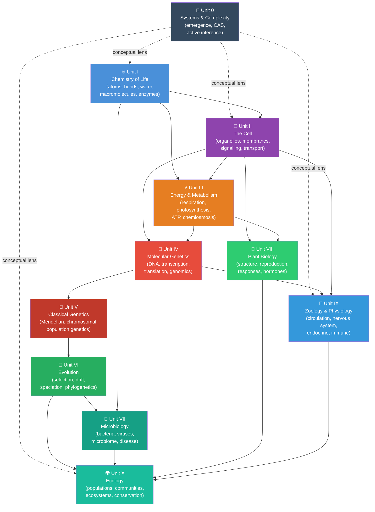

<!-- render:skip-beamer -->

---
# Front matter metadata — read by biology_analysis.py and scripts/03_render_pdf.py
# This file is rendered before the Preface and all chapters.
front_matter: true
page_break_after: true
---

# Front Matter {.unnumbered}

## Dedication {.unnumbered}

*To most students who encounter biology not as a collection of facts,  
but as a living, computable, mathematically rich discipline —  
and to those who show them the way.*

\vspace{2em}

*And to the open-science community whose shared code, data, and scholarship  
made a freely available, computationally grounded textbook possible.*

\newpage

---

## Acknowledgements {.unnumbered}

The author gratefully acknowledges the following contributions and sources of
inspiration:

**Scientific foundations.** This textbook builds on the foundational scholarship of
Alberts et al. (*Molecular Biology of the Cell*), Campbell & Reece (*Biology*),
Stryer (*Biochemistry*), Lodish et al. (*Molecular Cell Biology*), the primary
literature cited throughout each chapter, and a variety of other sources. 
Specific experimental results are cited at point of use with full author credit. 
The structure of this textbook is informed by the open curriculum [OpenStax Biology 2e](https://openstax.org/details/books/biology-2e) and the [QUBES Hub](https://qubeshub.org/) community of quantitative biology educators.

**Computational tools and open source.** All figures were generated with
[Matplotlib](https://matplotlib.org/) and [NumPy](https://numpy.org/).
Mermaid process diagrams were rendered with the
[Mermaid CLI](https://github.com/mermaid-js/mermaid-cli).
The textbook pipeline uses [Pandoc](https://pandoc.org/) and
[LaTeX](https://www.latex-project.org/) for PDF rendering.
Scholarship was enriched using [Perplexity](https://www.perplexity.ai/)
AI-assisted literature searches.

**Research project template.** The build pipeline, testing infrastructure, and
multi-project architecture are based on the Research Project Template
maintained in the [Research Project Template repository](https://github.com/docxology/template).
This textbook’s sources, figures, and tests live in the dedicated book repository
[biology textbook source repository](https://github.com/docxology/biology_textbook).
The template is a comprehensive framework for reproducible research, including
version control, testing, documentation, and publication. It is a model for
this work, and the template is used to build this textbook.

\newpage

---

## About This Textbook {.unnumbered}

### Computational Philosophy {.unnumbered}

*Introduction to Biology* integrates narrative explanation with quantitative models.
When a chapter introduces a model (enzyme kinetics, predator–prey dynamics, action
potentials), the corresponding computation is implemented in the accompanying Python
modules and used to generate figures where appropriate.

This approach aims to help students move between mechanisms, measurements, and
models: what a system does, how we know, and what a simple quantitative model can
predict (and where it breaks).

### What Makes This Textbook Different {.unnumbered}

| Feature | This Textbook | Traditional Textbook |
| ------- | ------------- | -------------------- |
| **Figures** | Generated from mathematical models; reproducible | Static graphics |
| **Equations** | Derived and numerically validated | Stated without derivation |
| **Code** | Python modules for every major model | Absent |
| **Diagrams** | Mermaid process diagrams; automatically rendered | Hand-drawn |
| **Opening vignettes** | Landmark experiment narrative opening each chapter | Absent |
| **Curriculum map** | Generated chapter/lab/question/standards alignment | Usually external |
| **Master glossary** | 220 terms with etymology and chapter cross-references | Chapter-end lists |
| **Open access** | CC BY 4.0; fully open source | Copyright restricted |
| **Citations** | Inline, with year and journal | Often chapter-end primarily |

### How to Navigate This Book {.unnumbered}

<!-- toc-navigation-start -->
The textbook is organized from systems-level orientation through molecular,
cellular, organismal, evolutionary, and ecological scales. The entries below
are generated from `manuscript/config.yaml` so navigation stays aligned with
the rendered table of contents.

- **Unit 0 — Systems Science and the Biology of Complexity:** Systems Science and the Logic of Emergence; Complex Adaptive Systems; Active Inference and the Free Energy Principle.
- **Unit I — Chemistry of Life:** Atoms, Molecules, and Chemical Bonds; Water — The Molecule of Life; Biological Macromolecules; Enzymes and the Kinetics of Catalysis.
- **Unit II — The Cell:** Cell Theory and Cell Types; Cell Structure and Organelles; Membrane Structure and Transport; Cell Signalling and Communication.
- **Unit III — Energy and Metabolism:** Bioenergetics and Cellular Respiration; Photosynthesis; Metabolic Integration and Regulation.
- **Unit IV — Molecular Genetics:** DNA Replication and the Cell Cycle; Gene Expression — Transcription and Translation; Mutations, CRISPR, and Genomics; Epigenetics and Gene Regulation.
- **Unit V — Classical Genetics and Heredity:** Mendelian Genetics and Heredity; Chromosomal Inheritance and Linkage; Population Genetics and Hardy-Weinberg Equilibrium.
- **Unit VI — Evolution:** Evolution — Theory, Natural Selection, and Adaptation; Genetic Drift, Gene Flow, and Speciation; Phylogenetics and the Tree of Life.
- **Unit VII — Microbiology:** Bacteria, Archaea, and Viruses; Microbial Ecology and the Microbiome; Infectious Disease and Immunity.
- **Unit VIII — Botany — Plant Biology:** Plant Structure, Water Relations, and Transport; Plant Reproduction and Development; Plant Responses to the Environment.
- **Unit IX — Zoology and Systems Physiology:** Circulation, Respiration, and Homeostasis; Nervous System and Neural Signalling; Action Potentials and Synaptic Transmission; Endocrine and Immune Systems.
- **Unit X — Ecology:** Population Ecology and Growth Models; Community Ecology and Species Interactions; Ecosystem Ecology and Biogeochemical Cycles; Biomes and Conservation Biology.
- **Laboratory activities:** one companion lab follows each chapter in the
same canonical order.
- **Question banks:** one 30-item question bank follows each chapter in the
same canonical order.
- **Appendix A — Curriculum Map:** reference material generated or ordered from the same manifest.
- **Appendix B — Instructor Orchestration Guide:** reference material generated or ordered from the same manifest.
- **Appendix C — Mathematical Review for Biology:** reference material generated or ordered from the same manifest.
- **Appendix D — Units, Physical Constants, and Biological Ranges:** reference material generated or ordered from the same manifest.
- **Appendix E — A Periodic Table for Biology:** reference material generated or ordered from the same manifest.
- **Appendix F — Master Glossary of Biological Terms:** reference material generated or ordered from the same manifest.
- **Appendix G — Index of Key Terms:** reference material generated or ordered from the same manifest.
- **Source modules:** `src/biology/<domain>/` contains the tested Python
implementations for the quantitative models used throughout the book.
<!-- toc-navigation-end -->

### Suggested reading paths {.unnumbered}

| Path | Units / emphasis | Notes |
| ---- | ---------------- | ----- |
| **AP / first-year survey** | I, II, III, IV (selections), V, VI (selections), X | Skim Unit 0; prioritise metabolism and genetics core narratives. |
| **Pre-health / majors** | Full I–IX + X; Unit 0 as orientation | Add labs for quantitative skills; pair each physiology chapter with its Python bridge. |
| **Ecology / environmental focus** | I–II (review), III (photosynthesis), VI, VII, X | Emphasise population models, biogeochemistry, conservation metrics in `ecology.py`. |
| **Computation-first** | Unit 0 + any unit | Read “Bridge to computation” blocks first, then narrative; run `scripts/generate_figures.py`. |

### Notation and conventions {.unnumbered}

- **Logarithms:** $\ln$ = natural log; $\log_{10}$ used where orders of magnitude matter (pH, viral titre, doubling time).
- **Concentrations:** square brackets $[X]$ denote molarity unless a chapter states otherwise.
- **Genetics:** italic gene symbols (*lacZ*); protein products often Roman with capital initial (LacZ) where conventional.
- **Units:** SI base units; physiology at 37 °C, pH 7.4, sea level unless noted.
- **Chapter numbers** in the glossary and cross-links match the PDF table of contents (sequential numbering from `config.yaml`, including Unit 0 when present).

### Scholarship and source practice {.unnumbered}

Biology changes because methods change: better microscopes, longer reads,
larger cohorts, improved models, and more inclusive sampling can most revise a
claim that once looked settled. When reading this book, treat every important
statement as part of a source chain:

| Source type | Best use | Question to ask |
| --- | --- | --- |
| Primary research article | Evidence for a specific method, dataset, result, or mechanism | What exactly was measured, and in which organism, cell type, population, or environment? |
| Review or textbook synthesis | Orientation across a field or controversy | Which primary findings does the synthesis depend on, and are any newer results likely to change it? |
| Public dataset or database | Reusable evidence for comparison, reanalysis, and reproducibility | How were samples selected, processed, filtered, and annotated? |
| Institutional report or guideline | Current public-health, clinical, biodiversity, or policy status | What date, jurisdiction, and decision context does the guidance assume? |
| Model or simulation | A testable simplification of a mechanism | Which assumptions, parameters, or boundary conditions would change the conclusion? |

For recent or numeric claims, prefer the source closest to the measurement and
write one sentence naming what would change your confidence. For example, a
claim about antimicrobial resistance should identify the organism-resistance
pair, surveillance population, and selection pressure; a claim about
biodiversity loss should separate population trends, extinction risk, land-use
drivers, and value judgments. This is why chapter answer keys ask for both a
core response and a scholarship check.

### Textbook Concept Map {.unnumbered}

The **eleven** instructional blocks of this textbook (Unit 0 plus Units I–X) form an interdependent architecture. The diagram below shows primary dependency paths and integrative threads.

<!-- alt: Graph showing figure FM-1. Dependency map: Unit 0 (dashed links) is a conceptual scaffold for feedback, emergence, and inference — not a prerequisite for reading Unit I in detail, but useful orientation. Solid arrows show content dependencies among Units I–X. Units I–III provide the molecular foundation; IV–VI the hereditary and evolutionary framework; VII–IX apply these to major organismal groups; Unit X integrates at the population-to-biosphere scale. -->

*Figure FM-1. Dependency map: **Unit 0** (dashed links) is a conceptual scaffold for feedback, emergence, and inference — not a prerequisite for reading Unit I in detail, but useful orientation. Solid arrows show content dependencies among Units I–X. Units I–III provide the molecular foundation; IV–VI the hereditary and evolutionary framework; VII–IX apply these to major organismal groups; Unit X integrates at the population-to-biosphere scale.*

### Accessing source materials {.unnumbered}

| Resource | Location |
| -------- | -------- |
| **Living source (Git)** | [biology textbook source repository](https://github.com/docxology/biology_textbook) — manuscript Markdown, `src/biology/` modules, maintenance scripts, and tests |
| **Archival citation (DOI)** | [Zenodo archival DOI record](https://doi.org/10.5281/zenodo.20286478) — cite this record for a fixed edition snapshot |
| **Combined PDF / HTML** | Build from the repository with `uv run python scripts/03_render_pdf.py --project biology_textbook` (from the template root) or the project’s `biology_analysis.py` workflow |
| **Figures and diagrams** | `scripts/generate_figures.py` (matplotlib) and `scripts/generate_diagrams.py` (registered Mermaid); inline Mermaid in chapters renders during PDF preprocessing |
| **Corrections and extensions** | Open an issue or pull request on the book repository; substantive edits should keep chapter `\cref` labels and `config.yaml` ordering in sync |

Text is licensed **CC BY 4.0**; source code is **Apache-2.0** (see `manuscript/config.yaml` → `book`).

## Course Planning Grid {.unnumbered}

The table below provides a per-chapter difficulty rating (Level 1/3 to Level 3/3), an
estimated student reading time, and a suggested lecture allotment. It is
auto-generated by ``scripts/insert_chapter_metadata.py`` from the
canonical table of contents in ``manuscript/config.yaml`` plus
``src/biology/chapter_metadata.py`` — edit those sources and re-run the
script to refresh this grid.

<!-- course-planning-grid-start -->
| # | Unit | Chapter | Difficulty | Reading | Lecture |
|---|------|---------|------------|---------|---------|
| 0 | 0 | Systems Science and the Logic of Emergence | Level 2/3 | 35 min | 50 min |
| 0 | 0 | Complex Adaptive Systems | Level 2/3 | 35 min | 50 min |
| 0 | 0 | Active Inference and the Free Energy Principle | Level 3/3 | 45 min | 75 min |
| 1 | I | Atoms, Molecules, and Chemical Bonds | Level 1/3 | 40 min | 50 min |
| 2 | I | Water — The Molecule of Life | Level 1/3 | 40 min | 50 min |
| 3 | I | Biological Macromolecules | Level 2/3 | 55 min | 75 min |
| 4 | I | Enzymes and the Kinetics of Catalysis | Level 3/3 | 60 min | 75 min |
| 5 | II | Cell Theory and Cell Types | Level 1/3 | 45 min | 50 min |
| 6 | II | Cell Structure and Organelles | Level 2/3 | 50 min | 75 min |
| 7 | II | Membrane Structure and Transport | Level 2/3 | 50 min | 75 min |
| 8 | II | Cell Signalling and Communication | Level 3/3 | 55 min | 75 min |
| 9 | III | Bioenergetics and Cellular Respiration | Level 3/3 | 60 min | 100 min |
| 10 | III | Photosynthesis | Level 2/3 | 55 min | 75 min |
| 11 | III | Metabolic Integration and Regulation | Level 3/3 | 60 min | 100 min |
| 12 | IV | DNA Replication and the Cell Cycle | Level 2/3 | 55 min | 75 min |
| 13 | IV | Gene Expression — Transcription and Translation | Level 2/3 | 60 min | 100 min |
| 14 | IV | Mutations, CRISPR, and Genomics | Level 2/3 | 55 min | 75 min |
| 15 | IV | Epigenetics and Gene Regulation | Level 3/3 | 50 min | 75 min |
| 16 | V | Mendelian Genetics and Heredity | Level 2/3 | 65 min | 100 min |
| 17 | V | Chromosomal Inheritance and Linkage | Level 2/3 | 60 min | 75 min |
| 18 | V | Population Genetics and Hardy-Weinberg Equilibrium | Level 3/3 | 75 min | 100 min |
| 19 | VI | Evolution — Theory, Natural Selection, and Adaptation | Level 2/3 | 60 min | 75 min |
| 20 | VI | Genetic Drift, Gene Flow, and Speciation | Level 3/3 | 60 min | 75 min |
| 21 | VI | Phylogenetics and the Tree of Life | Level 3/3 | 60 min | 100 min |
| 22 | VII | Bacteria, Archaea, and Viruses | Level 2/3 | 65 min | 75 min |
| 23 | VII | Microbial Ecology and the Microbiome | Level 2/3 | 60 min | 75 min |
| 24 | VII | Infectious Disease and Immunity | Level 2/3 | 60 min | 75 min |
| 25 | VIII | Plant Structure, Water Relations, and Transport | Level 2/3 | 55 min | 75 min |
| 26 | VIII | Plant Reproduction and Development | Level 2/3 | 55 min | 75 min |
| 27 | VIII | Plant Responses to the Environment | Level 2/3 | 55 min | 75 min |
| 28 | IX | Circulation, Respiration, and Homeostasis | Level 3/3 | 60 min | 100 min |
| 29 | IX | Nervous System and Neural Signalling | Level 3/3 | 55 min | 75 min |
| 30 | IX | Action Potentials and Synaptic Transmission | Level 3/3 | 55 min | 100 min |
| 31 | IX | Endocrine and Immune Systems | Level 2/3 | 55 min | 75 min |
| 32 | X | Population Ecology and Growth Models | Level 3/3 | 75 min | 100 min |
| 33 | X | Community Ecology and Species Interactions | Level 2/3 | 80 min | 100 min |
| 34 | X | Ecosystem Ecology and Biogeochemical Cycles | Level 2/3 | 65 min | 75 min |
| 35 | X | Biomes and Conservation Biology | Level 2/3 | 70 min | 75 min |
| | | **Totals** | | **2150 min (35 h)** | **2975 min (49 h)** |
<!-- course-planning-grid-end -->

\newpage
\newpage
