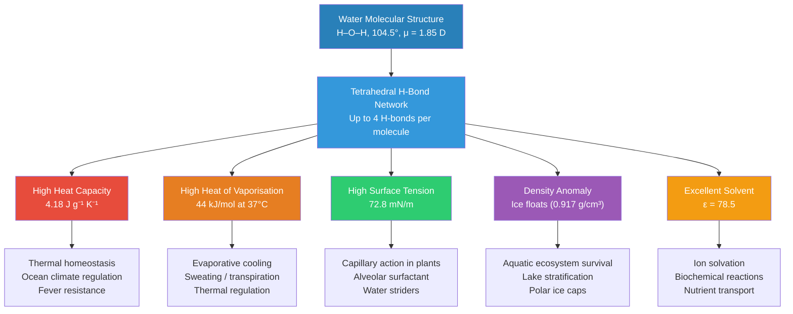
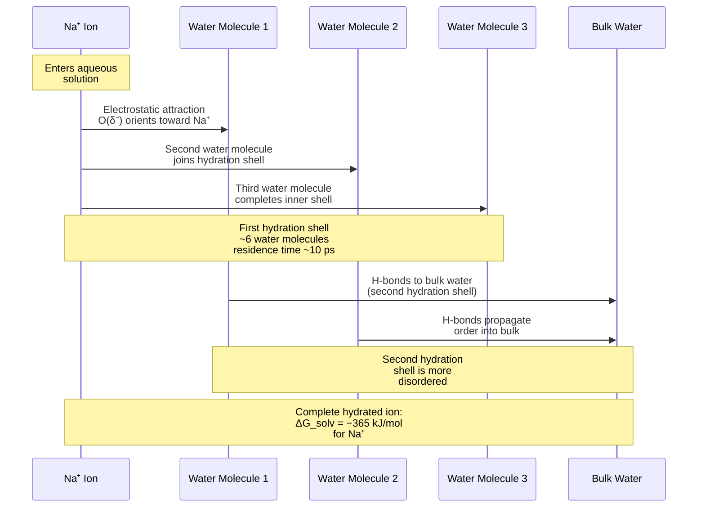
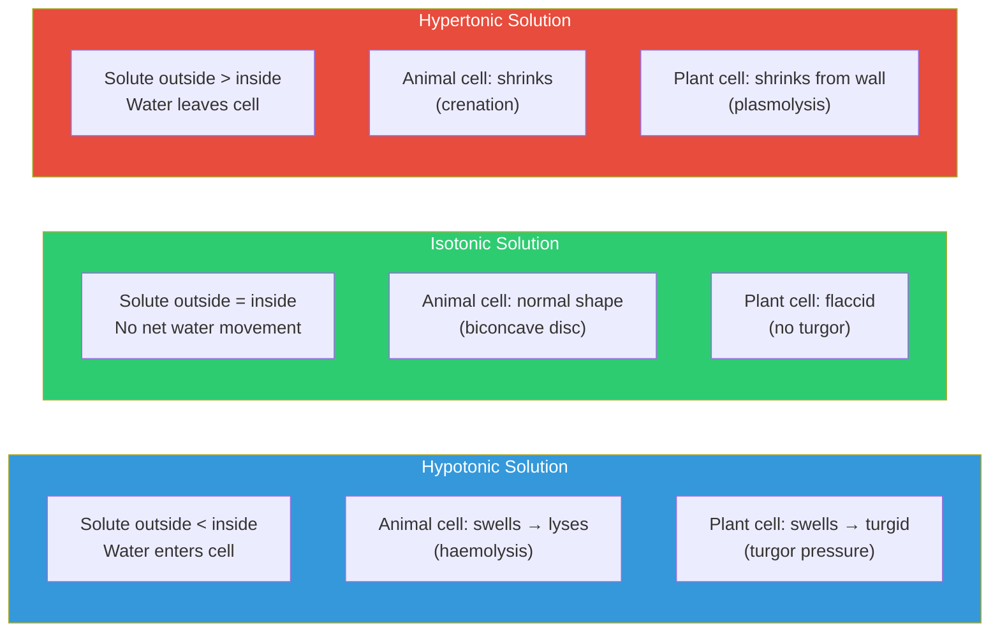

<!-- render:skip-beamer -->

# Water — The Molecule of Life

\label{sec:unit_I_water_and_life}


<!-- chapter-metadata-badge -->
> **Ch 2** · Level 1/3 · 40 min read · 50 min lecture · Prerequisites: \cref{sec:unit_I_atoms_molecules}

## Learning Objectives

1. Explain how water's polarity generates its unusual physical properties.
2. Describe hydrophilic and hydrophobic interactions and their importance in cell architecture.
3. Quantify osmotic pressure using the van 't Hoff equation and derive it from first principles.
4. Apply Fick's First Law to describe diffusion across membranes with multiple biological applications.
5. Relate water's properties to [**homeostasis**](#gl:homeostasis) and adaptation in living organisms.
6. Describe the structure and function of aquaporins and their clinical significance.
7. Explain colligative properties and their relevance to antifreeze organisms and cryobiology.
8. Define water activity and explain its importance for food science and microbiology.

<!-- curriculum-scaffold-start -->
### Study Blueprint

- **Big idea:** Water's polarity, hydrogen bonding, and ionization make cells physically possible.
- **Core concepts:** hydrogen bonding, cohesion, pH, buffers.
- **Framework alignment:** Vision & Change: Structure and function, Pathways and transformations of energy and matter; AP Biology: Energetics, Systems Interactions; NGSS-style topics: Matter and Energy in Organisms and Ecosystems, Structure and Function.
- **Model or quantitative lens:** Henderson-Hasselbalch and pH-scale calculations.
- **Data skill:** Convert between pH, hydrogen ion concentration, and buffer ratios.
- **Practice cadence:** Concept Explanation, Statistical Tests and Data Analysis, Argumentation.
- **Common misconception to repair:** Water is not an inert background; it is an active participant in structure and reaction chemistry.
- **Primary lab:** \cref{sec:lab_unit_I_water_and_life}.
- **Question bank:** \cref{sec:q_unit_I_water_and_life}.
- **Transfer task:** Transfer water-property reasoning to blood buffering, plant transport, or protein folding.
- **Bridge to computation:** `biology.biochemistry.biochemistry.atp_free_energy`.
<!-- curriculum-scaffold-end -->

---

> **Opening Vignette: Life at the Boiling Point — and Below Zero**
>
> Water boils at 100 °C and freezes at 0 °C. By every prediction from homologous compounds —
> hydrogen sulfide (H₂S, boiling point −60 °C), hydrogen selenide (H₂Se, bp −41 °C) — water
> "should" be a gas at room temperature. It is not, and that deviation is why you are alive. The
> anomalous boiling point of water arises entirely from [**hydrogen bond**](#gl:hydrogen-bond)s: each water molecule can
> donate two and accept two H-bonds, creating a dynamic, three-dimensional network that requires
> exceptional energy to disrupt. That high specific heat capacity (4.18 J/g·°C) [**buffer**](#gl:buffer)s organisms
> against temperature swings. The high heat of vaporisation (2,260 J/g) makes sweating an
> efficient coolant — a marathon runner loses ~1.5 L/hour but keeps their core temperature
> within 1 °C.
>
> In 2012, scientists drilling into Lake Vostok — buried 3.7 km beneath Antarctic ice under
> 350 atmospheres of pressure — recovered microbial DNA from supercooled water isolated from the
> atmosphere for 15 million years (Rogers et al., 2013, *PLOS ONE*). Life persisted in near-freezing
> darkness, sustained by water's extraordinary properties. Everything in this chapter explains why.
>
> *Primary source: Rogers, S. O. et al. (2013). Physiology and phylogeny of microorganisms from Lake Vostok. PLOS ONE, 8(2), e56136.*

---


Among known molecules on Earth, liquid water is unusually well suited as the solvent of life. It is the most abundant molecule in living cells (~70% of cell mass), and metabolism depends on water as solvent, reactant, product, or thermal buffer. The following properties --- each a direct consequence of its molecular structure --- make water biologically hard to substitute.

Water is so central to biology that astrobiologists use the mantra "follow the water" when searching for extraterrestrial life. Every known form of life requires liquid water, and the "habitable zone" around a star is defined primarily by the temperature range permitting liquid water on a planet's surface.

---

## Molecular Structure and Polarity

The water molecule consists of one oxygen atom covalently bonded to two hydrogen atoms. The O--H bond length is 0.096 nm; the H--O--H bond angle is **104.5 degrees** (less than the tetrahedral \citep{henderson1913} 109.5 degrees because the two lone pairs compress the bonding pairs, as predicted by VSEPR theory).

Oxygen's high [**electronegativity**](#gl:electronegativity) (3.44 vs. H = 2.20) generates **partial charges**: $\delta^-$ on oxygen and $\delta^+$ on each hydrogen. The resulting dipole moment (μ = 1.85 Debye) is one of the largest for any small molecule.

Each water molecule can form **up to four hydrogen bonds**: two as a hydrogen-bond donor (through its two O--H hydrogens) and two as a hydrogen-bond acceptor (through its two lone pairs). This tetrahedral hydrogen bonding network gives rise to many of water's exceptional properties.


<!-- alt: Flowchart showing water structure and hydrogen bonding. Water's molecular structure gives rise to a tetrahedral hydrogen-bonding network, which in turn produces five extraordinary physical properties. Each property has direct biological consequences. -->

*Water structure and hydrogen bonding. Water's molecular structure gives rise to a tetrahedral hydrogen-bonding network, which in turn produces five extraordinary physical properties. Each property has direct biological consequences.*

### The Hydrogen Bond Network in Detail

In liquid water at 25 degrees C, each molecule forms an average of ~3.4 hydrogen bonds at any instant (out of a maximum 4). These bonds are dynamic, with a lifetime of approximately 1--20 picoseconds. The entire hydrogen bond network rearranges on a timescale of ~1 ps --- meaning water is simultaneously highly structured and highly dynamic.

In ice, the hydrogen bond network is fully realised: every molecule forms exactly 4 hydrogen bonds in a perfect tetrahedral geometry, creating a hexagonal lattice. This explains both the lower density of ice and the hexagonal symmetry of snowflakes.

**Quantitative dynamics of the H-bond network.** Modern femtosecond infrared spectroscopy has measured several timescales that govern water's behaviour:

| Process | Timescale | Biological relevance |
| ------- | --------- | -------------------- |
| O--H stretch vibration | ~10 fs | Vibrational coupling of H-bond network |
| Single H-bond lifetime (exchange) | 1--3 ps | Faster than enzyme turnover; water "lubricates" catalysis |
| Translational diffusion (1 nm) | ~50 ps | Sets viscous drag on macromolecules |
| Hydration shell residence time at protein surface | 10 ps -- 1 ns | Couples to protein backbone fluctuations |
| Tightly bound waters (buried in protein) | μs -- ms | Visible in X-ray structures; contribute to specificity |
| Bulk-water dielectric relaxation | ~8 ps | Determines $\varepsilon$ at MHz/GHz |

Each water molecule undergoes ~10$^{12}$ H-bond rearrangements per second --- an extraordinary churn that nevertheless preserves the average network structure. Biological molecules effectively "swim" through this fluctuating cage; their conformational dynamics are intimately coupled to the surrounding water (the "slaving" model of protein dynamics).

> **Concept Check 1:** If each water molecule in liquid water forms an average of 3.4 hydrogen bonds and each hydrogen bond is shared between two molecules, how many hydrogen bonds exist per mole of liquid water?

---

## Physical Properties Explained by Hydrogen Bonding

### High Heat Capacity ($C_p$ = 4.18 J g$^{-1}$ K$^{-1}$)

Heating water requires breaking hydrogen bonds before kinetic energy of [**translation**](#gl:translation)/rotation can increase. This buffers temperature fluctuations in organisms --- an important thermal homeostasis tool. Cells with high water content resist temperature changes.

*Comparison:* Ethanol has $C_p$ = 2.44 J g$^{-1}$ K$^{-1}$ (barely half of water's) despite similar molecular weight, because it has fewer H-bonds per molecule.

The high heat capacity of water has global implications: coastal climates are moderated by the ocean's thermal inertia. The Gulf Stream carries ~1.4 petawatts ($1.4 \times 10^{15}$ W) of heat from the tropics to northern Europe, keeping Britain 5--10 degrees C warmer than equivalent latitudes in Canada.

**Worked example:** How much heat is required to raise the temperature of 70 kg of body water (a typical human) by 1 degree C?

$$Q = mC_p\Delta T = 70{,}000 \;\text{g} \times 4.18 \;\text{J g}^{-1}\text{K}^{-1} \times 1 \;\text{K} = 292{,}600 \;\text{J} \approx 293 \;\text{kJ} \tag{2.1} \label{eq:unit_I_water_and_life_item_1}$$


This is equivalent to the energy in approximately 70 kcal of food --- a substantial metabolic investment. This explains why fever is energetically costly: raising body temperature by even 2 degrees C requires ~586 kJ, roughly 20% of resting metabolic output for one hour.

### High Heat of Vaporisation ($\Delta_{\text{vap}}H$ = 44 kJ/mol at 37 degrees C)

Evaporating water requires breaking the hydrogen bond network. This underlies sweating as a thermoregulatory strategy: evaporating 1 g of sweat removes ~2.4 kJ of heat from the body. At metabolic rates of ~80 W, a resting person must evaporate roughly 120 mL/h at 37 degrees C to maintain steady body temperature.

**Comparison with other solvents:**

| Solvent | $\Delta_{\text{vap}}H$ (kJ/mol) | Boiling Point (degrees C) | Molecular Weight |
| ------- | ------------------------------- | ------------------------ | ---------------- |
| Water | 40.7 | 100 | 18 |
| Ethanol | 38.6 | 78 | 46 |
| Acetone | 31.3 | 56 | 58 |
| Diethyl ether | 26.5 | 35 | 74 |
| H$_2$S | 18.7 | --60 | 34 |

Water has a disproportionately high heat of vaporisation relative to its molecular weight --- a direct consequence of its extensive hydrogen bonding.

**Thermodynamic decomposition.** The high $\Delta_{\text{vap}}H$ is dominated by the enthalpic cost of breaking H-bonds. On vaporisation each molecule loses about 3.4 H-bonds; if each is worth about 10 kJ/mol on rupture, the net enthalpy is about 34 kJ/mol from H-bonds alone after correcting for double-counting of shared bonds, matched by about 7 kJ/mol from the work of expansion ($P\Delta V$) and other contributions. The corresponding entropy gain on vaporisation is $\Delta_{\text{vap}}S \approx \Delta_{\text{vap}}H/T_b \approx 109$ J mol$^{-1}$ K$^{-1}$ (Trouton's rule predicts about 85 J mol$^{-1}$ K$^{-1}$ for "normal" liquids; water's higher value reflects the unusually structured liquid state). The enormous $\Delta_{\text{vap}}H$ is what makes evaporative cooling so efficient: each gram of sweat carries away the energy needed to disassemble its share of the H-bond network.

### High Surface Tension (γ = 72.8 mN/m at 20 degrees C)

Surface molecules have fewer neighbours to form H-bonds with, creating a net inward force. Water's surface tension is among the highest of common liquids (except mercury). This allows:

- Insects (water striders) to walk on water --- their legs distribute body weight across ~2 cm$^2$ of surface area, resulting in pressure below the surface tension threshold
- Capillary action: water rises in narrow tubes against gravity, critical for tall plants (see \cref{sec:unit_VIII_plant_structure_and_water})
- Pulmonary alveolar [**surfactant**](#gl:surfactant) (dipalmitoylphosphatidylcholine, DPPC) reduces surface tension to ~25 mN/m to prevent lung collapse during expiration

> **Clinical Connection: Neonatal Respiratory Distress Syndrome (NRDS)**
>
> Premature infants often lack sufficient pulmonary surfactant because type II pneumocytes do not mature until ~35 weeks of gestation. Without surfactant, alveolar surface tension is too high, and alveoli collapse during expiration (atelectasis). The infant must expend enormous energy to re-inflate collapsed alveoli with each breath. Treatment involves administering exogenous surfactant (e.g., beractant) directly into the trachea. The development of synthetic surfactant therapy in the 1980s dramatically reduced neonatal mortality.

### Density Anomaly --- Ice Floats

Liquid water is denser than ice because the hexagonal lattice of ice (perfect tetrahedral H-bond geometry) is less compact than the fluctuating, partially broken H-bond network of liquid water. This causes:

- Ice floats, so aquatic ecosystems are insulated below, preventing freeze-solid
- Maximum density at 4 degrees C, so lakes stratify with cold water at 4 degrees C at the bottom
- Floating sea ice reflects solar radiation (albedo effect), contributing to climate regulation

If ice were denser than water, as is the case for nearly most other substances, lakes and oceans would freeze from the bottom up, making most aquatic life unsustainable in temperate climates where water bodies freeze seasonally.

> **Concept Check 2:** If ice sank instead of floated, how would this affect lake ecosystems during winter? Consider both the physical arrangement and biological consequences.

---

## Water as a Solvent

### Hydrophilic Interactions and the Hydration Shell

**Hydrophilic** ("water-loving") molecules carry polar groups or charges that interact favourably with water molecules via hydrogen bonding or electrostatic attraction. When ionic compounds dissolve in water, each ion is surrounded by a **hydration shell** of oriented water molecules:

- Na$^+$: surrounded by ~6 water molecules (O pointing toward Na$^+$)
- Cl$^-$: surrounded by ~8 water molecules (H pointing toward Cl$^-$)
- Mg$^{2+}$: surrounded by ~6 water molecules held very tightly (residence time ~1 μs vs. ~10 ps for Na$^+$)

The energy cost of separating the ionic lattice is offset by the energy released from forming the hydration shell. This balance is captured by the **Born equation** for the free energy of ion solvation:

$$\Delta G_{\text{solv}} = -\frac{z^2 e^2 N_A}{8\pi\varepsilon_0 r}\left(1 - \frac{1}{\varepsilon_r}\right) \tag{2.2} \label{eq:unit_I_water_and_life_item_2}$$


where $z$ is the ion charge, $r$ is the ionic radius, and $\varepsilon_r$ is the dielectric constant of the solvent.


<!-- alt: Sequence diagram for Hydrophilic Interactions and the Hydration Shell showing ordered interaction among Na⁺ Ion, Water Molecule 1, Water Molecule 2, and Water Molecule 3. -->

*Sequence diagram for Hydrophilic Interactions and the Hydration Shell showing ordered interaction among Na⁺ Ion, Water Molecule 1, Water Molecule 2, and Water Molecule 3.*

### The Dielectric Constant and Electrostatic Screening

Water's high dielectric constant ($\varepsilon$ = 78.5 at 25 degrees C) dramatically weakens electrostatic interactions between charges. Coulomb's law in a medium:

$$F = \frac{q_1 q_2}{4\pi\varepsilon_0\varepsilon_r r^2} \tag{2.3} \label{eq:unit_I_water_and_life_item_3}$$


In water, the force between two charges is reduced by a factor of 78.5 compared to vacuum. This is why NaCl (lattice energy 787 kJ/mol) dissolves readily in water but not in hexane ($\varepsilon$ = 1.9).

### Hydrophobic Effect

**Hydrophobic** ("water-fearing") molecules carry nonpolar groups (C--H, C--C) that cannot H-bond with water. When forced into aqueous solution, surrounding water molecules form a rigid, ordered cage (**clathrate structure**) to maintain their H-bonding network. This **decreases entropy** ($\Delta S < 0$).

The **hydrophobic effect** is therefore driven by entropy: aggregating nonpolar molecules together minimises the clathrate-ordered water, restoring freedom to bulk water molecules ($\Delta S$ increases). The free energy change is:

$$\Delta G = \Delta H - T\Delta S \tag{2.4} \label{eq:unit_I_water_and_life_item_4}$$


Because $\Delta S$ is positive (entropy of the system increases) and $\Delta H \approx 0$ (van der Waals interactions in the nonpolar aggregate are similar to water-water interactions), $\Delta G < 0$ --- the aggregation is spontaneous.

**Quantitative aspects:** The transfer free energy of a hydrocarbon chain from water to a nonpolar environment is approximately --3.1 kJ/mol per CH$_2$ group. For a 16-carbon palmitic acid tail, the hydrophobic driving force is roughly 50 kJ/mol per chain --- a substantial thermodynamic force.

The hydrophobic effect explains:
- **Lipid bilayer formation** --- phospholipid tails aggregate, forming the barrier of cell membranes (see \cref{sec:unit_II_membrane_transport})
- **[Protein](#gl:protein) folding** --- hydrophobic side chains buried in the core; hydrophilic on surface
- **Micelle formation** --- soap molecules orient with polar heads facing water, nonpolar tails inside
- **Drug partitioning** --- the octanol-water partition coefficient ($\log P$) predicts drug membrane permeability

> **Concept Check 3:** Why does the hydrophobic effect become stronger at higher temperatures? Consider the $T\Delta S$ term in the Gibbs free energy equation.

### Amphipathic Molecules and Self-Assembly

Molecules with both hydrophilic and hydrophobic regions are **amphipathic** (also called amphiphilic). Their self-assembly behaviour depends on geometry:

| Shape | Structure Formed | Example |
| ----- | --------------- | ------- |
| Cone (large head, small tail) | Micelles | Bile salts, SDS |
| Cylinder (head and tail cross-sections similar) | Bilayers / vesicles | Phospholipids |
| Inverted cone (small head, large tail) | Inverted micelles | Some lipids in hexagonal phase |

The **critical micelle concentration (CMC)** is the concentration above which amphipathic molecules spontaneously form micelles. For SDS, CMC = 8.2 mM; for bile salts, CMC = 2--12 mM depending on the species.

---

## Osmotic Pressure --- The van 't Hoff Equation

When a selectively permeable membrane separates solutions of different solute concentrations, **water moves from low solute (high water potential) to high solute (low water potential)** by [**osmosis**](#gl:osmosis).

### Derivation of the van 't Hoff Equation

The osmotic pressure can be derived from the chemical potential of water. The chemical potential of water in a solution is:

$$\mu_{\text{water}} = \mu^{\circ}_{\text{water}} + RT\ln a_w \tag{2.5} \label{eq:unit_I_water_and_life_item_5}$$


where $a_w$ is the water activity. For dilute ideal solutions, $a_w \approx 1 - x_s$ where $x_s$ is the mole fraction of solute. Using the approximation $\ln(1-x) \approx -x$ for small $x$:

$$\mu_{\text{water}} \approx \mu^{\circ}_{\text{water}} - RTx_s \tag{2.6} \label{eq:unit_I_water_and_life_item_6}$$


The osmotic pressure is the external pressure needed to restore the chemical potential to that of pure water:

$$\pi \bar{V} = RTx_s \tag{2.7} \label{eq:unit_I_water_and_life_item_7}$$


For dilute solutions, $x_s \approx n_s/n_w$ and $n_w\bar{V} \approx V$, giving the **van 't Hoff equation**:

$$\pi = iCRT \tag{2.8} \label{eq:unit_I_water_and_life_item_8}$$


where:
- **$i$** = van 't Hoff factor (number of particles per formula unit; 2 for NaCl -> Na$^+$ + Cl$^-$)
- **$C$** = molar solute concentration (mol L$^{-1}$)
- **$R$** = 8.314 J mol$^{-1}$ K$^{-1}$
- **$T$** = temperature in Kelvin

### Worked Examples

**Example 1 --- Blood plasma osmotic pressure:** Blood plasma osmolarity is about 0.3 Osm (made up of NaCl, glucose, proteins, etc.). Using $i \cdot C_{\text{total}}$ = 0.3 mol/L, T = 310 K:

$$\pi = 0.3 \times 8.314 \times 310 = 773 \; \text{kPa} \approx 7.6 \; \text{atm} \tag{2.9} \label{eq:unit_I_water_and_life_item_9}$$


This means a 7.6 atm pressure difference would be required to completely prevent osmotic water movement --- illustrating why [**turgor pressure**](#gl:turgor-pressure) is critical for plant cell rigidity (see \cref{sec:unit_VIII_plant_structure_and_water}).

**Example 2 --- Sucrose solution:** What osmotic pressure is generated by a 0.5 M sucrose solution at 25 degrees C? Sucrose does not dissociate, so $i = 1$:

$$\pi = 1 \times 0.5 \times 8.314 \times 298 = 1,239 \; \text{kPa} \approx 12.2 \; \text{atm} \tag{2.10} \label{eq:unit_I_water_and_life_item_10}$$


This is why plant cells can generate enormous turgor pressures --- enough for roots to crack concrete.

**Example 3 --- Intravenous fluids:** A nurse prepares an isotonic saline drip using NaCl. What concentration is needed? Plasma osmolarity = 0.3 Osm; NaCl $i = 2$:

$$C = \frac{0.3}{2} = 0.15 \; \text{M} = 0.15 \times 58.44 = 8.77 \; \text{g/L} \approx 0.9\% \tag{2.11} \label{eq:unit_I_water_and_life_item_11}$$


This is the basis for "normal saline" (0.9% NaCl), almost universally used in clinical settings.

### Tonicity and Cell Behaviour


<!-- alt: Flowchart showing tonicity and osmotic responses. Osmotic behaviour of animal and plant cells in solutions of different tonicity. Plant cells are protected from lysis by their rigid cell wall, which generates turgor pressure to counterbalance osmotic influx. -->

*Tonicity and osmotic responses. Osmotic behaviour of animal and plant cells in solutions of different tonicity. Plant cells are protected from lysis by their rigid cell wall, which generates turgor pressure to counterbalance osmotic influx.*

| Condition | Relative Solute [outside] | Red Blood Cell Effect | Plant Cell Effect |
| --------- | ------------------------- | --------------------- | ----------------- |
| Isotonic (0.9% NaCl) | = inside | Normal biconcave disc | Flaccid |
| Hypotonic (distilled water) | < inside | Swells -> lyses (haemolysis) | Turgid (ideal for growth) |
| Hypertonic (2.5% NaCl) | > inside | Shrinks (crenation) | Plasmolysis |

> **Clinical Connection: Osmotic Demyelination Syndrome**
>
> When hyponatraemia (low blood sodium, < 135 mM) is corrected too rapidly with hypertonic saline, brain cells --- which had adapted to low osmolarity by losing organic osmolytes --- suddenly find themselves in a hypertonic environment. Water rushes out of [**neuron**](#gl:neuron)s and oligodendrocytes, causing demyelination of pontine neurons. This **osmotic demyelination syndrome** (formerly called central pontine myelinolysis) causes devastating neurological damage including "locked-in syndrome." The safe correction rate is less than 8 mM/24 h.

> **Concept Check 4:** A wilted lettuce leaf placed in cold water becomes crisp again. Explain this observation using the van 't Hoff equation and the concept of turgor pressure.

---

## Diffusion --- Fick's First Law

Small molecules move passively down their **concentration gradients** by Brownian motion --- diffusion. Fick's First Law describes the net flux $J$ (mol m$^{-2}$ s$^{-1}$):

$$J = -D \frac{d[C]}{dx} \tag{2.12} \label{eq:unit_I_water_and_life_item_12}$$


where:
- **$D$** = diffusion coefficient (m$^2$ s$^{-1}$) --- depends on molecule size, shape, and temperature
- **$d[C]/dx$** = concentration gradient (mol m$^{-4}$)

The negative sign indicates flux is in the direction of decreasing concentration.

### The Stokes-Einstein Equation

The diffusion coefficient is predicted by the Stokes-Einstein equation:

$$D = \frac{k_B T}{6\pi\eta r} \tag{2.13} \label{eq:unit_I_water_and_life_item_13}$$


where $k_B$ is the Boltzmann constant, $T$ is temperature, η is solvent viscosity, and $r$ is the hydrodynamic radius of the solute. This equation predicts that:

- Larger molecules diffuse more slowly ($D \propto 1/r$)
- Higher temperature increases diffusion ($D \propto T$)
- More viscous media slow diffusion ($D \propto 1/\eta$)

**Reference diffusion coefficients at 37 degrees C:**

| Molecule | D (m$^2$ s$^{-1}$) | Hydrodynamic Radius (nm) |
| -------- | ------------------ | ----------------------- |
| O$_2$ (in water) | $2.1 \times 10^{-9}$ | 0.16 |
| H$_2$O (self-diffusion) | $2.3 \times 10^{-9}$ | 0.14 |
| Glucose | $6.7 \times 10^{-10}$ | 0.37 |
| ATP | $3.7 \times 10^{-10}$ | 0.55 |
| Haemoglobin | $6.9 \times 10^{-11}$ | 3.1 |
| IgG antibody | $3.8 \times 10^{-11}$ | 5.4 |
| DNA (small [**plasmid**](#gl:plasmid)) | $5.0 \times 10^{-13}$ | ~50 |

### Mean Diffusion Distance and Biological Design

**Mean diffusion distance:** $\bar{x} = \sqrt{2Dt}$.

For O$_2$ to diffuse 1 μm in water: $t = x^2/2D = (10^{-6})^2/(2 \times 2.1 \times 10^{-9}) \approx 0.24 \; \text{μs}$. For 1 mm: $t \approx 238 \; \text{s} \approx 4 \; \text{min}$.

This is why multicellular organisms exceeding ~1 mm require **circulatory systems** --- diffusion alone is too slow. It also explains why:

- Mitochondria are typically < 1 μm wide (O$_2$ diffusion time < 1 μs)
- Capillaries are spaced no more than ~100 μm apart in metabolically active tissues
- Alveolar walls are about 0.2 μm thick (gas exchange must be nearly instantaneous)
- Neurons require active transport along axons (diffusion over 1 m would take ~16 years!)

### Biological Applications of Fick's Law

**Application 1 --- Oxygen delivery to muscle fibres:**

During exercise, the O$_2$ concentration at the capillary wall is approximately 0.13 mM, and at the centre of a muscle fibre (radius 25 μm) it drops to 0.01 mM. The flux across the fibre radius:

$$J = -D\frac{\Delta C}{\Delta x} = -(2.1 \times 10^{-9})\frac{(0.01 - 0.13) \times 10^3}{25 \times 10^{-6}} = 1.0 \times 10^{-2} \; \text{mol m}^{-2}\text{s}^{-1} \tag{2.14} \label{eq:unit_I_water_and_life_item_14}$$


**Application 2 --- CO$_2$ removal from tissues:**

CO$_2$ produced by [**aerobic**](#gl:aerobic) metabolism ($D = 1.9 \times 10^{-9}$ m$^2$/s in water) must diffuse from mitochondria to capillaries. Because CO$_2$ diffuses about 20 times faster in air than O$_2$ in water, gas exchange in the lungs is limited primarily by O$_2$ diffusion, not CO$_2$.

**Application 3 --- Neurotransmitter diffusion in the synaptic cleft:**

The synaptic cleft is ~20 nm wide. For acetylcholine ($D \approx 5 \times 10^{-10}$ m$^2$/s):

$$t = \frac{x^2}{2D} = \frac{(20 \times 10^{-9})^2}{2 \times 5 \times 10^{-10}} = 4 \times 10^{-7} \; \text{s} = 0.4 \; \text{$\mu$s} \tag{2.15} \label{eq:unit_I_water_and_life_item_15}$$


This submicrosecond diffusion time ensures rapid neurotransmission, far faster than the ~0.5 ms delay of synaptic transmission (which is dominated by vesicle fusion and receptor activation).

> **Concept Check 5:** A single-celled organism is spherical with a radius of 500 μm. Using the diffusion time equation $t = r^2/(6D)$ for three-dimensional diffusion, calculate how long it would take O$_2$ to diffuse from the cell surface to the centre. Is this organism viable if it relies solely on diffusion for O$_2$ supply?

---

### Solubility Rules and the Thermodynamics of Dissolution

Whether a solute dissolves in water is governed by the Gibbs free energy of solution:

\begin{equation}
\Delta G_{\text{soln}} = \Delta H_{\text{soln}} - T\Delta S_{\text{soln}}
\label{eq:unit_I_dissolution_dG}
\end{equation}

The enthalpy term has three contributions: breaking solute-solute interactions ($\Delta H_1 > 0$), breaking solvent-solvent interactions ($\Delta H_2 > 0$), and forming solute-solvent interactions ($\Delta H_3 < 0$). The sign and magnitude of $\Delta H_{\text{soln}} = \Delta H_1 + \Delta H_2 + \Delta H_3$ depends on which set of interactions wins.

| Class | Example | Sign of $\Delta H$ | Sign of $\Delta S$ | Outcome |
| ----- | ------- | ------------------ | ------------------ | ------- |
| Salt with high lattice E | NaCl | small (+) | (+) | Soluble, slightly endothermic |
| Salt with strong hydration | CaCl$_2$ | (−) | (+) | Soluble, exothermic (heat packs) |
| Salt with weak hydration | AgCl | (+) | (+) but small | Insoluble; H wins |
| Polar covalent | sucrose, glucose | small | (+) | Soluble |
| Nonpolar in water | hexane, lipid tail | ~0 | **(−)** | **Insoluble** (entropy! see hydrophobic effect) |
| Amphipathic | phospholipid, soap | mixed | mixed | Self-assembles into bilayers/micelles |

The textbook rule "like dissolves like" is a shorthand for: when solute-solvent interactions are similar in strength to the bulk interactions they replace, $\Delta H_{\text{soln}} \approx 0$ and the (usually positive) entropy of mixing drives dissolution. When interactions differ greatly --- as for ionic salts in nonpolar solvents, or alkanes in water --- $\Delta H$ and/or $\Delta S$ oppose dissolution and the solute remains in its own phase.

### The Hydrophobic Effect Quantified

The **hydrophobic effect** is the principal driving force for protein folding, lipid bilayer assembly, and many ligand-binding reactions. Despite its name, it is **not** a force; it is a thermodynamic consequence of the difficulty water has accommodating nonpolar surfaces.

When a nonpolar molecule is forced into water, the surrounding waters cannot form their full complement of H-bonds with it. They preserve their network by reorienting around the solute, sacrificing translational and rotational entropy. The free energy cost is dominated not by enthalpy but by *entropy*:

| Process | $\Delta H$ (kJ/mol) | $T\Delta S$ at 25 $^\circ$C (kJ/mol) | $\Delta G$ (kJ/mol) |
| ------- | ------------------- | ------------------------------------ | ------------------- |
| Transfer 1 mol benzene from oil to water | small (about 0) | $-22$ (entropy lost) | $+22$ |
| Transfer 1 mol --CH$_2$-- from water to oil | small | $+3.1$ | $-3.1$ (per CH$_2$) |
| Hydrocarbon aggregation in water (per CH$_2$) | small | $+3.1$ | $-3.1$ |

The entropic origin has a striking signature: the hydrophobic effect *strengthens* with temperature (up to ~70 $^\circ$C) because the $T\Delta S$ term grows. This is why heat denatures proteins partly by *favouring* hydrophobic exposure (the cold-denaturation paradox). A 16-carbon palmitate tail, contributing ~3 kJ/mol per --CH$_2$--, generates ~50 kJ/mol of effective driving force into the membrane interior --- enough to make membrane partitioning essentially irreversible at biological concentrations.

### Colligative Property: Osmotic Pressure (van 't Hoff)

The **osmotic pressure** of a dilute solution is given by the **van 't Hoff equation**:

\begin{equation}
\pi = i\,C\,R\,T
\label{eq:unit_I_vant_hoff}
\end{equation}

where $i$ is the van 't Hoff factor, $C$ is the molar solute concentration, $R$ is the gas constant, and $T$ is the absolute temperature. (We re-derive \cref{eq:unit_I_vant_hoff} from chemical potential below.)

**Worked example: the osmotic pressure on a red blood cell.** Plasma osmolarity is 290 mOsm at body temperature (310 K). What pressure must the cell membrane withstand if placed in pure water? Using \cref{eq:unit_I_vant_hoff} with $iC$ = 0.290 osm L$^{-1}$:

$$\pi = 0.290 \times 8.314\,\text{J mol}^{-1}\text{K}^{-1} \times 310\,\text{K} = 747\,\text{kPa} \approx 7.4\,\text{atm} \label{eq:unit_I_water_and_life_item_16}$$


This is the pressure of a vehicle tyre. The lipid bilayer cannot resist such force --- placed in distilled water, a red blood cell swells and lyses (haemolysis) within seconds. Plant cells, protected by their rigid cellulose wall, can sustain similar pressures as turgor; this turgor is what keeps lettuce crisp and what allows plant roots to crack pavement.

### Water Activity and Biological Processes

**Water activity** ($a_w$) is the effective "thermodynamic concentration" of water and is governed by the same chemical potential expression that gives osmotic pressure:

\begin{equation}
\mu_w = \mu_w^\circ + RT\ln a_w
\label{eq:unit_I_water_activity}
\end{equation}

Adding solutes lowers $a_w$ below 1 (pure water), which (i) reduces the rate of water-dependent reactions including hydrolysis, (ii) inhibits microbial growth, and (iii) suppresses freezing. Most cellular processes proceed at $a_w \gtrsim 0.99$. When $a_w$ falls below 0.6 (e.g., honey, raisins, dried meat), microbial growth halts entirely --- the basis of most traditional preservation methods. We will quantify this further in \S 8 below.

### Proton Hopping --- The Grotthuss Mechanism

Protons (H$^+$, actually the hydronium ion H$_3$O$^+$) diffuse through water roughly 7$\times$ faster than any other ion of similar size. The reason is that protons do not move as discrete particles; instead, the *charge* hops from one water molecule to the next via a chain of H-bond rearrangements --- the **Grotthuss mechanism** (Theodor von Grotthuss, 1806).

Visualise a chain of H-bonded waters linking a proton donor to a proton acceptor:

$$\text{H}_3\text{O}^+\cdots\text{H--O--H}\cdots\text{H--O--H}\cdots\text{O--H}\cdots\text{A}^- \label{eq:unit_I_water_and_life_item_17}$$


Concerted reorientation of the O--H bonds along the chain (each requiring about 1 ps) transports a proton across many molecular diameters in a few picoseconds, *without* any individual water moving more than fractions of an angstrom. The effective diffusion coefficient of H$^+$ in water (9.3 $\times$ 10$^{-9}$ m$^2$ s$^{-1}$) is dominated by Grotthuss hopping rather than vehicular diffusion.

**Biological implications:**
- **ATP synthase.** The F$_o$ subunit conducts protons across the mitochondrial inner membrane along a chain of buried waters and protonatable residues (Asp, Glu, Lys); rotational coupling drives ATP synthesis. The Grotthuss mechanism allows fast H$^+$ flux without bulk water flow.
- **Cytochrome c oxidase** and other proton pumps shuttle protons through "proton wires" --- ordered chains of waters and titratable residues.
- **Aquaporin proton exclusion.** Aquaporins must allow rapid H$_2$O passage but **block** proton transport (otherwise membrane potentials would collapse). They achieve this by reorienting a central water so its O--H bonds break the H-bond chain, defeating the Grotthuss mechanism while permitting "vehicular" water transport.
- **Photosystem II.** Splits water into O$_2$ + 4H$^+$ + 4e$^-$ on the lumenal side of the thylakoid; the four protons join the proton-motive force via H-bond chains in the protein.

### Ice Nucleation and Cryopreservation

Pure liquid water can be **supercooled** to about --40 $^\circ$C before homogeneous ice nucleation forces freezing. In real solutions, **heterogeneous nucleation** (initiated by surfaces, dust, or specialised proteins) usually freezes water far above --40 $^\circ$C. Many bacteria (e.g., *Pseudomonas syringae*) express ice-nucleating proteins that template ice at --2 $^\circ$C, weaponising frost on plant tissues so the bacteria can colonise the resulting wounds.

Cryopreservation of cells (sperm, oocytes, stem cells, organs) exploits this thermodynamics. Two strategies:

1. **Slow freezing with cryoprotectants.** Glycerol or DMSO at 1--3 M lowers the freezing point colligatively (\cref{eq:unit_I_vant_hoff}) and replaces water in hydrogen bonds at membrane surfaces, preventing the membrane damage caused by cellular dehydration. Slow cooling (0.5--1 $^\circ$C/min) lets water leave cells before intracellular ice forms.
2. **Vitrification.** Very high cryoprotectant concentrations (50%+) plus rapid cooling (>10$^4$ $^\circ$C/min) glasses water before any ice nucleates. Used for human oocytes and embryos with >90% post-thaw survival.

The wood frog (*Rana sylvatica*) survives whole-body freezing for weeks using a natural variant of strategy 1: liver glycogen is rapidly converted to glucose at ~0 $^\circ$C, raising blood glucose to ~250 mM (10$\times$ hyperglycaemia by mammalian standards). Glucose enters cells and lowers the freezing point intracellularly, while extracellular ice forms harmlessly.

> **Concept Check 6:** Using \cref{eq:unit_I_dissolution_dG}, explain why ammonium nitrate (NH$_4$NO$_3$) dissolves *spontaneously* in water *despite* an endothermic enthalpy of solution. (Hint: instant cold packs use this reaction.)

## Aquaporins --- Molecular Water Channels

### Discovery and Structure

While water can slowly permeate lipid bilayers by diffusion, many cell types require rapid water transport. In 1992, Peter Agre discovered **aquaporins** (AQPs) --- integral membrane proteins that form selective water channels. Agre received the Nobel Prize in Chemistry in 2003 for this discovery.

Aquaporins are homotetramers, with each subunit forming an independent water pore. Key structural features:

- **Hourglass shape:** narrow constriction (2.8 angstroms diameter) allows primarily single-file water passage
- **Two NPA motifs** (Asn-Pro-Ala): meet at the centre of the channel, creating a positive electrostatic barrier
- **Aromatic/arginine (ar/R) selectivity filter:** four residues at the extracellular constriction determine selectivity
- **Proton exclusion mechanism:** the NPA motifs reorient water molecules mid-channel, breaking the hydrogen-bond "wire" that would allow proton hopping

### Aquaporin Family and Functions

| Aquaporin | Primary Location | Function | Permeability |
| --------- | --------------- | -------- | ------------ |
| AQP0 | Eye lens fibre cells | Lens transparency | Low water |
| AQP1 | Red blood cells, kidney proximal tubule | Rapid water reabsorption | High water |
| AQP2 | Kidney collecting duct | ADH-regulated water reabsorption | Regulated |
| AQP3 | Kidney, skin | Water and glycerol transport | Aquaglyceroporin |
| AQP4 | Brain astrocytes | Brain water homeostasis | High water |
| AQP5 | Salivary glands, lacrimal glands | Secretory water flow | High water |
| AQP7 | Adipocytes | Glycerol release during lipolysis | Aquaglyceroporin |

A single AQP1 channel transports approximately $3 \times 10^9$ water molecules per second --- among the fastest known transport rates for any channel protein.

### Aquaporins in Disease

> **Clinical Connection: Nephrogenic Diabetes Insipidus**
>
> [**Mutation**](#gl:mutation)s in the AQP2 [**gene**](#gl:gene) cause **nephrogenic diabetes insipidus (NDI)**, a condition where the kidneys cannot concentrate urine despite adequate levels of antidiuretic [**hormone**](#gl:hormone) (ADH/vasopressin). Patients produce up to 20 L of dilute urine per day and must drink enormous quantities of water to avoid dehydration. The most common inherited form involves autosomal recessive mutations that cause AQP2 to misfold and be retained in the endoplasmic reticulum. Acquired NDI can result from lithium therapy (used in bipolar disorder), which downregulates AQP2 expression via mechanisms involving glycogen synthase kinase-3β.

> **Clinical Connection: Cerebral Oedema and AQP4**
>
> AQP4, the predominant water channel in brain astrocytes, plays a dual role in cerebral oedema. In cytotoxic oedema (e.g., ischaemic stroke), AQP4 facilitates water influx into swelling astrocytes, worsening damage. In vasogenic oedema (e.g., brain tumours), AQP4 helps clear excess extracellular water. AQP4 is also the target of autoantibodies in neuromyelitis optica (NMO/Devic's disease), an autoimmune disorder that mimics multiple sclerosis.

---

## Colligative Properties

**Colligative properties** depend on the number of dissolved particles, not their identity. They are direct consequences of water activity reduction by solutes.

### Boiling Point Elevation and Freezing Point Depression

$$\Delta T_b = iK_b m \quad \text{and} \quad \Delta T_f = iK_f m \tag{2.16} \label{eq:unit_I_water_and_life_item_18}$$


where $K_b$ = 0.512 degrees C/m (ebullioscopic constant) and $K_f$ = 1.86 degrees C/m (cryoscopic constant) for water, $m$ is molality (mol/kg solvent), and $i$ is the van 't Hoff factor.

**Worked example:** Blood serum has an effective molality of ~0.3 m (most solutes combined). Freezing point depression:

$$\Delta T_f = 1 \times 1.86 \times 0.3 = 0.558 \; \text{degrees C} \tag{2.17} \label{eq:unit_I_water_and_life_item_19}$$


Clinical osmometers measure this freezing point depression to determine serum osmolality. Normal serum freezes at --0.56 degrees C, corresponding to ~290 mOsm/kg.

### Antifreeze Organisms

Many organisms survive sub-zero temperatures using biological antifreeze strategies:

| Organism | Strategy | Mechanism |
| -------- | -------- | --------- |
| Arctic fish (*Dissostichus*) | Antifreeze glycoproteins (AFGPs) | Bind ice crystal surfaces, inhibit growth |
| Wood frog (*Rana sylvatica*) | Freeze tolerance + glucose cryoprotectant | Allows extracellular ice; glucose prevents intracellular freezing |
| Antarctic midge (*Belgica*) | Dehydration + trehalose | Removes freezable water |
| Spruce bark beetle | Glycerol accumulation | Colligative freezing point depression to --40 degrees C |
| Winter rye | Antifreeze proteins + supercooling | Survives to --30 degrees C |

**Antifreeze proteins (AFPs)** do not work by colligative effects. Instead, they bind to specific ice crystal faces via a flat, hydrophobic ice-binding surface, preventing crystal growth. This creates a difference between the melting point and the freezing point called **thermal hysteresis** (typically 1--5 degrees C). Fish AFPs can depress the freezing point of blood to --2.5 degrees C, matching the temperature of polar seawater.

> **Concept Check 7:** The spruce bark beetle accumulates glycerol to ~2 M concentration in its haemolymph. Using the freezing point depression equation with $i = 1$ and $K_f = 1.86$ degrees C/m, estimate the freezing point depression. Why might the observed freezing point be lower than this calculated value?

---

## Water Activity and Microbial Growth

### Definition of Water Activity

**Water activity** ($a_w$) is the ratio of the vapour pressure of water in a solution to that of pure water:

$$a_w = \frac{p}{p^{\circ}} \tag{2.18} \label{eq:unit_I_water_and_life_item_20}$$


Pure water has $a_w = 1.0$. Adding solutes lowers $a_w$. For an ideal dilute solution, $a_w \approx 1 - x_s$ where $x_s$ is the mole fraction of solute.

### Water Activity and Food Preservation

Microorganisms require a minimum $a_w$ for growth:

| Organism Type | Minimum $a_w$ | Example |
| ------------- | ------------- | ------- |
| Most bacteria | 0.91 | *Salmonella*, *E. coli* |
| Most yeasts | 0.88 | *Saccharomyces* |
| Most moulds | 0.80 | *Aspergillus* |
| Halophilic bacteria | 0.75 | *Halobacterium* |
| Xerophilic moulds | 0.65 | *Xeromyces bisporus* |
| No microbial growth | < 0.60 | Honey, dried milk powder |

Traditional food preservation methods most work by reducing $a_w$:

- **Salting:** NaCl reduces $a_w$ (salted fish, cured ham)
- **Sugaring:** sucrose reduces $a_w$ (jams, candied fruits, honey)
- **Drying:** evaporation removes water (jerky, raisins, dried herbs)
- **Smoking:** combines drying with antimicrobial phenols

> **Concept Check 8:** Honey has a water activity of approximately 0.6 and an extremely high sugar content (~80% w/w). Despite this, honey has been found in Egyptian tombs still preserved after 3,000 years. Using the concept of water activity, explain why honey is essentially immune to microbial spoilage. Why might diluted honey be more susceptible to [**fermentation**](#gl:fermentation)?

> **Concept Check 9:** Aquaporins permit water passage at $\sim 3\times 10^9$ molecules/s yet block protons. Explain qualitatively how the channel achieves this --- and why a hypothetical "leaky" aquaporin allowing Grotthuss proton hopping would be lethal to the cell.

---

## Water and Adaptation

Because every biochemical reaction occurs in or at water, organisms in
water-scarce or water-hostile environments have evolved striking adaptations to
defend their hydration state. Three strategies recur across the tree of life:
tolerate water loss, prevent ice formation, and economise water turnover.

**Desiccation tolerance (anhydrobiosis).** Tardigrades, the brine shrimp
*Artemia*, many rotifers, and resurrection plants such as *Selaginella* can lose
more than 95% of their body water and revive on rewetting. They replace the
hydrogen bonds that normally hold macromolecules in shape with the disaccharide
**trehalose** (together with late-embryogenesis-abundant, LEA, proteins), which
vitrifies the cytoplasm into a glass that arrests molecular motion and prevents
protein unfolding and membrane fusion. In this state metabolism is
undetectable and survival extends by orders of magnitude.

**Freeze avoidance and tolerance.** Because dissolved solute depresses the
freezing point primarily colligatively ($\Delta T_f = i K_f m$), small molecules
alone cannot protect a fish in $-1.9\ ^\circ$C seawater. Antarctic notothenioid
fish instead secrete **antifreeze glycoproteins** that adsorb to nascent ice
crystals and arrest their growth, lowering the freezing point
non-colligatively (thermal hysteresis) by roughly $1\ ^\circ$C at millimolar
concentrations. Freeze-*tolerant* wood frogs take the opposite route: they
nucleate ice in extracellular spaces and flood cells with glucose and glycerol
so that intracellular water rarely freezes.

**Water economy.** A kangaroo rat can survive on metabolic water alone without
drinking: a nasal countercurrent exchanger recovers most respiratory water
vapour, and its kidney concentrates urine roughly fivefold above plasma
osmolarity. Such osmoregulatory extremes — from halophilic archaea balancing
molar internal K⁺ against a near-saturated brine exterior, to euryhaline fish
reversing the direction of their gill ion pumps between fresh and salt water —
show that controlling water potential and solute load
(\cref{sec:unit_II_membrane_transport}) is as much a target of natural
selection as any catalytic site.

## Current Evidence and Frontier Biology

For **Water — The Molecule of Life**, frontier biology belongs inside the evidence logic of
the chapter. Chemistry-of-life claims now connect classical bonding and thermodynamics with AI-guided structure prediction and experimental validation. The core reading question is this: water's biological effects depend on hydrogen bonding, colligative context, interfaces, temperature, and solute identity.

- **What to verify:** identify the observation, model, assay, or dataset that
  would make the claim stronger or weaker.
- **What to qualify:** state the scale, organism, cell type, environmental
  condition, or population where the claim is expected to hold.
- **What to compare:** test at least one alternative explanation, baseline, or
  null model before treating the pattern as causal.
- **What to cite:** distinguish primary evidence, review synthesis, public
  dataset, and institutional guidance; for recent or numeric claims, prefer
  the source closest to the measurement and state what has changed since it was
  published.

Use AI biomolecular models as hypothesis generators: compare confidence, conservation, solvent exposure, and assay evidence before turning a predicted contact into a biological claim \citep{abramson2024alphafold3}.

**Source practice:** For structure and interaction claims, cite experimental structures when available and treat AlphaFold 3 or AFDB complex predictions as hypotheses to validate with confidence metrics, conservation, mutagenesis, binding, or cryo-EM/X-ray/NMR evidence \citep{abramson2024alphafold3,velankar2026alphafolddb2025,emblebi2026alphafoldcomplexes}.

## Summary of Water's Exceptional Properties

| Property | Value (25 degrees C) | Biological Consequence |
| -------- | -------------------- | --------------------- |
| Specific heat | 4.18 J g$^{-1}$ K$^{-1}$ | Thermal buffer; clinical hypothermia therapy |
| Heat of vaporisation | 2,442 J g$^{-1}$ | Evaporative cooling (sweating, [**transpiration**](#gl:transpiration)) |
| Dielectric constant | 78.5 | Ion solvation; electrostatic screening |
| Surface tension | 72.8 mN m$^{-1}$ | Capillary rise; alveolar function |
| Density at 0 degrees C | 0.917 g cm$^{-3}$ | Ice floats; aquatic ecosystems insulated |
| Density at 4 degrees C | 1.000 g cm$^{-3}$ | Maximum density drives lake stratification |
| Viscosity | 0.89 mPa$\cdot$s | Blood flow; cytoplasmic diffusion rates |
| Thermal conductivity | 0.606 W m$^{-1}$ K$^{-1}$ | Heat distribution in tissues |

### Extremophiles and Water

**Halophiles** (e.g., *Halobacterium salinarum*) thrive in salt-saturated brines where water activity $a_w$ < 0.75. Their protective strategy: accumulate compatible solutes (glycine betaine, ectoine) to maintain osmotic balance without disrupting [**enzyme**](#gl:enzyme) function. Remarkably, halophilic enzymes have evolved surfaces rich in acidic residues (Asp, Glu) that create a hydration shell even in near-saturated salt solutions.

**Xerophiles** (e.g., *Artemia* brine shrimp) survive complete desiccation by replacing water with **trehalose**, which forms a glassy matrix. Trehalose H-bonds to membrane phospholipid head groups in place of water, preserving membrane architecture. Tardigrades (water bears) can survive in a desiccated state (**tun**) for decades, reviving upon rehydration.

**Thermophiles** face the challenge that hydrogen bonds weaken at high temperatures. *Thermus aquaticus* enzymes compensate with increased salt bridges, more compact hydrophobic cores, and proline substitutions that reduce backbone flexibility.

**Psychrophiles** in Antarctic ice maintain membrane fluidity by incorporating polyunsaturated fatty acids and short-chain fatty acids. Their enzymes have increased flexibility (more glycine residues, fewer prolines) to maintain activity at sub-zero temperatures --- at the cost of reduced thermal stability.

---

## Computational Bridge

The van 't Hoff relation $\pi = iCRT$ appears throughout this chapter. The cell module implements the same expression in SI units (output in pascals):

```python
from biology.cell import osmotic_pressure

# ~0.15 M NaCl, i = 2, body temperature
pi_pa = osmotic_pressure(0.15, temperature_K=310.0, solute_count=2)
print(round(pi_pa))  # ~7.7e5 Pa for ~isotonic NaCl (order of several atm)
```

> **Clinical / systems note:** Nephrogenic diabetes insipidus from *AQP2* mutations illustrates how loss of selective water permeability breaks the kidney's ability to concentrate urine despite normal vasopressin signalling --- a channel-level failure of the osmotic water flux you model with π and tonicity.

---

## Summary

- Water's polarity and H-bonding network underlie its high heat capacity, heat of vaporisation, surface tension, and solvent properties.
- Hydrophilic/hydrophobic dichotomy drives membrane bilayer formation, protein folding, and micelle structure.
- The hydration shell stabilises ions in solution; water's high dielectric constant screens electrostatic interactions.
- Osmotic pressure ($\pi = iCRT$) governs water movement across semipermeable membranes with profound cellular consequences.
- Fick's First Law ($J = -D \cdot dC/dx$) quantifies passive solute/gas diffusion; slow diffusion over mm distances necessitates circulatory systems.
- Aquaporins are selective water channels critical for renal function, brain water homeostasis, and lens transparency; mutations cause nephrogenic diabetes insipidus.
- Colligative properties (freezing point depression, boiling point elevation) are exploited by antifreeze organisms.
- Water activity determines microbial growth limits and is the basis of traditional food preservation methods.
- **Connections:** See Unit II (membrane transport and aquaporin structure), Unit IX (renal concentration gradients and ADH), and Unit VIII (transpiration and [**xylem**](#gl:xylem) tension).

## Key Terms

- **Hydrogen bond:** Weak electrostatic attraction between H bonded to N/O/F and another electronegative atom
- **Hydrophilic:** Water-loving; molecules with polar or charged groups
- **Hydrophobic effect:** Entropy-driven aggregation of nonpolar molecules in water
- **Clathrate:** Ordered cage of water molecules around a nonpolar solute
- **Amphipathic:** Molecules with both hydrophilic and hydrophobic regions
- **Osmosis:** Net water movement across a semipermeable membrane down its concentration gradient
- **Osmotic pressure (π):** Pressure required to prevent osmotic water flow
- **Van 't Hoff equation:** $\pi = iCRT$; relates osmotic pressure to solute concentration
- **Tonicity:** Relative solute concentration affecting cell volume
- **Diffusion:** Net movement of molecules down a concentration gradient
- **Fick's First Law:** $J = -D \cdot dC/dx$; relates flux to concentration gradient
- **Diffusion coefficient ($D$):** Measure of molecular mobility in a medium
- **Aquaporin:** Integral membrane protein forming a selective water channel
- **Colligative property:** Solution property depending on particle number, not identity
- **Water activity ($a_w$):** Effective concentration of water in a solution; determines microbial growth
- **Antifreeze protein:** Protein that inhibits ice crystal growth via thermal hysteresis
- **Dielectric constant ($\varepsilon$):** Measure of a medium's ability to screen electrostatic interactions

## Review Questions

1. Draw the hydrogen bonding network around a single water molecule. How many H-bonds can one water molecule form, and why?
2. Explain why water's heat of vaporisation is biologically important. Calculate the volume of sweat that must evaporate to remove 500 kJ of heat from the body.
3. A red blood cell is placed in a solution of 0.45% NaCl ($i = 2$, MW = 58.44). Calculate the osmolarity of this solution and predict what will happen to the cell.
4. Using Fick's First Law, explain why alveolar walls are about 0.2 μm thick. What would happen to gas exchange efficiency if they were 10 μm thick?
5. An aquaporin channel transports $3 \times 10^9$ water molecules per second. If a red blood cell contains 200,000 AQP1 channels, how many moles of water pass through the cell membrane per second?
6. Explain the molecular mechanism by which aquaporins allow water passage but exclude protons (H$^+$ / H$_3$O$^+$).
7. A food scientist wants to reduce the water activity of a fruit jam from 0.95 to 0.80 by adding sucrose. Qualitatively, how does this protect against microbial spoilage?
8. The wood frog (*Rana sylvatica*) survives freezing by accumulating glucose in its cells. Explain, using colligative properties, how intracellular glucose prevents lethal ice crystal formation inside cells even while extracellular ice forms.
9. Compare the hydration shells of Na$^+$ and Mg$^{2+}$. Which ion has a more tightly bound hydration shell, and why? How does this affect the biological roles of each ion?
10. Derive the relationship between the mean diffusion distance and time ($\bar{x} = \sqrt{2Dt}$) starting from the concept of a random walk. Explain why this relationship makes circulatory systems necessary for organisms larger than ~1 mm.
11. Using `osmotic_pressure`, compare the osmotic pressure (Pa) of 0.30 M glucose ($i=1$) vs. 0.15 M NaCl ($i=2$) at 310 K. Which is closer to human plasma tonicity?
12. A child with nephrogenic diabetes insipidus excretes large volumes of dilute urine. Link this [**phenotype**](#gl:phenotype) to aquaporin-2 trafficking in collecting ducts and the role of vasopressin (ADH) in increasing epithelial water permeability.
13. Using \cref{eq:unit_I_dissolution_dG}, predict whether n-octanol (a hydrocarbon-like alcohol) is more soluble in water at 25 $^\circ$C or 60 $^\circ$C. Assume $\Delta H_{\text{soln}} \approx 0$ and the dissolution is dominated by the unfavourable entropy of cage formation. How does this relate to drug partition coefficients ($\log P$)?
14. Explain how the Grotthuss mechanism allows ATP synthase to translocate ~10$^4$ protons per second through its F$_o$ ring without bulk water flow. What would happen if a mutation introduced a single Pro residue that broke the proton wire?
15. Cryopreservation protocols for human embryos use vitrification (rapid cooling with high cryoprotectant concentrations) rather than slow freezing. Using your understanding of ice nucleation and water activity, explain why vitrification is preferred for delicate cells.
16. Use \cref{eq:unit_I_water_activity} to quantify the difference in chemical potential of water in pure water ($a_w = 1$) versus a 1 M sucrose solution ($a_w \approx 0.98$) at 310 K. Compare your answer to the corresponding osmotic pressure from \cref{eq:unit_I_vant_hoff}. Are they consistent?

---


## Further Reading and Source Notes

- Henderson (1913). *The Fitness of the Environment*. Macmillan.
- Eisenberg & Kauzmann (1969). *The Structure and Properties of Water*. Oxford University Press.
- Tanford (1980). *The Hydrophobic Effect: Formation of Micelles and Biological Membranes*. Wiley.
- Ball (2008). Water as an active constituent in cell biology. *Chemical Reviews*, 108.
- Pace (2001). The comprehensive nature of biochemistry. *Proceedings of the National Academy of Sciences*, 98.
- Franks (2000). *Water: A Matrix of Life*. Royal Society of Chemistry.

---

### Companion Source Module

**Water — The Molecule of Life** should leave a reproducible trail from a biological claim to
the code, figure, diagram, or paper-based activity that can test it. Use the
surfaces below to inspect the chapter's assumptions, rerun the relevant model,
or compare the manuscript explanation with companion labs and figures.

| Surface | Use it for |
| --- | --- |
| `src/biology/cell/cell_biology.py` (`osmotic_pressure`, `diffusion_flux`) | Translate water potential, solute gradients, and diffusion into quantitative predictions. |
| `src/biology/botany/botany.py` (`water_potential`, `transpiration_flux`) | Carry water chemistry into plant transport and drought-response scenarios. |
| `src/visualization/plots.py` (`plot_light_response_curve`) | Use graph reading practice for environmental-response curves with clear axes and units. |

**Reproducibility check:** state temperature, solute identity, concentration, and membrane permeability before generalising a water-property claim. **Cross-reference:** connect molecular water properties to \cref{sec:unit_VIII_plant_structure_and_water} and \cref{sec:unit_II_membrane_transport}.
