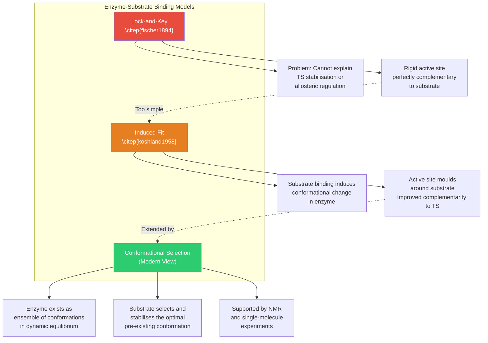
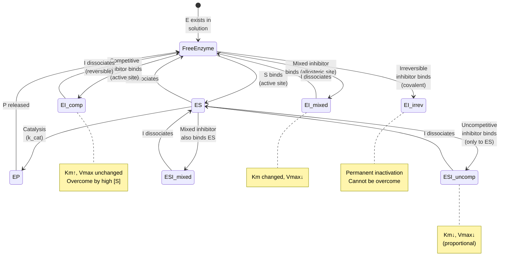
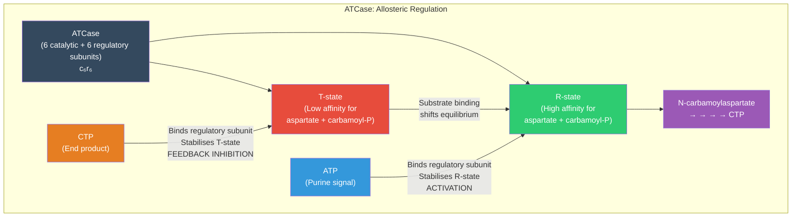

<!-- render:skip-beamer -->

# Enzymes and the Kinetics of Catalysis

\label{sec:unit_I_enzymes_and_kinetics}


<!-- chapter-metadata-badge -->
> **Ch 4** · Level 3/3 · 60 min read · 75 min lecture · Prerequisites: \cref{sec:unit_I_macromolecules}

## Learning Objectives

1. Describe how [**enzyme**](#gl:enzyme)s lower activation energy without changing the [**thermodynamics**](#gl:thermodynamics) of a reaction.
2. Derive and interpret the Michaelis-Menten equation (\cref{eq:unit_I_enzymes_and_kinetics_item_7}) and its kinetic parameters using the steady-state assumption.
3. Explain competitive, uncompetitive, mixed, and irreversible inhibition with mathematical descriptions and clinical examples.
4. Describe [**allosteric**](#gl:allosteric) regulation and cooperativity using the Hill equation, with ATCase as a model system.
5. Explain how [**pH**](#gl:ph), temperature, and cofactors modulate enzyme activity.
6. Classify enzymes using the EC numbering system, including the seventh class (translocases).
7. Describe modern applications of enzymes in medicine and industry.

<!-- curriculum-scaffold-start -->
### Study Blueprint

- **Big idea:** Enzymes accelerate reactions by stabilizing transition states without changing thermodynamic endpoints.
- **Core concepts:** activation energy, Michaelis-Menten kinetics, inhibition, allostery.
- **Framework alignment:** Vision & Change: Structure and function, Pathways and transformations of energy and matter; AP Biology: Energetics, Systems Interactions; NGSS-style topics: Matter and Energy in Organisms and Ecosystems, Structure and Function.
- **Model or quantitative lens:** Michaelis-Menten, Lineweaver-Burk, and inhibition-pattern calculations.
- **Data skill:** Fit or interpret enzyme-rate data and identify which parameter changed.
- **Practice cadence:** Concept Explanation, Statistical Tests and Data Analysis, Argumentation.
- **Common misconception to repair:** A catalyst changes rate, not the equilibrium constant or the sign of delta G.
- **Primary lab:** \cref{sec:lab_unit_I_enzymes_and_kinetics}.
- **Question bank:** \cref{sec:q_unit_I_enzymes_and_kinetics}.
- **Transfer task:** Apply enzyme-kinetic reasoning to drug dosing, metabolic control, or diagnostic assays.
- **Bridge to computation:** `biology.biochemistry.biochemistry.michaelis_menten`.
<!-- curriculum-scaffold-end -->

---

> **Opening Vignette: The Enzyme That Beats Geological Time**
>
> Without the enzyme OMP decarboxylase, the spontaneous decarboxylation of orotidine
> 5′-monophosphate (OMP) would take approximately **78 million years** at body temperature —
> longer than the entire duration of dinosaur dominance of land vertebrates. OMP decarboxylase
> accomplishes the same reaction in 25 milliseconds. That is a rate enhancement of approximately
> $10^{23}$-fold — the largest known for any enzyme (Radzicka & Wolfenden, 1995, *Science*).
>
> The mechanism is not conventional. OMP decarboxylase uses no metal ions, no cofactors, and
> performs general acid-base catalysis primarily through electrostatic destabilization of the
> substrate's ground state rather than direct stabilisation of the transition state. Understanding
> how it achieves such a feat challenged enzymologists for decades and continues to inform the
> design of enzyme inhibitors as antifungal and antiprotozoal drugs. OMP decarboxylase is the
> essential enzyme in the pyrimidine biosynthesis pathway — block it, and pathogens cannot make
> the [**nucleotide**](#gl:nucleotide)s they need to replicate.
>
> *Primary source: Radzicka, A. & Wolfenden, R. (1995). A proficient enzyme. Science, 267(5194), 90–93.*

---


A **catalyst** accelerates a chemical reaction without being consumed and without altering the reaction equilibrium. **Enzymes** are biological catalysts --- almost typically [**protein**](#gl:protein)s (a few are ribozymes; see \cref{sec:unit_I_macromolecules}) --- that accelerate reaction rates by factors of $10^6$--$10^{23}$ compared with uncatalysed reaction rates.

The free energy change of a reaction ($\Delta G$) dictates whether a reaction is thermodynamically spontaneous ($\Delta G < 0$) or non-spontaneous ($\Delta G > 0$). Enzymes do **not** alter $\Delta G$ --- they alter the **kinetics** by providing an alternative mechanism with a **lower activation energy** ($\Delta G^{\ddagger}$).

**Remarkable rate enhancements:**

| Enzyme | Uncatalysed $t_{1/2}$ | Catalysed $t_{1/2}$ | Rate Enhancement |
| ------ | -------------------- | ------------------- | ---------------- |
| OMP decarboxylase | 78 million years | 25 ms | $10^{23}$ |
| Staphylococcal nuclease | 130,000 years | ~1 ms | $10^{17}$ |
| Alkaline phosphatase | 7 years | ~1 ms | $10^{11}$ |
| Carbonic anhydrase | 5 seconds | ~1 μs | $10^7$ |
| Chorismate mutase | 7.4 hours | ~1 ms | $10^7$ |

OMP decarboxylase achieves the largest known rate enhancement: without this enzyme, the spontaneous decarboxylation of orotidine 5'-monophosphate would take 78 million years --- longer than the age of the dinosaurs.

### Transition State Theory

Every reaction proceeds through a **transition state** (TS) --- a transient, high-energy configuration that cannot be isolated. The **activation energy** ($E_a$ or $\Delta G^{\ddagger}$) is the energy required to reach this state from the ground state:

$$\text{Rate} = A \cdot e^{-\Delta G^{\ddagger}/RT} \tag{4.1} \label{eq:unit_I_enzymes_and_kinetics_item_1}$$


where $A$ is the pre-exponential factor. Lowering $\Delta G^{\ddagger}$ by just 17 kJ/mol increases the rate by $e^7 \approx 1{,}000$-fold. Lowering it by 34 kJ/mol gives a million-fold increase.

**How enzymes lower $\Delta G^{\ddagger}$:**

1. **Proximity and orientation:** Substrates are brought together in optimal geometry at the active site, with the entropic cost already paid during binding. Effective concentration of reactants in the active site can exceed $10^8$ M.
2. **Transition state stabilisation:** The enzyme active site binds the transition state *more tightly* than either substrate or product (complementarity to TS, not substrate). This is the single most important mechanism.
3. **General acid-base catalysis:** Amino acid side chains (His, Asp, Glu, Lys) donate/accept protons simultaneously with bond breaking/forming, stabilising developing charges in the TS.
4. **Covalent catalysis:** Transient covalent enzyme-substrate intermediates (Ser proteases, Cys proteases, Lys in Schiff base enzymes). The covalent intermediate provides a lower-energy pathway.
5. **Metal ion catalysis:** Metal ions (Zn$^{2+}$, Mg$^{2+}$, Fe$^{2+/3+}$) stabilise negative charges, act as Lewis acids, or enable redox chemistry.
6. **Electrostatic catalysis:** The active site creates a microenvironment with a lower effective dielectric constant, enhancing electrostatic interactions.
7. **Desolvation:** Stripping water from substrate and active-site residues increases their reactivity (e.g., a "naked" carboxylate is a much stronger base than a hydrated one).

> **Concept Check 1:** Transition state analogues --- molecules that mimic the transition state geometry --- are potent enzyme inhibitors. Why are they typically much tighter binders than the substrate itself? (Hint: Consider what the active site is optimised to bind.)


<!-- alt: Graph showing models of enzyme-substrate binding. Evolution of enzyme-substrate binding models. The lock-and-key model (1894) proposed rigid complementarity. The induced-fit model (1958) introduced conformational change upon binding. The modern conformational selection model recognises that enzymes sample multiple conformations, and substrates select the most complementary one. -->

*Models of enzyme--substrate binding. Evolution of enzyme-substrate binding models. The lock-and-key model (1894) proposed rigid complementarity. The induced-fit model (1958) introduced conformational change upon binding. The modern conformational selection model recognises that enzymes sample multiple conformations, and substrates select the most complementary one.*

### Active Site Architecture

The **active site** occupies roughly 1--10% of the enzyme's total surface but accounts for most catalytic power. Key features:

- **Specific geometry** complementary to the transition state (more so than to the substrate)
- **Hydrophobic microenvironment** that enhances nucleophilicity and acid/base strength
- **Flexibility:** conformational changes upon substrate binding (induced fit model)
- **Conserved residues:** catalytic residues are highly conserved across species, even when surrounding sequences diverge

The **lock-and-key model** \citep{fischer1894} viewed the active site as rigid. The **induced-fit model** \citep{koshland1958} recognised that substrate binding induces conformational changes that improve active-site complementarity --- validated by crystallographic structures. The modern **conformational selection model** proposes that the enzyme pre-exists in an ensemble of conformations, and the substrate selects the optimal one, shifting the equilibrium.

**Case study --- Hexokinase:** X-ray crystallography reveals that hexokinase undergoes a dramatic conformational change upon glucose binding: two lobes of the enzyme close around the substrate like a jaw, excluding water from the active site. This prevents the wasteful hydrolysis of ATP (which would occur if water could access the γ-phosphate).

---

## Enzyme Classification (EC Numbers)

The International Union of Biochemistry and Molecular Biology (IUBMB) classifies enzymes into **seven classes** by reaction type, each with a four-digit EC (Enzyme Commission) number:

| EC Class | Name | Reaction Type | Example | EC Number |
| -------- | ---- | ------------- | ------- | --------- |
| 1 | Oxidoreductases | Redox reactions | Lactate dehydrogenase | EC 1.1.1.27 |
| 2 | Transferases | Group transfer | Hexokinase (phosphoryl) | EC 2.7.1.1 |
| 3 | Hydrolases | Hydrolysis | Trypsin | EC 3.4.21.4 |
| 4 | Lyases | Non-hydrolytic bond cleavage / addition to double bonds | Fumarase | EC 4.2.1.2 |
| 5 | Isomerases | Isomerisation | Phosphoglucose isomerase | EC 5.3.1.9 |
| 6 | Ligases | Bond formation coupled to ATP/GTP hydrolysis | [**DNA ligase**](#gl:dna-ligase) | EC 6.5.1.1 |
| 7 | **Translocases** | Movement of ions/molecules across membranes | Na$^+$/K$^+$-ATPase | EC 7.2.2.6 |

The **seventh class (translocases)** was added in 2018, recognising the catalytic nature of active transport. Enzyme names follow the pattern: **Substrate(s) + reaction type + "-ase"** (e.g., pyruvate kinase, lactate dehydrogenase).

> **Concept Check 2:** The Na$^+$/K$^+$-ATPase pumps 3 Na$^+$ out and 2 K$^+$ in per ATP hydrolysed. It was traditionally classified as an ATPase (EC 3.6). Why was reclassification to translocase (EC 7) considered more appropriate?

---

## The Michaelis-Menten Equation

### Detailed Derivation

In 1913, Leonor Michaelis and Maud Menten proposed a kinetic framework for enzyme-catalysed reactions. The basic mechanism:

$$\text{E} + \text{S} \underset{k_{-1}}{\overset{k_1}{\rightleftharpoons}} \text{ES} \overset{k_2}{\rightarrow} \text{E} + \text{P} \tag{4.2} \label{eq:unit_I_enzymes_and_kinetics_item_2}$$


**Step 1: Write rate equations.**

The rate of ES formation: $\frac{d[\text{ES}]}{dt} = k_1[\text{E}][\text{S}] - k_{-1}[\text{ES}] - k_2[\text{ES}]$

**Step 2: Apply the steady-state assumption** ($d[\text{ES}]/dt = 0$).

This assumes that after an initial transient, [ES] reaches a constant level because the rate of ES formation equals the rate of ES breakdown:

$$k_1[\text{E}][\text{S}] = (k_{-1} + k_2)[\text{ES}] \tag{4.3} \label{eq:unit_I_enzymes_and_kinetics_item_3}$$


**Step 3: Define the Michaelis constant.**

$$K_m = \frac{k_{-1} + k_2}{k_1} \tag{4.4} \label{eq:unit_I_enzymes_and_kinetics_item_4}$$


**Step 4: Express [E] in terms of measurable quantities.**

Total enzyme: $[\text{E}]_T = [\text{E}] + [\text{ES}]$, so $[\text{E}] = [\text{E}]_T - [\text{ES}]$

Substituting: $([\text{E}]_T - [\text{ES}])[\text{S}] = K_m[\text{ES}]$

$$[\text{ES}] = \frac{[\text{E}]_T[\text{S}]}{K_m + [\text{S}]} \tag{4.5} \label{eq:unit_I_enzymes_and_kinetics_item_5}$$


**Step 5: Calculate the initial velocity.**

$$v_0 = k_2[\text{ES}] = \frac{k_2[\text{E}]_T[\text{S}]}{K_m + [\text{S}]} \tag{4.6} \label{eq:unit_I_enzymes_and_kinetics_item_6}$$


Since $V_{max} = k_2[\text{E}]_T$ (maximum rate when most enzyme is saturated):

$$\boxed{v_0 = \frac{V_{max}[\text{S}]}{K_m + [\text{S}]}} \tag{4.7} \label{eq:unit_I_enzymes_and_kinetics_item_7}$$


This is the **Michaelis-Menten equation** --- a rectangular hyperbola (\cref{eq:unit_I_enzymes_and_kinetics_item_7}); plotting $v_0$ against $[\text{S}]$ traces the saturating curve shown in \cref{fig:unit_I_michaelis_menten}, where the velocity rises steeply at low substrate and asymptotically approaches $V_{max}$.

### Interpretation of Kinetic Parameters

**$K_m$** approximates the substrate affinity of the enzyme. When [S] = $K_m$, $v = V_{max}/2$. A **low $K_m$** means high affinity (half-saturation at low [S]).

Special cases:
- When $k_2 \ll k_{-1}$: $K_m \approx K_d = k_{-1}/k_1$ (true dissociation constant)
- When $k_2 \gg k_{-1}$: $K_m \approx k_2/k_1$ (the enzyme is so fast that ES rarely dissociates back to E + S)

**$V_{max}$ and $k_{cat}$:** $V_{max} = k_{cat} \times [\text{E}]_T$. The **catalytic constant** $k_{cat}$ (also called the turnover number) is the number of substrate molecules converted to product per enzyme molecule per second when fully saturated.

**Catalytic efficiency:** $k_{cat}/K_m$ (units: M$^{-1}$ s$^{-1}$). This is the gold standard for comparing enzyme power. The diffusion limit sets the maximum possible $k_{cat}/K_m \approx 10^8$--$10^9$ M$^{-1}$ s$^{-1}$ (kinetically "perfect" enzymes).

**Reference kinetic constants:**

| Enzyme | Substrate | $K_m$ (mM) | $k_{cat}$ (s$^{-1}$) | $k_{cat}/K_m$ (M$^{-1}$s$^{-1}$) | Status |
| ------ | --------- | ---------- | -------------------- | -------------------------------- | ------ |
| Carbonic anhydrase | CO$_2$ | 12 | $10^6$ | $8.3 \times 10^7$ | Near-perfect |
| Fumarase | Fumarate | 0.005 | 800 | $1.6 \times 10^8$ | Near-perfect |
| Acetylcholinesterase | Acetylcholine | 0.095 | $1.4 \times 10^4$ | $1.5 \times 10^8$ | Near-perfect |
| Catalase | H$_2$O$_2$ | 25 | $4 \times 10^7$ | $1.6 \times 10^9$ | Diffusion-limited |
| Lactate dehydrogenase | Pyruvate | 0.047 | 800 | $1.7 \times 10^7$ | Highly efficient |
| Hexokinase | Glucose | 0.15 | 650 | $4.3 \times 10^6$ | Efficient |
| Alcohol dehydrogenase | Ethanol | 1.0 | 73 | $7.3 \times 10^4$ | Moderate |
| Lysozyme | Hexasaccharide | 0.006 | 0.5 | $8.3 \times 10^4$ | Moderate |

> **Concept Check 3:** Catalase converts H$_2$O$_2$ to H$_2$O and O$_2$ with a $k_{cat}$ of $4 \times 10^7$ s$^{-1}$. How many molecules of H$_2$O$_2$ does a single catalase molecule destroy per millisecond? Why is such extreme speed necessary in the cell?

### Lineweaver-Burk Analysis


\begin{figure}[htbp]
\centering
\includegraphics[width=0.85\textwidth]{../figures/michaelis_menten.png}
\caption{Michaelis--Menten kinetics: initial velocity ($v_0$) versus substrate concentration with an uninhibited curve, a competitive-inhibitor curve, and the $V_{\max}$, $V_{\max}/2$, and $K_m$ reference lines annotated.}
\label{fig:unit_I_michaelis_menten}
\end{figure}
<!-- alt: Rectangular-hyperbola plot of enzyme initial velocity against substrate concentration. The uninhibited curve rises toward Vmax, while the competitive-inhibitor curve is shifted right with the same Vmax; reference lines mark Vmax, Vmax/2, and Km. -->


Inverting the Michaelis-Menten equation:

$$\frac{1}{v_0} = \frac{K_m}{V_{max}} \cdot \frac{1}{[\text{S}]} + \frac{1}{V_{max}} \tag{4.8} \label{eq:unit_I_enzymes_and_kinetics_item_8}$$


The **double-reciprocal (Lineweaver-Burk) plot** of $1/v$ vs. $1/[\text{S}]$ is linear:
- Slope = $K_m/V_{max}$
- $x$-intercept = $-1/K_m$
- $y$-intercept = $1/V_{max}$

**Worked example --- Determining $K_m$ and $V_{max}$:**

An enzyme is assayed at five substrate concentrations:

| [S] (mM) | $v_0$ (μmol/min) | 1/[S] (mM$^{-1}$) | $1/v_0$ |
| --------- | -------------------- | ------------------ | ------- |
| 0.5 | 1.67 | 2.0 | 0.60 |
| 1.0 | 2.50 | 1.0 | 0.40 |
| 2.0 | 3.33 | 0.5 | 0.30 |
| 4.0 | 4.00 | 0.25 | 0.25 |
| 10.0 | 4.55 | 0.10 | 0.22 |

From the Lineweaver-Burk plot:
- $y$-intercept = 0.20, so $V_{max} = 1/0.20 = 5.0$ μmol/min
- Slope = $(0.60 - 0.20)/(2.0 - 0) = 0.20$, and slope $= K_m/V_{max}$, so $K_m = 0.20 \times 5.0 = 1.0$ mM

**Limitations of the Lineweaver-Burk plot:** It distorts experimental error at low [S] (high 1/[S]), giving those points excessive weight. Modern software uses nonlinear regression to fit the Michaelis-Menten equation directly, which is statistically superior.

---

## Enzyme Inhibition


<!-- alt: State diagram for Enzyme Inhibition showing transitions among E exists in solution, S binds (active site), S dissociates, and Catalysis (k_cat). -->

*State diagram for Enzyme Inhibition showing transitions among E exists in solution, S binds (active site), S dissociates, and Catalysis (k_cat).*

### Competitive Inhibition

A **competitive inhibitor** (I) resembles the substrate structurally and competes for the same active site. Binding of I and S are mutually exclusive:

$$E + I \rightleftharpoons EI \quad (K_i = [\text{E}][\text{I}]/[\text{EI}]) \tag{4.9} \label{eq:unit_I_enzymes_and_kinetics_item_9}$$


The apparent $K_m$ increases (less substrate affinity at fixed [I]) while $V_{max}$ is unchanged (inhibition overcome by high [S]):

$$v_0 = \frac{V_{max}[\text{S}]}{K_m\left(1 + \frac{[\text{I}]}{K_i}\right) + [\text{S}]} \tag{4.10} \label{eq:unit_I_enzymes_and_kinetics_item_10}$$


Defining $\alpha = 1 + [\text{I}]/K_i$:

$$v_0 = \frac{V_{max}[\text{S}]}{\alpha K_m + [\text{S}]} \tag{4.11} \label{eq:unit_I_enzymes_and_kinetics_item_11}$$


On a Lineweaver-Burk plot: same $y$-intercept ($1/V_{max}$), different slopes. Lines intersect on the $y$-axis.

**Clinical examples of [**competitive inhibition**](#gl:competitive-inhibition):**

| Inhibitor | Target Enzyme | Clinical Use |
| --------- | ------------- | ------------ |
| Methotrexate | Dihydrofolate reductase | Cancer chemotherapy |
| Statins (atorvastatin) | HMG-CoA reductase | Cholesterol-lowering |
| Sulfonamide antibiotics | Dihydropteroate synthase | Bacterial infection |
| Allopurinol | Xanthine oxidase | Gout |
| Ethanol | Alcohol dehydrogenase | Methanol/ethylene glycol poisoning |

> **Clinical Connection: Statins and Cardiovascular Disease**
>
> Statins (e.g., atorvastatin, rosuvastatin) are competitive inhibitors of HMG-CoA reductase, the rate-limiting enzyme in cholesterol biosynthesis. By mimicking the structure of HMG-CoA, statins bind the active site with $K_i$ values in the low nanomolar range (much lower than the $K_m$ for HMG-CoA, ~4 μM). This reduces hepatic cholesterol synthesis, upregulates LDL receptors, and lowers circulating LDL cholesterol by 30--50%. Statins are among the most widely prescribed drugs worldwide, with robust evidence for reducing cardiovascular events and mortality.

### Uncompetitive Inhibition

An **uncompetitive inhibitor** binds primarily to the ES complex, not free enzyme:

$$v_0 = \frac{V_{max}[\text{S}]}{K_m + \alpha'[\text{S}]} \tag{4.12} \label{eq:unit_I_enzymes_and_kinetics_item_12}$$


where $\alpha' = 1 + [\text{I}]/K_i'$. Both $K_m$ and $V_{max}$ are decreased proportionally --- the ratio $V_{max}/K_m$ (= $k_{cat}/K_m$) is unchanged. On a Lineweaver-Burk plot: **parallel lines** (both slope and intercepts change equally).

Uncompetitive inhibition is rare in single-substrate reactions but important in two-substrate reactions and in multi-enzyme pathways. **Lithium** is an uncompetitive inhibitor of inositol monophosphatase, which may contribute to its therapeutic effect in bipolar disorder.

### Mixed (Noncompetitive) Inhibition

A **mixed inhibitor** binds to both free enzyme (E) and the ES complex, at a site other than the active site:

$$v_0 = \frac{V_{max}[\text{S}]}{\alpha K_m + \alpha'[\text{S}]} \tag{4.13} \label{eq:unit_I_enzymes_and_kinetics_item_13}$$


where $\alpha = 1 + [\text{I}]/K_i$ and $\alpha' = 1 + [\text{I}]/K_i'$.

- If $\alpha = \alpha'$ ($K_i = K_i'$): **pure noncompetitive** inhibition. $K_m$ unchanged, $V_{max}$ decreased.
- If $\alpha \neq \alpha'$: **mixed** inhibition. Both $K_m$ and $V_{max}$ change.

On a Lineweaver-Burk plot: lines intersect to the left of the $y$-axis (not on it).

**Pure noncompetitive inhibitor:** Heavy metal ions (Hg$^{2+}$, Pb$^{2+}$) that bind cysteine residues distant from the active site.

### Irreversible Inhibition

**Irreversible inhibitors** form covalent bonds with enzyme residues, permanently inactivating the enzyme. The enzyme must be replaced by new protein synthesis.

| Inhibitor | Target | Mechanism | Clinical Application |
| --------- | ------ | --------- | -------------------- |
| Aspirin (acetylsalicylate) | COX-1 and COX-2 | Acetylates Ser530 | Anti-inflammatory, antiplatelet |
| Penicillin / amoxicillin | Transpeptidase (DD-peptidase) | Acylates active-site Ser | Antibiotic |
| DIPF / sarin | Acetylcholinesterase | Phosphorylates active-site Ser | Nerve agent (sarin) |
| Omeprazole (Prilosec) | H$^+$/K$^+$-ATPase | Disulfide bond with Cys813 | Proton pump inhibitor (acid reflux) |
| Clopidogrel (Plavix) | P2Y12 receptor | Disulfide bond | Antiplatelet |

> **Clinical Connection: Aspirin --- The Oldest Irreversible Enzyme Inhibitor**
>
> Aspirin (acetylsalicylic acid) irreversibly acetylates Ser530 in cyclooxygenase (COX), preventing the conversion of arachidonic acid to prostaglandins and thromboxane A$_2$. Because platelets lack a nucleus and cannot synthesise new protein, a single dose of aspirin inhibits platelet COX-1 for the entire platelet lifespan (~10 days). This is why low-dose aspirin (75--100 mg/day) is an effective antiplatelet agent for preventing heart attacks and strokes, despite its short plasma half-life of ~20 minutes.

> **Clinical Connection: Penicillin and Bacterial Cell Wall Synthesis**
>
> Penicillin and related β-lactam antibiotics are irreversible inhibitors of bacterial transpeptidase (also called penicillin-binding protein, PBP), the enzyme that cross-links peptidoglycan strands in the bacterial cell wall. The β-lactam ring of penicillin mimics the D-Ala--D-Ala terminus of the peptidoglycan substrate, forming a stable acyl-enzyme intermediate. Without cross-linking, the cell wall loses integrity and the bacterium lyses due to osmotic stress. Resistance arises when bacteria produce β-lactamases that hydrolyse the β-lactam ring.

### Lineweaver-Burk Patterns Summary

| Inhibition Type | Apparent $K_m$ | Apparent $V_{max}$ | L-B Plot Pattern |
| --------------- | ------------- | ------------------ | ---------------- |
| Competitive | Increases ($\alpha K_m$) | Unchanged | Same $y$-intercept |
| Uncompetitive | Decreases ($K_m/\alpha'$) | Decreases ($V_{max}/\alpha'$) | Parallel lines |
| Pure noncompetitive | Unchanged | Decreases ($V_{max}/\alpha$) | Same $x$-intercept |
| Mixed | Changes | Decreases | Intersect left of $y$-axis |
| Irreversible | N/A | Decreases (less $[\text{E}]_T$) | Same $K_m$, lower $V_{max}$ |

> **Concept Check 4:** An enzyme is studied in the presence and absence of an inhibitor. In the Lineweaver-Burk plot, the two lines are parallel. What type of inhibition is this? Does the inhibitor bind the free enzyme, the ES complex, or both?

---

## Multi-substrate Kinetics: Bi-Bi Mechanisms

The single-substrate Michaelis-Menten framework is a useful approximation, but most enzymes use *two* substrates (or one substrate plus a cofactor). Reactions of the form

$$\text{A} + \text{B} \rightleftharpoons \text{P} + \text{Q} \label{eq:unit_I_enzymes_and_kinetics_item_14}$$


are known as **Bi-Bi reactions**. Cleland (1963) classified them into three principal mechanisms based on the order in which substrates bind and products release.

### Sequential (Ternary Complex) Mechanisms

Both substrates must be bound to the enzyme *simultaneously* before any product is released. The enzyme thus passes through a ternary EAB complex.

- **Ordered Bi-Bi:** A binds before B; Q releases before P. Example: NAD$^+$-dependent dehydrogenases such as lactate dehydrogenase, where NAD$^+$ binds first and NADH leaves last.
- **Random Bi-Bi:** A and B can bind in either order; products can leave in either order. Example: creatine kinase.

The general rate equation for a sequential Bi-Bi reaction (assuming rapid equilibrium and saturating second substrate) reduces to:

\begin{equation}
v_0 = \frac{V_{\max}\,[\text{A}]\,[\text{B}]}{K_{ia}K_b + K_b[\text{A}] + K_a[\text{B}] + [\text{A}][\text{B}]}
\label{eq:unit_I_bibi_sequential}
\end{equation}

where $K_a$ and $K_b$ are Michaelis constants for A and B, and $K_{ia}$ is the dissociation constant of A from the binary EA complex. **Diagnostic Lineweaver-Burk pattern:** plotting $1/v_0$ vs. $1/[\text{A}]$ at several fixed [B] gives a family of lines that **intersect to the left of the y-axis** (sequential signature).

### Ping-Pong (Double-Displacement) Mechanism

The first substrate A binds, transfers a chemical group to the enzyme, and the first product P is released, leaving the enzyme in a covalently modified form (E*). Then B binds to E*, accepts the group, and Q is released. **At no time does the enzyme contain both substrates simultaneously.** Examples: aminotransferases (PLP carries the amino group between substrates), serine proteases (substrate A acylates the active-site Ser; substrate B = water deacylates), and many kinases that proceed via a phospho-enzyme intermediate.

The rate equation:

\begin{equation}
v_0 = \frac{V_{\max}\,[\text{A}]\,[\text{B}]}{K_b[\text{A}] + K_a[\text{B}] + [\text{A}][\text{B}]}
\label{eq:unit_I_bibi_pingpong}
\end{equation}

Notice the absent $K_{ia}K_b$ term in the denominator. **Diagnostic Lineweaver-Burk pattern:** the family of lines is **parallel** --- a clean kinetic signature distinguishing ping-pong from sequential mechanisms.

| Feature | Sequential (Random or Ordered) | Ping-Pong |
| ------- | ------------------------------ | --------- |
| Ternary complex EAB? | Yes | No |
| Covalent enzyme intermediate E*? | No | Yes |
| Lineweaver-Burk pattern (vary A, fixed B) | Intersecting lines | Parallel lines |
| Examples | LDH, hexokinase, CK | AspAT, chymotrypsin, GS |

> **Concept Check 5:** A biochemist measures the rate of an enzyme reaction at varying [A] for several fixed [B] values, and obtains a family of parallel lines on a Lineweaver-Burk plot. Identify the mechanism and predict whether a covalent enzyme intermediate exists.

---

## Allosteric Regulation and Cooperativity

Allosteric enzymes are not governed by simple [**Michaelis-Menten kinetics**](#gl:michaelis-menten-kinetics). They have:
- Multiple subunits, typically with identical active sites
- Regulatory sites distinct from active sites
- Cooperative (sigmoidal) substrate binding
- Modulation by effector molecules (activators or inhibitors)

### The Hill Equation

For an enzyme with $n$ equivalent cooperative subunits, the fraction of active sites occupied (θ) follows the **Hill equation**:

$$\theta = \frac{[\text{S}]^n}{K_{0.5}^n + [\text{S}]^n} \tag{4.14} \label{eq:unit_I_enzymes_and_kinetics_item_15}$$


where **$n$** is the Hill coefficient:
- $n = 1$: no cooperativity (hyperbolic, Michaelis-Menten)
- $n > 1$: positive cooperativity (sigmoidal; binding one substrate increases affinity for subsequent substrates)
- $n < 1$: negative cooperativity (binding decreases affinity)

**Linearised Hill equation:**

$$\log\frac{\theta}{1 - \theta} = n\log[\text{S}] - n\log K_{0.5} \tag{4.15} \label{eq:unit_I_enzymes_and_kinetics_item_16}$$


A plot of $\log[\theta/(1-\theta)]$ vs. $\log[\text{S}]$ (the **Hill plot**) gives a straight line with slope $n$ and $x$-intercept at $\log K_{0.5}$.

Haemoglobin (see \cref{sec:unit_IX_circulation_respiration_homeostasis}) has $n \approx 2.8$ (not 4, because cooperativity is imperfect). Sigmoidal kinetics give allosteric enzymes **switch-like** behaviour --- small changes in [S] near $K_{0.5}$ cause large changes in activity.

**Worked example:** For an allosteric enzyme with $K_{0.5}$ = 5 mM and $n$ = 3:

At [S] = 4 mM: $\theta = \frac{4^3}{5^3 + 4^3} = \frac{64}{125 + 64} = \frac{64}{189} = 0.339$ (33.9%)

At [S] = 6 mM: $\theta = \frac{6^3}{5^3 + 6^3} = \frac{216}{125 + 216} = \frac{216}{341} = 0.634$ (63.4%)

A 50% increase in [S] (from 4 to 6 mM) nearly doubles the fractional saturation. This is the "switch-like" sensitivity of cooperative systems.

### Concerted (MWC) and Sequential Models

Two models describe the molecular mechanism of cooperativity:

**Monod-Wyman-Changeux (MWC) Concerted Model:**
- Most subunits exist in either the T-state (tense, low affinity) or R-state (relaxed, high affinity)
- Most subunits transition simultaneously (concerted)
- Substrate preferentially binds R-state, shifting T$\rightleftharpoons$R equilibrium toward R
- Activators stabilise R; inhibitors stabilise T

**Koshland-Nemethy-Filmer (KNF) Sequential Model:**
- Each subunit can independently switch between T and R
- Substrate binding to one subunit induces conformational changes that propagate to adjacent subunits
- Explains negative cooperativity (which MWC cannot)

In reality, most allosteric systems show features of both models.

### Aspartate Transcarbamoylase (ATCase) --- A Model Allosteric Enzyme


<!-- alt: Flowchart showing aTCase allostery (CTP and ATP). Allosteric regulation of ATCase. CTP (the end product of the pyrimidine pathway) is a feedback inhibitor that stabilises the T-state. ATP (a purine nucleotide) is an activator that stabilises the R-state, coordinating purine and pyrimidine synthesis. -->

*ATCase allostery (CTP and ATP). Allosteric regulation of ATCase. CTP (the end product of the pyrimidine pathway) is a feedback inhibitor that stabilises the T-state. ATP (a purine nucleotide) is an activator that stabilises the R-state, coordinating purine and pyrimidine synthesis.*

ATCase (catalyses the first committed step of pyrimidine biosynthesis) is the textbook allosteric enzyme:
- **Structure:** 6 catalytic subunits (c$_3$)$_2$ + 6 regulatory subunits (r$_2$)$_3$ = c$_6$r$_6$ (~310 kDa)
- **Inhibited** by CTP (end-product of the pathway --- **feedback inhibition**)
- **Activated** by ATP (signals adequate purine availability -> coordinate pyrimidine synthesis)
- Hill coefficient $n \approx 2.5$ for N-carbamoylaspartate synthesis
- T->R transition involves a 12-angstrom expansion and 10-degree rotation of catalytic trimers

This allows the cell to precisely match nucleotide biosynthesis to demand. When CTP is abundant, ATCase is inhibited; when ATP is abundant (indicating nucleotide precursors are available), ATCase is activated.

### Why Cooperativity Improves Pathway Control

A first-glance question: why has evolution invested in elaborate allosteric machinery when simple Michaelis-Menten enzymes could in principle perform every metabolic task? The answer lies in the *control properties* of cooperative enzymes.

Compare a hyperbolic enzyme (Hill coefficient $n = 1$) and a sigmoidal enzyme ($n = 4$) in the small region around $K_{0.5}$. For a 2-fold increase in [S] near $K_{0.5}$:

| Enzyme | θ at $[S] = 0.5\,K_{0.5}$ | θ at $[S] = 2\,K_{0.5}$ | Sensitivity (ratio) |
| ------ | --------------------------------- | ------------------------------- | -------------------- |
| Michaelis-Menten ($n=1$) | 0.33 | 0.67 | 2.0$\times$ |
| Cooperative ($n=2$) | 0.20 | 0.80 | 4.0$\times$ |
| Cooperative ($n=4$) | 0.059 | 0.941 | 16$\times$ |
| Cooperative ($n=8$) | 0.0039 | 0.9961 | 256$\times$ |

An 8-fold increase in Hill coefficient (from n=1 to n=8) gives a 128-fold increase in switching sensitivity around $K_{0.5}$ — each doubling of n roughly squares the sensitivity ratio. This **ultrasensitivity** confers three regulatory advantages:

1. **Steeper response to small signal changes.** Glycolysis can be ramped up rapidly during exercise without requiring 10-fold changes in metabolite concentrations.
2. **Sharper response thresholds.** Below $K_{0.5}$ the pathway is nearly off; above $K_{0.5}$ nearly fully on. Enables clear "decision-making" at metabolic branch points.
3. **Insulation from noise.** Random fluctuations in [S] within the low-saturation regime cause much smaller activity changes than under MM kinetics. Stability and switch-like behaviour coexist.

The same logic explains why haemoglobin's $n \approx 2.8$ delivers ~25% of bound O$_2$ between arterial (pO$_2$ 100 mmHg) and venous (40 mmHg) blood, whereas hyperbolic myoglobin would deliver about 10% of the same change. Cooperativity is biology's tunable amplifier.

> **Concept Check 6:** Phosphofructokinase-1 (PFK-1) is an allosteric enzyme in [**glycolysis**](#gl:glycolysis) that is activated by AMP and inhibited by ATP and citrate. Why does this regulatory pattern make metabolic sense? (Consider the energy charge of the cell.)

---

## Environmental Factors Affecting Enzyme Activity

### Temperature

Enzyme activity generally increases with temperature ($\uparrow$ kinetic energy -> $\uparrow$ collision frequency -> $\uparrow$ rate) according to the Arrhenius equation:

$$k = A \cdot e^{-E_a/RT} \tag{4.16} \label{eq:unit_I_enzymes_and_kinetics_item_17}$$


A 10 degrees C rise approximately doubles reaction rate ($Q_{10} \approx 2$). However, **above the optimal temperature**, denaturation of the protein occurs (tertiary and quaternary structure disrupts), sharply reducing activity. The optimal temperature for most human enzymes: ~37 degrees C.

**$Q_{10}$ calculation:**

$$Q_{10} = \left(\frac{k_2}{k_1}\right)^{10/(T_2 - T_1)} \tag{4.17} \label{eq:unit_I_enzymes_and_kinetics_item_18}$$


For most enzyme reactions, $Q_{10}$ = 1.5--3.0. The $Q_{10}$ rule breaks down near the denaturation temperature.

**Extremophile enzymes (extremozymes):**
- *Thermus aquaticus* (hot springs, 75 degrees C) Taq polymerase: thermostable DNA polymerase, the workhorse of PCR (optimal 72 degrees C). Taq achieves thermostability through increased salt bridges, compact hydrophobic core, and proline substitutions.
- *Pyrococcus furiosus* (deep-sea vent, 100 degrees C) Pfu polymerase: even more thermostable and has 3'->5' proofreading activity (higher fidelity than Taq).
- *Psychrobacter* (Antarctic, --20 degrees C) enzymes: more flexible (more Gly, fewer Pro, fewer salt bridges), lower activation energy, active at sub-zero temperatures but rapidly denature at 37 degrees C.

### pH

Enzyme catalysis depends on the ionisation state of key active-site residues. Activity-pH curves are typically bell-shaped:

| Enzyme | Location | Optimum pH | Key Catalytic Residue |
| ------ | -------- | ---------- | -------------------- |
| Pepsin | Stomach | 1.5--2.5 | Asp (must be protonated) |
| Salivary amylase | Mouth | 6.7--7.0 | Glu (acid/base catalyst) |
| Trypsin | Intestine | 7.5--8.5 | His57 (must be deprotonated) |
| Alkaline phosphatase | Intestine/bone | 8--10 | Ser (phosphorylated intermediate) |
| Arginase | Liver | 9.5--10.0 | Mn$^{2+}$ (binuclear metal centre) |

The bell-shaped curve reflects the requirement for specific protonation states: the ascending limb corresponds to deprotonation of one essential residue; the descending limb to deprotonation of another.

### Cofactors and Coenzymes

Many enzymes require non-protein cofactors for activity. The enzyme without its cofactor is the **apoenzyme**; the complete, active enzyme is the **holoenzyme**.

| Type | Examples | Function | Dietary Source |
| ---- | -------- | -------- | ------------- |
| **Metal ions** | Zn$^{2+}$ (carboxypeptidase) | Lewis acid catalysis | Red meat, shellfish |
| | Mg$^{2+}$ (kinases) | Stabilise ATP phosphate | Green vegetables |
| | Fe$^{2+/3+}$ (cytochromes) | Electron transfer | Red meat, lentils |
| | Cu$^{2+}$ (cytochrome c oxidase) | O$_2$ reduction | Liver, nuts |
| | Mn$^{2+}$ (SOD, arginase) | Redox, hydrolysis | Whole grains |
| | Mo (xanthine oxidase) | Oxygen atom transfer | Legumes |
| | Se (glutathione peroxidase) | Peroxide reduction | Brazil nuts |
| **Coenzymes** | NAD$^+$/NADH (from niacin, B3) | Hydride transfer | Meat, fish |
| | FAD/FADH$_2$ (from riboflavin, B2) | Hydride transfer | Dairy, eggs |
| | Coenzyme A (from pantothenate, B5) | Acyl group transfer | Widespread |
| | Pyridoxal phosphate (from pyridoxine, B6) | Amino group transfer | Poultry, fish |
| | Thiamine pyrophosphate (from thiamine, B1) | Decarboxylation | Whole grains |
| | Biotin (B7) | Carboxylation | Eggs, nuts |
| | Tetrahydrofolate (from folate, B9) | One-carbon transfer | Leafy greens |
| | 5'-deoxyadenosylcobalamin (from B12) | Rearrangements | Animal products |
| **Prosthetic groups** | Haem (contains Fe) | O$_2$ binding, electron transfer | Synthesised endogenously |
| | Lipoic acid | Acyl group transfer | Synthesised endogenously |

Most water-soluble vitamins (B vitamins) function as coenzyme precursors. This is why vitamin deficiencies cause enzyme dysfunction and disease:

| Vitamin Deficiency | Coenzyme Affected | Disease |
| ------------------- | ----------------- | ------- |
| B1 (Thiamine) | TPP | Beriberi, Wernicke-Korsakoff syndrome |
| B2 (Riboflavin) | FAD | Ariboflavinosis (angular stomatitis) |
| B3 (Niacin) | NAD$^+$ | Pellagra (dermatitis, diarrhoea, dementia) |
| B6 (Pyridoxine) | PLP | Peripheral neuropathy |
| B9 (Folate) | THF | Megaloblastic anaemia, neural tube defects |
| B12 (Cobalamin) | AdoCbl, MeCbl | Pernicious anaemia, neurodegeneration |

> **Clinical Connection: ACE Inhibitors and Zinc-Dependent Catalysis**
>
> Angiotensin-converting enzyme (ACE) is a zinc metalloprotease that converts angiotensin I to angiotensin II (a potent vasoconstrictor) and degrades bradykinin (a vasodilator). **ACE inhibitors** (enalapril, lisinopril, ramipril) chelate the active-site Zn$^{2+}$, preventing catalysis. By blocking angiotensin II production and bradykinin degradation, ACE inhibitors reduce blood pressure and are first-line therapy for hypertension and heart failure. The side effect of dry cough (in ~10% of patients) is caused by bradykinin accumulation in the airways.

> **Concept Check 7:** Most water-soluble vitamins serve as coenzyme precursors. Explain why these vitamins must be obtained from the diet (unlike fat-soluble vitamins, which can be stored). What does this imply about the recommended frequency of intake?

---

## Industrial and Biotechnological Enzymes

Enzymes have transformed medicine and industry:

Modern enzyme biotechnology couples classical kinetics with structure-guided design, directed evolution, high-throughput screening, and increasingly AI-predicted interaction models. AlphaFold-class tools can nominate an active-site geometry or protein-complex interface, but an engineered-enzyme claim still needs measured $k_{cat}$, $K_M$, specificity, stability, expression yield, and performance under application conditions; a plausible structure is a hypothesis until kinetics and controls support it \citep{abramson2024alphafold3,velankar2026alphafolddb2025}.

### CRISPR-Cas9 as a Nuclease Enzyme

The Cas9 protein from *Streptococcus pyogenes* is an RNA-guided endonuclease:
- **Classification:** EC 3.1 (nuclease / hydrolase)
- **Mechanism:** The guide RNA (gRNA) forms a 20-nt complementary complex with the target DNA. Cas9 unwinds the DNA and cleaves both strands using two nuclease domains: RuvC cuts the non-target strand; HNH cuts the target strand
- **Specificity:** PAM (protospacer adjacent motif, 5'-NGG-3') is required adjacent to the target sequence
- **Applications:** [**Gene**](#gl:gene) editing, gene therapy (sickle cell disease, β-thalassaemia), diagnostics (SHERLOCK, DETECTR)
- **Nobel Prize 2020:** Jennifer Doudna and Emmanuelle Charpentier

### Industrial Applications

| Enzyme | Industry | Application |
| ------ | -------- | ----------- |
| Lipases | Biodiesel, detergents | Transesterification, stain removal |
| Cellulases | Biofuel | Cellulosic ethanol production |
| Amylases | Food, brewing | Starch liquefaction, brewing |
| Proteases | Detergents, leather | Protein stain removal, dehairing |
| Lactase | Dairy | Lactose-free milk production |
| DNA polymerase (Taq) | Molecular biology | PCR amplification |
| Restriction enzymes | Biotechnology | Molecular cloning |
| Glucose isomerase | Food | High-fructose corn syrup |

### Enzyme Engineering Approaches

- **Directed evolution:** Random mutagenesis + screening/selection for improved properties. Frances Arnold received the **2018 Nobel Prize in Chemistry** for this approach.
- **Rational design:** Structure-guided [**mutation**](#gl:mutation) of specific residues based on mechanistic understanding.
- **Immobilised enzymes:** Enzymes attached to solid supports for continuous-flow industrial processes. Advantages: reusability, stability, easy product separation.

### Quantitative Metrics for Engineered Enzymes

When evaluating an engineered or evolved variant, several quantitative figures of merit are routinely compared against the wild-type enzyme:

| Metric | Definition | What it tells you |
| ------ | ---------- | ----------------- |
| Fold-improvement in $k_{cat}$ | $k_{cat}^{\text{var}} / k_{cat}^{\text{WT}}$ | Speed-up at saturating [S] |
| Fold-improvement in $k_{cat}/K_m$ | $(k_{cat}/K_m)^{\text{var}} / (k_{cat}/K_m)^{\text{WT}}$ | Catalytic efficiency at low [S] (closer to *in vivo*) |
| Substrate scope | # of new substrates accepted | Breadth of activity |
| Enantioselectivity (E-value) | $\ln[(1 - c)(1 - ee_S)] / \ln[(1 - c)(1 + ee_S)]$ | Discrimination between enantiomers |
| Thermal stability ($T_{50}$, $T_m$) | Temp at half-activity / unfolding midpoint | Process robustness |
| Half-life under operating conditions | Time to lose 50% activity | Industrial economics |
| Specific activity | μmol/min/mg | Practical productivity |
| Total turnover number (TTN) | Total substrate molecules per enzyme before death | Catalyst longevity |

A successful directed evolution campaign will track several of these metrics simultaneously across many rounds; the best-known successes (e.g., engineered transaminases for sitagliptin manufacture) achieved 25,000-fold rate improvements and >10$^6$ TTN over ~10 evolutionary rounds.

---

## Worked Examples

**Problem 1:** An enzyme obeys Michaelis-Menten kinetics with $K_m$ = 2.0 mM and $V_{max}$ = 100 μmol/min. Calculate $v_0$ at [S] = 0.5 mM, 2.0 mM, 10 mM, and 200 mM.

*Solution:*

$$v_0 = \frac{100 \times [\text{S}]}{2.0 + [\text{S}]} \tag{4.18} \label{eq:unit_I_enzymes_and_kinetics_item_19}$$


| [S] (mM) | $v_0$ (μmol/min) | % of $V_{max}$ |
| --------- | -------------------- | -------------- |
| 0.5 | $100 \times 0.5 / 2.5 = 20.0$ | 20% |
| 2.0 | $100 \times 2.0 / 4.0 = 50.0$ | 50% (by definition, [S] = $K_m$) |
| 10.0 | $100 \times 10 / 12 = 83.3$ | 83.3% |
| 200.0 | $100 \times 200 / 202 = 99.0$ | 99.0% (near saturation) |

**Problem 2:** In the presence of a competitive inhibitor at [I] = 5 mM and $K_i$ = 2.5 mM, what is the new apparent $K_m$? At what [S] will $v_0$ = $V_{max}/2$?

*Solution:*
$$\alpha = 1 + \frac{[\text{I}]}{K_i} = 1 + \frac{5.0}{2.5} = 3.0 \tag{4.19} \label{eq:unit_I_enzymes_and_kinetics_item_20}$$

$$K_m^{app} = \alpha K_m = 3.0 \times 2.0 = 6.0 \; \text{mM} \tag{4.20} \label{eq:unit_I_enzymes_and_kinetics_item_21}$$


$v_0 = V_{max}/2$ when [S] = $K_m^{app}$ = 6.0 mM. The inhibitor triples the substrate concentration needed for half-maximal velocity.

**Problem 3:** The Hill coefficient for haemoglobin is 2.8, and $K_{0.5}$ for O$_2$ is 26 mmHg. Calculate the fractional saturation at:
(a) pO$_2$ = 40 mmHg (venous blood)
(b) pO$_2$ = 100 mmHg (arterial blood)

*Solution:*
$$\theta = \frac{[\text{S}]^n}{K_{0.5}^n + [\text{S}]^n} \tag{4.21} \label{eq:unit_I_enzymes_and_kinetics_item_22}$$


(a) $\theta = \frac{40^{2.8}}{26^{2.8} + 40^{2.8}} = \frac{40^{2.8}}{26^{2.8} + 40^{2.8}}$

$40^{2.8} = e^{2.8 \ln 40} = e^{2.8 \times 3.689} = e^{10.33} = 30{,}600$

$26^{2.8} = e^{2.8 \ln 26} = e^{2.8 \times 3.258} = e^{9.12} = 9{,}160$

$\theta = \frac{30{,}600}{9{,}160 + 30{,}600} = \frac{30{,}600}{39{,}760} = 0.770$ (77.0%)

(b) $100^{2.8} = e^{2.8 \times 4.605} = e^{12.89} = 396{,}000$

$\theta = \frac{396{,}000}{9{,}160 + 396{,}000} = 0.977$ (97.7%)

The difference: haemoglobin loads O$_2$ to 97.7% in the lungs and unloads to 77.0% in tissues, delivering ~20% of its O$_2$ per circuit. During exercise (venous pO$_2$ drops to ~20 mmHg), delivery increases substantially due to the steep part of the sigmoidal curve.

---

## Computational Bridge

The Michaelis--Menten hyperbola is implemented directly on concentrations in µM:

```python
from biology.biochemistry import michaelis_menten

res = michaelis_menten(5.0, Vmax=120.0, Km=10.0)
print(res.reaction_rate, res.efficiency)  # v and v/Vmax
```

> **Clinical / systems note:** Many drugs are mechanism-based inhibitors that shrink effective $V_\mathrm{max}$ or raise apparent $K_m$; statins compete at HMG-CoA reductase's active site, illustrating competitive themes at a clinically relevant scale.

---

## Bridge to Systems: From Enzyme Kinetics to Metabolic Flux

A single enzyme's $K_m$, $V_{\max}$, and Hill coefficient become inputs to a higher-level question: what is the **flux** ($J$, in mol L$^{-1}$ s$^{-1}$) through a metabolic pathway, and which enzyme limits it? This question is the bridge from this chapter to Unit III (bioenergetics and respiration).

### Pathway Flux is Set by Multiple Enzymes, Not One

The classical idea that a single "rate-limiting step" governs a pathway has been replaced by **metabolic control analysis** (MCA), developed in the 1970s by Heinrich, Rapoport, Kacser, and Burns. MCA assigns each enzyme $i$ a **flux control coefficient**:

\begin{equation}
C_i^J = \frac{\partial \ln J}{\partial \ln [E_i]}
\label{eq:unit_I_flux_control_coefficient}
\end{equation}

This is the fractional change in steady-state flux when the activity of enzyme $i$ is changed by a small fraction. The **summation theorem** states that for any pathway:

\begin{equation}
\sum_i C_i^J = 1
\label{eq:unit_I_summation_theorem}
\end{equation}

Three lessons follow:

1. **Control is distributed.** No single enzyme has $C_i^J = 1$; instead, glycolytic flux in muscle is controlled by hexokinase ($C^J \approx 0.3$), PFK-1 ($C^J \approx 0.3$), pyruvate kinase ($C^J \approx 0.2$), and others.
2. **Targeting the "rate-limiting" enzyme often disappoints.** Doubling PFK-1 primarily doubles flux if $C^J = 1$, which is rarely true. This is why metabolic engineering campaigns to improve product yields often increase one enzyme tenfold for a 1.5-fold flux gain.
3. **Allosteric regulation tunes the control distribution.** When ATP is high, AMP is low, and ATCase or PFK-1 sit in their T-state, $C^J$ for those enzymes rises toward 1; the cell concentrates control where it can respond quickly to demand changes.

### Enzyme Saturation Modes Determine Pathway Behaviour

The local $[\text{S}] / K_m$ ratio for each enzyme determines whether it operates near saturation or far below. Glycolytic enzymes typically operate at $[\text{S}] \approx K_m$ (around half-saturation), where the response to small $[\text{S}]$ changes is approximately linear and control coefficients are large. Enzymes whose substrates are at $\gg K_m$ (saturated) have $C^J \approx 0$ and exert no flux control. Designing a pathway thus means choosing $K_m$ values matched to physiological metabolite concentrations --- a constraint visible in the convergent evolution of glycolytic enzymes across most kingdoms of life.

### Branching Points and Connectivity

When a metabolite sits at a branch point (e.g., glucose-6-phosphate, fed into glycolysis or the pentose phosphate pathway), the control coefficient for one branch can exceed 1, balanced by a *negative* control coefficient on the other branch. Allosteric regulation at branch points (NADPH-mediated inhibition of glucose-6-phosphate dehydrogenase; citrate inhibition of PFK-1) allows the cell to apportion flux based on demand.

Unit III revisits these concepts at the level of full pathways (glycolysis, TCA cycle, electron transport) and shows how phosphorylation cascades, [**hormone**](#gl:hormone)-driven changes in enzyme abundance, and substrate cycles allow flux to vary 100-fold between rest and exercise.

> **Concept Check 8:** Insulin treatment of a hepatocyte reduces gluconeogenic flux by ~10$\times$ within minutes, primarily by phosphorylating PFK-2/FBPase-2 to raise [fructose-2,6-bisphosphate]. Without invoking transcription, explain how this allosteric activator achieves a 10$\times$ flux reduction while individual enzyme abundances remain unchanged. Use the language of $C^J$ and $K_m$.

---

## Current Evidence and Frontier Biology

For **Enzymes and the Kinetics of Catalysis**, frontier biology belongs inside the evidence logic of
the chapter. Chemistry-of-life claims now connect classical bonding and thermodynamics with AI-guided structure prediction and experimental validation. The core reading question is this: enzyme claims should separate binding, catalysis, regulation, transport limits, and measurement conditions.

- **What to verify:** identify the observation, model, assay, or dataset that
  would make the claim stronger or weaker.
- **What to qualify:** state the scale, organism, cell type, environmental
  condition, or population where the claim is expected to hold.
- **What to compare:** test at least one alternative explanation, baseline, or
  null model before treating the pattern as causal.
- **What to cite:** distinguish primary evidence, review synthesis, public
  dataset, and institutional guidance; for recent or numeric claims, prefer
  the source closest to the measurement and state what has changed since it was
  published.

Use AI biomolecular models as hypothesis generators: compare confidence, conservation, solvent exposure, and assay evidence before turning a predicted contact into a biological claim \citep{abramson2024alphafold3}.

**Source practice:** For structure and interaction claims, cite experimental structures when available and treat AlphaFold 3 or AFDB complex predictions as hypotheses to validate with confidence metrics, conservation, mutagenesis, binding, or cryo-EM/X-ray/NMR evidence \citep{abramson2024alphafold3,velankar2026alphafolddb2025,emblebi2026alphafoldcomplexes}.

### Current Evidence Map: Enzyme Engineering Evidence Chain


<!-- alt: Flowchart showing enzyme-engineering claims need rate, specificity, stability, and context; a better active-site story is not enough without quantitative kinetics. -->

*Enzyme-engineering claims need rate, specificity, stability, and context; a better active-site story is not enough without quantitative kinetics.*

## Summary

- Enzymes are protein catalysts that lower the activation energy $\Delta G^{\ddagger}$ without altering equilibrium.
- Rate enhancement mechanisms include proximity/orientation, transition state stabilisation, acid-base catalysis, covalent catalysis, and metal ion catalysis.
- The Michaelis-Menten equation: $v_0 = V_{max}[\text{S}] / (K_m + [\text{S}])$; $K_m$ approximates substrate affinity; $k_{cat}$ = turnover number; $k_{cat}/K_m$ = catalytic efficiency.
- Enzyme inhibition: competitive (increases apparent $K_m$), uncompetitive (decreases both $K_m$ and $V_{max}$), mixed/noncompetitive ($V_{max}$ decreases), irreversible (covalent inactivation). Each has a characteristic Lineweaver-Burk pattern.
- Allosteric enzymes exhibit sigmoidal kinetics (Hill equation); key for metabolic feedback control. ATCase is the paradigm for allosteric regulation.
- pH, temperature, and cofactor availability most modulate enzyme activity. Vitamin deficiencies impair coenzyme-dependent enzymes.
- Enzymes are classified into seven EC classes (the seventh, translocases, added in 2018).
- Modern enzyme applications include CRISPR-Cas9 gene editing, industrial biocatalysis, and directed evolution.
- **Connections:** See Unit III (pathway-level flux and regulated enzymes), Unit IV (polymerases and repair enzymes), and Unit VII (antibiotic targets in bacterial metabolism).

## Key Terms

- **Activation energy ($\Delta G^{\ddagger}$):** Energy barrier between reactants and transition state
- **Active site:** Region of enzyme that binds substrate and catalyses reaction
- **Transition state:** Highest-energy intermediate along the reaction coordinate
- **Michaelis constant ($K_m$):** Substrate concentration at half-maximal velocity
- **Turnover number ($k_{cat}$):** Maximum substrate molecules converted per enzyme per second
- **Catalytic efficiency ($k_{cat}/K_m$):** Overall measure of enzyme performance
- **Competitive inhibition:** Inhibitor competes with substrate for active site; overcome by high [S]
- **Uncompetitive inhibition:** Inhibitor binds primarily the ES complex
- **Mixed inhibition:** Inhibitor binds both E and ES at an allosteric site
- **Irreversible inhibition:** Covalent modification permanently inactivates the enzyme
- **Allosteric regulation:** Modulation by effector binding at a site other than the active site
- **Hill coefficient ($n$):** Measure of cooperativity; $n > 1$ = positive cooperativity
- **Feedback inhibition:** End product inhibits an early enzyme in its biosynthetic pathway
- **Coenzyme:** Organic cofactor, often derived from a water-soluble vitamin
- **Prosthetic group:** Tightly bound cofactor (e.g., haem, FAD)
- **Holoenzyme:** Complete enzyme with most cofactors bound
- **Apoenzyme:** Enzyme protein without its cofactor
- **EC number:** Four-digit enzyme classification number assigned by IUBMB
- **Transition state analogue:** Inhibitor that mimics the transition state geometry
- **Directed evolution:** Laboratory technique for engineering improved enzymes

## Review Questions

1. Explain, using transition state theory, why an enzyme that binds the transition state $10^6$-fold more tightly than the substrate achieves a rate enhancement of approximately $10^6$-fold.
2. Derive the Michaelis-Menten equation starting from the steady-state assumption. State clearly most assumptions made.
3. An enzyme has $K_m$ = 0.2 mM and $V_{max}$ = 50 μmol/min. A competitive inhibitor ($K_i$ = 0.1 mM) is added at 0.5 mM. Calculate the apparent $K_m$ and the rate at [S] = 0.2 mM with and without inhibitor.
4. On a Lineweaver-Burk plot, two lines obtained with and without an inhibitor are parallel. Identify the type of inhibition and explain what molecular event is occurring.
5. The Hill coefficient for phosphofructokinase-1 is approximately 3.8. What does this tell you about the enzyme's response to changes in substrate concentration near $K_{0.5}$?
6. Explain how aspirin's mechanism of action (irreversible COX inhibition) accounts for both its anti-inflammatory properties and its use as an antiplatelet drug.
7. Why do statins lower blood cholesterol more effectively than simply reducing dietary cholesterol intake? Consider the relative contributions of endogenous synthesis and dietary absorption.
8. A food scientist wants to use an immobilised enzyme in a continuous-flow reactor. What are three advantages of enzyme immobilisation over using the free enzyme in solution?
9. CRISPR-Cas9 requires a PAM sequence (5'-NGG-3') adjacent to its target. Explain why this requirement exists and how it affects the enzyme's specificity. How does this relate to the concept of substrate recognition?
10. Pellagra (deficiency of niacin/vitamin B3) causes the "three Ds": dermatitis, diarrhoea, and dementia. Given that niacin is the precursor to NAD$^+$, explain why this deficiency has such widespread systemic effects.
11. Using `michaelis_menten`, compute $v$ at $[S] = K_m/2$, $K_m$, and $2K_m$ for the same $V_\mathrm{max}$. Verify numerically that $v$ is **not** linear in $[S]$ even when $[S] \ll K_m$ is often approximated as linear.
12. Explain why $k_\mathrm{cat}/K_m$ is a useful upper-bound metric for substrate discrimination under cellular subsaturating conditions, and give one evolutionary scenario where [**natural selection**](#gl:natural-selection) would increase this ratio.
13. A two-substrate enzyme is studied at varying [A] for several fixed [B]. The Lineweaver-Burk plot reveals **intersecting** lines that meet to the **left of the y-axis**. Use \cref{eq:unit_I_bibi_sequential} and \cref{eq:unit_I_bibi_pingpong} to argue whether the mechanism is sequential or ping-pong.
14. Compare the switching sensitivity (fold-change in θ for a 2$\times$ change in [S] near $K_{0.5}$) of cooperative enzymes with $n=1, 2, 4, 8$. Why do regulatory (rate-controlling) enzymes typically have $n > 2$ while housekeeping enzymes are usually hyperbolic?
15. A directed-evolution campaign improves a transaminase's $k_{cat}/K_m$ by 100$\times$ over six rounds of mutation/selection. Discuss two metrics besides $k_{cat}/K_m$ that the campaign should monitor in parallel, and explain why $k_{cat}/K_m$ alone is not sufficient to declare success for an industrial process.
16. Using \cref{eq:unit_I_summation_theorem}, argue why doubling the abundance of a single "rate-limiting" glycolytic enzyme rarely doubles glycolytic flux. Suggest one cellular scenario where the flux control coefficient $C^J$ for PFK-1 would approach 1.

---


## Further Reading and Source Notes

- Fischer (1894). Einfluss der Configuration auf die Wirkung der Enzyme. *Berichte der deutschen chemischen Gesellschaft*, 27.
- Koshland (1958). Application of a Theory of Enzyme Specificity to Protein Synthesis. *Proceedings of the National Academy of Sciences*, 44.

---

### Companion Source Module

**Enzymes and the Kinetics of Catalysis** should leave a reproducible trail from a biological claim to
the code, figure, diagram, or paper-based activity that can test it. Use the
surfaces below to inspect the chapter's assumptions, rerun the relevant model,
or compare the manuscript explanation with companion labs and figures.

| Surface | Use it for |
| --- | --- |
| `src/biology/biochemistry/biochemistry.py` (`michaelis_menten`, `competitive_inhibition`, `enzyme_rate_curve`) | Reproduce saturation curves, inhibition shifts, and parameter interpretation. |
| `src/visualization/plots.py` (`plot_michaelis_menten`) | Check that graph shape, axes, and units match the kinetic equation. |
| `src/mermaid/biology_diagrams.py` (`enzyme_kinetics_diagram`) | Keep mechanism, substrate binding, and regulation visually aligned. |

**Reproducibility check:** report substrate range, enzyme amount, temperature, pH, and rate units before comparing kinetic parameters. **Cross-reference:** connect kinetics to \cref{sec:unit_III_metabolic_integration} and \cref{sec:unit_IV_gene_expression}.
