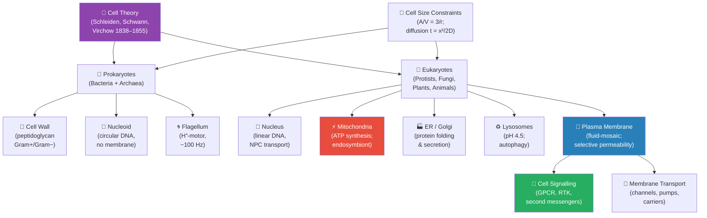

<!-- render:skip-beamer -->

# Unit II — The Cell: Introduction {.unnumbered}

## Why This Unit Matters {.unnumbered}

In 1665, Robert Hooke pressed a thin sliver of cork against the lens of a compound microscope he had
built himself and saw, for the first time in human history, the architectural unit of life: the cell.
He called them *cellulae* — small rooms — because they reminded him of monks' chambers in a monastery.
What Hooke saw in cork were dead walls. Antoni van Leeuwenhoek, a decade later, saw living cells:
bacteria darting through pond water, human sperm, red blood cells coursing through capillaries. The
universe had grown smaller in every direction.

Today, three and a half centuries after those first observations, the cell remains the central unit of
biology — and it turns out to be far stranger and more sophisticated than Hooke could have imagined.
A typical human liver cell contains ~20,000 different proteins, ~5 km of DNA, ~5,000 mitochondria, and
~10 million ribosomes, most coordinated within a volume of roughly 1,000 μm³. Every second, that cell
performs thousands of enzymatic reactions, processes ~20 receptor signals, divides its mitochondria,
degrades misfolded proteins in lysosomes at pH 4.5, and repairs ~10,000 DNA lesions in its nucleus —
most simultaneously, without a central coordinator.

This unit examines the cell at three levels of resolution: the **cellular** (organelle inventory and
function), the **molecular** (membrane biophysics, signal transduction), and the **computational**
(mathematical models of cell size constraints, diffusion, and membrane potential). You will encounter
the endosymbiotic theory — one of the most elegant and evidence-rich hypotheses in biology — and the
minimal cell, which asks: what is the irreducible instruction set for life?

---

## Landmark Discoveries {.unnumbered}

| Discoverer(s) | Year | Journal / Source | Discovery | Significance |
| ------------- | ---- | ---------------- | --------- | ------------ |
| Robert Hooke | 1665 | *Micrographia* | "Cells" in cork | Named and conceptualised the cellular unit; launched microscopy as a biological tool |
| Schleiden & Schwann | 1838–39 | Multiple | Cell theory (plants + animals) | First two postulates: most organisms are composed of cells |
| Rudolf Virchow | 1855 | *Archiv f. path. Anat.* | *Omnis cellula e cellula* | Third postulate: cells arise primarily from pre-existing cells; foundational to cancer biology |
| George Palade | 1953 | *J. Histochem. Cytochem.* | Ribosome discovery via electron microscopy | Identified the protein synthesis machinery; Nobel Prize, 1974 |
| Peter Mitchell | 1961 | *Nature* | Chemiosmosis — proton-gradient-driven ATP synthesis | Explained mitochondrial ATP production; later became central to Unit III |
| Lynn Margulis | 1967 | *J. Theor. Biol.* | Formal endosymbiotic theory | Proposed mitochondria and chloroplasts are descended from engulfed bacteria |
| J. Craig Venter et al. | 2016 | *Science* | JCVI-syn3.0: minimal synthetic cell (473 genes) | Defined the lower boundary of self-replicating cellular life |

---

## Key Concepts and Connections {.unnumbered}


<!-- alt: Graph showing unit II concept map — The Cell. Purple = foundational theory; red = energy-related organelles (anticipating Unit III); blue = membrane; green = signalling. -->

*Unit II concept map — The Cell. Purple = foundational theory; red = energy-related organelles (anticipating Unit III); blue = membrane; green = signalling.*

---

## Current Evidence Thread {.unnumbered}

Read Unit II as a measurement story: cell biology is now captured as live-cell biosensor and optogenetic recordings, cryo-electron tomograms, spatial and single-cell atlases, and perturbational screens rather than static diagrams alone. As you
move through the chapters, keep a two-column note: **claim** on the left,
**evidence that would change my confidence** on the right. By the end of the
unit, each major idea should be tied to a measurement, model, citation, or
paper-based lab decision.

## Chapter Roadmap {.unnumbered}

| Chapter | Title | Core Question | Key Equation / Model |
| ------- | ----- | ------------- | -------------------- |
| **5** | Cell Theory and Cell Types | What is a cell, and how did cell theory transform biology? | $A/V = 3/r$; $t = x^2/2D$ |
| **6** | Cell Structure and Organelles | How do eukaryotic organelles achieve compartmentalised function? | Nernst equation (membrane potential) |
| **7** | Membrane Transport | How do cells control passage across membranes? | Fick's First Law: $J = -D(dC/dx)$ |
| **8** | Cell Signalling | How do extracellular signals change intracellular behaviour? | Hill equation (co-operativity); cAMP second messenger models |

---

## Connections Across the Textbook {.unnumbered}

- **Membranes and transport** (\cref{sec:unit_II_membrane_transport}) are the physical substrate for the proton-motive force of mitochondria and chloroplasts (Unit III) and the action potential of neurons (Unit IX).
- **Cell signalling** (\cref{sec:unit_II_cell_signaling}) reappears in Unit IV (nuclear signalling and gene regulation), Unit V (mitosis/meiosis checkpoints), Unit IX (hormone receptor cascades), and oncogene/tumour-suppressor biology.
- **Endosymbiosis** directly informs Unit VI (mitochondrial DNA as molecular clock), Unit VII (organelle gene transfer to nucleus), and Unit VIII (chloroplast inheritance).
- **Prokaryotic cell structure** (cell walls, flagella, pili) underpins Unit VII (Microbiology) — antibiotic mechanisms, Gram staining, biofilm formation.

> **Key vocabulary introduced here:** prokaryote, eukaryote, organelle, nucleoid, plasma membrane, endosymbiosis, fluid-mosaic model, ligand, receptor, second messenger, autophagy.


## Computational Toolbox — Unit II {.unnumbered}

```python
from biology.cell import nernst_potential, goldman_equation, IonConcentration

# Nernst equation: equilibrium potential for K+ at 37°C
k_ion = IonConcentration(name="K+", intracellular_mM=150, extracellular_mM=4, valence=1)
e_k = nernst_potential(k_ion)
print(f"E_K = {e_k:.1f} mV")
# Expected: E_K = -89.7 mV (close to resting potential of -70 mV; K+ is dominant)

# Goldman-Hodgkin-Katz equation: resting membrane potential
# Permeabilities at rest: P_K = 1.0, P_Na = 0.04, P_Cl = 0.45
ions = [
    IonConcentration("K+",  150, 4,   valence=1),
    IonConcentration("Na+", 15,  145, valence=1),
    IonConcentration("Cl-", 10,  120, valence=-1),
]
permeabilities = {"K+": 1.0, "Na+": 0.04, "Cl-": 0.45}
v_rest = goldman_equation(ions, permeabilities)
print(f"V_rest (GHK) = {v_rest:.1f} mV")
# Expected: V_rest (GHK) ≈ -70.0 mV
```

> **Try it yourself:** Change `P_Na` from 0.04 to 0.6 (simulating an action potential peak)
> and observe how `V_rest` shifts toward `E_Na` (≈ +60 mV).

---

*Source note: cell-biology helpers cover membrane biophysics, signal transduction, and organelle inventory. Mermaid diagrams and Nernst plots provide the visual companion.*
