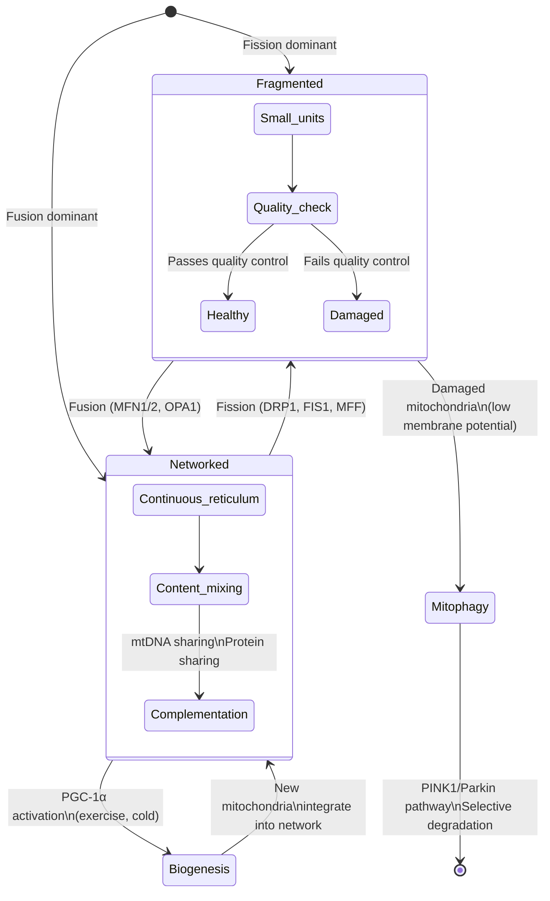
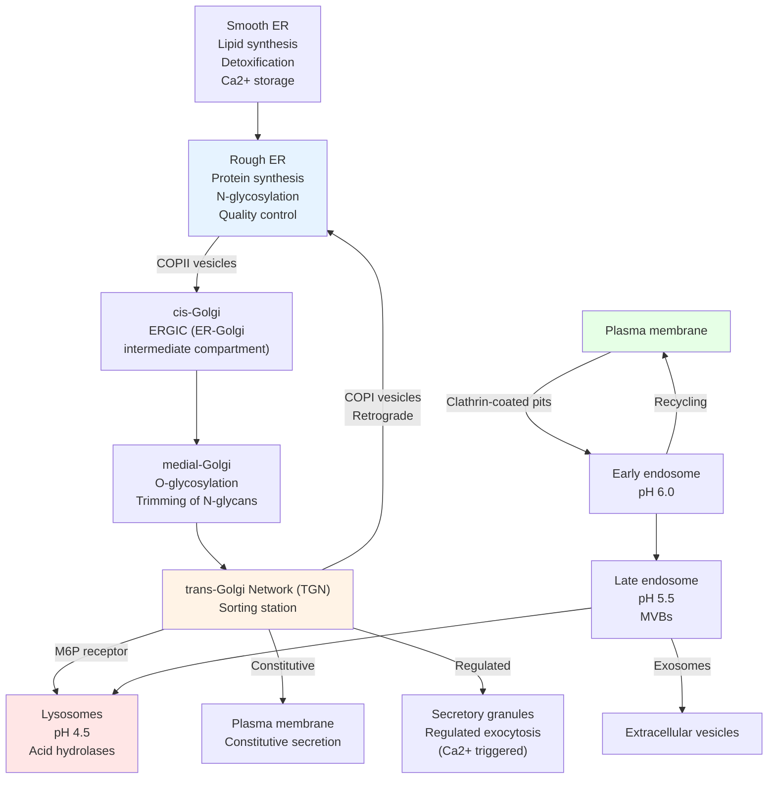
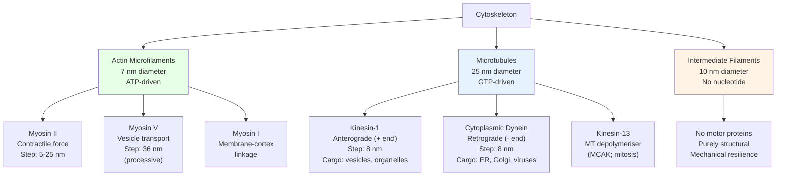
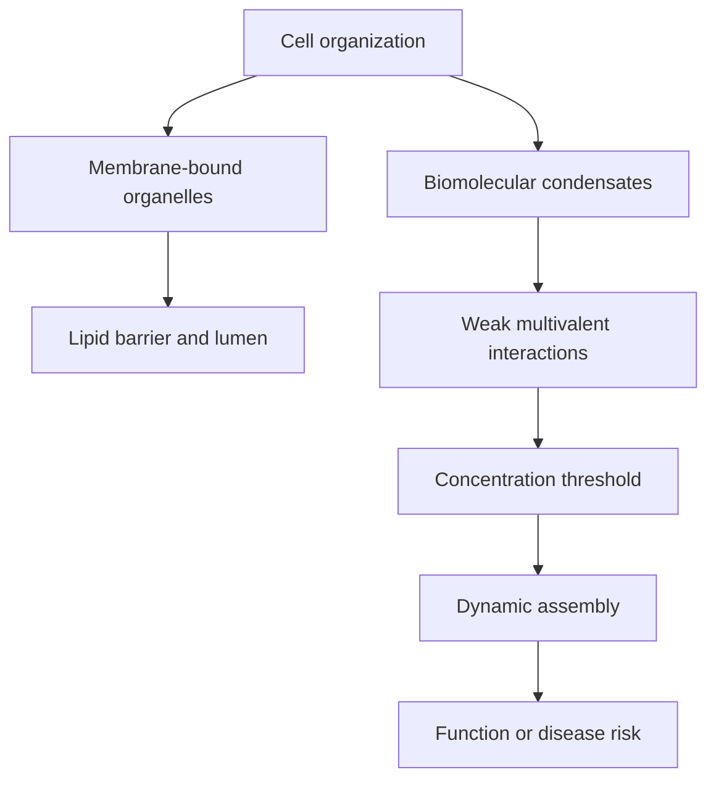

<!-- render:skip-beamer -->

# Cell Structure and Organelles

\label{sec:unit_II_cell_structure}


<!-- chapter-metadata-badge -->
> **Ch 6** · Level 2/3 · 50 min read · 75 min lecture · Prerequisites: \cref{sec:unit_II_cell_theory}

## Learning Objectives

1. Describe the structure and function of each major eukaryotic [**organelle**](#gl:organelle) in detail.
2. Explain the endomembrane system and the secretory/endocytic pathways, including coat [**protein**](#gl:protein)s and sorting signals.
3. Describe the [**cytoskeleton**](#gl:cytoskeleton): microtubules, microfilaments, and intermediate filaments, including their associated motor proteins.
4. Explain how the nucleus controls [**gene**](#gl:gene) expression through [**chromatin**](#gl:chromatin) organisation and the [**histone code**](#gl:histone-code).
5. Relate organelle dysfunction to specific human diseases.
6. Describe mitochondrial dynamics (fusion, fission) and their role in cellular [**homeostasis**](#gl:homeostasis).
7. Explain the role of peroxisomes, centrosomes, and primary cilia in cell biology.
8. Describe cell adhesion molecules and their role in tissue architecture.

<!-- curriculum-scaffold-start -->
### Study Blueprint

- **Big idea:** Organelle structure partitions work, traffic, information, and energy inside eukaryotic cells.
- **Core concepts:** organelles, endomembrane system, cytoskeleton, motor proteins.
- **Framework alignment:** Vision & Change: Structure and function, Systems, Information flow, exchange, and storage; AP Biology: Systems Interactions, Information Storage and Transmission; NGSS-style topics: Structure and Function.
- **Model or quantitative lens:** Compartment-flow and motor-transport calculations.
- **Data skill:** Trace a molecule through compartments using evidence from labels or perturbations.
- **Practice cadence:** Visual Representations, Questions and Methods, Argumentation.
- **Common misconception to repair:** Organelles are dynamic process hubs, not static textbook icons.
- **Primary lab:** \cref{sec:lab_unit_II_cell_structure}.
- **Question bank:** \cref{sec:q_unit_II_cell_structure}.
- **Transfer task:** Apply compartment logic to secretion, apoptosis, infection, or cell division.
- **Bridge to computation:** `biology.cell.cell_biology.ORGANELLES`.
<!-- curriculum-scaffold-end -->

---

> **Opening Vignette: The World's Smallest Rotary Motor**
>
> Buried in the envelope of a bacterium is a molecular machine that spins at 100,000 rotations per
> minute, driven by a stream of protons flowing down an electrochemical gradient. The **bacterial
> flagellar motor** — known since the 1970s from electron microscopy — is roughly 45 nm in diameter
> and converts ion-motive force directly into rotational movement, propelling the cell at up to
> 30 body lengths per second. No human-engineered motor approaches this combination of speed, size,
> and efficiency.
>
> The bacterial flagellar motor is assembled from over 40 different proteins, each with a precise
> structural role: the MS ring anchors to the inner membrane; the C ring acts as a cargo dock for
> proteins to be secreted; the rod and hook transmit torque; the flagellar filament acts as a
> propeller. The motor can switch rotation direction in under a millisecond, enabling the tumbling
> runs that allow bacteria to chemotax toward nutrients (Berg & Brown, 1972, *Nature*). Cell
> structure, as this chapter shows, is not merely a container for biochemistry — it is the
> machinery of life itself.
>
> *Primary source: Berg, H. C. & Brown, D. A. (1972). Chemotaxis in Escherichia coli analysed by three-dimensional tracking. Nature, 239(5374), 500–504.*

---

## Quantitative Organelle Inventory

Before examining each organelle individually, it is useful to fix the dimensions and copy numbers in a single reference table. Sizes vary modestly across cell types; the values below are typical for a cultured mammalian cell (HeLa-like, ~20 μm diameter).

| Organelle | Linear dimension | Number per cell | Approximate volume | Membrane area |
| --------- | ---------------- | --------------- | ------------------ | ------------- |
| Plasma membrane | 5 nm thick; 20 μm cell diameter | 1 | --- | ~1,300 μm$^2$ |
| Nucleus | 5–10 μm diameter | 1 | ~600 μm$^3$ | ~280 μm$^2$ (NE) |
| Nuclear pore complex (NPC) | ~120 nm outer; ~9 nm channel | ~3,000–5,000 | --- | --- |
| Mitochondrion | 0.5–10 μm long; 0.5 μm wide | 100–2,000 | ~400 μm$^3$ total | OMM ~5,000 μm$^2$; IMM ~30,000 μm$^2$ (cristae 6× amplification) |
| Mitochondrial DNA (mtDNA) | 16,569 bp circular | ~10–100 copies per mitochondrion | --- | --- |
| Rough ER | sheets/tubules ~30–100 nm | one continuous network | ~10% cell volume | ~13,000 μm$^2$ |
| Smooth ER | tubules ~30–60 nm | one network (continuous with RER) | varies; large in liver/muscle | varies |
| Golgi stack | 4–8 cisternae; ~1 μm wide | typically 1 (cis–trans); fragmented during mitosis | ~1% cell volume | ~1,000 μm$^2$ |
| Lysosome | 0.1–1 μm diameter | ~50–1,000 | ~1% cell volume | ~100 μm$^2$ each |
| Peroxisome | 0.1–1 μm diameter | 50–1,000 | ~1% cell volume | --- |
| Centriole | 200 nm long × 250 nm wide | 2 (one centrosome) | --- | --- |
| Primary cilium | 1–10 μm long × 250 nm wide | 1 | --- | --- |
| [**Ribosome**](#gl:ribosome) (cytosolic, 80S) | ~25 nm | ~10$^7$ per cell | --- | --- |
| Ribosome (mitochondrial, 55S) | ~25 nm | ~10$^4$ per mitochondrion | --- | --- |
| Microtubule | 25 nm wide × variable length | thousands | --- | --- |
| [**Actin**](#gl:actin) filament | 7 nm × variable length | ~10$^9$ G-actin monomers | --- | --- |
| Cytoplasmic vesicle | 50–200 nm | thousands transient | --- | --- |
| Proteasome (26S) | 45 nm long | ~30,000–500,000 per cell | --- | --- |

Three numerical patterns deserve attention. (1) The internal membrane area exceeds the plasma membrane area by ~30-fold, so the plasma membrane is a small fraction of cellular membrane surface. (2) Mitochondria are the largest membrane reservoir (cristae alone are 20× the plasma membrane), which is why their dysfunction propagates so quickly through bioenergetics. (3) NPCs are far rarer than ribosomes (10$^3$ vs. 10$^7$) yet handle 100× more transport events per second per channel — they are arguably the most heavily used machinery in the cell. The chapters that follow refer back to this table so that quantitative arguments (e.g., "if mitophagy disposes of 10% of mitochondria per day...") have grounded numbers.

---

## The Nucleus --- The Information Centre

The **nucleus** (diameter typically 5--10 μm) is the defining hallmark of the eukaryotic cell.

### Nuclear Envelope

The nucleus is bounded by the **nuclear envelope** --- two concentric [**phospholipid bilayer**](#gl:phospholipid-bilayer)s (inner and outer nuclear membrane). The outer nuclear membrane is continuous with the rough ER. The **nuclear pore complex (NPC)** penetrates both membranes at ~3,000 pores per nucleus. Each NPC is a massive protein assembly (~120 MDa; 34 distinct nucleoporin proteins, 8-fold rotational symmetry), gating passage of macromolecules:

- Small molecules (<40 kDa) diffuse passively through the pore channel (diameter ~9 nm)
- Larger molecules require **nuclear localisation sequences (NLS)** or **nuclear export sequences (NES)** recognised by importin/exportin proteins
- The NPC can transport cargo up to ~39 nm in diameter (e.g., ribosomal subunits, mRNA-protein complexes)
- Transport is powered by the RanGTP/RanGDP gradient: high RanGTP in the nucleus, high RanGDP in the [**cytoplasm**](#gl:cytoplasm)

**Import mechanism:** Cargo with NLS binds importin-alpha/beta in the cytoplasm, translocates through the NPC, and RanGTP in the nucleus causes importin to release its cargo.

**Export mechanism:** Cargo with NES binds exportin (CRM1) + RanGTP in the nucleus, translocates out, and RanGAP in the cytoplasm hydrolyses RanGTP to RanGDP, releasing cargo.

**NPC architecture in numbers.** Each NPC is built of ~30 distinct nucleoporin (Nup) species totalling ~500–1,000 protein subunits arranged with 8-fold rotational symmetry. The structural scaffold (the "Y-complex") forms two outer rings; cytoplasmic and nuclear filaments project ~50 nm from each face; FG-repeat nucleoporins (Nup98, Nup62, Nsp1) line the central channel and form a hydrogel-like phase that confers selectivity. A single human nucleus contains ~3,000–5,000 NPCs (density ~10–20 per μm$^2$ of nuclear envelope), and each NPC handles roughly **1,000 translocation events per second** at peak activity — meaning the entire nucleus exchanges ~10$^7$ macromolecules per second. The selective barrier is so efficient that small molecules (<40 kDa) cross by simple diffusion in <1 ms while large cargo without NLS/NES are excluded essentially indefinitely. The energy budget is supplied by the **RanGTP/GDP gradient** (10$^4$:1 nuclear:cytoplasmic ratio for RanGTP), which is itself maintained by RanGEF (RCC1, chromatin-bound) and RanGAP (cytoplasmic): the result is a vectorial pump powered by GTP hydrolysis but requiring no direct translocation ATPase.

**Pathological NPCs.** The Nup98 gene is fused to dozens of partners in pediatric leukaemias (Nup98-HOXA9, Nup98-NSD1) — the FG-repeat domain provides a phase-separating prion-like domain that drives oncogenic condensate formation. Nucleoporins also accumulate damage with age; selective loss of NPC function is a hallmark of post-mitotic neurons in Alzheimer's and ALS.

### Protein Targeting and Sorting

Every protein synthesised in the cell must reach a specific compartment, but proteins are made (initially) in primarily two places: free cytosolic ribosomes and ER-bound ribosomes. **Sorting signals** within the polypeptide direct each protein to its destination. Most signals are short, modular, and additive — analogous to postal addresses appended to the same envelope.

| Destination | Targeting signal | Recognition machinery | Mechanism |
| ----------- | ----------------- | --------------------- | --------- |
| Nucleus | Nuclear localisation sequence (NLS): clusters of basic residues (e.g., PKKKRKV in SV40 T-antigen) | Importin-alpha (recognises NLS) + Importin-beta (NPC binding) | Co- or post-translational; powered by Ran-GTP gradient |
| Mitochondrion (matrix) | N-terminal amphipathic alpha-helix (presequence; ~15–70 aa) | TOM complex (outer membrane); TIM23 complex (inner membrane); Hsp70 motor | Post-translational; unfolded protein threaded through; presequence cleaved by MPP |
| Mitochondrion (OMM, IMM) | Internal hydrophobic / cysteine motifs | TOM, SAM, TIM22, MIA40 (IMS) | Multiple lateral and stop-transfer pathways |
| Chloroplast (stroma) | N-terminal transit peptide | TOC and TIC complexes | Analogous to TOM/TIM |
| Peroxisome (matrix) | PTS1 (C-terminal SKL) or PTS2 (N-terminal RLx5HL) | PEX5 (PTS1), PEX7 (PTS2) | Folded proteins imported (unique); mono-ubiquitinated PEX5 recycles via PEX1/6 ATPases |
| ER (secretory pathway) | N-terminal signal peptide (~16–30 hydrophobic aa) | SRP (signal recognition particle) → SRP receptor → Sec61 translocon | **Co-translational** — translation pauses until ribosome docks |
| ER → Golgi (anterograde) | Diacidic/dihydrophobic motifs (DXE, FF) | COPII coat (Sar1, Sec23/24, Sec13/31) | Vesicle budding |
| Golgi → ER (retrieval) | C-terminal KDEL (lumenal) or KKXX (membrane) | KDEL receptor (KDELR); COPI coat | Retrograde retrieval of escaped resident proteins |
| Lysosome | Mannose-6-phosphate (M6P) added in cis-Golgi | M6P receptor (MPR) | Sorting at trans-Golgi network |
| Plasma membrane | Default pathway (no retention signal) | Constitutive secretion | Vesicles fuse continuously |

**The SRP pathway in detail.** SRP is a ribonucleoprotein particle (54 kDa SRP54 GTPase + 6 other proteins + 7SL RNA) that solves a three-way coordination problem: it must (i) recognise the nascent signal peptide as it emerges from the ribosome, (ii) pause translation to prevent premature folding in the cytoplasm, and (iii) deliver the ribosome–nascent chain to the ER membrane. SRP54 binds the hydrophobic signal peptide; SRP9/14 contact the ribosome's elongation factor binding site, halting translation. The complex docks at the SRP receptor (SR, also a GTPase) on the ER membrane. Reciprocal GTP hydrolysis by SRP54 and SR releases SRP, hands the signal peptide to the **Sec61 translocon**, and translation resumes — now co-translationally threading the polypeptide into the ER lumen. The "GTPase exchange" mechanism is deeply conserved: SRP/SR systems occur in bacteria, archaea, and eukaryotes, with lineage-specific architectural variations.

**TOM/TIM mitochondrial import.** Mitochondrial matrix proteins face a unique problem: they must cross *two* membranes while remaining largely unfolded. The **TOM complex** (Translocase of Outer Membrane) — built around Tom40 (β-barrel channel), Tom20 (presequence receptor), Tom22, and small Tom proteins — accepts the presequence on the cytoplasmic side. **TIM23** (Translocase of Inner Membrane) then takes over, threaded by the **PAM motor** (Presequence translocase-Associated Motor) containing mtHsp70 that uses ATP hydrolysis to ratchet the polypeptide into the matrix. The inner membrane potential (ΔΨ ≈ −180 mV) provides additional electrostatic pulling force on the positively charged presequence. Once in the matrix, MPP (Mitochondrial Processing Peptidase) cleaves the presequence and the protein folds, often with mtHsp60/Hsp10 chaperonin assistance.

OMM β-barrel proteins (e.g., porin/VDAC, Tom40 itself) take a different route: through TOM, into the IMS, then inserted laterally by the **SAM complex** (Sorting and Assembly Machinery). Carrier proteins (e.g., ADP/ATP translocase) of the inner membrane skip TIM23 entirely and use **TIM22** for lateral release into the IMM. IMS proteins use the **MIA40/Erv1 disulphide relay** for oxidative folding.

**Why this matters.** Failures of any single targeting pathway produce specific, severe disease phenotypes — testimony to how hard-coded the cellular logistics are. Defects in PEX genes cause peroxisome biogenesis disorders (Zellweger syndrome). Defects in TIM/TOM components cause mitochondrial myopathies. ER signal peptide mutations are now recognised in disorders ranging from preprovasopressin (familial diabetes insipidus) to coagulation-factor deficiencies. The cell's postal system has no general delivery option — every misrouted package is a disease.

> **Concept Check 1b:** A researcher creates a fusion protein with both an N-terminal mitochondrial presequence *and* a C-terminal SKL (peroxisomal PTS1). Where is the protein delivered? (Hint: consider whether targeting is co-translational or post-translational, and which signal acts first.)

### Chromatin and Nucleosomes

Human nuclear DNA (2 x 3.2 billion base pairs = 6.4 Gbp total) is packaged into chromatin. The **[nucleosome](#gl:nucleosome)** is the basic packaging unit: 147 bp of DNA wound ~1.75 times around an octamer of [**histone**](#gl:histone) proteins (2x H2A, H2B, H3, H4) with linker H1 bridging adjacent nucleosomes.

**Levels of chromatin compaction:**

1. **10 nm fibre** (beads on a string): nucleosome arrays; ~6-fold compaction of naked DNA
2. **30 nm fibre**: solenoid or zigzag arrangement (histone H1 stabilises); ~40-fold compaction
3. **300 nm loops**: attached to a protein scaffold (condensin, cohesin); ~10,000-fold
4. **700 nm condensed chromatin**: mitotic [**chromosome**](#gl:chromosome)
5. **1,400 nm** fully condensed: metaphase chromosome; ~10,000--20,000-fold compaction total

**[Euchromatin](#gl:euchromatin)** (transcriptionally active; less compacted) vs. **[heterochromatin](#gl:heterochromatin)** (transcriptionally silent; highly compacted). Histone modifications (acetylation = active; methylation context-dependent) regulate this switch --- the **histone code**.

| Modification | Residue | Effect | Writer [**enzyme**](#gl:enzyme) | Eraser enzyme |
| ------------ | ------- | ------ | ------------- | ------------- |
| Acetylation | H3K9ac, H3K27ac | Activation | HATs (p300/CBP) | HDACs |
| Methylation | H3K4me3 | Activation ([**promoter**](#gl:promoter)s) | SET1/MLL | KDM5/JARID |
| Methylation | H3K9me3 | Silencing (heterochromatin) | SUV39H1 | KDM4/JMJD2 |
| Methylation | H3K27me3 | Silencing (Polycomb) | EZH2 (PRC2) | KDM6/UTX |
| Phosphorylation | H3S10ph | Mitotic condensation | Aurora B | PP1 |
| Ubiquitination | H2BK120ub | [**Transcription**](#gl:transcription) elongation | RNF20/40 | USP22 |

### Nucleolus

The **nucleolus** (1--3 per nucleus) is not membrane-bound. It is the site of ribosomal RNA (rRNA) transcription by RNA polymerase I and [**ribosome**](#gl:ribosome) assembly. It disassembles during [**mitosis**](#gl:mitosis) and re-forms around **nucleolus organiser regions (NORs)** on chromosomes 13, 14, 15, 21, and 22 (in humans).

The nucleolus has three ultrastructural regions:
- **Fibrillar centre (FC):** rDNA gene clusters and RNA Pol I
- **Dense fibrillar component (DFC):** nascent rRNA processing; fibrillarin
- **Granular component (GC):** maturing pre-ribosomal particles

> **Clinical Connection: The Nucleolus in Cancer**
> Nucleolar size and number are often increased in cancer cells due to elevated ribosome biogenesis driven by oncogenes (Myc, mTOR). Pathologists use nucleolar prominence (AgNOR staining) as a prognostic marker in several cancers. The RNA Pol I inhibitor CX-5461 is in clinical trials as an anti-cancer agent that specifically targets ribosome biogenesis.

> **Concept Check 1:** A protein has both an NLS and an NES. Would it be found in the nucleus or cytoplasm? How might the cell regulate its localisation?

---

## Mitochondria --- Power Plants of the Cell

Mitochondria (singular: mitochondrion) are 1--5 μm long, often branching, highly dynamic organelles. A liver hepatocyte contains ~1,000--2,000 mitochondria, constituting ~20% of cell volume.

### Structural Organisation

- **Outer mitochondrial membrane (OMM):** contains **porin** (VDAC) channels; freely permeable to molecules <5 kDa. Also contains MAM (mitochondria-associated ER membrane) contact sites for Ca$^{2+}$ and lipid exchange.
- **Intermembrane space (IMS):** equivalent to cytoplasm in ion composition; site of electron carrier cytochrome c; contains pro-apoptotic factors (Smac/DIABLO, AIF)
- **Inner mitochondrial membrane (IMM):** highly folded into **cristae** (10x surface area amplification); **impermeable** to protons --- essential for [**chemiosmosis**](#gl:chemiosmosis); contains electron transport chain (ETC) complexes I--IV, [**ATP synthase**](#gl:atp-synthase). The cristae are shaped by the MICOS complex (mitochondrial contact site and cristae organising system) and OPA1.
- **Matrix:** aqueous interior; contains mitochondrial DNA, ribosomes, TCA cycle enzymes, fatty acid oxidation enzymes, pyruvate dehydrogenase complex

**Crista density** correlates with energetic demand: sperm mitochondria and cardiac muscle mitochondria have densely packed cristae. Resting cells have fewer, wider cristae.

### Mitochondrial DNA (mtDNA)

Human mtDNA: 16,569 bp, circular, encodes 37 genes:
- 13 subunits of respiratory chain complexes (e.g., ND1-6, COX1-3, ATP6, ATP8)
- 22 transfer RNAs
- 2 ribosomal RNAs

mtDNA is inherited **maternally** (sperm mitochondria are typically ubiquitinated and destroyed in the fertilised egg). This enables maternal-lineage **phylogenetic analysis** and forensic identification. **Mitochondrial Eve** --- the most recent common maternal ancestor of living humans --- lived ~150,000--200,000 years ago in Africa.

**Mitochondrial diseases** arise from mtDNA [**mutation**](#gl:mutation)s (point mutations or deletions):
- **Leber hereditary optic neuropathy (LHON):** mutations in ND genes leads to retinal ganglion cell degeneration and blindness
- **MELAS** (Mitochondrial Encephalomyopathy, Lactic Acidosis, Stroke-like episodes): A3243G mutation in tRNA-Leu
- **Kearns-Sayre syndrome:** large mtDNA deletions; progressive external ophthalmoplegia, cardiac conduction defects, retinitis pigmentosa

### Mitochondrial Dynamics: Fusion and Fission

Mitochondria are not static organelles --- they constantly undergo **fusion** (joining) and **fission** (splitting), forming a dynamic network called the mitochondrial reticulum.


<!-- alt: State diagram showing mitochondrial dynamics: the balance between fusion and fission controls mitochondrial morphology, quality control, and biogenesis. Damaged mitochondria are selectively removed by mitophagy via the PINK1/Parkin pathway. -->

*Mitochondrial dynamics: the balance between fusion and fission controls mitochondrial morphology, quality control, and biogenesis. Damaged mitochondria are selectively removed by mitophagy via the PINK1/Parkin pathway.*

**Fusion proteins:**
- **MFN1/MFN2 (mitofusins):** GTPases on the OMM; mediate outer membrane tethering and fusion
- **OPA1:** GTPase on the IMM; mediates inner membrane fusion and cristae remodelling
- Mutations in MFN2 cause **Charcot-Marie-Tooth type 2A** (peripheral neuropathy)
- Mutations in OPA1 cause **[dominant](#gl:dominant) optic atrophy** (most common inherited optic neuropathy)

**Fission proteins:**
- **DRP1 (dynamin-related protein 1):** cytosolic GTPase recruited to the OMM by adaptors (MFF, MiD49/51, FIS1); assembles into a ring and constricts the mitochondrion
- **ER-mitochondria contact sites** mark fission sites; the ER wraps around the mitochondrion before DRP1 recruitment
- Fission is essential for equal mitochondrial distribution during cell division and for isolating damaged mitochondria for mitophagy

**Mitophagy (PINK1/Parkin pathway):**
1. In healthy mitochondria, PINK1 kinase is imported and degraded by PARL protease
2. In damaged mitochondria (depolarised), PINK1 accumulates on the OMM
3. PINK1 phosphorylates ubiquitin and recruits **Parkin** (E3 ubiquitin ligase)
4. Parkin ubiquitinates OMM proteins, creating autophagy receptor binding sites
5. Autophagosome engulfs the damaged mitochondrion for lysosomal degradation

> **Clinical Connection: Mitochondrial Dynamics and Parkinson's Disease**
> Mutations in PINK1 and Parkin cause autosomal recessive early-onset Parkinson's disease (PARK6 and PARK2). The failure of mitophagy leads to accumulation of damaged mitochondria in dopaminergic [**neuron**](#gl:neuron)s of the substantia nigra, causing oxidative stress, energy depletion, and neuronal death. This pathway is a major therapeutic target. see \cref{sec:unit_II_cell_signaling} for [**apoptosis**](#gl:apoptosis) pathways.

> **Concept Check 2:** Predict the mitochondrial [**phenotype**](#gl:phenotype) in a cell with a dominant-negative mutation in DRP1 that prevents GTP hydrolysis. Would the mitochondria appear fragmented or hyperfused?

---

## The Endomembrane System and Secretory Pathway

Several organelles form a functionally integrated **endomembrane system**:


<!-- alt: Flowchart showing endomembrane system and secretory/endocytic pathways. COPII vesicles carry cargo anterograde (ER to Golgi); COPI vesicles carry cargo retrograde (Golgi to ER). The trans-Golgi network sorts proteins to lysosomes (via M6P signal), plasma membrane, or secretory granules. -->

*The endomembrane system and secretory/endocytic pathways. COPII vesicles carry cargo anterograde (ER to Golgi); COPI vesicles carry cargo retrograde (Golgi to ER). The trans-Golgi network sorts proteins to lysosomes (via M6P signal), plasma membrane, or secretory granules.*

### Endoplasmic Reticulum

**Rough ER** (RER): studded with ribosomes; site of synthesis, folding, and initial N-glycosylation of secreted and membrane proteins. Molecular chaperones (BiP/GRP78, calnexin, calreticulin) ensure proper folding; misfolded proteins are retrotranslocated for **ER-associated degradation (ERAD)** by the proteasome.

The **signal recognition particle (SRP)** pathway directs secretory proteins to the ER:
1. Ribosome begins translating mRNA; signal peptide (~16--30 hydrophobic amino acids) emerges
2. SRP binds signal peptide and ribosome, pausing [**translation**](#gl:translation)
3. SRP-ribosome complex docks at SRP receptor on ER membrane
4. Signal peptide inserts into the **translocon** (Sec61 channel)
5. Translation resumes; polypeptide is co-translationally threaded into the ER lumen
6. Signal peptidase cleaves the signal peptide

**Smooth ER** (SER): lacks ribosomes; functions:
- Lipid synthesis (phospholipids, cholesterol, steroid [**hormone**](#gl:hormone)s)
- Drug/toxin detoxification (cytochrome P450 enzymes in liver SER)
- Ca$^{2+}$ storage and release for signalling (sarcoplasmic reticulum in muscle = specialised SER)
- Glycogen metabolism

**Unfolded protein response (UPR):** Accumulation of misfolded proteins triggers the UPR --- three ER stress sensor pathways (IRE1, PERK, ATF6) that expand ER capacity, halt translation, and if irresolvable, trigger apoptosis. Relevant in diabetes (beta-cells overwhelmed by insulin demand), neurodegeneration, and cancer.

**ER quality control and ERAD (in detail).** Newly synthesised glycoproteins entering the ER lumen are tagged with a triple-glucosylated N-glycan (Glc$_3$Man$_9$GlcNAc$_2$). Glucosidases I and II sequentially trim two glucoses, generating a monoglucosylated form that is recognised by the lectin chaperones **calnexin** (membrane-bound) and **calreticulin** (lumenal). These chaperones hold the protein in a folding-competent state. If the protein folds correctly, glucosidase II removes the last glucose and the protein exits via COPII vesicles. If folding fails, **UGGT** (UDP-glucose:glycoprotein glucosyltransferase) re-glucosylates it, sending it back to calnexin/calreticulin — the **calnexin/calreticulin cycle**. Repeated failure marks the protein for **ERAD (ER-associated degradation)**:

1. **Recognition:** Mannose trimming by ER mannosidases (EDEM1/2/3) creates a "give up" signal — no further folding attempts.
2. **Retrotranslocation:** The misfolded protein is recognised by ERAD components (HRD1/SEL1L, gp78, MARCH6) and threaded back to the cytoplasm through a retrotranslocation channel (likely Hrd1 itself).
3. **Polyubiquitination:** ER-membrane E3 ligases (Hrd1, gp78) attach K48-linked ubiquitin chains.
4. **Extraction:** The AAA+ ATPase **p97/VCP** (Cdc48 in yeast) uses ATP hydrolysis to mechanically extract the ubiquitinated polypeptide from the membrane.
5. **Degradation:** The proteasome digests the substrate to small peptides.

**Three branches of the UPR.** When ERAD cannot keep up with the load, three transmembrane sensors are activated:

| Sensor | Mechanism | Output | Time scale |
| ------ | --------- | ------ | ---------- |
| **IRE1** | Lumenal domain dimerises on misfolded proteins; cytoplasmic domain has kinase + endoribonuclease activity | Splices XBP1 mRNA → active XBP1s transcription factor → genes for ER expansion, ERAD, lipid synthesis | Minutes–hours (chronic adaptation) |
| **PERK** | Dimerises and trans-phosphorylates eIF2alpha | Global translation attenuation; selective translation of ATF4 → CHOP | Minutes (immediate response) |
| **ATF6** | Trafficks to Golgi; cleaved by S1P + S2P proteases | Cytoplasmic fragment is a transcription factor for ER chaperones (BiP, GRP94) | Hours |

If the lesion is repaired, the UPR shuts down and homeostasis resumes. If the stress is severe or prolonged, **CHOP** (downstream of PERK/ATF4) and IRE1's secondary RIDD activity (Regulated IRE1-Dependent Decay of mRNAs) bias the cell toward apoptosis. The same pathway is therefore an adaptive thermostat *and* a death timer — the switch is set by the integrated stress dose.

**Worked observation: insulin secretion and ER load.** A pancreatic beta-cell synthesises ~10$^6$ insulin molecules per minute during glucose stimulation. Each must be folded with three disulphide bonds, processed by PC1/3 and PC2 from proinsulin, and packaged into secretory granules. ER folding capacity is therefore one of the rate-limiting steps for insulin secretion. Chronic hyperglycaemia (in obesity, type 2 diabetes) drives sustained UPR, eventual CHOP-mediated apoptosis, and progressive beta-cell loss. Pharmacological chemical chaperones (TUDCA, 4-PBA) and selective IRE1 inhibitors are in trials to delay this collapse.

> **Clinical Connection: ER Stress and Type 2 Diabetes**
> Pancreatic beta-cells produce enormous quantities of insulin (~1 million molecules per cell per minute during glucose stimulation). This places extreme demands on the ER folding machinery. Chronic hyperglycaemia and obesity increase insulin demand beyond ER capacity, triggering the UPR. Prolonged UPR activation causes beta-cell apoptosis, contributing to the progressive decline in insulin secretion seen in type 2 diabetes. Pharmacological chaperones (e.g., TUDCA, 4-PBA) that reduce ER stress are being investigated as diabetes therapeutics.

### Golgi Apparatus

The Golgi stack (cis-Golgi network, cis, medial, trans, trans-Golgi network/TGN) receives cargo from the ER in **COPII-coated vesicles** and processes proteins by:
- O-glycosylation (adding sugars to Ser/Thr)
- Proteolytic processing (e.g., insulin prohormone to insulin)
- Phosphorylation of mannose-6-phosphate (M6P) residues, creating the lysosomal targeting signal
- Sorting to: secretory vesicles, plasma membrane, lysosomes, or ER (retrograde COPI vesicles)

**Vesicle coat proteins and their roles:**

| Coat protein | Vesicle route | Cargo |
| ------------ | ------------- | ----- |
| COPII (Sec13/31, Sec23/24) | ER to cis-Golgi | Newly synthesised secretory proteins |
| COPI (coatomer) | Golgi to ER (retrograde) | ER-resident proteins (KDEL retrieval) |
| Clathrin + adaptors (AP1, AP2) | TGN to endosome; PM to endosome | Lysosomal enzymes (M6P); receptor-mediated [**endocytosis**](#gl:endocytosis) |

**Brefeldin A** (BFA) inhibits GBF1 (a GEF for Arf1 GTPase needed for COPI assembly) and dissolves the Golgi within minutes --- demonstrating its dynamic membrane flux.

### Lysosomes

Lysosomes ([**pH**](#gl:ph) 4.5--5.0, maintained by V-type H$^+$-ATPase) contain ~60 acid hydrolases (proteases, lipases, nucleases, glycosidases) that digest:
- **Autophagy:** cellular debris and aged organelles (macroautophagy, microautophagy, chaperone-mediated autophagy)
- **Phagocytosis:** bacteria and debris (in macrophages, neutrophils)
- **Receptor-mediated endocytosis:** LDL-cholesterol uptake
- **Extracellular digestion:** osteoclasts secrete lysosomal contents to resorb bone

**Types of selective autophagy:**
- **Mitophagy:** selective removal of damaged mitochondria (PINK1/Parkin pathway)
- **Pexophagy:** selective removal of excess peroxisomes
- **Lipophagy:** selective degradation of lipid droplets
- **Ribophagy:** selective degradation of ribosomes during starvation
- **ER-phagy/reticulophagy:** selective removal of excess ER

**Lysosomal storage diseases** result from enzyme deficiencies:
- **Pompe disease:** alpha-1,4-glucosidase deficiency, glycogen accumulates, cardiac/muscle failure
- **Gaucher disease:** glucocerebrosidase deficiency, sphingolipid accumulation in macrophages
- **Tay-Sachs disease:** hexosaminidase A deficiency, GM2 ganglioside accumulation in neurons, neurodegeneration
- **Niemann-Pick type C:** NPC1/NPC2 cholesterol transport deficiency, cholesterol accumulates in lysosomes
- Both Pompe and Gaucher are treatable by **enzyme replacement therapy (ERT)**, where recombinant enzyme is infused intravenously and targeted to lysosomes via M6P receptors

> **Concept Check 3:** A patient has I-cell disease (mucolipidosis II), in which the enzyme that adds M6P to lysosomal enzymes in the cis-Golgi is defective. Predict the consequences for (a) lysosomal enzyme targeting, (b) extracellular enzyme levels, and (c) intracellular digestion.

---

## The Cytoskeleton

The cytoskeleton is a dynamic protein network pervading the cytoplasm, providing structural support, enabling cell movement, and directing intracellular traffic.


<!-- alt: Graph showing cytoskeletal components and their associated motor proteins. Actin filaments are driven by myosin motors, microtubules by kinesin and dynein motors, and intermediate filaments have no associated motors. -->

*Cytoskeletal components and their associated motor proteins. [**Actin**](#gl:actin) filaments are driven by myosin motors, microtubules by kinesin and dynein motors, and intermediate filaments have no associated motors.*

### Actin Microfilaments

Actin filaments (F-actin; diameter ~7 nm) are polar, ATP-driven polymers of globular G-actin monomers. Properties:
- **Treadmilling:** net polymerisation at the (+) barbed end; depolymerisation at the (-) pointed end, resulting in net movement of the filament while maintaining constant length
- **Branching:** Arp2/3 complex creates ~70-degree branches (lamellipodia, phagocytic cups); nucleated by WASP/WAVE family activators
- **Bundling:** Fimbrin (parallel tight bundles in microvilli), alpha-actinin (looser bundles in stress fibres), villin (intestinal brush border)

**Critical concentration and treadmilling — the quantitative basis.** A single actin monomer can add to (or dissociate from) either end of a filament. At each end, the rate constants for assembly ($k_+$) and disassembly ($k_-$) define an end-specific **critical concentration**:

\begin{equation}
C_c^{\text{end}} = \frac{k_-}{k_+}
\label{eq:unit_II_critical_conc}
\end{equation}

When the free monomer concentration $[G\text{-actin}]$ exceeds $C_c$, the end grows; below $C_c$, the end shrinks. Crucially, the (+) barbed end and the (−) pointed end have *different* critical concentrations because of their different geometries:

$$C_c^{(+)} \approx 0.1 \, \mu\text{M}, \qquad C_c^{(-)} \approx 0.6 \, \mu\text{M} \tag{6.2} \label{eq:unit_II_cell_structure_item_1}$$

In a steady state with $[G\text{-actin}]$ between these two values (say 0.3 μM), the (+) end grows continuously while the (−) end shrinks continuously — and the filament *translates* through space at a steady velocity even though its average length is constant. This is **treadmilling**, and the velocity is:

$$v_\text{tread} = \delta \cdot k_+^{(+)} \cdot ([G] - C_c^{(+)}) \tag{6.3} \label{eq:unit_II_cell_structure_item_2}$$


where $\delta = 2.7$ nm (axial rise per monomer; two monomers per helical repeat = 5.4 nm). For lamellipodial actin in a migrating fibroblast, treadmilling proceeds at ~0.1 μm/s at 37 °C — the molecular speed limit on which crawling cells move.

ATP hydrolysis on the filament shifts the (−)-end disassembly rate, increasing the asymmetry between ends; cofilin and ADF (actin-depolymerising factor) accelerate (−)-end disassembly; profilin loads ATP onto G-actin to enrich the (+)-end-favoured pool. The net result is that **treadmilling is energetically driven by ATP hydrolysis** even though the polymerisation reaction itself does not consume ATP.

**Microtubule dynamic instability — the GTP cap.** Microtubules treadmill very weakly; instead they exhibit **dynamic instability** — alternating phases of growth and rapid shrinkage at a single end. The (+) end of a growing microtubule carries a "GTP cap" (a few hundred GTP-tubulin subunits added before hydrolysis catches up). When the cap is intact, polymerisation continues at ~1 μm/min. Stochastic loss of the cap exposes GDP-tubulin, which has a strained lateral lattice and undergoes rapid catastrophic depolymerisation at ~10–30 μm/min ("**catastrophe**"). Catastrophic shrinkage can be rescued by reformation of a GTP cap ("**rescue**"). The four parameters — growth rate $v_g$, shrinkage rate $v_s$, catastrophe frequency $f_c$, rescue frequency $f_r$ — completely specify microtubule behaviour and are tuned by a panoply of plus-end tracking proteins (+TIPs: EB1, CLIP-170) and depolymerases (kinesin-13/MCAK).

**Motor proteins on actin:**
- **Myosin II:** generates contractile force (muscle sarcomere, cytokinesis, cell migration); bipolar thick filaments; step size ~5--25 nm; non-processive (releases after each step)
- **Myosin V:** processive motor for vesicle transport; walks "hand-over-hand" with 36 nm steps matching the F-actin helical repeat; transports melanosomes, ER, secretory vesicles
- **Myosin I:** single-headed; links membrane to actin cortex; involved in endocytosis and membrane tension

Functions: cell shape, cytokinesis (contractile ring), muscle contraction, phagocytosis, cell crawling (lamellipodia, filopodia), intracellular organelle movement.

### Tubulin Microtubules

Microtubules (MTs; 25 nm diameter) are hollow tubes of alpha/beta-tubulin heterodimers forming 13 protofilaments. Properties:
- **GTP-driven dynamic instability:** rapid switching between growth (rescue) and catastrophic depolymerisation; GTP cap model --- growing end has GTP-tubulin; loss of cap triggers depolymerisation
- **Polarity:** (+) end grows toward cell periphery; (-) end at **MTOC/centrosome**
- **Post-translational modifications:** acetylation (stable MTs), tyrosination/detyrosination, polyglutamylation --- the "tubulin code" directs motor protein binding

**Motor proteins on microtubules:**
- **Kinesin-1 (conventional kinesin):** anterograde (+ end directed); dimeric, processive; 8 nm step size matching tubulin repeat; transports vesicles, mitochondria, mRNA toward cell periphery; speed ~0.8 μm/s
- **Cytoplasmic dynein:** retrograde (- end directed); large complex (~1.2 MDa) with dynactin cofactor; 8 nm steps; transports ER, Golgi, endosomes, viruses toward cell centre; also drives mitotic spindle positioning
- **Kinesin-13 (MCAK):** depolymerises MT ends; critical for spindle dynamics during mitosis

Functions: chromosome segregation (mitotic spindle), flagella/cilia (axoneme: 9+2 MT arrangement), intracellular vesicle transport (axonal transport in neurons), cell polarity, cell shape.

### Worked Example: Motor Protein Kinematics and Energetics

**Problem:**
A kinesin-1 motor protein is transporting a neurotransmitter vesicle down a nerve axon along a microtubule. The motor moves at a constant velocity of $v = 0.80 \, \mu\text{m/s}$ and takes fixed step sizes of $d = 8 \, \text{nm}$ per step. 
1. How many steps does the kinesin take per second?
2. If kinesin hydrolyses exactly one ATP molecule per 8 nm step, how many ATP molecules are consumed during a $2.4 \, \text{mm}$ transport journey along the axon?

**Solution:**

1. **Calculate the stepping rate:**
   First, convert velocity to nanometres per second to match the step size units:
   $$ v = 0.80 \, \mu\text{m/s} = 800 \, \text{nm/s}  \label{eq:unit_II_cell_structure_item_3}$$

   Calculate the number of steps per second:
   $$ \text{Step rate} = \frac{v}{d} = \frac{800 \, \text{nm/s}}{8 \, \text{nm/step}} = 100 \text{ steps/s}  \label{eq:unit_II_cell_structure_item_4}$$

   The motor takes exactly **100 steps per second**.

2. **Calculate the energy consumption for the journey:**
   Convert the total distance from millimetres to nanometres:
   $$ D_{\text{total}} = 2.4 \, \text{mm} = 2.4 \times 10^6 \, \text{nm} = 2,400,000 \, \text{nm}  \label{eq:unit_II_cell_structure_item_5}$$

   Calculate the total number of steps:
   $$ \text{Total steps} = \frac{D_{\text{total}}}{d} = \frac{2,400,000 \, \text{nm}}{8 \, \text{nm/step}} = 300,000 \text{ steps}  \label{eq:unit_II_cell_structure_item_6}$$

   Since 1 step = 1 ATP molecule hydrolysed:
   $$ \text{Total ATP consumed} = 300,000 \text{ molecules of ATP}  \label{eq:unit_II_cell_structure_item_7}$$


This calculation highlights the immense energy requirements of axonal transport; maintaining trillions of synapses across the nervous system commands a massive proportion of the body's total ATP production.

3. **Calculate the transport time:**
   The total transport time at constant velocity is simply distance divided by velocity:
   $$ t = \frac{D_\text{total}}{v} = \frac{2.4 \times 10^{-3} \, \text{m}}{0.80 \times 10^{-6} \, \text{m/s}} = 3{,}000 \, \text{s} \approx 50 \, \text{min}  \label{eq:unit_II_cell_structure_item_8}$$

   So a kinesin-driven cargo crosses 2.4 mm of axon in just under an hour. For a giraffe motor neuron (axon length ~3 m), the same calculation yields ~43 days — consistent with the historical observation by Weiss and Hiscoe (1948) that materials accumulate above an axonal ligature with a wave-front velocity of a few millimetres per day. Compare this with **passive diffusion** of the same vesicle: using $t = x^2/2D$ with $D \approx 10^{-12}$ m$^2$/s for a 100 nm vesicle, $t \approx 1.4 \times 10^{12}$ s ≈ 45,000 years. Active transport beats diffusion by **eight orders of magnitude** for cargoes of this size and distance. The cell's choice to spend ~10$^5$ ATPs per vesicle is therefore not extravagance — it is what makes the long axon viable at most.

**Worked Example: Comparing kinesin and dynein transport.**

A dendritic spine 50 μm from the cell body needs both anterograde (kinesin: 0.8 μm/s) and retrograde (dynein: 1.0 μm/s) cargoes. Calculate the round-trip time and minimum ATP cost for a single cargo cycle.

- Anterograde transit: $t_+ = 50 \, \mu\text{m} / 0.8 \, \mu\text{m/s} = 62.5$ s
- Retrograde transit: $t_- = 50 \, \mu\text{m} / 1.0 \, \mu\text{m/s} = 50$ s
- Total transit time: $\sim 112$ s (cargo handling and motor switching add another ~10 s)
- Kinesin steps: $50{,}000 \, \text{nm} / 8 \, \text{nm} = 6{,}250$ steps → 6,250 ATP
- Dynein steps (more variable, average ~8 nm): another ~6,250 ATP
- Total: ~12,500 ATP per round trip per cargo

A single dendrite that supports 100 active spines and turns over 10 cargoes per spine per minute therefore consumes ~10$^7$ ATPs/min on motor stepping alone — roughly 1% of a neuron's resting ATP budget devoted to logistics.

**Taxol** (paclitaxel) stabilises MT and prevents depolymerisation, arresting mitosis in metaphase. Used in chemotherapy for breast, ovarian, and lung cancers. It is derived from the bark of the Pacific yew tree (*Taxus brevifolia*).

**Colchicine** destabilises MT by binding free tubulin and preventing polymerisation. Used for gout (inhibits neutrophil migration) and in cytogenetics (arrests cells in metaphase for karyotyping).

**Vincristine/vinblastine** (vinca alkaloids from *Catharanthus roseus*) also destabilise MT. Used in cancer chemotherapy (lymphomas, leukaemias).

### Intermediate Filaments

Intermediate filaments (IFs; ~10 nm diameter) are ropelike cables of coiled-coil proteins. Unlike actin and MT, IFs are not polar and have no associated motors --- they are **purely structural**:

| IF type | Protein | Location | Associated disease |
| ------- | ------- | -------- | ------------------ |
| Keratin (types I/II) | Keratin 1--20 | Epithelial cells | Epidermolysis bullosa simplex |
| Vimentin (type III) | Vimentin | Fibroblasts, endothelial | Diagnostic marker for sarcomas |
| Desmin (type III) | Desmin | Muscle (Z-disc) | Desminopathy (cardiomyopathy) |
| GFAP (type III) | GFAP | Astrocytes | Alexander disease (leukodystrophy) |
| Neurofilament (type IV) | NF-L, NF-M, NF-H | Axons (determines axon diameter) | ALS, Charcot-Marie-Tooth |
| Lamins (type V) | Lamin A/B/C | Nuclear lamina (inner NE) | Progeria, Emery-Dreifuss muscular dystrophy |

**Lamins** form a meshwork underlying the inner nuclear membrane, giving the nucleus mechanical rigidity and organising chromatin. Progerin (mutant lamin A with 50-aa deletion due to a point mutation activating a cryptic splice site) causes **Hutchinson-Gilford progeria syndrome** --- accelerated ageing with death typically by age 13 from cardiovascular disease.

> **Clinical Connection: Cytoskeleton Diseases**
> **Alexander disease** (GFAP mutations): Gain-of-function mutations in GFAP cause Rosenthal fibre accumulation in astrocytes, leading to progressive leukodystrophy with megalencephaly, seizures, and developmental regression.
> **ALS (amyotrophic lateral sclerosis):** Some familial ALS cases involve mutations in dynactin (DCTN1) or dynein, disrupting retrograde axonal transport and causing motor neuron degeneration.
> **Taxol mechanism in cancer therapy:** By hyperstabilising microtubules, taxol prevents the dynamic instability required for mitotic spindle function. Chromosomes cannot properly segregate, activating the spindle assembly checkpoint and ultimately triggering apoptosis in rapidly dividing tumour cells.

> **Concept Check 4:** Kinesin-1 moves toward the (+) end of microtubules, while dynein moves toward the (-) end. In a neuron, which direction does each motor move cargo along the axon? Which motor would transport newly synthesised synaptic vesicle precursors from the cell body to the synapse?

---

## Centrosomes, Centrioles, and Cilia

### Centrosome/MTOC

The **centrosome** is the primary microtubule organising centre (MTOC) in animal cells. It consists of two **centrioles** (barrel-shaped structures of 9 triplet microtubules arranged in a pinwheel) surrounded by **pericentriolar material (PCM)** containing gamma-tubulin ring complexes (gamma-TuRC) that nucleate new microtubules.

During mitosis, centrosomes duplicate and migrate to opposite poles of the cell, organising the mitotic spindle. Centrosome amplification (>2 per cell) is common in cancer and contributes to chromosomal instability.

### Cilia and Flagella

**Motile cilia** (9+2 axoneme: 9 outer doublet MTs + 2 central singlet MTs, linked by dynein arms and nexin bridges) beat in coordinated waves. Found on respiratory epithelium (~200 per cell), fallopian tube epithelium, and ependymal cells lining brain ventricles.

**Primary cilia** (9+0 axoneme: no central pair, non-motile) are mechanosensory/chemosensory antennae present on nearly most mammalian cells. Function as signalling hubs:
- **Hedgehog signalling:** Smoothened receptor relocates to the primary cilium upon Hedgehog ligand binding
- **Polycystin-1/2:** mechanosensitive Ca$^{2+}$ channels on kidney primary cilia; sense urine flow

**Ciliopathies** --- diseases caused by defective cilia:
- **Primary ciliary dyskinesia (Kartagener syndrome):** dynein arm defects; immotile cilia; chronic respiratory infections, situs inversus (50%), male infertility
- **Polycystic kidney disease (PKD):** mutations in PKD1 (polycystin-1) or PKD2 (polycystin-2); defective primary cilia mechanosensing; uncontrolled tubular cell proliferation and cyst formation
- **Bardet-Biedl syndrome:** defective ciliary trafficking; obesity, retinitis pigmentosa, renal anomalies, polydactyly

> **Concept Check 5:** Why does Kartagener syndrome sometimes cause situs inversus (mirror-reversal of organ asymmetry)? Consider the role of motile nodal cilia in establishing left-right body asymmetry during embryonic development.

---

## Peroxisomes

Peroxisomes contain oxidases that generate hydrogen peroxide (H$_2$O$_2$) as a byproduct of fatty acid beta-oxidation, and **catalase** that destroys it:

$$2\text{H}_2\text{O}_2 \rightarrow 2\text{H}_2\text{O} + \text{O}_2 \quad (\text{catalase}) \tag{6.1} \label{eq:unit_II_cell_structure_item_9}$$


### Key Functions

- **Very-long-chain fatty acid (VLCFA) beta-oxidation:** Shortens VLCFAs (>C22) to medium-chain products that are then transferred to mitochondria for complete oxidation
- **Plasmalogen biosynthesis:** Ether-linked phospholipids essential for myelin sheaths; ~50% of heart phospholipids are plasmalogens
- **Bile acid synthesis:** Side chain oxidation of cholesterol intermediates
- **Amino acid oxidation:** D-amino acid oxidase
- **Reactive oxygen species management:** Both generation (H$_2$O$_2$ from oxidases) and detoxification (catalase, peroxidase)
- **Glyoxylate metabolism:** Alanine-glyoxylate aminotransferase (AGT) converts glyoxylate to glycine

### Peroxisome Biogenesis

Peroxisomes form by **growth and division** of existing peroxisomes (similar to mitochondria) and also by **de novo formation** from ER-derived vesicles. Peroxisomal matrix proteins are imported post-translationally via **PTS1** (C-terminal SKL tripeptide) or **PTS2** (N-terminal nonapeptide) signals, recognised by PEX5 and PEX7 receptors.

> **Clinical Connection: Peroxisome Biogenesis Disorders**
> **Zellweger syndrome** (the most severe peroxisome biogenesis disorder) results from mutations in PEX genes (most commonly PEX1). Absent or non-functional peroxisomes lead to VLCFA accumulation, plasmalogen deficiency, and bile acid synthesis failure. Affected infants present with severe hypotonia, seizures, hepatomegaly, and characteristic facial features, with death typically in the first year.
> **X-linked adrenoleukodystrophy (X-ALD):** Mutation in ABCD1 (a peroxisomal ABC transporter for VLCFA); VLCFA accumulation destroys adrenal cortex and CNS myelin. Depicted in the film "Lorenzo's Oil."
> **Primary hyperoxaluria type 1:** AGT mistargeted from peroxisomes to mitochondria; oxalate accumulates; kidney stones and renal failure. see \cref{sec:unit_II_membrane_transport} for ABC transporters.

---

## Cell Adhesion and Junctions

Multicellular organisms require cells to adhere to each other and to the extracellular matrix (ECM). Four major families of cell adhesion molecules (CAMs) and several junction types mediate this:

### Cell Adhesion Molecules

| CAM family | Binding | Ca$^{2+}$ dependent? | Key examples | Function |
| ---------- | ------- | -------------------- | ------------ | -------- |
| Cadherins | Homophilic | Yes | E-cadherin (epithelial), N-cadherin (neural), VE-cadherin (endothelial) | Tissue-specific sorting; adherens junctions |
| Integrins | Heterophilic (ECM ligands) | Yes (divalent cation) | alpha5-beta1 (fibronectin), alphaV-beta3 (vitronectin), alpha2-beta1 (collagen) | Cell-ECM adhesion; focal adhesions; bidirectional signalling |
| Selectins | Heterophilic (sugar ligands) | Yes | L-selectin (leukocytes), P-selectin (platelets, endothelium), E-selectin (endothelium) | Leukocyte rolling and homing |
| IgCAMs | Homo/heterophilic | No | NCAM, ICAM-1, VCAM-1 | Neural development; immune cell adhesion |

### Cell Junctions

- **Tight junctions (zonula occludens):** Seal adjacent epithelial cells; prevent paracellular diffusion; claudins and occludin form the seal; ZO-1/2/3 link to actin cytoskeleton. Create apical-basal polarity.
- **Adherens junctions (zonula adherens):** Cadherin-mediated; linked to actin cytoskeleton via catenins (alpha, beta, p120). E-cadherin loss is a hallmark of epithelial-mesenchymal transition (EMT) in cancer metastasis.
- **Desmosomes (macula adherens):** Cadherin-mediated (desmogleins, desmocollins); linked to intermediate filaments (keratin) via plakoglobin and desmoplakin. Provide mechanical strength to skin and heart. Autoantibodies against desmoglein-3 cause **pemphigus vulgaris** (life-threatening blistering disease).
- **Gap junctions:** Connexin hexamers (connexons) form channels between adjacent cells; allow passage of ions and small molecules (<1 kDa); enable electrical coupling (cardiac muscle synchrony), metabolic coupling, and intercellular signalling. Mutations in connexin-26 (GJB2) are the most common cause of hereditary deafness.
- **Hemidesmosomes:** Integrin alpha6-beta4 links epithelial basal surface to basement membrane; connected to keratin intermediate filaments. Defects cause epidermolysis bullosa (skin blistering from minor trauma).

> **Concept Check 6:** E-cadherin is frequently downregulated in invasive carcinomas. How would loss of E-cadherin promote cancer metastasis? Consider both adhesion and signalling functions.

---

## The Proteasome --- Protein Quality Control

While lysosomes degrade proteins within membrane-bound compartments, the **ubiquitin-proteasome system (UPS)** degrades misfolded, damaged, or regulatory proteins in the cytoplasm and nucleus.

### The 26S Proteasome

The 26S proteasome is a ~2.5 MDa multi-subunit protease complex consisting of:
- **20S core particle:** barrel-shaped structure of four stacked heptameric rings (alpha7-beta7-beta7-alpha7); proteolytic activity (chymotrypsin-like, trypsin-like, and [**caspase**](#gl:caspase)-like) is sequestered within the barrel interior
- **19S regulatory particle (cap):** recognises ubiquitinated substrates, deubiquitinates them, unfolds the polypeptide, and threads it into the 20S core for degradation

### Ubiquitination --- The Degradation Signal

Ubiquitin (76 amino acids, highly conserved) is conjugated to target proteins via a three-enzyme cascade:

1. **E1 (ubiquitin-activating enzyme):** Activates ubiquitin in an ATP-dependent reaction (2 E1 enzymes in humans)
2. **E2 (ubiquitin-conjugating enzyme):** Carries activated ubiquitin (~40 E2s in humans)
3. **E3 (ubiquitin ligase):** Confers substrate specificity; transfers ubiquitin to the target protein (~600 E3s in humans)

A chain of at least 4 ubiquitin molecules linked via K48 serves as the proteasomal degradation signal. Other ubiquitin chain types (K63, M1/linear) serve non-degradative signalling functions (NF-kB activation, DNA repair, endocytosis).

**Key E3 ligases and their substrates:**

| E3 Ligase | Substrate | Function |
| --------- | --------- | -------- |
| MDM2 | p53 | Keeps p53 levels low in unstressed cells |
| APC/C ([**anaphase**](#gl:anaphase)-promoting complex) | Securin, cyclin B | Drives mitotic exit |
| SCF$^{beta-TrCP}$ | Beta-catenin, IkB | Wnt signalling, NF-kB regulation |
| VHL (von Hippel-Lindau) | HIF-1-alpha | Oxygen sensing; mutations cause renal cell carcinoma |
| Parkin | OMM proteins | Mitophagy through the PINK1-Parkin quality-control pathway |

> **Clinical Connection: Proteasome Inhibitors in Cancer**
> **Bortezomib** (Velcade) inhibits the chymotrypsin-like activity of the 20S proteasome. This causes accumulation of misfolded proteins, ER stress, and apoptosis. Multiple myeloma cells are particularly sensitive because they produce enormous quantities of immunoglobulins, generating high proteasomal load. Bortezomib has transformed multiple myeloma treatment. Carfilzomib and ixazomib are second-generation proteasome inhibitors with improved profiles.

---

## CRISPR Applications in Organelle Biology

The CRISPR-Cas9 system has revolutionised the study of organelle biology by enabling precise gene editing:

- **Fluorescent tagging of endogenous proteins:** CRISPR knock-in of GFP/mCherry at native loci enables live imaging of organelles at endogenous expression levels (avoiding overexpression artifacts)
- **[Genome](#gl:genome)-wide screens:** CRISPR knockout libraries have identified new genes required for mitophagy, autophagy, ER-phagy, and peroxisome biogenesis
- **Base editing of mtDNA:** DddA-derived cytosine base editors (DdCBEs) can edit mtDNA without double-strand breaks, enabling creation of precise mitochondrial disease models
- **Organelle-targeted degradation:** AID (auxin-inducible degron) tagged organelle proteins enable acute, reversible organelle disruption

---

## Computational Bridge

Membrane-bound organelle counts are explicit in the cell model and can be queried for teaching comparisons:

```python
from biology.cell import get_organelles_by_cell_type, count_membrane_bound_organelles

org = get_organelles_by_cell_type("animal")
print(count_membrane_bound_organelles(org))
```

> **Clinical / systems note:** Mitochondrial disorders and peroxisomal diseases (e.g. Zellweger spectrum) show how loss of a single organelle compartment produces multi-system phenotypes because compartment-specific metabolites fail to reach the cytosol or nucleus.

---

### DddA-Derived Base Editors: Editing the Mitochondrial Genome Without a Double-Strand Break

Mitochondrial DNA (mtDNA) encodes 13 proteins of the electron transport chain and 22 tRNAs — mutations here cause a spectrum of **mitochondrial diseases** (MELAS, MERRF, Leber's hereditary optic neuropathy) that affect roughly 1 in 5000 births. CRISPR–Cas9 could not reach mtDNA because guide RNA import into mitochondria is inefficient, and any DNA double-strand break in the polyploid (100–10 000 copies per cell) mitochondrial genome triggers rapid linear-DNA degradation rather than useful repair.

The breakthrough came from an unusual source: a **bacterial interbacterial toxin (DddA)** from *Burkholderia cenocepacia* that deaminates cytosines in *double-stranded* DNA (most cytidine deaminases require single-stranded substrates). In 2020, the Liu lab published **DddA-derived cytosine base editors (DdCBEs)** — split DddA halves fused to programmable TALE arrays that reconstitute deaminase activity primarily when both halves bind adjacent mitochondrial sites (*Nature* 2020). Subsequent engineering produced **zinc-finger–DdCBEs** (smaller, easier to import), **mitoBEs** capable of A-to-G edits, and **TALED** (TALE-linked deaminases) for A-to-I conversion. Efficiencies in human cells now reach 30–50 % heteroplasmy shift with bystander editing < 5 %.

Worked example: for the MELAS-causing mutation m.3243A>G in tRNA^Leu^, a DdCBE targeting the reverse strand near position 3244 converts the pathogenic G back to A in ~30 % of mtDNA copies — above the threshold needed to cross the **heteroplasmy clinical phenotype boundary** (~80 % mutant copies for overt disease). A 2022 report corrected a murine Ndufa10 mutation *in vivo* via AAV-delivered DdCBE with functional rescue of respiratory chain complex I. Cautions: off-target mitochondrial editing rates of ~0.1–1 % at 30–50 predicted sites; potential nuclear off-targets; the edit is heritable in the female germline (with the ethical considerations of heritable genome editing). The technology is a clean example of how **unusual biochemistry in obscure organisms** (a bacterial toxin no textbook mentioned in 2019) can become the keystone of a new therapeutic platform within 4 years.

---

## Current Evidence and Frontier Biology

For **Cell Structure and Organelles**, frontier biology belongs inside the evidence logic of
the chapter. Cell biology is increasingly measured as live, spatial, single-cell, and perturbational data rather than static diagrams alone. The core reading question is this: organelle function is dynamic, contact-mediated, and context-dependent rather than a fixed list of compartments.

- **What to verify:** identify the observation, model, assay, or dataset that
  would make the claim stronger or weaker.
- **What to qualify:** state the scale, organism, cell type, environmental
  condition, or population where the claim is expected to hold.
- **What to compare:** test at least one alternative explanation, baseline, or
  null model before treating the pattern as causal.
- **What to cite:** distinguish primary evidence, review synthesis, public
  dataset, and institutional guidance; for recent or numeric claims, prefer
  the source closest to the measurement and state what has changed since it was
  published.

Ask what measurement scale is being claimed: nanometre structure, single-cell transcript abundance, organelle dynamics, tissue context, or organismal phenotype.

**Source practice:** For cell-state claims, distinguish microscopy, live-cell perturbation, single-cell sequencing, spatial transcriptomics, and biochemical assay evidence before making a causal statement.

### Current Evidence Map: Membrane-Bound and Condensate Organization


<!-- alt: Flowchart showing condensates should be taught as regulatable cellular organization, not as a replacement for membrane-bound organelles or as proof of causality by appearance alone. -->

*Condensates should be taught as regulatable cellular organization, not as a replacement for membrane-bound organelles or as proof of causality by appearance alone.*

## Summary

- The nucleus houses chromatin (DNA + histones); nuclear pores regulate macromolecule traffic via the Ran GTPase system; the nucleolus assembles ribosomes and is a cancer prognostic marker.
- Mitochondria have their own circular DNA and ribosomes, consistent with endosymbiotic origin; cristae maximise IMM surface area for the ETC; fusion/fission dynamics maintain mitochondrial quality via PINK1/Parkin-mediated mitophagy.
- The endomembrane system (RER, SER, Golgi, vesicles) coordinates protein secretion and glycosylation; COPII (anterograde), COPI (retrograde), and clathrin (endocytic) coat proteins direct vesicle traffic.
- The cytoskeleton (actin, MTs, IFs) provides structure, enables motility, and directs intracellular transport via motor proteins (myosin, kinesin, dynein).
- Peroxisomes perform VLCFA oxidation and ROS management; centrosomes/cilia function as MTOCs and sensory antennae; cell adhesion molecules and junctions maintain tissue architecture.
- **Connections:** See \cref{sec:unit_II_cell_theory} for cell theory and [**endosymbiosis**](#gl:endosymbiosis), \cref{sec:unit_II_membrane_transport} for membrane traffic, and Unit IX for cilia-linked physiology.

---

## Review Questions

1. Describe the mechanism by which a newly synthesised lysosomal enzyme is sorted from the trans-Golgi network to the lysosome. What would happen if the M6P phosphotransferase were defective?

2. Compare and contrast the three types of cytoskeletal filaments (actin, microtubules, intermediate filaments) in terms of diameter, polarity, [**nucleotide**](#gl:nucleotide) dependence, associated motors, and dynamic behaviour.

3. Explain the PINK1/Parkin mitophagy pathway. Why do mutations in these genes specifically affect dopaminergic neurons in Parkinson's disease?

4. A patient presents with recurrent respiratory infections, male infertility, and situs inversus. What is the likely diagnosis, and what is the molecular basis?

5. Describe the unfolded protein response (UPR) and explain its three branches (IRE1, PERK, ATF6). Under what circumstances does the UPR switch from adaptive to apoptotic?

6. Explain how the nuclear pore complex achieves selective transport of macromolecules while allowing free diffusion of small molecules.

7. Compare the mechanisms by which taxol and colchicine affect microtubule dynamics. Both are used clinically --- for what different purposes?

8. Explain the role of primary cilia as signalling platforms. Why do PKD1/PKD2 mutations in primary cilia lead to polycystic kidney disease?

9. Describe the vesicle coat proteins COPII, COPI, and clathrin. For each, specify the transport route, the GTPase involved, and the type of cargo carried.

10. A cell biologist discovers a new organelle-associated protein. Describe a CRISPR-based experimental strategy to determine its function and subcellular localisation.
11. Using the organelle catalogue, explain why disrupting **mitochondrial** fusion/fission dynamics preferentially affects tissues with high ATP turnover.
12. Compare one structural difference between COPII-coated vesicles and clathrin-coated pits that explains their distinct cargo size ranges.

---


## Further Reading and Source Notes

- Sagan (1967). On the origin of mitosing cells. *Journal of Theoretical Biology*, 14.
- de Duve (1969). The lysosome in retrospect. *Lysosomes in Biology and Pathology*, North-Holland.
- Palade (1975). Intracellular aspects of the process of protein synthesis. *Science*, 189.
- Alberts et al. (latest ed.). *Molecular Biology of the Cell* (chapters on organelles and the endomembrane system). Garland Science.
- Margulis (1981). *Symbiosis in Cell Evolution*. W. H. Freeman.
- Lane & Martin (2010). The energetics of genome complexity. *Nature*, 467.

---

## Key Terms

| Term | Definition |
| ---- | ---------- |
| **Nuclear pore complex** | Massive protein assembly (~120 MDa) gating macromolecule transport between nucleus and cytoplasm |
| **Nucleosome** | Basic chromatin packaging unit: 147 bp DNA wound around histone octamer |
| **Histone code** | Combinatorial histone modifications that regulate chromatin state and gene expression |
| **Cristae** | Folds of the inner mitochondrial membrane that increase surface area for [**oxidative phosphorylation**](#gl:oxidative-phosphorylation) |
| **ERAD** | ER-associated degradation; retrotranslocation of misfolded ER proteins for proteasomal destruction |
| **Unfolded protein response** | Three-branch ER stress pathway (IRE1, PERK, ATF6) that restores proteostasis or triggers apoptosis |
| **Treadmilling** | Actin filament behaviour: net polymerisation at (+) end, depolymerisation at (-) end |
| **Dynamic instability** | Microtubule property: stochastic switching between growth and rapid depolymerisation (GTP cap model) |
| **Kinesin** | Plus-end directed microtubule motor protein; anterograde transport |
| **Dynein** | Minus-end directed microtubule motor protein; retrograde transport |
| **Lamins** | Type V intermediate filament proteins forming the nuclear lamina; mutations cause laminopathies |
| **Mitophagy** | Selective autophagy of damaged mitochondria; mediated by PINK1/Parkin pathway |
| **COPII** | Coat protein complex mediating anterograde ER-to-Golgi vesicle transport |
| **Primary cilium** | Non-motile 9+0 sensory cilium present on most mammalian cells; signalling antenna |
| **Ciliopathy** | Disease caused by defective cilia structure or function (e.g., PKD, Kartagener syndrome) |
| **Connexin** | Protein forming gap junction channels; allows intercellular communication |
| **E-cadherin** | Calcium-dependent homophilic adhesion molecule; loss promotes cancer metastasis |

---

### Companion Source Module

**Cell Structure and Organelles** should leave a reproducible trail from a biological claim to
the code, figure, diagram, or paper-based activity that can test it. Use the
surfaces below to inspect the chapter's assumptions, rerun the relevant model,
or compare the manuscript explanation with companion labs and figures.

| Surface | Use it for |
| --- | --- |
| `src/biology/cell/cell_biology.py` (`Organelle`, `get_organelles_by_cell_type`, `count_membrane_bound_organelles`) | Connect organelle inventories to cell type and function. |
| `src/mermaid/biology_diagrams.py` (`organelle_function_diagram`, `membrane_transport_diagram`) | Keep compartment diagrams tied to transport and interaction. |

**Reproducibility check:** treat an organelle claim as conditional on cell type, developmental state, and measurement method. **Cross-reference:** use \cref{sec:unit_II_cell_theory}, \cref{sec:unit_II_membrane_transport}, and \cref{sec:unit_III_bioenergetics_and_respiration}.
