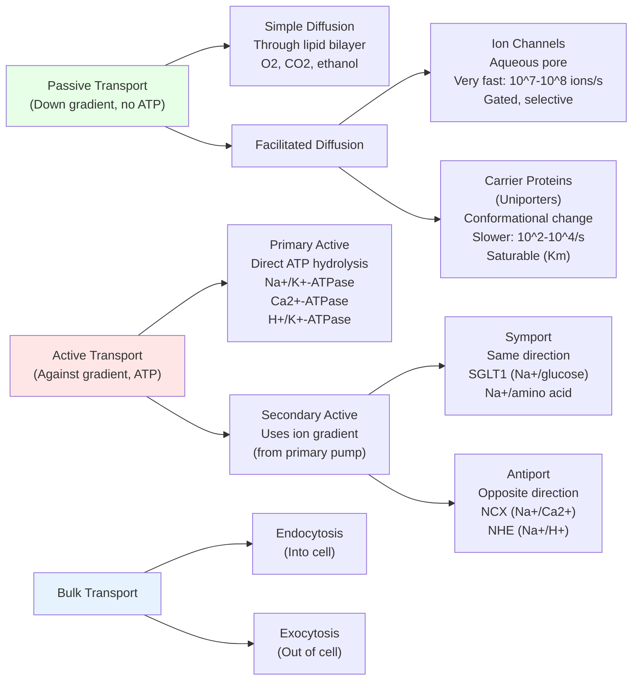
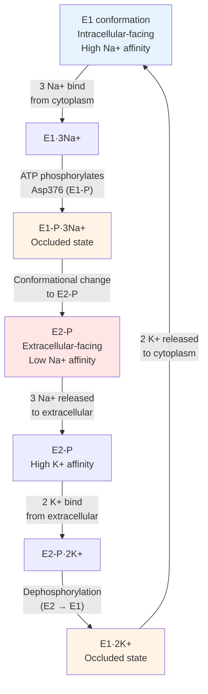
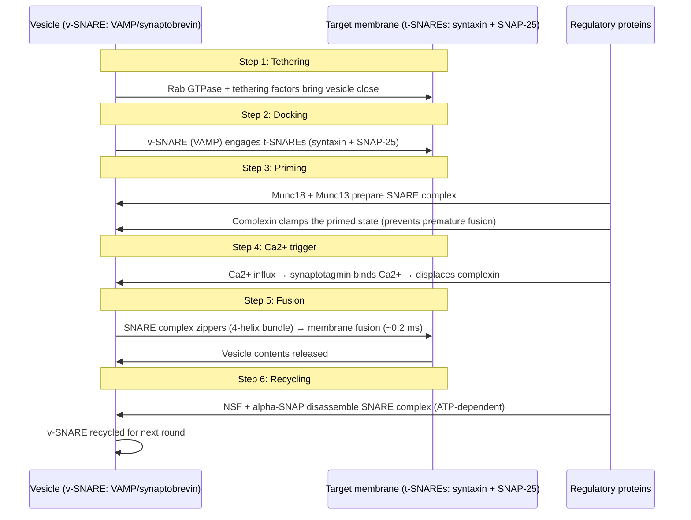

<!-- render:skip-beamer -->

# Membrane Structure and Transport

\label{sec:unit_II_membrane_transport}


<!-- chapter-metadata-badge -->
> **Ch 7** · Level 2/3 · 50 min read · 75 min lecture · Prerequisites: \cref{sec:unit_II_cell_structure}, \cref{sec:unit_I_water_and_life}

## Learning Objectives

1. Describe the fluid mosaic model of the plasma membrane and recent updates from single-molecule studies.
2. Classify membrane [**protein**](#gl:protein)s by their topology and function.
3. Distinguish passive from active transport and provide mechanistic explanations.
4. Derive the Nernst equation and apply it to membrane potential calculations.
5. Explain the Goldman-Hodgkin-Katz equation for multi-ion membrane potential.
6. Describe ion channel gating mechanisms and selectivity filters.
7. Explain the Na$^+$/K$^+$-ATPase cycle and its physiological significance.
8. Describe vesicular trafficking including SNARE-mediated membrane fusion.
9. Compare [**endocytosis**](#gl:endocytosis) types: phagocytosis, macropinocytosis, clathrin-mediated, and caveolar.

<!-- curriculum-scaffold-start -->
### Study Blueprint

- **Big idea:** Membranes convert gradients, permeability, and selective transport into cellular physiology.
- **Core concepts:** bilayers, diffusion, osmosis, electrochemical gradients.
- **Framework alignment:** Vision & Change: Structure and function, Systems, Information flow, exchange, and storage; AP Biology: Systems Interactions, Information Storage and Transmission; NGSS-style topics: Structure and Function.
- **Model or quantitative lens:** Nernst, Goldman, osmotic, and facilitated-transport calculations.
- **Data skill:** Interpret transport data from gradients, rates, and membrane potentials.
- **Practice cadence:** Visual Representations, Questions and Methods, Argumentation.
- **Common misconception to repair:** Equilibrium does not mean equal concentration; charge and permeability matter.
- **Primary lab:** \cref{sec:lab_unit_II_membrane_transport}.
- **Question bank:** \cref{sec:q_unit_II_membrane_transport}.
- **Transfer task:** Transfer gradient logic to neurons, kidneys, roots, and mitochondrial membranes.
- **Bridge to computation:** `biology.cell.cell_biology.nernst_potential`.
<!-- curriculum-scaffold-end -->

\begin{figure}[htbp]
\centering
\includegraphics[width=0.85\textwidth]{../figures/ghk_permeability.png}
\caption{Goldman--Hodgkin--Katz permeability sensitivity. Membrane potential is plotted as relative sodium permeability increases while potassium permeability is held fixed and chloride permeability is varied.}
\label{fig:unit_II_ghk_permeability}
\end{figure}
<!-- alt: Semilog plot of GHK membrane potential in millivolts versus relative sodium permeability. Increasing sodium permeability depolarises the membrane, while separate line styles show how different chloride permeabilities shift the voltage. -->

---

> **Opening Vignette: The Membrane Pump That Makes Cancer Cells Immortal**
>
> In 1976, July Ling and colleagues at MIT discovered that some tumour cells were extraordinarily
> difficult to kill with chemotherapy drugs because they expressed unusual amounts of a 170 kDa
> membrane protein — later named **P-glycoprotein** (P-gp) — that used ATP hydrolysis to actively
> export cytotoxic drugs from the cell interior (Juliano & Ling, 1976, *Biochimica et Biophysica
> Acta*). A cancer cell overexpressing P-gp can reduce the intracellular concentration of
> doxorubicin, vincristine, paclitaxel, and dozens of other chemotherapy agents to sub-lethal
> levels, rendering the entire drug arsenal ineffective. This phenomenon — **multidrug resistance
> (MDR)** — remains one of the greatest challenges in oncology.
>
> P-gp is an ABC transporter: it has two [**nucleotide**](#gl:nucleotide)-binding domains (NBDs) that hydrolyse ATP and
> two transmembrane domains (TMDs) that form the drug-export channel. It exemplifies the principle
> that membranes are not passive barriers — they are dynamic, information-processing systems that
> control exactly which molecules enter and exit cells, and at what rate. Understanding that
> selectivity, and exploiting it therapeutically, is the central theme of this chapter.
>
> *Primary source: Juliano, R. L. & Ling, V. (1976). A surface glycoprotein modulating drug permeability in Chinese hamster ovary cell mutants. Biochimica et Biophysica Acta, 455(1), 152–162.*

---


In 1972, Singer and Nicolson proposed the **fluid mosaic model**: the plasma membrane is a lipid bilayer in which proteins float like icebergs in a sea of lipids. Both the lipid and protein components can diffuse laterally within the membrane plane (**fluid** component), while the asymmetric distribution of lipids and proteins across the two leaflets generates **mosaic** heterogeneity.

### Membrane Lipid Composition

The plasma membrane is not a homogeneous bilayer but contains distinct regions of varying composition:

| Lipid Class | % of membrane (animal) | Location preference |
| ----------- | ---------------------- | ------------------- |
| Phosphatidylcholine (PC) | 25--30 | Outer leaflet |
| Phosphatidylethanolamine (PE) | 25 | Inner leaflet |
| Phosphatidylserine (PS) | 10 | Inner leaflet (negatively charged) |
| Sphingomyelin (SM) | 15 | Outer leaflet (rafts) |
| Cholesterol | 20--50 | Both leaflets (condenses rafts) |
| Phosphatidylinositol (PI) | 5 | Inner leaflet (signalling: PIP$_2$, PIP$_3$) |

**Lipid asymmetry** is maintained by **flippases** (ATP-dependent; P4-ATPases; move PS and PE to the inner leaflet) and **floppases** (ATP-dependent; ABC transporters; move lipids to the outer leaflet). **Scramblases** (Ca$^{2+}$-activated; TMEM16F) randomise asymmetry during [**apoptosis**](#gl:apoptosis) --- externalised phosphatidylserine (PS) is the "eat me" signal recognised by phagocyte receptors (TIM-4, BAI-1, Stabilin-2).

**Membrane fluidity** depends on lipid composition:
$$\text{Fluidity} \propto \frac{\text{degree of unsaturation} + \text{chain shortness}}{\text{cholesterol content (moderate)}} \tag{7.1} \label{eq:unit_II_membrane_transport_item_1}$$


Cholesterol has a biphasic effect: at low temperature, it disrupts crystalline packing (fluidises); at high temperature, it restricts excessive fluidity (condenses). This **buffering** effect maintains membrane fluidity across a physiological temperature range.

### Lipid Rafts and Membrane Microdomains

**Lipid rafts** are dynamic, cholesterol- and sphingolipid-enriched microdomains (10--200 nm) in the outer leaflet that preferentially recruit certain proteins:
- **GPI-anchored proteins** partition into rafts
- **Signalling receptors** (e.g., T cell receptor, B cell receptor) cluster in rafts upon ligand binding
- **Caveolins** (caveolae) represent a specialised, stable form of lipid raft

**Controversy:** The existence and functional significance of lipid rafts has been debated. Single-molecule tracking studies reveal that raft-like domains are transient (~10--20 ms lifetime), small (~10--20 nm), and form/dissolve dynamically. STED super-resolution microscopy (Eggeling et al., 2009, *Nature*) confirmed that sphingolipids and GPI-anchored proteins are transiently confined in nanoscale membrane domains, supporting a dynamic raft model.

### Updates to the Fluid Mosaic Model

Since 1972, several refinements have been made:

1. **Membrane is more mosaic than fluid:** Up to 50% of membrane area is occupied by proteins; crowding restricts lateral diffusion
2. **Cytoskeletal fences:** The [**actin**](#gl:actin) cortex creates corrals ("picket fence" model, Kusumi et al.) that compartmentalise membrane proteins into ~40--300 nm domains, restricting free diffusion
3. **Lipid asymmetry** is more extensive than originally appreciated
4. **Membrane curvature** is actively generated by BAR-domain proteins, ESCRT complexes, and coat proteins
5. **Transbilayer communication:** Inner and outer leaflet lipids can be coupled through interdigitating acyl chains

> **Concept Check 1:** During apoptosis, phosphatidylserine (PS) moves from the inner to the outer leaflet. What [**enzyme**](#gl:enzyme) mediates this, and why is PS externalisation a critical signal for phagocytic clearance?

---

## Membrane Proteins

**Integral (transmembrane) proteins** span the bilayer via alpha-helical segments (of ~20 hydrophobic amino acids each, sufficient to span the ~3 nm hydrophobic core) or beta-barrel structures (found primarily in outer membranes of Gram-negative bacteria, mitochondria, and [**chloroplast**](#gl:chloroplast)s).

**Peripheral proteins** associate noncovalently with membrane surfaces or integral proteins via electrostatic interactions, [**hydrogen bond**](#gl:hydrogen-bond)s, or hydrophobic interactions with the lipid headgroup region.

**Lipid-anchored proteins** are covalently modified with:
- **GPI-anchors** (outer leaflet): e.g., alkaline phosphatase, CD59 (complement regulator)
- **Myristoyl** groups (inner leaflet, N-terminal): e.g., Src kinase
- **Palmitoyl** groups (inner leaflet, Cys residue): e.g., Ras (reversible; regulates membrane association)
- **Farnesyl/geranylgeranyl** groups (inner leaflet, C-terminal CAAX): e.g., Ras, Rho GTPases

### Functions of Membrane Proteins

| Function | Examples |
| -------- | -------- |
| Transport (channel) | Aquaporins, K$^+$ channels, Cl$^-$ channels, mechanosensitive channels |
| Transport (carrier) | GLUT glucose transporters, amino acid carriers, nucleoside transporters |
| Active transport (pump) | Na$^+$/K$^+$-ATPase, Ca$^{2+}$-ATPase (SERCA), H$^+$/K$^+$-ATPase |
| ABC transporter | MDR1/P-glycoprotein, CFTR, ABCA1 (cholesterol efflux) |
| Receptor | EGFR, insulin R, beta$_2$-adrenergic R, rhodopsin, TLR4 |
| Enzyme | Adenylyl cyclase, guanylyl cyclase, gamma-secretase |
| Cell adhesion | Integrins, cadherins, selectins, IgCAMs |
| Structural anchor | Ankyrin-spectrin (RBC), dystrophin-glycoprotein complex |

---

## Passive Transport

Passive transport requires no energy input --- molecules move down their electrochemical gradient.


<!-- alt: Flowchart showing classification of membrane transport mechanisms, from simple diffusion through channels and carriers to primary and secondary active transport and bulk transport. -->

*Classification of membrane transport mechanisms, from simple diffusion through channels and carriers to primary and secondary active transport and bulk transport.*

### Simple Diffusion

For uncharged molecules, flux obeys Fick's First Law:

$$J = -D \frac{d[C]}{dx} = P \cdot \Delta [C] \tag{7.2} \label{eq:unit_II_membrane_transport_item_2}$$


where $P$ = permeability coefficient (m/s) = $D \cdot K_{\text{oil/water}} / d$ (membrane thickness).

Membrane permeability:
- **High:** small nonpolar molecules (O$_2$, CO$_2$, N$_2$, ethanol, benzene)
- **Moderate:** small polar uncharged (water, glycerol, urea)
- **Low:** large polar (glucose, amino acids)
- **Very low/none:** ions (Na$^+$, K$^+$, Cl$^-$, Ca$^{2+}$) --- require protein channels

The **partition coefficient** ($K_{\text{oil/water}}$) is the strongest predictor of simple diffusion rate. Overton's rule (1899): membrane permeability correlates with oil/water partition coefficient.

### Osmosis and the van't Hoff Equation

Although water is technically a small polar molecule, its transport across cell membranes is fast and quantitative enough to deserve its own treatment. **Osmosis** is the net diffusion of water across a semi-permeable membrane in response to a difference in solute concentrations. Because water mass is conserved, osmosis amounts to a redistribution of *volume* — and uncontrolled osmotic swelling will lyse a cell.

The thermodynamic driving force is the difference in **water chemical potential** $\mu_w$ between two compartments:

$$\mu_w = \mu_w^0 + RT \ln a_w + \bar{V}_w P \tag{7.24} \label{eq:unit_II_membrane_transport_item_3}$$


where $a_w$ is water activity (≈ mole fraction in dilute solution) and $\bar{V}_w$ is the partial molar volume of water (~18 mL/mol). Each dissolved solute particle reduces $a_w$ proportionally — this is the molecular origin of colligative properties (boiling-point elevation, freezing-point depression, vapour-pressure lowering). Setting $\mu_w$ equal on both sides of a semi-permeable membrane and solving for the pressure required to balance a solute gradient yields **van't Hoff's law**:

\begin{equation}
\Pi = i M R T
\label{eq:unit_II_vant_hoff}
\end{equation}

where Π is the **osmotic pressure** (in atm or Pa), $M$ is the solute molar concentration, $R$ is the gas constant, $T$ is absolute temperature, and $i$ is the **van't Hoff factor** — the number of effective particles produced per formula unit (1 for glucose; 2 for NaCl; 3 for CaCl$_2$ at full dissociation).

In SI units with $R = 0.0821$ L·atm/mol/K and 37 °C ($T = 310$ K), 1 mM of an ideal solute generates $\Pi = 1 \cdot 0.001 \cdot 0.0821 \cdot 310 = 0.0254$ atm ≈ 25 mmHg. Plasma is ~290 mOsm/L, generating ~7,500 mmHg of total osmotic pressure — but cells don't burst because they are surrounded by isotonic interstitial fluid, and primarily the *difference* matters.

**Worked Example: Osmotic swelling of a red blood cell.**

A red blood cell is placed in a hypotonic solution (200 mOsm/L; plasma is 290 mOsm/L). Calculate (a) the initial osmotic pressure difference driving water inward, (b) the cell's predicted volume change to reach equilibrium.

(a) The osmotic pressure gradient is:
$$ \Delta \Pi = (290 - 200) \times 10^{-3} \cdot 0.0821 \cdot 310 = 0.0900 \cdot 25.45 = 2.29 \text{ atm} \approx 1{,}740 \text{ mmHg}  \label{eq:unit_II_membrane_transport_item_4}$$

This drives water into the cell at a flux of $J_w = p_f \cdot \Delta C$, where $p_f \approx 0.02$ cm/s for an AQP1-rich erythrocyte. For a typical cell ($A \approx 140 \, \mu\text{m}^2$, $V \approx 90 \, \mu\text{m}^3$), volume doubling occurs in roughly 200 ms — fast enough to be visible in a microscope as the cell swells from biconcave disc to sphere.

(b) At osmotic equilibrium, water content adjusts to make intracellular osmolarity = 200 mOsm/L. If initial intracellular osmolyte content is $V_0 \cdot C_0 = 90 \cdot 290 = 26{,}100$ μmol·μm$^3$/L, the new equilibrium volume is:
$$ V_\text{new} = V_0 \cdot \frac{C_0}{C_\text{new}} = 90 \cdot \frac{290}{200} = 130.5 \, \mu\text{m}^3  \label{eq:unit_II_membrane_transport_item_5}$$

A 45% volume increase. RBCs reach a critical volume of ~150 μm$^3$ before haemolysis (membrane area cannot accommodate further sphere expansion), so the cell is on the brink of lysis.

**Tonicity terms (clinical):** Hypotonic solutions cause cells to swell (haemolysis if severe). Isotonic solutions (e.g., 0.9% NaCl, 5% dextrose, lactated Ringer's) preserve volume. Hypertonic solutions cause cells to shrink (crenation in RBCs). Aquaporin defects cause major fluid balance disorders: **AQP2 mutations** cause nephrogenic diabetes insipidus (water reabsorption fails despite vasopressin); **AQP4 autoantibodies** cause neuromyelitis optica (astrocyte water-handling fails, edema and demyelination). The osmotic pressure of plasma proteins (mostly albumin, ~25 mmHg) is the **oncotic pressure** that retains fluid in the vasculature — its loss in nephrotic syndrome and liver failure causes generalised oedema.

> **Concept Check 1b:** A patient with severe burns receives 4 L of 0.45% NaCl ("half-normal saline") rapidly. Calculate the tonicity relative to plasma (290 mOsm/L) and predict the consequence for red blood cells.

### Facilitated Diffusion via Channels

**Ion channels** are integral membrane proteins forming aqueous pores. They are:
- **Selective:** ion selectivity filter determines which ions pass
- **Gated:** open/close in response to specific stimuli
- **Fast:** ion throughput rates of 10$^7$--10$^8$ ions/s (near diffusion limit)

**Gating mechanisms:**

- **Voltage-gated:** opened by membrane-potential change; examples include sodium channel Nav1.1--1.9, potassium channel Kv1--12, and calcium channel Cav1--3 families.
- **Ligand-gated, extracellular:** opened by neurotransmitter binding; examples include nAChR, GABAA receptor, NMDAR, and AMPAR.
- **Ligand-gated, intracellular:** opened by second messengers; examples include calcium-activated potassium channel BK and retinal cGMP-gated channels.
- **Mechanosensitive:** opened by stretch or pressure; examples include Piezo1/2, TREK-1, and bacterial MscL.
- **Temperature-gated:** opened by heat or cold; examples include TRPV1 (>43 degrees C, capsaicin) and TRPM8 (<26 degrees C, menthol).
- **Light-gated:** opened by photons; channelrhodopsin ChR2 is the standard optogenetic example.

**Selectivity filter of K$^+$ channels** (MacKinnon, Nobel Prize 2003):
The selectivity filter contains the signature sequence TVGYG. Four carbonyl oxygens from each of the four subunits line the pore, precisely mimicking the hydration shell of K$^+$ (radius 1.33 angstroms). Na$^+$ (radius 0.95 angstroms) is too small to be coordinated effectively --- the energetic cost of dehydrating Na$^+$ without compensating coordination makes Na$^+$ passage unfavourable. This elegant size-exclusion mechanism achieves 10,000:1 selectivity for K$^+$ over Na$^+$.

**Aquaporins (AQP):** Facilitate water transport (not solutes). AQP1 (Peter Agre, Nobel Prize 2003) channels ~3 x 10$^8$ water molecules/s while excluding protons (the Grotthuss mechanism is interrupted by a critical asparagine residue in the channel pore, and the electrostatic field of the NPA motif reorients water molecules, preventing H$_3$O$^+$ passage).

**Aquaporin discovery and selectivity in detail.** Before 1992, biologists could not explain how erythrocytes and renal tubule cells achieve water permeability rates 100× faster than predicted from the lipid bilayer alone. Peter Agre's group, while studying Rh-blood-group proteins, noticed a contaminating 28 kDa membrane protein. Reconstitution experiments (Preston et al., 1992, *Science*) demonstrated that this protein — christened **AQP1** (aquaporin-1) — conferred ~10× water permeability when expressed in *Xenopus* oocytes. Agre shared the 2003 Nobel Prize in Chemistry. Thirteen aquaporin paralogues are now known in humans, with tissue-specific expression: AQP2 (renal collecting duct, vasopressin-regulated), AQP4 (astrocyte endfeet, target of NMO autoantibodies), AQP5 (salivary/lacrimal glands), AQP7 (adipocytes, glycerol channel).

The structural basis of selectivity is exquisite. Each AQP monomer is a hexa-helical bundle with two short re-entrant helices (carrying the conserved **NPA motifs** — Asn-Pro-Ala) that meet in the middle of the membrane to form the narrowest part of the pore (~2.8 Å, just wide enough for a single water molecule). Two mechanisms exclude protons:

1. **Electrostatic barrier:** The two NPA half-helices have positive macrodipoles meeting in the middle of the pore — repelling H$_3$O$^+$ but attracting electrically neutral water.
2. **Hydrogen-bond reorientation:** The central asparagines force passing water molecules to flip their hydrogen-bond donor/acceptor orientation. This breaks the proton-relay (Grotthuss) chain that would otherwise allow H$^+$ to "hop" through the channel.

The water permeability coefficient ($p_f$, the **osmotic permeability**) for a single AQP1 channel is ~$3 \times 10^{-14}$ cm$^3$/s, corresponding to ~3 × 10$^9$ water molecules/s under typical osmotic gradients. A red blood cell expressing ~200,000 AQP1 channels can therefore exchange its entire water volume in <100 ms — the basis of erythrocyte swelling/shrinking responses.

**Clinical aquaporins.** Loss-of-function mutations in AQP2 cause **nephrogenic diabetes insipidus** (kidneys cannot concentrate urine despite normal vasopressin). Autoantibodies against AQP4 cause **neuromyelitis optica (Devic's disease)**, a demyelinating disorder distinct from MS. AQP1 is upregulated in many tumours and is being explored as a target in glioma therapy.

**Clinical Connection: Channelopathies.** Ion channel [**mutation**](#gl:mutation)s cause a wide range of diseases:

- **Long QT syndrome:** Mutations in cardiac potassium or sodium channels prolong repolarisation and can trigger fatal arrhythmias. Drug-development screens therefore test for hERG channel block.
- **Cystic fibrosis:** Mutations in CFTR disrupt chloride transport. The common deltaF508 variant causes misfolding and ER retention; modulator combinations such as lumacaftor/ivacaftor and elexacaftor/tezacaftor/ivacaftor partly restore channel function.
- **Malignant hyperthermia:** RyR1 mutations cause uncontrolled Ca$^{2+}$ release from sarcoplasmic reticulum after exposure to volatile anaesthetics. See \cref{sec:unit_II_cell_signaling} for calcium signalling.

> **Concept Check 2:** Tetrodotoxin (TTX, from pufferfish) blocks voltage-gated Na$^+$ channels by binding the selectivity filter from the extracellular side. Predict the effects of TTX on (a) [**action potential**](#gl:action-potential) generation, (b) nerve conduction, and (c) skeletal muscle contraction.

### Ion Channel Gating Kinetics

A single ion channel in a patch-clamp recording flickers between open and closed states stochastically. The time-averaged current through a population of $N$ channels with single-channel conductance γ (in pS = pico-siemens) and open probability $P_o$ is:

\begin{equation}
I = N \cdot P_o \cdot \gamma \cdot (V_m - E_\text{rev})
\label{eq:unit_II_macroscopic_current}
\end{equation}

where $V_m$ is the membrane potential and $E_\text{rev}$ is the reversal potential (for a perfectly selective channel, $E_\text{rev} = E_\text{ion}$). This decomposition is one of the most powerful in biophysics: drugs can change channel function by altering $N$ (channel expression/internalisation), $P_o$ (gating modulators, allosteric drugs), or γ (pore-block, modifications of selectivity filter), and each can be measured separately.

**Single-channel conductances of representative channels (in pS):**

- **nAChR, muscle endplate:** conductance 30--50 pS; open probability about 0.85 with ACh; throughput about 3 x 10^7 ions/s.
- **BK, large-conductance calcium-activated potassium channel:** conductance 200--250 pS; open probability 0.1--0.9 depending on calcium; throughput up to 10^8 ions/s.
- **Kv1.x delayed rectifier:** conductance 10--20 pS; open probability about 0.7 at +20 mV; throughput about 10^6 ions/s.
- **Nav1.x:** conductance 15--20 pS; transient open probability below 0.5; throughput about 5 x 10^6 ions/s during an action potential.
- **L-type Cav1.2:** conductance about 25 pS; open probability about 0.3; throughput about 10^5 ions/s.
- **ClC-1 skeletal chloride channel:** conductance about 1 pS with gating-coupled pores; open probability about 0.5 at rest.
- **CFTR chloride channel / ABC transporter:** conductance 8--10 pS; PKA-dependent open probability 0.3--0.5.

**Open probability and gating models.** The open probability $P_o$ depends on the gating stimulus (voltage, ligand concentration, mechanical force). For a voltage-gated channel with effective gating charge $z_g$ (typical ~4–6 for Na$_V$, ~6–10 for K$_V$), the equilibrium open probability follows a Boltzmann relation:

$$P_o(V) = \frac{1}{1 + \exp\left(-\frac{z_g F (V - V_{1/2})}{RT}\right)} \tag{7.19} \label{eq:unit_II_membrane_transport_item_6}$$


where $V_{1/2}$ is the half-activation voltage. This sigmoidal curve is steep (~5–10 mV per e-fold change) — small voltage perturbations cause large changes in $P_o$, the basis of the action potential's switch-like behaviour. For ligand-gated channels with $n$ binding sites and Hill coefficient $h$:

$$P_o([L]) = \frac{[L]^h}{[L]^h + K_d^h} \tag{7.20} \label{eq:unit_II_membrane_transport_item_7}$$


For the muscle nAChR, $h \approx 1.5$ and $K_d \approx 30$ μM for ACh: half-maximal activation at ~30 μM, full activation by ~300 μM. The sub-millisecond opening of nAChRs after ACh release at the neuromuscular junction (peak [ACh] ~1 mM at the postsynaptic membrane) ensures essentially complete channel activation in every action potential.

### Electroneutral vs. Electrogenic Transport

Whether a transporter contributes net charge to the membrane potential depends on the **stoichiometry of the transport cycle**.

| Transporter | Stoichiometry | Net charge moved per cycle | Electrogenic? |
| ----------- | ------------- | -------------------------- | ------------- |
| Na$^+$/K$^+$-ATPase | 3 Na$^+$ out / 2 K$^+$ in / 1 ATP | +1 outward | Yes |
| Ca$^{2+}$-ATPase (SERCA) | 2 Ca$^{2+}$ in (to ER) / 2 H$^+$ out / 1 ATP | 0 | No (electroneutral) |
| H$^+$/K$^+$-ATPase (gastric) | 1 H$^+$ out / 1 K$^+$ in / 1 ATP | 0 | No |
| NCX (Na$^+$/Ca$^{2+}$ exchanger) | 3 Na$^+$ in / 1 Ca$^{2+}$ out | +1 inward | Yes |
| NHE1 (Na$^+$/H$^+$ exchanger) | 1 Na$^+$ in / 1 H$^+$ out | 0 | No |
| SGLT1 (Na$^+$/glucose symport) | 2 Na$^+$ in / 1 glucose | +2 inward | Yes |
| AE1 (Cl$^-$/HCO$_3^-$ exchanger) | 1 Cl$^-$ out / 1 HCO$_3^-$ in | 0 | No |

**Energetic consequences.** Electroneutral transporters move solutes "for free" with respect to the membrane potential — their thermodynamic feasibility depends primarily on chemical concentration gradients. Electrogenic transporters, by contrast, are driven by *both* concentration and voltage. The Na$^+$/K$^+$-ATPase, for example, would still hydrolyse ATP if Na$^+$ and K$^+$ concentrations were equalised, because moving net positive charge against the membrane potential (interior negative) costs additional energy: the **electrochemical gradient** is the relevant thermodynamic quantity:

$$\Delta G_\text{ion} = RT \ln \frac{[C]_\text{out}}{[C]_\text{in}} + z F V_m \tag{7.21} \label{eq:unit_II_membrane_transport_item_8}$$


For a 100× concentration gradient and 100 mV opposing voltage: $\Delta G \approx +12 + 9.6 = 21.6$ kJ/mol. ATP hydrolysis releases ~50 kJ/mol under cellular conditions, so a single ATP can drive ~2 ions of net charge against this combined gradient — exactly the stoichiometry observed in the Na$^+$/K$^+$-ATPase (3 Na$^+$ out – 2 K$^+$ in = +1 net per ATP, with margin for irreversibility).

> **Clinical Connection: Channelopathy diagnostics.** When a patient presents with arrhythmia, episodic weakness, or seizures, modern diagnostics include **gene panels** (sequencing known channel genes) followed by **functional reconstitution** of variants in HEK293 or oocyte expression systems. Patch-clamp measurements decompose the disease-causing change into $N$, $P_o$, and γ effects: for example, the cystic fibrosis ΔF508 mutation reduces $N$ at the membrane (trafficking defect, fixed by lumacaftor); G551D reduces $P_o$ (gating defect, fixed by ivacaftor). The combination drug Orkambi addresses both — a triumph of mechanism-guided pharmacology.

### Facilitated Diffusion via Carriers (Uniporters)

**GLUT transporters** (SLC2A family; 14 isoforms in humans) facilitate glucose diffusion:

| Transporter | Tissue | $K_m$ (mM) | Regulation |
| ----------- | ------ | ---------- | ---------- |
| GLUT1 | Erythrocytes, brain endothelium, placenta | 1.5 | Constitutive |
| GLUT2 | Liver, pancreatic beta-cells, small intestine | 17 | Low affinity; glucose sensor |
| GLUT3 | [**Neuron**](#gl:neuron)s | 1.4 | Constitutive; high affinity for brain |
| [**GLUT4**](#gl:glut4) | Muscle, adipose | 5 | Insulin-stimulated PM insertion |
| GLUT5 | Small intestine | N/A | Fructose transporter |

The **alternating access mechanism**: the carrier alternates between outward-facing (substrate binds from extracellular side) and inward-facing (substrate released to [**cytoplasm**](#gl:cytoplasm)) conformations. This is slower than channel transport (~10$^2$--10$^4$ molecules/s) but allows specificity and saturability.

## Worked Example: GLUT Transporter Kinetics

*Problem:* GLUT1 has $K_m = 1.5$ mM and $V_{max} = 200$ μmol/min per gram of membrane protein. Blood glucose is ~5 mM. At what fraction of $V_{max}$ is GLUT1 operating?

*Solution:*

Using the Michaelis-Menten equation:

$$v = \frac{V_{max} \cdot [S]}{K_m + [S]} = \frac{200 \times 5}{1.5 + 5} = \frac{1000}{6.5} = 154 \; \mu\text{mol/min/g} \tag{7.3} \label{eq:unit_II_membrane_transport_item_9}$$


$$\frac{v}{V_{max}} = \frac{154}{200} = 0.77 = 77\% \tag{7.4} \label{eq:unit_II_membrane_transport_item_10}$$


GLUT1 operates at 77% of maximum capacity at normal blood glucose --- providing a safety margin while ensuring high glucose flux to the brain.

---

## Active Transport

Active transport moves solutes against their electrochemical gradient, requiring energy (usually ATP hydrolysis or proton motive force).

### Primary Active Transport --- Pumps

**Na$^+$/K$^+$-ATPase (sodium-potassium pump):** Exports 3 Na$^+$ and imports 2 K$^+$ per ATP consumed (overall electrogenic; net +1 charge out). This pump consumes ~25% of the body's ATP (up to 70% in neurons).


<!-- alt: Flowchart showing post-Albers cycle of the Na^+/K^+-ATPase. The pump alternates between E1 (inward-facing, high Na^+ affinity) and E2 (outward-facing, high K^+ affinity) conformations. Phosphorylation by ATP and subsequent dephosphorylation drive the conformational changes. -->

*The Post-Albers cycle of the Na$^+$/K$^+$-ATPase. The pump alternates between E1 (inward-facing, high Na$^+$ affinity) and E2 (outward-facing, high K$^+$ affinity) conformations. Phosphorylation by ATP and subsequent dephosphorylation drive the conformational changes.*

This maintains:
- Resting membrane potential (K$^+$ gradient)
- High intracellular [K$^+$] (~140 mM) and low [Na$^+$] (~12 mM)
- Low intracellular Na$^+$ that drives secondary active transport
- Cell volume regulation (preventing osmotic swelling)

**Inhibition by ouabain/digitalis:** Cardiac glycosides block the K$^+$-binding E2-P form. This elevates intracellular Na$^+$, which reduces Na$^+$/Ca$^{2+}$ exchanger activity (NCX normally uses the Na$^+$ gradient to export Ca$^{2+}$), so [Ca$^{2+}$]$_i$ rises, causing stronger cardiac contraction. Used for heart failure; narrow therapeutic window (toxicity causes arrhythmias).

**Other primary active transport pumps:**
- **Ca$^{2+}$-ATPase (SERCA):** pumps Ca$^{2+}$ from cytoplasm into ER/SR lumen; maintains [Ca$^{2+}$]$_i$ at ~100 nM (10,000-fold lower than extracellular); critical for muscle relaxation
- **H$^+$/K$^+$-ATPase:** gastric parietal cells; pumps H$^+$ into stomach lumen ([**pH**](#gl:ph) ~1); target of proton pump inhibitors (omeprazole, lansoprazole) for acid reflux/ulcer treatment
- **V-type H$^+$-ATPase:** acidifies lysosomes, endosomes; does not use a phosphorylated intermediate

### ABC Transporters

**ATP-Binding Cassette (ABC) transporters** are a superfamily of ~48 members in humans. They use ATP hydrolysis to transport diverse substrates across membranes:

- **MDR1/P-glycoprotein (ABCB1):** Broad-specificity drug efflux pump; exports hydrophobic compounds from the cell. Overexpressed in many cancers, causing **multidrug resistance** --- tumour cells pump out chemotherapy drugs before they can act. Substrates include taxol, doxorubicin, vincristine.
- **CFTR (ABCC7):** Unique ABC transporter that functions as a Cl$^-$ channel. Mutations cause **cystic fibrosis** (see Clinical Connection above).
- **ABCA1:** Cholesterol and phospholipid efflux to apoA-I; critical for HDL formation. Loss-of-function mutations cause **Tangier disease** (very low HDL, cholesterol deposition in tissues).
- **TAP1/TAP2 (ABCB2/3):** Transport antigenic peptides from cytoplasm into ER lumen for MHC class I loading and immune presentation.

### Secondary Active Transport

Uses the Na$^+$ electrochemical gradient (generated by the primary pump) to drive uphill transport of other solutes:

- **Symport (co-transport, same direction):** SGLT1 (intestinal glucose): 2 Na$^+$ + 1 glucose move in together; net uptake even if [glucose]$_{\text{in}}$ > [glucose]$_{\text{out}}$. SGLT2 (kidney proximal tubule): 1 Na$^+$ + 1 glucose; target of gliflozin drugs for type 2 diabetes.
- **Antiport (exchange, opposite directions):** NCX (Na$^+$/Ca$^{2+}$ exchanger): 3 Na$^+$ in, 1 Ca$^{2+}$ out; critical for cardiac Ca$^{2+}$ [**homeostasis**](#gl:homeostasis). NHE (Na$^+$/H$^+$ exchanger): Na$^+$ in, H$^+$ out; regulates intracellular pH.

> **Clinical Connection: SGLT2 Inhibitors in Diabetes and Heart Failure**
> SGLT2 inhibitors (empagliflozin, dapagliflozin, canagliflozin) block glucose reabsorption in the kidney proximal tubule, causing glucosuria (glucose loss in urine) and lowering blood glucose. Remarkably, these drugs also reduce cardiovascular death and heart failure hospitalisations, even in non-diabetic patients --- likely through natriuresis, osmotic diuresis, and favourable metabolic effects. They represent a rare case where a simple transport mechanism becomes a blockbuster drug target. see \cref{sec:unit_III_metabolic_integration} (Metabolic Integration) for insulin signalling.

> **Concept Check 3:** The antibiotic gramicidin forms a channel in bacterial membranes that allows monovalent cations (Na$^+$, K$^+$) to flow freely. Predict how gramicidin would affect (a) the bacterial membrane potential, (b) the proton motive force, and (c) bacterial ATP synthesis.

---

## The Nernst Equation and Membrane Potential

### Electrochemical Potential

The electrochemical potential of an ion is:

$$\tilde{\mu}_i = \mu_i^0 + RT\ln[C_i] + z_i F V \tag{7.5} \label{eq:unit_II_membrane_transport_item_11}$$


where $z_i$ = ionic charge, $F$ = Faraday constant (96,485 C/mol), $V$ = membrane potential.

At equilibrium (no net flux), the **Nernst equation** gives the equilibrium potential $E_i$:

$$E_i = \frac{RT}{z_i F} \ln \frac{[C_i]_{\text{out}}}{[C_i]_{\text{in}}} \tag{7.6} \label{eq:unit_II_membrane_transport_item_12}$$


At 37 degrees C (310 K), $RT/F$ = 26.7 mV. Converting to log$_{10}$:

$$E_i = \frac{61.5 \; \text{mV}}{z_i} \log_{10} \frac{[C_i]_{\text{out}}}{[C_i]_{\text{in}}} \tag{7.7} \label{eq:unit_II_membrane_transport_item_13}$$


### Derivation of the Nernst Equation

Starting from the condition of zero net electrochemical driving force at equilibrium:

$$\Delta \tilde{\mu}_i = 0 \tag{7.8} \label{eq:unit_II_membrane_transport_item_14}$$


$$RT \ln \frac{[C_i]_{\text{in}}}{[C_i]_{\text{out}}} + z_i F (V_{\text{in}} - V_{\text{out}}) = 0 \tag{7.9} \label{eq:unit_II_membrane_transport_item_15}$$


$$z_i F \cdot E_i = -RT \ln \frac{[C_i]_{\text{in}}}{[C_i]_{\text{out}}} = RT \ln \frac{[C_i]_{\text{out}}}{[C_i]_{\text{in}}} \tag{7.10} \label{eq:unit_II_membrane_transport_item_16}$$


$$E_i = \frac{RT}{z_i F} \ln \frac{[C_i]_{\text{out}}}{[C_i]_{\text{in}}} \tag{7.11} \label{eq:unit_II_membrane_transport_item_17}$$


## Worked Example: Nernst Potential

*Problem:* Calculate the Nernst equilibrium potential for Ca$^{2+}$ at 37 degrees C, given [Ca$^{2+}$]$_{\text{out}}$ = 2.5 mM and [Ca$^{2+}$]$_{\text{in}}$ = 0.0001 mM (100 nM).

*Solution:*

$$E_{Ca} = \frac{RT}{z_{Ca}F} \ln \frac{[Ca^{2+}]_{\text{out}}}{[Ca^{2+}]_{\text{in}}} = \frac{26.7 \; \text{mV}}{2} \ln \frac{2.5}{0.0001} \tag{7.12} \label{eq:unit_II_membrane_transport_item_18}$$


$$E_{Ca} = 13.35 \; \text{mV} \times \ln(25,000) = 13.35 \times 10.13 = +135 \; \text{mV} \tag{7.13} \label{eq:unit_II_membrane_transport_item_19}$$


The strongly positive $E_{Ca}$ means that Ca$^{2+}$ has a massive driving force to enter cells. Brief Ca$^{2+}$ channel openings can therefore cause significant signalling events.

**Nernst potentials of key ions:**

| Ion | [inside] (mM) | [outside] (mM) | $E_i$ (mV, 37 degrees C) |
| --- | ------------- | --------------- | ----------------------- |
| K$^+$ | 140 | 5 | -89 |
| Na$^+$ | 12 | 145 | +63 |
| Ca$^{2+}$ | 0.0001 | 2.5 | +135 |
| Cl$^-$ | 4 | 110 | -82 |

**Worked Example: Nernst Potentials for K$^+$, Na$^+$, and Cl$^-$.**

Each row of the table above can be reproduced from \cref{eq:unit_II_membrane_transport_nernst} below by careful sign-handling. Using the simplified form at 37 °C: $E_i = (61.5 \text{ mV} / z_i) \log_{10}([\text{out}]/[\text{in}])$.

\begin{equation}
E_i = \frac{RT}{z_i F} \ln \frac{[C_i]_{\text{out}}}{[C_i]_{\text{in}}}
\label{eq:unit_II_membrane_transport_nernst}
\end{equation}

*Potassium (z = +1):* $E_K = 61.5 \cdot \log_{10}(5/140) = 61.5 \cdot \log_{10}(0.0357) = 61.5 \cdot (-1.447) = -89.0 \text{ mV}$. K$^+$ is concentrated inside, so equilibrium drives K$^+$ outward; the equilibrium potential is negative (interior must be ~89 mV more negative to halt K$^+$ efflux). The resting membrane potential ($V_m \approx -70$ mV) is therefore *less negative* than $E_K$ — meaning K$^+$ continues to leak slowly outward at rest.

*Sodium (z = +1):* $E_{Na} = 61.5 \cdot \log_{10}(145/12) = 61.5 \cdot \log_{10}(12.08) = 61.5 \cdot 1.082 = +66.6 \text{ mV}$. (Tabulated values vary 63–67 mV depending on the assumed concentrations.) Na$^+$ is concentrated outside, so equilibrium drives Na$^+$ inward; the equilibrium potential is strongly positive. The resting membrane potential is *very far* from $E_{Na}$ — meaning Na$^+$ has a massive electrochemical force driving it inward, restrained primarily by the low resting Na$^+$ permeability.

*Chloride (z = −1):* $E_{Cl} = (61.5 / -1) \cdot \log_{10}(110/4) = -61.5 \cdot \log_{10}(27.5) = -61.5 \cdot 1.439 = -88.5 \text{ mV}$. (Tabulated values vary 80–90 mV depending on cell type — neurons have higher [Cl$^-$]$_i$ than skeletal muscle.) Note the *negative* sign on $z_\text{Cl}$ inverts the ratio's effect: a higher [Cl$^-$]$_o$ than [Cl$^-$]$_i$ yields a *negative* equilibrium potential, the opposite of K$^+$. In adult neurons, $E_\text{Cl}$ sits near $V_m$, so Cl$^-$ is essentially at equilibrium and small Cl$^-$ permeability changes (e.g., GABA$_A$-receptor opening) cause primarily modest hyperpolarisation by stabilising $V_m$ near $E_\text{Cl}$. In neonatal neurons, [Cl$^-$]$_i$ is higher (~25 mM) due to immature KCC2 expression, $E_\text{Cl}$ becomes ~−40 mV, and GABA is *depolarising* — a fact with major implications for early brain development and neonatal seizures.

These three numbers — $E_K \approx -89$, $E_{Na} \approx +63$, $E_{Cl} \approx -82$ — together with the relative permeabilities $P_K : P_{Na} : P_{Cl}$ generate the entire repertoire of resting and action potentials in excitable cells.

The resting membrane potential (-70 mV) lies close to $E_K$ because the resting cell membrane is ~25x more permeable to K$^+$ than Na$^+$. K$^+$ "leaks" out through K2P (two-pore domain) leak channels; uncovered negative charges on impermeable intracellular proteins (Donnan effect) and the electrogenic Na$^+$/K$^+$ pump (net export of +1 charge per cycle) contribute the remainder.

### Goldman-Hodgkin-Katz Equation

When multiple ions carry current, the resting membrane potential is given by the **Goldman equation**:

\begin{equation}
V_m = \frac{RT}{F} \ln \frac{P_K[K^+]_o + P_{Na}[Na^+]_o + P_{Cl}[Cl^-]_i}{P_K[K^+]_i + P_{Na}[Na^+]_i + P_{Cl}[Cl^-]_o}
\label{eq:unit_II_ghk}
\end{equation}

Note: anions (Cl$^-$) appear with reversed subscripts because of their negative charge.

**Derivation sketch.** The full Goldman-Hodgkin-Katz (GHK) derivation begins from the Nernst-Planck equation for ionic flux $J_i$ across a membrane of thickness $d$ in a constant electric field:

$$J_i = -D_i \left( \frac{dC_i}{dx} + z_i C_i \frac{F}{RT} \frac{dV}{dx} \right) \tag{7.22} \label{eq:unit_II_membrane_transport_item_20}$$

Integrating across the membrane assuming a constant field ($dV/dx = -V_m/d$) and a single permeability $P_i = D_i \beta_i / d$ (where $\beta_i$ is the partition coefficient between water and membrane) gives the **GHK current equation**:

$$I_i = z_i F P_i \frac{z_i F V_m / RT}{1 - \exp(-z_i F V_m / RT)} \left( [C_i]_\text{in} - [C_i]_\text{out} \exp(-z_i F V_m / RT) \right) \tag{7.23} \label{eq:unit_II_membrane_transport_item_21}$$


At the resting membrane potential, the *net* current must be zero: $\sum_i I_i = 0$. Solving this for K$^+$, Na$^+$, and Cl$^-$ (and treating Cl$^-$ as monovalent anion) algebraically yields the GHK voltage equation \cref{eq:unit_II_ghk}. The key conceptual takeaways are: (i) the membrane potential is a *weighted log average* of the Nernst potentials, with weights set by permeability; (ii) the ion with the highest permeability dominates; (iii) shifts in permeability ratios (e.g., during the action potential) produce predictable shifts in $V_m$.

## Worked Example: Goldman Equation

*Problem:* Calculate $V_m$ at 37 degrees C given relative permeabilities $P_K : P_{Na} : P_{Cl}$ = 1.0 : 0.04 : 0.45 and the ion concentrations in the table above.

*Solution:*

$$V_m = 26.7 \; \text{mV} \times \ln \frac{(1.0)(5) + (0.04)(145) + (0.45)(4)}{(1.0)(140) + (0.04)(12) + (0.45)(110)} \tag{7.15} \label{eq:unit_II_membrane_transport_item_22}$$


$$V_m = 26.7 \times \ln \frac{5.0 + 5.8 + 1.8}{140 + 0.48 + 49.5} = 26.7 \times \ln \frac{12.6}{190.0} \tag{7.16} \label{eq:unit_II_membrane_transport_item_23}$$


$$V_m = 26.7 \times \ln(0.0663) = 26.7 \times (-2.71) = -72.4 \; \text{mV} \tag{7.17} \label{eq:unit_II_membrane_transport_item_24}$$


This is close to the experimentally measured [**resting potential**](#gl:resting-potential) of ~-70 mV.

> **Concept Check 4:** During an action potential, the permeability to Na$^+$ increases ~500-fold (from $P_{Na}/P_K$ = 0.04 to ~20). Using the Goldman equation, predict what happens to $V_m$. Why does the membrane potential approach but not quite reach $E_{Na}$?

---

## Membrane Potential and the Action Potential

While the Nernst and Goldman equations describe resting membrane potential, the **action potential** is the defining electrical event in excitable cells (neurons, muscle cells, some endocrine cells).

### Phases of the Action Potential

1. **Resting state** ($V_m$ ~ -70 mV): Voltage-gated Na$^+$ and K$^+$ channels are closed. K$^+$ leak channels (K2P family) maintain the resting potential near $E_K$.

2. **[Depolarisation](#gl:depolarisation) to threshold** (~-55 mV): Graded potentials (e.g., from synaptic input) depolarise the membrane. If threshold is reached, voltage-gated Na$^+$ channels (Na$_V$1.x) open rapidly (activation gate).

3. **Rising phase** (depolarisation): Na$^+$ influx drives $V_m$ toward $E_{Na}$ (+63 mV). Positive feedback: depolarisation opens more Na$^+$ channels. This is the Hodgkin-Huxley regenerative cycle.

4. **Overshoot:** $V_m$ briefly exceeds 0 mV (typically reaches +30 to +40 mV but does not reach $E_{Na}$ because Na$^+$ channel inactivation begins).

5. **Repolarisation:** Na$^+$ channel inactivation (ball-and-chain mechanism, h-gate) closes channels within ~1 ms. Voltage-gated K$^+$ channels (K$_V$, delayed rectifier) open slowly, allowing K$^+$ efflux, driving $V_m$ back toward $E_K$.

6. **Undershoot (afterhyperpolarisation):** K$^+$ channels remain open transiently, overshooting below resting potential (~ -80 mV). K$^+$ channels then close, and $V_m$ returns to rest.

7. **Refractory periods:** Absolute refractory period (Na$^+$ channels inactivated; no action potential possible). Relative refractory period (some Na$^+$ channels recovered; stronger stimulus needed).

### Hodgkin-Huxley Model

Hodgkin and Huxley (Nobel Prize 1963) described the action potential mathematically using voltage-clamp experiments on the squid giant axon:

$$I_m = C_m \frac{dV}{dt} + g_K n^4 (V - E_K) + g_{Na} m^3 h (V - E_{Na}) + g_L (V - E_L) \tag{7.18} \label{eq:unit_II_membrane_transport_item_25}$$


where $m$ = Na$^+$ activation variable, $h$ = Na$^+$ inactivation variable, $n$ = K$^+$ activation variable. This model predicted the ionic basis of the action potential before the molecular identity of ion channels was known.

### Saltatory Conduction

In myelinated axons, myelin sheaths (formed by Schwann cells in PNS, oligodendrocytes in CNS) insulate the axon, reducing membrane capacitance. Action potentials "jump" between **nodes of Ranvier** (gaps in myelin where Na$^+$ channels are concentrated at ~1,000/um$^2$). This increases conduction velocity from ~1 m/s (unmyelinated C fibres) to ~120 m/s (large myelinated A-alpha fibres).

> **Clinical Connection: Multiple Sclerosis and Demyelination**
> Multiple sclerosis (MS) is an autoimmune disease in which T cells and antibodies attack CNS myelin. Demyelination exposes K$^+$ channels normally under the myelin sheath, causing K$^+$ leakage and conduction block. Symptoms include visual disturbances, motor weakness, and sensory abnormalities. The drug 4-aminopyridine (dalfampridine) blocks exposed K$^+$ channels and partially restores conduction, improving walking ability in MS patients.

> **Concept Check 6:** Local anaesthetics (e.g., lidocaine) block voltage-gated Na$^+$ channels by entering the channel pore from the intracellular side in their uncharged form, then becoming protonated and trapped. Why do local anaesthetics preferentially block small-diameter pain fibres before large motor fibres?

---

## Bulk Transport: Endocytosis and Exocytosis

### Exocytosis and SNARE-Mediated Membrane Fusion

**Exocytosis:** secretory vesicles fuse with the plasma membrane, releasing contents extracellularly.


<!-- alt: Sequence diagram showing SNARE-mediated vesicle fusion during regulated exocytosis. The v-SNARE on the vesicle (VAMP/synaptobrevin) and t-SNAREs on the target membrane (syntaxin + SNAP-25) form a tight four-helix bundle that drives membrane fusion. Synaptotagmin acts as the Ca^2+ sensor that triggers fusion in <1 ms. -->

*SNARE-mediated vesicle fusion during regulated exocytosis. The v-SNARE on the vesicle (VAMP/synaptobrevin) and t-SNAREs on the target membrane (syntaxin + SNAP-25) form a tight four-helix bundle that drives membrane fusion. [**Synaptotagmin**](#gl:synaptotagmin) acts as the Ca$^{2+}$ sensor that triggers fusion in <1 ms.*

- **Synaptic vesicle fusion:** Ca$^{2+}$ entry through voltage-gated Ca$^{2+}$ channels triggers synaptotagmin, fusion occurs in <0.2 ms (fastest biological membrane fusion)
- **Insulin secretion:** glucose metabolism raises ATP/ADP ratio, closes K$_{ATP}$ channels, depolarisation opens Ca$^{2+}$ channels, Ca$^{2+}$ triggers insulin granule exocytosis

> **Clinical Connection: Botulinum Toxin and Tetanus Toxin**
> Both botulinum toxin (Botox) and tetanus toxin are zinc metalloproteases that cleave SNARE proteins:
> - **Botulinum toxin** (7 serotypes A--G) cleaves VAMP, SNAP-25, or syntaxin at the neuromuscular junction, preventing acetylcholine release, causing flaccid paralysis. Clinical uses: dystonia, spasticity, cosmetic wrinkle reduction.
> - **Tetanus toxin** cleaves VAMP in inhibitory interneurons of the spinal cord, preventing GABA/glycine release, causing unopposed excitatory activity and spastic paralysis (lockjaw).

### SNARE Mechanism in Detail

The SNARE hypothesis (Rothman, Schekman, Südhof — 2013 Nobel Prize in Physiology or Medicine) explains how vesicles fuse with target membranes with both spatial and temporal precision. Each fusion event requires a quartet of helices contributed by a v-SNARE (on the vesicle) and t-SNAREs (on the target membrane). The four-helix bundle "**zippers**" from the membrane-distal N-terminus toward the membrane-proximal C-terminus, releasing ~35 $k_B T$ of free energy per SNARE complex — enough to overcome the kinetic barrier (~25 $k_B T$) for membrane fusion.

**Compartment-specific SNARE pairs** ensure that each vesicle fuses primarily with its correct target:

| Compartment pair | v-SNARE | t-SNAREs |
| ---------------- | ------- | -------- |
| Synaptic vesicle → presynaptic membrane | VAMP2 (synaptobrevin) | Syntaxin-1 + SNAP-25 |
| ER → cis-Golgi (COPII) | Sec22 / Bet1 | Syntaxin-5 + Membrin + GS27 |
| Endosome → late endosome | VAMP7 / VAMP8 | Syntaxin-7 + Vti1b + Syntaxin-8 |
| Late endosome → lysosome | VAMP7 | Syntaxin-7 + Vti1b + Syntaxin-8 |
| Golgi → plasma membrane (constitutive) | VAMP2 / VAMP3 / VAMP4 | Syntaxin-3/4 + SNAP-23 |

**The five steps of SNARE-mediated fusion:**

1. **Tethering.** Rab GTPases on the vesicle (e.g., Rab3 on synaptic vesicles, Rab1 on ER-derived vesicles) bind their effectors on the target membrane (long coiled-coil tethers like p115 or large multi-subunit complexes like the exocyst). Tethering is reversible and provides ~100 nm initial contact.
2. **Docking.** The four SNARE helices begin to pair through their N-terminal regions. SM proteins (Sec1/Munc18 family) chaperone the syntaxin partner, holding it in an open conformation. At synapses, Munc18 + Munc13 prepare syntaxin-1 for SNARE assembly.
3. **Priming.** Partial zippering brings the vesicle within ~5 nm of the target membrane. **Complexin** binds the half-zippered SNARE complex, clamping it in a metastable state ready to release on demand. Without complexin, vesicles fuse spontaneously; with complexin primarily, they cannot fuse — both must be present for regulated fusion.
4. **Triggering.** At the synapse, action-potential-evoked Ca$^{2+}$ entry through voltage-gated Ca$^{2+}$ channels reaches ~10 μM at the active zone within microseconds. Synaptotagmin-1 (Ca$^{2+}$ sensor with two C2 domains) binds Ca$^{2+}$ and PIP$_2$, displaces complexin, and releases the SNAREs to complete zippering. The whole event takes <0.2 ms — the fastest known protein-mediated fusion.
5. **Disassembly.** After fusion, the cis-SNARE complex (the four helices now in the same membrane) is dismantled by **NSF** (N-ethylmaleimide-sensitive factor, an AAA+ ATPase) and its adaptor **alpha-SNAP**. This requires ATP hydrolysis (~1 ATP per SNARE complex) and recycles the SNAREs for the next round.

### Vesicle Coat Proteins in Detail

Three major coat systems shape the secretory and endocytic pathways: **COPII**, **COPI**, and **clathrin**. Each is built around a small GTPase (Sar1 for COPII, Arf1 for COPI and clathrin) that anchors to the membrane upon GDP→GTP exchange and recruits coat subunits. Membrane curvature is generated by the geometry of the coat itself.

| Coat | GTPase | Inner layer | Outer layer | Cargo selection | Vesicle size |
| ---- | ------ | ----------- | ----------- | --------------- | ------------ |
| **COPII** | Sar1 | Sec23/24 (Sec24 is cargo selector via DXE/FF motifs) | Sec13/31 (cuboctahedral cage) | Anterograde ER→Golgi | 60–80 nm |
| **COPI** | Arf1 | β-, γ-, δ-, ζ-COP (cargo selector via KKXX) | α-, β'-, ε-COP | Retrograde Golgi→ER, intra-Golgi | 60–100 nm |
| **Clathrin** | Arf1 (TGN) or none (PM) | Adaptor proteins (AP1 at TGN, AP2 at PM, AP3 at endosome, AP4) | Clathrin triskelions (3 heavy + 3 light chains) | Selective endocytosis; lysosomal sorting | 80–120 nm |

**Clathrin triskelions** are 3-legged structures that self-assemble into open polyhedral lattices (hexagons + pentagons, like a soccer ball). Each clathrin-coated pit contains ~36 triskelions arranged into a lattice that gradually curves the membrane into a deep invagination. The vesicle is then released by **dynamin**, a GTPase that wraps as a helical collar around the neck and uses GTP hydrolysis to constrict and pinch off the bud (~60–120 nm vesicle, depending on local geometry). After release, the clathrin coat is disassembled by Hsc70 + auxilin (J-domain co-chaperone) at the cost of ~1 ATP per triskelion released.

**Vesicle traffic in numbers.** A typical mammalian cell sustains ~10$^4$ exocytic events and ~10$^4$ endocytic events per minute. The plasma membrane area equivalent of one entire cell is internalised every ~30 minutes — meaning the membrane is in dynamic flux, with steady-state composition maintained by precise SNARE-coupled bidirectional traffic. A typical secretory neuron at full activity can fuse ~1000 synaptic vesicles per second.

### Endocytosis

**Clathrin-mediated endocytosis (CME):**
1. Cargo receptors cluster in clathrin-coated pits (adaptor AP2 links receptors to clathrin triskelions)
2. Clathrin assembles into a polyhedral basket, deforming the membrane into an invagination
3. Dynamin GTPase wraps around the neck of the invagination and pinches it off (~60--120 nm vesicle)
4. Clathrin coat disassembles (uncoated by Hsc70 + auxilin)
5. Vesicle fuses with early endosome
- Examples: LDL receptor, transferrin receptor, EGF receptor

**Caveolar endocytosis:**
- 50--80 nm flask-shaped invaginations rich in cholesterol and sphingolipids
- Coated with caveolin-1 (integral membrane protein with hairpin topology)
- Functions: transcytosis across endothelial cells, lipid homeostasis, signalling compartmentalisation

**Phagocytosis:**
- Professional phagocytes (macrophages, neutrophils, dendritic cells)
- Actin-driven pseudopod extension engulfs large particles (>0.5 μm): bacteria, dead cells, debris
- Receptors: Fc receptors (opsonised particles), complement receptors, scavenger receptors, TLRs
- Phagosome fuses with lysosomes to form phagolysosome for degradation

**Macropinocytosis:**
- Non-specific uptake of large volumes of extracellular fluid
- Actin-driven membrane ruffles collapse back onto the cell surface, trapping fluid in large vesicles (0.2--5 μm)
- Important for antigen sampling by dendritic cells and for nutrient acquisition by cancer cells (exploited by RAS-mutant tumours)

> **Concept Check 5:** Familial hypercholesterolaemia (FH) can be caused by mutations in the LDL receptor, the adaptor protein ARH, or the PCSK9 protease. For each, explain how the mutation leads to elevated blood LDL cholesterol. Which type responds to statin therapy?

---

## Computational Bridge

Nernst potentials for tabulated physiological ions are computed in closed form:

```python
from biology.cell import PHYSIOLOGICAL_IONS, nernst_potential

for ion in PHYSIOLOGICAL_IONS:
    if ion.charge == 0:
        continue
    try:
        print(ion.ion, round(nernst_potential(ion), 2), "mV")
    except ValueError:
        pass
```

> **Clinical / systems note:** Long QT channelopathies and familial hyperkalaemic paralysis are reminders that single-ion permeability or gradient defects reshape the Goldman-style integrative potential you approximate in silico.

---

### AlphaFold-Predicted Transporter Structures: Computational Biology Meets Membrane Biophysics

Membrane transporter structures have historically been among the hardest to solve experimentally: hydrophobic surfaces resist crystallisation, cryo-EM requires stable purified protein, and conformational flexibility (the very thing that makes transporters work) blurs reconstructions. **AlphaFold2** (DeepMind, 2021), **AlphaFold-Multimer** (2022), and AlphaFold 3 (2024) changed the workflow by making high-quality structural hypotheses routine for many folded domains and complexes, including many membrane proteins \citep{abramson2024alphafold3,varadi2024alphafolddb}.

By 2024, the **AlphaFold Protein Structure Database** provided structure coverage for more than 214 million protein sequences in UniProt \citep{varadi2024alphafolddb}. This transforms downstream biology: researchers can inspect predicted transmembrane helices and cavities in an orphan transporter, nominate binding-site residues, compare paralogues, and design mutagenesis or cryo-EM experiments before a solved structure exists. The correct lesson is not that prediction replaces structure determination; it is that prediction changes what counts as a good first experiment.

Cautions are important for scientific literacy: AlphaFold predicts likely static conformations, but transporters function by *cycling* between conformations (outward-open ↔ occluded ↔ inward-open); a single model can miss gating, allostery, lipid dependence, and ligand-coupled state changes. **Predicted Aligned Error (PAE)** plots flag low-confidence inter-domain geometries, and **AlphaFold3** integrates ligands, ions, nucleic acids, and other biomolecules into interaction hypotheses \citep{abramson2024alphafold3}. The field now often generates predicted structures *before* requesting experimental ones, but strong biological claims still require transport assays, mutagenesis, binding data, or experimental structures.

---

## Current Evidence and Frontier Biology

For **Membrane Structure and Transport**, frontier biology belongs inside the evidence logic of
the chapter. Cell biology is increasingly measured as live, spatial, single-cell, and perturbational data rather than static diagrams alone. The core reading question is this: transport claims require gradients, permeability, electrochemical driving force, gating, and energy coupling.

- **What to verify:** identify the observation, model, assay, or dataset that
  would make the claim stronger or weaker.
- **What to qualify:** state the scale, organism, cell type, environmental
  condition, or population where the claim is expected to hold.
- **What to compare:** test at least one alternative explanation, baseline, or
  null model before treating the pattern as causal.
- **What to cite:** distinguish primary evidence, review synthesis, public
  dataset, and institutional guidance; for recent or numeric claims, prefer
  the source closest to the measurement and state what has changed since it was
  published.

Ask what measurement scale is being claimed: nanometre structure, single-cell transcript abundance, organelle dynamics, tissue context, or organismal phenotype.

**Source practice:** For cell-state claims, distinguish microscopy, live-cell perturbation, single-cell sequencing, spatial transcriptomics, and biochemical assay evidence before making a causal statement.

### Current Evidence Map: Transporter Structure to Function


<!-- alt: Flowchart showing transporter structure claims need functional assays because transport depends on cycling among states, not a single static conformation . -->

*Transporter structure claims need functional assays because transport depends on cycling among states, not a single static conformation \citep{abramson2024alphafold3,varadi2024alphafolddb}.*

## Summary

- The plasma membrane is a fluid mosaic bilayer with asymmetric lipid distribution maintained by flippases. Lipid rafts are dynamic cholesterol-sphingolipid microdomains with signalling roles.
- Ion channels achieve selectivity through precise selectivity filters (K$^+$ channel: carbonyl oxygen coordination) and are gated by voltage, ligands, mechanical force, or temperature.
- The Na$^+$/K$^+$-ATPase maintains ionic gradients essential for membrane potential, cell volume, and secondary active transport, consuming ~25% of cellular ATP.
- ABC transporters use ATP to transport diverse substrates; clinical significance includes multidrug resistance (MDR1) and cystic fibrosis (CFTR).
- The Nernst equation gives the equilibrium potential of each ion; the Goldman equation gives the actual membrane potential for multiple ions simultaneously.
- SNARE proteins mediate membrane fusion in exocytosis; synaptotagmin is the Ca$^{2+}$ sensor for regulated secretion.
- Endocytosis types (clathrin-mediated, caveolar, phagocytosis, macropinocytosis) internalise specific cargo or bulk fluid.
- **Connections:** See \cref{sec:unit_I_water_and_life} for water and [**osmosis**](#gl:osmosis), Unit IX for excitable tissues, and \cref{sec:unit_II_cell_signaling} for receptor-mediated signalling.

---

## Review Questions

1. Derive the Nernst equation from the electrochemical potential equation. Calculate $E_K$ at 20 degrees C (293 K) given [K$^+$]$_{\text{in}}$ = 140 mM, [K$^+$]$_{\text{out}}$ = 5 mM.

2. Explain how the Na$^+$/K$^+$-ATPase contributes to the resting membrane potential both directly (electrogenic pump) and indirectly (maintaining K$^+$ gradient).

3. Compare the selectivity mechanisms of K$^+$ channels and Na$^+$ channels. How does each achieve >100:1 selectivity for its preferred ion?

4. A patient is treated with omeprazole for gastric ulcer disease. What is the molecular target of this drug, and how does inhibiting it reduce gastric acid secretion?

5. Explain why MDR1/P-glycoprotein overexpression causes multidrug resistance in cancer. Suggest two strategies to overcome this resistance.

6. Describe the complete SNARE fusion cycle for synaptic vesicle exocytosis, from vesicle docking to [**SNARE complex**](#gl:snare-complex) disassembly. What role does Ca$^{2+}$ play?

7. Using the Goldman equation, predict how the resting membrane potential would change if the membrane suddenly became equally permeable to Na$^+$ and K$^+$.

8. Compare clathrin-mediated endocytosis with phagocytosis in terms of vesicle size, coat proteins, cytoskeletal involvement, and cell types involved.

9. Explain the biphasic effect of cholesterol on membrane fluidity. Why is this important for cells that experience temperature fluctuations?

10. SGLT2 inhibitors cause glucose loss in urine. Calculate the approximate caloric loss per day if a diabetic patient loses 70 g of glucose per day in urine (glucose: 4 kcal/g).
11. Run the Nernst loop in the bridge code and identify which ion's equilibrium potential is closest to a typical neuronal resting potential; justify using permeability weighting qualitatively.
12. Explain why CFTR is called a **channel** yet sits in the ABC transporter superfamily, and how that relates to ATP usage vs. passive flow.

---


## Further Reading and Source Notes

- Mitchell (1961). Coupling of phosphorylation to electron and hydrogen transfer by a chemi-osmotic type of mechanism. *Nature*, 191.
- Singer & Nicolson (1972). The fluid mosaic model of the structure of cell membranes. *Science*, 175.
- Hodgkin & Huxley (1952). A quantitative description of membrane current and its application to conduction and excitation in nerve. *Journal of Physiology*, 117.
- Skou (1957). The influence of some cations on an adenosine triphosphatase from peripheral nerves. *Biochimica et Biophysica Acta*, 23.
- Agre (2004). Aquaporin water channels (Nobel lecture). *Bioscience Reports*, 24.
- Simons & Ikonen (1997). Functional rafts in cell membranes. *Nature*, 387.

---

## Key Terms

| Term | Definition |
| ---- | ---------- |
| **Fluid mosaic model** | Singer-Nicolson model of the membrane as a lipid bilayer sea with floating protein icebergs |
| **Lipid raft** | Dynamic cholesterol/sphingolipid-enriched microdomain that concentrates signalling proteins |
| **Flippase** | ATP-dependent enzyme maintaining lipid asymmetry by moving PS/PE to the inner leaflet |
| **Aquaporin** | Water-selective channel; excludes protons via electrostatic mechanism |
| **GLUT** | Glucose transporter family (SLC2A); 14 isoforms with tissue-specific expression and $K_m$ |
| **Na$^+$/K$^+$-ATPase** | Primary active pump; 3 Na$^+$ out / 2 K$^+$ in per ATP; electrogenic; 25% of body ATP |
| **Symport** | Secondary active transport where two solutes move in the same direction |
| **Antiport** | Secondary active transport where two solutes move in opposite directions |
| **Nernst potential** | Equilibrium potential of a single ion species: $E_i = (RT/z_iF) \ln([C]_o/[C]_i)$ |
| **Goldman equation** | Membrane potential equation accounting for permeabilities and concentrations of multiple ions |
| **Selectivity filter** | Narrow region of an ion channel that determines ion selectivity (e.g., TVGYG in K$^+$ channels) |
| **ABC transporter** | ATP-binding cassette transporter superfamily; drug efflux (MDR1), Cl$^-$ channel (CFTR) |
| **SNARE** | Soluble NSF attachment protein receptor; mediates membrane fusion via four-helix bundle zippering |
| **Clathrin** | Triskelion coat protein forming polyhedral baskets during receptor-mediated endocytosis |
| **Channelopathy** | Disease caused by ion channel mutations (e.g., Long QT syndrome, cystic fibrosis) |
| **Macropinocytosis** | Non-specific bulk uptake of extracellular fluid via actin-driven membrane ruffling |

---

### Companion Source Module

**Membrane Structure and Transport** should leave a reproducible trail from a biological claim to
the code, figure, diagram, or paper-based activity that can test it. Use the
surfaces below to inspect the chapter's assumptions, rerun the relevant model,
or compare the manuscript explanation with companion labs and figures.

| Surface | Use it for |
| --- | --- |
| `src/biology/cell/cell_biology.py` (`nernst_potential`, `goldman_equation`, `osmotic_pressure`, `diffusion_flux`) | Reproduce electrochemical, osmotic, and diffusive driving forces. |
| `src/visualization/plots.py` (`plot_nernst_potentials`) | Inspect ion-specific gradients and sign conventions. |
| `src/mermaid/biology_diagrams.py` (`membrane_transport_diagram`) | Separate channels, carriers, pumps, and coupled transport. |

**Reproducibility check:** list concentrations, permeability, charge, temperature, and membrane orientation before interpreting transport direction. **Cross-reference:** connect with \cref{sec:unit_IX_action_potential_synapses} and \cref{sec:unit_VIII_plant_structure_and_water}.
