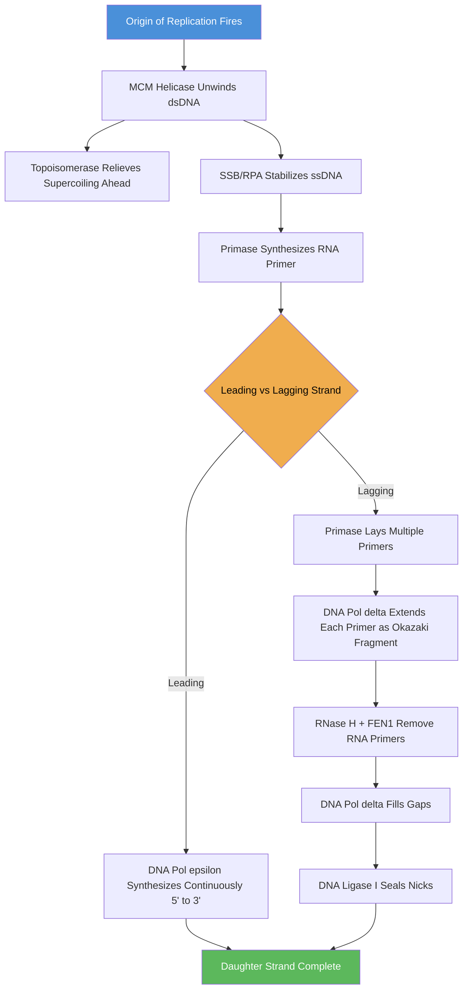
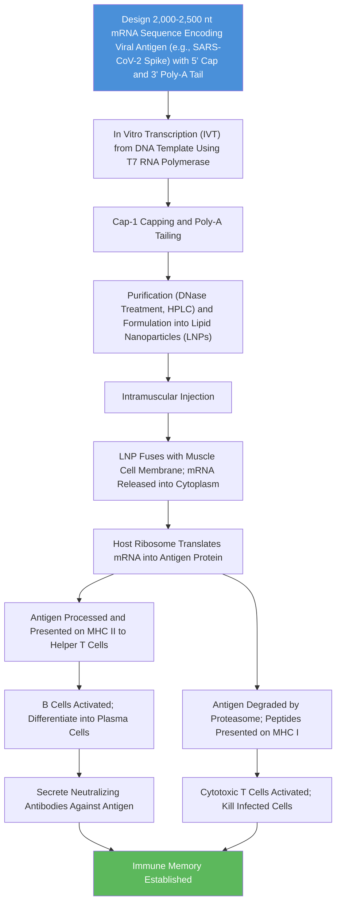
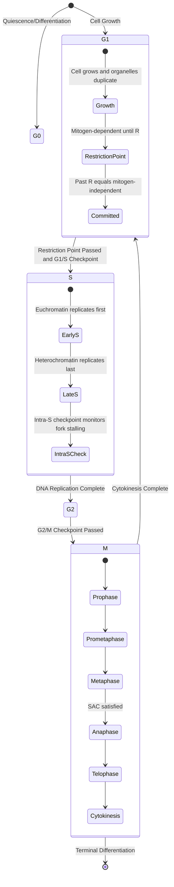
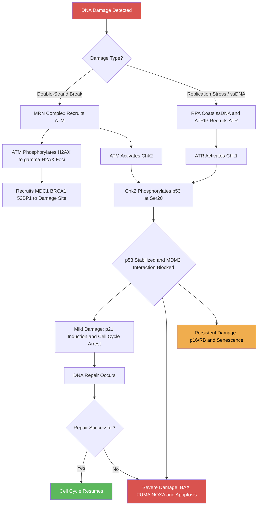

<!-- render:skip-beamer -->

# DNA Replication and the Cell Cycle

\label{sec:unit_IV_dna_replication_and_cell_cycle}


<!-- chapter-metadata-badge -->
> **Ch 12** · Level 2/3 · 55 min read · 75 min lecture · Prerequisites: \cref{sec:unit_I_macromolecules}, \cref{sec:unit_II_cell_structure}

## Learning Objectives

1. Describe the structure of DNA and explain why it is well-suited to information storage and replication.
2. Explain semiconservative replication and the key [**enzyme**](#gl:enzyme)s at the replication fork.
3. Compare the replication machinery of prokaryotes and [**eukaryote**](#gl:eukaryote)s.
4. Describe origin licensing, the role of MCM helicases, and how re-replication is prevented.
5. Explain the [**telomere**](#gl:telomere) end-replication problem and the role of telomerase.
6. Describe the stages of the [**cell cycle**](#gl:cell-cycle) and the function of cyclin-CDK complexes at each checkpoint.
7. Explain the DNA damage response pathway involving ATM, ATR, and p53.
8. Describe the stages of [**mitosis**](#gl:mitosis) at the molecular level, including spindle assembly checkpoint mechanisms.
9. Explain the mechanism and biological importance of [**meiosis**](#gl:meiosis), including crossing over and [**independent assortment**](#gl:independent-assortment).
10. Describe DNA damage types and the key repair pathways, and connect repair defects to human disease.

<!-- curriculum-scaffold-start -->
### Study Blueprint

- **Big idea:** Genome copying is accurate because chemistry, enzyme proofreading, and checkpoints cooperate.
- **Core concepts:** semiconservative replication, polymerase, proofreading, checkpoints.
- **Framework alignment:** Vision & Change: Information flow, exchange, and storage, Structure and function; AP Biology: Information Storage and Transmission, Systems Interactions; NGSS-style topics: Inheritance and Variation of Traits, Structure and Function.
- **Model or quantitative lens:** Replication-fork speed, error-rate, and cell-cycle timing calculations.
- **Data skill:** Interpret replication or cell-cycle data from timing, labeling, or checkpoint perturbations.
- **Practice cadence:** Concept Explanation, Questions and Methods, Argumentation.
- **Common misconception to repair:** High fidelity is not automatic; it is built from multiple partially redundant safeguards.
- **Primary lab:** \cref{sec:lab_unit_IV_dna_replication_and_cell_cycle}.
- **Question bank:** \cref{sec:q_unit_IV_dna_replication_and_cell_cycle}.
- **Transfer task:** Transfer replication logic to cancer, aging, viral replication, or antibiotic targets.
- **Bridge to computation:** `biology.genetics.genetics.dna_complement`.
<!-- curriculum-scaffold-end -->

---

> **Opening Vignette — The Double Helix's Debt to a Woman Scientist**
> 
> In 1952, Rosalind Franklin produced the sharpest X-ray diffraction photograph of DNA ever captured — "Photo 51." The image was obtained without her permission by Maurice Wilkins and shown to James Watson. Recognising in an instant that the helical periodicity and the 3.4 Å spacing implied a double helix, Watson and Crick used this insight to complete their landmark 1953 *Nature* paper. Franklin, who died of ovarian cancer in 1958 at age 37, rarely received the Nobel Prize awarded to Watson, Crick, and Wilkins in 1962. Yet her replication studies — painstakingly mapping how DNA unwinds, is copied semiconservatively, and repairs itself — anticipated the entire field of cell-cycle biology. Every chapter covering DNA replication and the cell cycle is, in part, her story.

## DNA as the Genetic Material

The Avery-MacLeod-McCarty experiment (1944) demonstrated that DNA (not [**protein**](#gl:protein)) carries genetic information by showing that purified DNA from virulent *Streptococcus pneumoniae* could transform non-virulent strains. The Hershey-Chase blender experiment (1952) confirmed this with radioactively labelled T4 phage: $^{32}$P-labelled DNA (not $^{35}$S-labelled protein) entered bacterial cells during infection.

### DNA Double Helix Structure

Watson and Crick's 1953 model of the B-form DNA helix, built on Rosalind Franklin's X-ray diffraction data (Photo 51) and Chargaff's base-pairing rules:

- **Antiparallel complementary strands** running 5' to 3' and 3' to 5'
- **Base pairing**: A-T (2 [**hydrogen bond**](#gl:hydrogen-bond)s), G-C (3 hydrogen bonds)
- **Major groove**: wide (~22 angstroms) and deep -- the primary site for sequence-specific protein binding ([**transcription**](#gl:transcription) factors, restriction enzymes). The pattern of hydrogen bond donors and acceptors in the major groove is unique for each base pair, allowing proteins to "read" the sequence without unwinding the helix.
- **Minor groove**: narrow (~12 angstroms) -- bound by certain drugs (e.g., netropsin, distamycin) and architectural proteins (e.g., HMG-box proteins, TBP)
- **Right-handed helix**, 10.5 bp per turn, rise 0.34 nm/bp, pitch ≈3.6 nm, diameter 2.0 nm

The phosphodiester backbone runs 5' to 3' and carries two negative charges per [**nucleotide**](#gl:nucleotide) at physiological [**pH**](#gl:ph) ($pK_a < 1$). This negative charge means DNA repels other nucleic acids and requires cationic counterions (Mg$^{2+}$, [**histone**](#gl:histone)s, polyamines) for compaction and stability.

**Alternative DNA conformations:**

| Form | Helix | bp/turn | Diameter | Conditions |
|------|-------|---------|----------|------------|
| B-DNA | Right-handed | 10.5 | 2.0 nm | Physiological; most common |
| A-DNA | Right-handed | 11 | 2.6 nm | Dehydrated; RNA-DNA hybrids |
| Z-DNA | Left-handed | 12 | 1.8 nm | Alternating purine-pyrimidine; may regulate transcription |

**Information capacity:** The human haploid [**genome**](#gl:genome) contains approximately 3.1 billion base pairs, equivalent to roughly 725 megabytes of digital data (2 bits per base). If fully stretched, the DNA in a single cell would extend approximately 2 meters, yet it is compacted into a nucleus approximately 6 micrometers in diameter. This compaction is achieved through a hierarchy of packaging: 147 bp of DNA wraps around each histone octamer to form a [**nucleosome**](#gl:nucleosome) (the "beads on a string"), which further compacts into the 30-nm [**chromatin**](#gl:chromatin) fiber, loop domains (anchored by CTCF and cohesin), and ultimately the mitotic [**chromosome**](#gl:chromosome).

> **Clinical Connection: Z-DNA and Autoimmunity**
> Antibodies against Z-DNA are found in patients with systemic lupus erythematosus (SLE). Z-DNA forms transiently behind moving RNA polymerase due to negative supercoiling, and [**mutation**](#gl:mutation)s in the Z-DNA binding protein ADAR1 cause Aicardi-Goutieres syndrome, a severe autoinflammatory disorder. Z-DNA-binding proteins such as ZBP1 (DAI) also function as innate immune sensors, recognizing viral Z-form nucleic acids.

---

## DNA Replication

Replication is **semiconservative** -- each daughter double helix retains one parental strand. This was demonstrated by \citet{meselson1958} using $^{15}$N density gradient centrifugation in *E. coli*. After one generation in $^{14}$N medium, most DNA was intermediate density (ruling out conservative replication). After two generations, half was intermediate and half was light (ruling out dispersive replication).

### Origins of Replication and Licensing

Replication begins at specific genomic sites called **origins of replication (ori)**:

- **Prokaryotes**: *E. coli* has a single origin (*oriC*), a 245-bp sequence containing five 9-bp DnaA-binding sites (DnaA boxes) and three AT-rich 13-mer repeats that melt first upon initiation
- **Eukaryotes**: Human genome contains approximately 30,000-50,000 origins; yeast origins are called **autonomously replicating sequences (ARS)**, each approximately 150 bp containing an 11-bp ARS consensus sequence (ACS)

**Origin licensing** ensures each origin fires primarily once per S phase:

1. In late M/early G1, the **Origin Recognition Complex (ORC)** binds origins constitutively (in yeast) or dynamically (in metazoans)
2. **Cdc6** and **Cdt1** load the **MCM2-7 helicase** (a hexameric ring) onto DNA as a double hexamer -- this is the "licensed" pre-replicative complex (pre-RC)
3. At the G1/S transition, **CDK** (S-CDK = cyclin A-CDK2) and **DDK** (Cdc7-Dbf4) phosphorylate MCM, activating the helicase and converting pre-RC to pre-initiation complex (pre-IC)
4. Re-licensing is prevented by CDK-mediated phosphorylation of Cdc6 (targeting it for degradation) and by geminin binding to Cdt1

**MCM licensing — molecular detail.** The pre-RC formation involves a precisely choreographed sequence:

1. **ORC binding (G1):** ORC1–6 heterohexamer binds origins. ORC1 contains an ATP-binding AAA+ ATPase fold; ATP hydrolysis triggers loading. In humans ORC1 levels oscillate (peaks late M/early G1; degraded in S/G2) — ensuring temporal restriction of licensing.
2. **Cdc6 recruitment:** Cdc6 (also AAA+ ATPase) joins ORC, forming an ORC–Cdc6 complex that wraps DNA into a left-handed superhelix.
3. **Cdt1–MCM2-7 loading:** Cdt1 (the licensing factor) binds MCM2-7 and chaperones it to the ORC–Cdc6–origin complex. ATP hydrolysis by ORC and Cdc6 drives the MCM2-7 ring open at the MCM2/MCM5 interface, allowing dsDNA to thread through.
4. **Double hexamer assembly:** A second Cdt1–MCM2-7 is loaded in the opposite orientation, creating a head-to-head MCM2-7 double hexamer encircling dsDNA. The double hexamer is the licensed pre-RC.
5. **CDT1 destruction in S phase:** Once MCM is loaded, S-CDK phosphorylates Cdt1 → ubiquitin ligase SCF^Skp2^ → proteasomal degradation. **CRL4^CDT2^** also targets Cdt1 for degradation when bound to chromatin (PCNA-coupled mechanism).
6. **Geminin sequesters Cdt1:** Geminin is an inhibitor that binds Cdt1, preventing it from re-licensing origins during S/G2/M. Geminin levels rise from S phase, peaking in M, and are degraded at anaphase by APC/C-Cdc20.
7. **Re-replication prevention is therefore three-fold:**
   - CDK-dependent Cdc6 export from nucleus and degradation
   - CDK-dependent Cdt1 degradation
   - Geminin-mediated Cdt1 sequestration
   - Loss of any of these (e.g., siRNA against geminin) causes catastrophic re-replication, DNA damage, and apoptosis.

8. **Origin firing in S phase:** A subset of licensed origins fires (~10 % per cell-cycle round in human cells); the remainder are dormant backups. Activation requires **DDK (Cdc7-Dbf4)** phosphorylation of MCM2-MCM4-MCM6 + **S-CDK** phosphorylation of Sld2/Sld3 → recruitment of **Cdc45** and **GINS** to form the **CMG helicase** (Cdc45-MCM-GINS) — the active replicative helicase.

**Replication timing domains.** Origin firing is not random in time. Each ~1 Mb region has a characteristic **replication timing**:
- **Early-replicating domains** (S phase first 1–3 hours): gene-rich, euchromatic, transcriptionally active, A-compartment, marked by H3K27ac, H3K4me3, high accessibility
- **Mid-S replicating domains** (3–5 h): transition zones
- **Late-replicating domains** (5–8 h): heterochromatic, gene-poor, B-compartment, marked by H3K9me3 and lamina-association (LADs)

Replication timing correlates with chromatin state and is reprogrammed during cell-fate transitions. Late replication is associated with elevated mutation rate (~2× background) — because the late-S nucleotide pool is depleted of dNTPs (which were consumed earlier), increasing polymerase mis-incorporation. This explains the spatial mutation-rate variation observed in cancer genomes: late-replicating regions accumulate ~2-fold more mutations per Mb than early-replicating regions.

**Quantitative parameters of replication licensing:**
- Number of origins per genome: ~30,000–50,000 (~one per 50–100 kb)
- MCM2-7 loaded per origin: 2 (head-to-head double hexamer)
- Total MCM2-7 in nucleus: ~10–20-fold excess over origins → MCM "paradox"
- Origins fired per cell cycle: ~15,000 (about 30 % of licensed origins)
- Dormant origins: provide backup if a fork stalls or fails — mutation in ATR (which suppresses dormant-origin firing under stress) causes Seckel syndrome (microcephaly, growth failure)

> **Clinical Connection: Meier-Gorlin Syndrome**
> Mutations in ORC1, ORC4, ORC6, CDT1, or CDC6 cause Meier-Gorlin syndrome, a rare primordial dwarfism characterized by short stature, absent or small patellae, and microtia. This underscores the essential role of origin licensing in normal growth and development.

### The Replication Fork Machinery


<!-- alt: Flowchart showing eukaryotic DNA replication machinery at the replication fork. The leading strand is synthesized continuously, while the lagging strand requires repeated priming and ligation of Okazaki fragments. -->

*Eukaryotic DNA replication machinery at the replication fork. The leading strand is synthesized continuously, while the lagging strand requires repeated priming and ligation of Okazaki fragments.*

### Key enzymes at the fork:

| Enzyme | Prokaryote | Eukaryote | Function |
|--------|-----------|-----------|----------|
| Helicase | DnaB (5' to 3') | MCM2-7/CMG (3' to 5') | Unwinds double helix; uses ATP hydrolysis (~500-1000 bp/s in *E. coli*, ~50 bp/s in humans) |
| Single-strand binding | SSB | RPA (replication protein A) | Stabilizes single-stranded regions, prevents re-annealing and nuclease attack |
| Primase | DnaG | DNA Pol alpha/primase complex | Synthesizes short RNA primers (8-10 nt in prokaryotes; 7-12 nt RNA + 20 nt DNA in eukaryotes) |
| Leading strand polymerase | DNA Pol III | DNA Pol epsilon | Synthesizes DNA 5' to 3'; high processivity with clamp |
| Lagging strand polymerase | DNA Pol III | DNA Pol delta | Synthesizes Okazaki fragments; also fills primer gaps |
| Sliding clamp | beta-clamp (homodimer) | PCNA (homotrimer) | Processivity factor; tethers polymerase to DNA; increases processivity from ~10 to >10,000 nt |
| Clamp loader | gamma complex | RFC (replication factor C) | ATP-dependent loading of sliding clamp |
| Primer removal | DNA Pol I (5' to 3' exo) | RNase H1 + FEN1 (flap endonuclease) | Removes RNA primers from Okazaki fragments |
| Ligase | [**DNA ligase**](#gl:dna-ligase) (NAD$^+$-dependent) | DNA ligase I (ATP-dependent) | Seals nicks between Okazaki fragments |
| Topoisomerase | Gyrase (Topo II) | Topo I and Topo II | Relieves positive supercoiling ahead of fork |

### mRNA Vaccines: A Modern Application of Nucleic Acid Technology


<!-- alt: Flowchart showing mechanism of mRNA vaccines. Synthetic mRNA encoding a viral antigen is delivered to host cells, where it is translated into protein. The protein is processed and presented to both helper T cells (via MHC II) and cytotoxic T cells (via MHC I), generating both antibody and cellular immune responses. -->

*Mechanism of mRNA vaccines. Synthetic mRNA encoding a viral antigen is delivered to host cells, where it is translated into protein. The protein is processed and presented to both helper T cells (via MHC II) and cytotoxic T cells (via MHC I), generating both antibody and cellular immune responses.*

**Molecular design**:

- **Sequence optimization**: The mRNA sequence is optimized for stability and translation efficiency. This includes:
  - **5' cap**: A modified guanosine (Cap-1: N7-methylated, 2'-O-methylated) mimics natural eukaryotic mRNA and prevents recognition by innate immune sensors (RIG-I, MDA5)
  - **5' UTR**: Contains Kozak consensus sequence (GCCACC[A/G]CC) for efficient translation initiation
  - **Open reading frame (ORF)**: Encodes the target antigen (e.g., SARS-CoV-2 spike protein). The sequence is codon-optimized to match human tRNA abundance, reducing rare codon clusters that could stall translation.
  - **3' UTR**: Contains stability elements (e.g., from human alpha-globin or cytochrome P450 genes) and poly-A tail (100-150 nt) to protect from degradation and enhance translation.
  - **Nucleoside modifications**: Pseudouridine (Ψ) or N1-methylpseudouridine (m1Ψ) replace uridine to reduce immunogenicity and increase translation efficiency.

- **In vitro transcription (IVT)**: The optimized DNA template (linearized plasmid or PCR product) is transcribed using T7 RNA polymerase in a cell-free system. Nucleoside triphosphates (NTPs) including modified UTP (e.g., m1Ψ-TP) are added. The reaction produces a 5'-triphosphate-ended mRNA, which is then enzymatically capped.

- **Purification and formulation**: The crude mRNA is treated with DNase to remove template DNA, then purified (often by tangential flow filtration or HPLC). The purified mRNA is formulated into **lipid nanoparticles (LNPs)** — spherical vesicles ~80-100 nm in diameter composed of ionizable cationic lipids, cholesterol, phospholipids, and PEG-lipids. The ionizable lipid is positively charged at low pH (during formulation) but neutral at physiological pH, reducing toxicity. LNPs protect mRNA from degradation and facilitate cellular uptake.

**Cellular uptake and translation**:

1. **Injection**: mRNA-LNP suspension is injected intramuscularly (typically deltoid). The injection site contains antigen-presenting cells (APCs) like dendritic cells and macrophages, as well as muscle cells.
2. **Uptake**: LNPs fuse with cell membranes or are endocytosed. In the endosome, the ionizable lipid becomes protonated, causing endosomal membrane disruption and release of mRNA into the cytoplasm.
3. **Translation**: Host ribosomes bind to the 5' cap and translate the mRNA into the antigen protein. The protein may be secreted (if signal peptide included) or remain intracellular.
4. **Processing and presentation**:
   - **MHC class II pathway**: Exogenous antigen taken up by APCs is degraded in lysosomes and presented on MHC II to CD4+ helper T cells.
   - **MHC class I pathway**: Endogenous antigen (produced inside the cell) is degraded by the proteasome into peptides, transported to the ER via TAP, and presented on MHC I to CD8+ cytotoxic T cells.

**Immune activation**:

- **Humoral immunity**: B cells recognizing the antigen receive help from CD4+ T cells and differentiate into plasma cells producing neutralizing antibodies (IgG, IgM initially, then IgG). These antibodies block viral entry by binding to the spike protein receptor-binding domain.
- **Cellular immunity**: CD8+ T cells recognize infected cells presenting viral peptides and kill them, preventing viral replication.
- **Immune memory**: Long-lived plasma cells and memory B/T cells provide lasting protection.

**Advantages over traditional vaccines**:

- **No live virus**: Safer for immunocompromised individuals; no risk of reversion to virulence.
- **Rapid design and manufacturing**: Once the viral sequence is known, mRNA can be designed in days and manufactured in weeks (cell-free synthesis). Traditional vaccines require growing virus in eggs or cell culture (months).
- **Strong immune response**: Both antibody and T-cell responses are robust.
- **Flexible platform**: The same LNP formulation can deliver mRNA for different antigens; the platform can be quickly adapted to new variants or emerging pathogens.

**Computational aspects**:

Modern mRNA vaccine design relies heavily on computational tools:

```python
import numpy as np
from Bio import SeqIO
from collections import Counter

# Example: Analyze GC content and codon usage of an mRNA sequence
def analyze_mrna_sequence(seq):
    """Analyze key features of an mRNA vaccine candidate."""
    gc_content = (seq.count('G') + seq.count('C')) / len(seq) * 100
    # Count codon frequencies
    codon_table = {}
    for i in range(0, len(seq)-2, 3):
        codon = seq[i:i+3]
        if codon in codon_table:
            codon_table[codon] += 1
        else:
            codon_table[codon] = 1
    return {
        'length': len(seq),
        'gc_content': round(gc_content, 2),
        'codon_counts': codon_table
    }

# Example: Codon optimization for human expression
def optimize_codon_usage(seq, codon_usage_table):
    """Replace rare codons with optimal human-preferred codons."""
    optimized = []
    for i in range(0, len(seq)-2, 3):
        codon = seq[i:i+3]
        amino_acid = translate_codon(codon)  # Assume a translation function
        # Choose the most frequent codon for this amino acid in human cells
        optimal_codon = max(codon_usage_table[amino_acid],
                           key=codon_usage_table[amino_acid].get)
        optimized.append(optimal_codon)
    return ''.join(optimized)

# Example: Predict secondary structure (simplified)
def predict_secondary_structure(seq):
    """Calculate minimum free energy using a simplified nearest-neighbor model."""
    # In practice, tools such as RNAfold (ViennaRNA) or NUPACK
    return "-10.5 kcal/mol"  # illustrative fixed value for the textbook example
```

**Clinical impact**: The Pfizer-BioNTech BNT162b2 and Moderna mRNA-1273 vaccines were developed in under a year from viral sequence release to emergency use authorization, demonstrating the power of this technology. Beyond COVID-19, mRNA vaccines are in development for influenza, HIV, Zika, and personalized cancer vaccines.

**Concept Check 11.2**

> 1. Why is the 5' cap important for mRNA vaccine stability and translation?
> 2. What is the role of lipid nanoparticles (LNPs) in mRNA vaccine delivery?
> 3. How does an mRNA vaccine activate both CD4+ helper T cells and CD8+ cytotoxic T cells?
> 4. Explain why nucleoside-modified mRNA (e.g., pseudouridine) reduces immunogenicity compared to unmodified mRNA.
> 5. Design a simple Python function to calculate the GC content of an mRNA sequence and explain why GC content matters for vaccine stability.

---

### Leading and Lagging Strands

DNA polymerase primarily adds nucleotides to the 3'-OH of an existing primer, and can primarily synthesize in the 5' to 3' direction. Therefore:

- **Leading strand**: synthesized continuously 5' to 3' in the same direction as fork movement. Requires primarily a single priming event. In eukaryotes, primarily synthesized by DNA Pol epsilon.
- **Lagging strand**: synthesized discontinuously as **Okazaki fragments** (1,000-2,000 nt in prokaryotes; 100-200 nt in eukaryotes). Each fragment requires a new RNA primer laid down by primase. After extension by DNA Pol delta, the primers are removed by a multi-step process:
  1. **RNase H** degrades the RNA portion of the primer
  2. **FEN1** (flap endonuclease 1) removes the remaining 5' flap created when the upstream Okazaki fragment displaces the primer of the next fragment
  3. **DNA Pol delta** fills the gap
  4. **DNA Ligase I** seals the nick with a phosphodiester bond (consuming ATP)

**Replication fork speed**: *E. coli* replicates its 4.6 Mb genome from a single origin in approximately 40 minutes (~1,000 bp/s). Human cells replicate 3.2 Gb from approximately 30,000 origins over 6-8 hours of S phase (~50 bp/s per fork, but thousands of forks operate simultaneously).

### PCNA Sliding Clamp -- The Processivity Engine

PCNA is a homotrimeric ring (three identical subunits) that encircles double-stranded DNA and slides freely. It acts as a **molecular matchmaker**:

- **Face toward template junction**: binds DNA polymerase (Pol delta/epsilon), FEN1, and ligase I through a conserved PIP box motif
- **Monoubiquitination at K164** (by RAD6/RAD18): recruits Y-family translesion synthesis (TLS) polymerases (Pol eta, Pol iota, Pol kappa, Rev1) when the fork stalls at DNA damage. TLS polymerases have relaxed active sites that can bypass lesions but at the cost of lower fidelity

### DNA Proofreading and Fidelity

The error rate of replication is remarkably low: approximately 1 error per $10^{9}$-$10^{10}$ base pairs copied. This fidelity results from three layers:

1. **Base selection by polymerase** (~$10^{-5}$ error rate): The polymerase active site preferentially binds correctly paired nucleotides based on geometry and hydrogen bonding
2. **3' to 5' exonuclease proofreading** (~$10^{-2}$ improvement): If a mismatch is incorporated, the polymerase pauses; the 3' to 5' exonuclease domain excises the incorrect nucleotide and the polymerase re-extends
3. **Mismatch repair (MMR)** (~$10^{-3}$ improvement): Post-replicative scanning by MutS (MSH2/MSH6 in humans), which detects mismatches and small insertion/deletion loops

\begin{equation}\text{Overall error rate} \approx 10^{-5} \times 10^{-2} \times 10^{-3} = 10^{-10} \text{ per bp per replication} \tag{12.1}\label{eq:error_rate}\end{equation}

> **Clinical Connection: Lynch Syndrome (HNPCC)**
> Germline mutations in MMR [**gene**](#gl:gene)s (*MLH1*, *MSH2*, *MSH6*, *PMS2*) cause Lynch syndrome (hereditary non-polyposis colorectal cancer). Affected individuals have a 50-80% lifetime risk of colorectal cancer and increased risk of endometrial, ovarian, and gastric cancers. The hallmark is **microsatellite instability (MSI)** -- expansion or contraction of short tandem repeats due to uncorrected replication slippage. MSI-high tumors respond well to immune checkpoint inhibitors (anti-PD-1), making Lynch syndrome diagnosis therapeutically important.

### Telomeres and Telomerase

**The end-replication problem**: Linear eukaryotic chromosomes cannot replicate the very 5' end of the lagging strand (no upstream sequence to place a primer). This means 50-200 bp of telomeric DNA are lost with each cell division.

**Telomere structure**: Human telomeres consist of 5-15 kb of the hexameric repeat TTAGGG, ending in a 150-200 nt single-stranded 3' overhang. This overhang invades the upstream duplex to form a **T-loop** (telomere loop), which is stabilized by the **shelterin complex** (TRF1, TRF2, RAP1, TIN2, TPP1, POT1). The T-loop hides the chromosome end from the DNA damage response, which would otherwise recognize it as a double-strand break.

**The shelterin complex — six-protein architecture and function:**

| Subunit | DNA binding specificity | Function |
| ------- | ----------------------- | -------- |
| **TRF1** (telomeric repeat factor 1) | dsDNA TTAGGG (Myb domain) | Negatively regulates telomerase access; controls telomere length |
| **TRF2** | dsDNA TTAGGG (Myb domain) | Stabilises T-loop; suppresses ATM-mediated DNA damage signalling at telomeres |
| **TIN2** | TRF1, TRF2 partner (no DNA binding) | Bridge protein, stabilises whole complex |
| **RAP1** | TRF2 partner | NF-κB pathway crosstalk; chromatin contacts |
| **TPP1** | TIN2 partner; binds POT1 | Recruits telomerase via TEL patch |
| **POT1** | ssDNA TTAGGG-overhang (OB-fold domain) | Suppresses ATR; protects 3′ overhang |

**T-loop formation in detail.** The 3′ G-rich overhang (150–200 nt) folds back and invades the upstream duplex, displacing one strand and forming a D-loop (displacement loop) within the T-loop. TRF2 wraps the DNA, inducing the strand exchange. The structure has been visualised by electron microscopy and STORM super-resolution. Shelterin coats the entire telomere — about ~1 shelterin per 100 bp.

**Shelterin's six functions in protecting chromosome ends:**
1. **Suppress ATM kinase** at telomeres (TRF2-dependent)
2. **Suppress ATR kinase** at telomeres (POT1-dependent)
3. **Inhibit NHEJ** at chromosome ends (preventing fusions; TRF2-RAP1)
4. **Inhibit HR** between telomeres (TRF2; preventing telomere-telomere recombination)
5. **Recruit telomerase** in cells where it is active (TPP1-TEL patch)
6. **Mediate semi-conservative replication** through telomeres (CST complex with shelterin)

**Telomere replication problem in detail.** Two distinct issues:
1. **Lagging-strand end-replication**: The very 5′ end of the lagging strand cannot be replicated because there is no upstream template for primer placement. After RNA primer removal, ~50–100 nt are lost from the 5′ end of the lagging-strand-complement.
2. **Leading-strand end-resection**: The leading strand is synthesised continuously to the chromosome end, but specialised exonucleases then resect the 5′ end to generate the 3′ overhang necessary for T-loop formation.

Result: each replication cycle, ~50–200 bp of TTAGGG repeats are lost from telomeres in the absence of telomerase.

**G-quadruplex regulation.** The G-rich telomere sequence can fold into intramolecular G-quadruplexes (four G's stacked via Hoogsteen bonds). G-quadruplexes are stabilised by K⁺ but inhibit telomerase access. Drugs that stabilise telomeric G-quadruplexes (e.g., RHPS4, telomestatin, BRACO19) cause progressive telomere shortening and senescence in cancer cells — they are anti-cancer leads but limited by toxicity in normal stem cells.

**G-quadruplexes**: The G-rich telomeric sequence can fold into **G-quadruplex** structures -- stacked tetrads of four guanines connected by Hoogsteen hydrogen bonds, stabilized by monovalent cations (K$^+$). G-quadruplexes inhibit telomerase and are targets for anti-cancer drug development.

**Telomerase RNA template — TERC mechanism in detail.** TERC is a 451-nt RNA with several functional regions: (i) a **template region** (5′-CUAACCCUAAC-3′, ~11 nt) that base-pairs with the telomere 3′ overhang and dictates the TTAGGG sequence added; (ii) a **pseudoknot** (essential structural motif); (iii) a **CR4/CR5** stem-loop that binds TERT; (iv) an **H/ACA scaRNA box** at the 3′ end (essential for stability and dyskerin binding). The H/ACA box recruits dyskerin (DKC1) — mutations in DKC1 cause X-linked dyskeratosis congenita.

**Telomerase**: A specialized reverse transcriptase that extends the 3' overhang:

\begin{equation}5'\text{-}(TTAGGG)_n\text{-OH-3'} \xrightarrow{\text{TERC RNA template: 3'-AAUCCC-5'}} 5'\text{-}(TTAGGG)_{n+1}\text{-OH-3'} \tag{12.2}\label{eq:telomerase}\end{equation}

- **TERT** (telomerase reverse transcriptase): the catalytic protein subunit
- **TERC** (telomerase RNA component): 451-nt RNA containing the template sequence (in humans, 5'-CUAACCCUAAC-3') used to add TTAGGG repeats
- After TERT extends the 3' overhang, conventional DNA Pol alpha/primase synthesizes the complementary C-rich strand

**Telomeres, aging, and cancer**: Somatic cells lack telomerase activity and undergo progressive telomere shortening, eventually reaching a critically short length that triggers replicative senescence (the Hayflick limit, ~50-70 divisions for human fibroblasts). This is a tumor-suppressive mechanism. However, approximately 85% of cancers reactivate telomerase (often through TERT [**promoter**](#gl:promoter) mutations, especially C228T and C250T), and approximately 15% use **ALT (alternative lengthening of telomeres)** via [**recombination**](#gl:recombination) between telomeres (associated with ATRX/DAXX mutations, with C-circles as biomarkers).

> **Clinical Connection: Telomere Biology Disorders**
> Mutations in TERT, TERC, DKC1, or other telomere maintenance genes cause **dyskeratosis congenita** (DC), characterized by bone marrow failure, pulmonary fibrosis, and mucosal leukoplakia. Patients have critically short telomeres and premature aging features. Related conditions include idiopathic pulmonary fibrosis and aplastic anemia, forming a spectrum called **telomere biology disorders (TBDs)**.

**Concept Check 11.1**

> 1. Why is the lagging strand synthesized discontinuously?
> 2. What would happen to a eukaryotic cell if you knocked out FEN1?
> 3. A patient has MSI-high colorectal cancer. What is the most likely genetic defect? Why might this patient respond to immunotherapy?
> 4. Explain why telomerase is an attractive anti-cancer drug target, and what complications might arise from telomerase inhibition.

---

## The Cell Cycle

The **cell cycle** is the ordered series of events by which a cell duplicates its contents and divides. In a typical mammalian cell, the cycle takes approximately 24 hours.


<!-- alt: State diagram showing eukaryotic cell cycle. G1 contains the restriction point (R), after which the cell is committed to division independent of mitogenic signals. Each transition is guarded by checkpoints. -->

*The eukaryotic cell cycle. G1 contains the restriction point (R), after which the cell is committed to division independent of mitogenic signals. Each transition is guarded by checkpoints.*

### Cell Cycle Phases

| Phase | Duration (typical) | Key Events |
|-------|-------------------|------------|
| **G1** (Gap 1) | 8-12 h | Cell growth; [**organelle**](#gl:organelle) duplication; assessment of extracellular signals (mitogens, growth factors); passage through the **restriction point (R)** commits the cell to divide |
| **S** (Synthesis) | 6-8 h | DNA replication; centrosome duplication; histone synthesis; [**euchromatin**](#gl:euchromatin) replicates early, [**heterochromatin**](#gl:heterochromatin) late |
| **G2** (Gap 2) | 3-4 h | Continued growth; preparation for mitosis; final DNA damage check |
| **M** (Mitosis) | ~1 h | Chromosome condensation, alignment, separation, and cytokinesis |
| **G0** (Quiescence) | Variable | Reversible exit from the cell cycle; [**neuron**](#gl:neuron)s and muscle cells may remain in G0 permanently |

### Cyclin-CDK Complexes: The Cell Cycle Engine

The cell cycle is driven by the sequential activation and destruction of **cyclin-CDK (cyclin-dependent kinase)** complexes:

| Phase | Cyclin-CDK Complex | Key Substrates | Function |
|-------|-------------------|----------------|----------|
| G1 (early) | Cyclin D - CDK4/6 | RB (retinoblastoma protein) | Partial phosphorylation of RB; releases E2F to transcribe S-phase genes |
| G1/S | Cyclin E - CDK2 | RB (hyperphosphorylation), p27 | Commits cell to S phase; triggers centrosome duplication |
| S | Cyclin A - CDK2 | Cdc6, Cdt1 (for degradation) | Fires replication origins; prevents re-licensing |
| G2/M | Cyclin B - CDK1 (MPF) | Lamins, condensins, Golgi proteins | Nuclear envelope breakdown; chromosome condensation; spindle formation |

**Regulation of CDK activity:**

- **Cyclin binding**: CDKs are inactive monomers without their cyclin partner
- **Activating phosphorylation**: CAK (CDK-activating kinase) phosphorylates the T-loop
- **Inhibitory phosphorylation**: Wee1 kinase phosphorylates CDK1 at Tyr15 and Thr14 (inactive); Cdc25 phosphatase removes these (activates)
- **CKI (CDK inhibitors)**: p21$^{CIP1}$ (induced by p53), p27$^{KIP1}$, p16$^{INK4a}$ bind and inactivate specific cyclin-CDK complexes
- **Cyclin destruction**: APC/C ([**anaphase**](#gl:anaphase)-promoting complex/cyclosome) ubiquitinates cyclins A and B for proteasomal degradation, ending mitosis

**Quantitative CDK activity through the cell cycle.** Single-cell biosensor measurements have provided a quantitative picture of CDK activity dynamics:

| Cell-cycle phase | Total CDK activity | Active complexes | Approximate timing (mammalian, 24-h cycle) |
| ---------------- | ------------------ | ---------------- | ------------------------------------------ |
| Early G1 (mitogen-stimulated) | ~5 % of peak | Cyclin D-CDK4/6 (low) | 0–4 h post-mitosis |
| Restriction point | ~20 % | Cyclin D-CDK4/6 + early Cyclin E-CDK2 | 6–8 h post-mitosis |
| G1/S transition | ~40 % | Cyclin E-CDK2 high; Cyclin A-CDK2 rising | 8–10 h |
| Mid-S | ~50 % | Cyclin A-CDK2 dominant | 10–14 h |
| G2 | ~70 % | Cyclin A-CDK2 + early Cyclin B-CDK1 | 14–18 h |
| G2/M transition | ~90 % | Cyclin B-CDK1 (= MPF) rises sharply | 18–20 h |
| Mitosis (M-phase) | **100 % (peak)** | Cyclin B-CDK1 + Aurora A/B kinases | 20–22 h |
| Anaphase / Telophase | Drops to < 10 % | APC/C-Cdc20 destroys cyclin B | 22–24 h |

The peak-to-trough ratio is ~10-fold. This sharp threshold-like activity profile is encoded by:
- **Bistability** in CDK1 activation: Wee1 inhibits CDK1; Cdc25 activates CDK1; both have positive-feedback loops on themselves through CDK1 phosphorylation, creating a bistable switch.
- **Timing precision** from cyclin synthesis and destruction: cyclin A, cyclin B, and securin most have D-box and KEN-box motifs that direct APC/C-mediated ubiquitination at precise times.

### Specific Checkpoint Failures in Cancer

Cancer is essentially a disease of cell-cycle deregulation. Key checkpoint mutations and their consequences:

**(1) RB1 loss (G1/S checkpoint failure)**
- Normal: hypophosphorylated RB binds E2F → E2F cannot transcribe S-phase genes (DNA Pol α, PCNA, MCM, thymidine kinase)
- Cancer: biallelic RB1 mutations or deletions (retinoblastoma; small-cell lung cancer; bladder; osteosarcoma)
- Consequence: constitutive E2F activity; cells enter S phase regardless of mitogen status
- Therapeutic relevance: **CDK4/6 inhibitors (palbociclib, ribociclib, abemaciclib) are ineffective in RB-null tumours** because the entire downstream pathway is already deregulated.

**(2) p53 loss (G1/S and G2/M checkpoints failure)**
- Normal: p53 senses DNA damage → induces p21 → arrests CDK2 (G1/S) and CDK1 (G2/M); also induces apoptosis (BAX, PUMA, NOXA)
- Cancer: ~50 % of cancers carry p53 mutations (most frequent mutated gene); often dominant-negative (mutant p53 oligomerises with wild-type to inactivate it) or gain-of-function (p53^R175H^, p53^R273H^ stabilise oncogenic chromatin states)
- Consequence: cells with damaged DNA continue dividing; aneuploidy; centrosome amplification; chromosomal instability
- Therapeutic relevance: PRIMA-1, APR-246 (eprenetapopt) re-fold mutant p53 conformations; HDM2 inhibitors (idasanutlin, milademetan) re-stabilise wild-type p53 in tumours where p53 is wild-type but suppressed by HDM2 amplification.

**(3) WEE1/CDC25 deregulation (G2/M checkpoint failure)**
- Normal: Wee1 phosphorylates CDK1 (Tyr15) → inactive; Cdc25 dephosphorylates → activates; balance controls mitotic entry timing.
- Cancer-relevant deregulation:
  - **CDC25 amplification** in many tumours (breast, lung, pancreatic) → premature CDK1 activation → DNA-damaged cells enter mitosis prematurely → mitotic catastrophe (paradoxically anti-tumour in some contexts).
  - **WEE1 inhibition (adavosertib/MK-1775)** is being trialled in p53-mutant tumours: without p53 (the G1/S guard), the cell relies on Wee1-mediated G2/M arrest; inhibiting Wee1 forces entry into mitosis with damaged DNA → mitotic catastrophe. This is **synthetic lethality** with p53 loss.

**(4) APC/C-Cdc20 / SAC failures**
- Normal: SAC (mitotic checkpoint complex MCC: Mad2 + BubR1 + Bub3) prevents anaphase until kinetochores are properly attached.
- Cancer: **BUB1B (BubR1)** loss-of-function causes mosaic variegated aneuploidy syndrome (childhood cancers, microcephaly).
- Tumour-targeting drugs:
  - **Taxanes (paclitaxel, docetaxel)** stabilise microtubules → triggering SAC arrest → mitotic catastrophe + apoptosis
  - **Vincristine, vinblastine, vinorelbine** depolymerise microtubules → SAC arrest

**(5) MCM helicase / replication-stress tolerance**
- Normal: ATR activates Chk1 in response to stalled forks → suppresses dormant origin firing under stress
- Cancer: tumours often have constitutively elevated replication stress (driven by oncogenic *MYC* or *RAS*); this provides a vulnerability:
  - **ATR inhibitors (berzosertib, ceralasertib)** block the cancer cell's ability to manage replication stress → genome catastrophe
  - **CHK1 inhibitors (LY2603618, prexasertib)** similarly target the replication-stress response

**Summary table — checkpoint failures and therapeutic targeting:**

| Checkpoint failure | Cancer | Therapeutic strategy |
| ------------------ | ------ | -------------------- |
| RB1 loss (G1/S) | Retinoblastoma; SCLC; bladder | CDK4/6 inhibitors INEFFECTIVE (downstream); requires alternative |
| p53 loss (G1/S, G2/M) | ~50 % of cancers | Re-fold mutant p53 (APR-246); WEE1 inhibitor (synthetic lethal); HDM2 inhibitor (if p53 wt) |
| BRCA1/2 loss (HR) | Breast, ovarian, prostate, pancreatic | PARP inhibitors (synthetic lethal) |
| MMR loss (replication fidelity) | Lynch syndrome; MSI-high CRC, endometrial | Anti-PD-1 (high neoantigen load) |
| BUB1B / SAC loss | Mosaic variegated aneuploidy syndrome | Microtubule targeting (taxanes, vinca alkaloids) |
| MYC-driven replication stress | Lymphoma, neuroblastoma | ATR/CHK1 inhibitors |
| Cyclin D / CDK4-6 amplification | Mantle cell lymphoma; breast (HR+); melanoma | CDK4/6 inhibitors (palbociclib, ribociclib, abemaciclib) — effective if RB intact |

### Cell Cycle Checkpoints

Checkpoints are surveillance mechanisms that halt the cell cycle if conditions are not met:

**G1/S Checkpoint (Restriction Point)**:
- The **RB-E2F pathway** is the molecular switch. In early G1, hypophosphorylated RB binds and inhibits E2F transcription factors. Mitogenic signals activate cyclin D-CDK4/6, which partially phosphorylates RB. Cyclin E-CDK2 completes RB hyperphosphorylation, releasing E2F to transcribe genes for DNA replication (DNA Pol alpha, PCNA, MCM, thymidine kinase).
- This is the "point of no return": once past R, the cell will complete S phase even if mitogens are withdrawn.

**Intra-S Checkpoint**:
- Monitors replication fork stalling and DNA damage during S phase
- Stalled forks activate **ATR kinase** (via RPA-coated ssDNA), which phosphorylates **Chk1** kinase
- Chk1 inhibits Cdc25A phosphatase, preventing activation of cyclin A-CDK2 and cyclin E-CDK2
- Slows origin firing to prevent catastrophic fork collapse

**G2/M Checkpoint**:
- Prevents entry into mitosis with damaged or incompletely replicated DNA
- **ATM** (activated by DSBs) and **ATR** (activated by ssDNA/stalled forks) phosphorylate **Chk2** and **Chk1** respectively
- Chk1/Chk2 phosphorylate Cdc25C, creating a 14-3-3 binding site that sequesters Cdc25C in the [**cytoplasm**](#gl:cytoplasm), preventing it from activating cyclin B-CDK1 (MPF)
- Simultaneously, p53 induces p21, which directly inhibits cyclin B-CDK1

**Spindle Assembly Checkpoint (SAC)**:
- Prevents anaphase until most kinetochores are properly attached to spindle microtubules
- Unattached kinetochores catalyze formation of the **mitotic checkpoint complex (MCC)**: Mad2, BubR1, Bub3, and Cdc20
- MCC binds and inhibits **Cdc20**, preventing activation of APC/C
- A single unattached kinetochore is sufficient for complete arrest (Rieder et al. 1995)
- Once most kinetochores achieve bipolar attachment with tension, SAC is silenced; Cdc20 activates APC/C, which ubiquitinates securin and cyclin B
- Securin degradation releases **separase**, which cleaves cohesin (Scc1/Rad21 subunit) -- triggering anaphase

### The DNA Damage Response: ATM/ATR and p53


<!-- alt: Flowchart showing DNA damage response pathway. ATM responds to double-strand breaks; ATR responds to replication stress and single-stranded DNA. Both converge on p53, which decides between cell cycle arrest (allowing repair), apoptosis, or senescence depending on damage severity. -->

*The DNA damage response pathway. ATM responds to double-strand breaks; ATR responds to replication stress and single-stranded DNA. Both converge on p53, which decides between cell cycle arrest (allowing repair), [**apoptosis**](#gl:apoptosis), or senescence depending on damage severity.*

**p53: Guardian of the Genome**

p53 is the most frequently mutated gene in human cancers (approximately 50% of cancers carry *TP53* mutations). Normal p53 function:

- **Normally kept at low levels** by MDM2 (an E3 ubiquitin ligase) that targets p53 for proteasomal degradation (half-life approximately 20 min)
- **Stabilized by damage signals**: ATM/ATR-mediated phosphorylation of p53 at Ser15 and Chk2-mediated phosphorylation at Ser20 disrupt the p53-MDM2 interaction
- **Acts as a transcription factor** (binds DNA as a tetramer) to induce:
  - **p21** (CDKN1A): CDK inhibitor that arrests the cell cycle at G1/S and G2/M
  - **GADD45**: DNA repair and G2 arrest
  - **14-3-3sigma**: G2 arrest
  - **BAX, PUMA, NOXA**: pro-apoptotic Bcl-2 family members (if damage is irreparable)
  - **MDM2** itself: negative feedback loop

> **Clinical Connection: Li-Fraumeni Syndrome**
> Germline [**heterozygous**](#gl:heterozygous) *TP53* mutations cause Li-Fraumeni syndrome (LFS). Patients have a greater than 90% lifetime cancer risk, developing sarcomas, breast cancer, brain tumors, adrenocortical carcinoma, and leukemia -- often before age 30. The remaining wild-type [**allele**](#gl:allele) is lost somatically (loss of heterozygosity, LOH), consistent with Knudson's two-hit hypothesis. Many *TP53* mutations are [**dominant**](#gl:dominant)-negative (mutant p53 tetramerizes with wild-type p53 and inactivates it) or gain-of-function.

### Cancer and the Cell Cycle

Cancer is fundamentally a disease of uncontrolled cell cycle progression. Key deregulated pathways:

| Gene/Pathway | Normal Function | Cancer Alteration | Associated Cancer |
|-------------|----------------|-------------------|-------------------|
| RB1 | G1/S checkpoint | Loss-of-function mutations | Retinoblastoma (childhood eye cancer); also lung, bladder |
| CDKN2A (p16) | Inhibits CDK4/6 | Deletion or methylation | Melanoma, pancreatic, many others |
| CDK4 | G1 progression | Amplification or activating mutation | Melanoma, glioblastoma |
| Cyclin D1 | G1 progression | Amplification (11q13) | Breast cancer, mantle cell lymphoma |
| TP53 | G1/S and G2/M arrest; apoptosis | Loss-of-function or dominant-negative mutation | Approximately 50% of cancers |
| MDM2 | p53 degradation | Amplification | Sarcomas, other cancers |
| MYC | Transcription factor for cell cycle genes | Amplification/translocation | Burkitt lymphoma (t(8;14)), neuroblastoma |

**CDK4/6 inhibitors** (palbociclib, ribociclib, abemaciclib) are now standard of care in HR+/HER2- metastatic breast cancer. They block cyclin D-CDK4/6, preventing RB phosphorylation and E2F release.

**Concept Check 11.2**

> 1. What is the restriction point, and how does the RB-E2F pathway control it?
> 2. Why is p53 called the "guardian of the genome"? Describe three outcomes of p53 activation.
> 3. Explain why CDK4/6 inhibitors would be ineffective in RB-null tumors.
> 4. A tumor cell has a homozygous deletion of CDKN2A (p16). Predict the effect on the cell cycle.

---

## Mitosis: Molecular Events at Each Stage

Mitosis distributes one copy of each duplicated chromosome to each daughter cell. In most mammalian cells it takes approximately 1 hour.

**Stages of mitosis -- molecular detail:**

| Phase | Duration | Molecular Events |
|-------|----------|-----------------|
| **Prophase** | ~25 min | Condensin I/II complexes compact chromosomes (~10,000-fold); centrosomes (duplicated in S phase) begin migrating to opposite poles; Aurora A kinase activates centrosome maturation |
| **Prometaphase** | ~15 min | Nuclear envelope breakdown (NEB) by CDK1-mediated lamin phosphorylation (lamins A, B, C depolymerize); kinetochores (CENP-A, CENP-C, KNL1, Ndc80 complex) capture spindle microtubules; chromosomes undergo rapid poleward/anti-poleward oscillations |
| **Metaphase** | ~5 min | Chromosomes aligned at the metaphase plate (equidistant from both poles); bipolar attachment generates tension across sister kinetochores; SAC monitors attachment |
| **Anaphase A** | ~5 min | Separase cleaves cohesin Scc1 subunit; sister chromatids separate; kinetochore microtubules shorten (depolymerization at kinetochore end via Pacman mechanism) pulling chromosomes poleward at ~1 micrometer/min |
| **Anaphase B** | ~5 min | Interpolar microtubules slide apart (kinesin-5/Eg5 pushes poles apart); astral microtubules pull poles via cortical dynein |
| **Telophase** | ~10 min | Nuclear envelope re-forms around each chromosome set (nuclear pore complexes reassemble); chromosomes decondense; nuclear lamina reforms |
| **Cytokinesis** | ~5 min | **Animals**: contractile ring of [**actin**](#gl:actin) + myosin II constricts at the cleavage furrow (position determined by central spindle/RhoA); **Plants**: cell plate forms from vesicle fusion at the phragmoplast |

**Cohesin and separase**: Cohesin (Smc1/Smc3/Scc1/Scc3) holds sister chromatids together from S phase. During prophase, most arm cohesin is removed by the "prophase pathway" (Wapl + Polo-like kinase 1 phosphorylation of SA2 subunit). Centromeric cohesin is protected by **shugoshin (Sgo1)** and protein phosphatase 2A (PP2A). At anaphase onset, APC/C-Cdc20 ubiquitinates securin, releasing separase, which cleaves the remaining centromeric Scc1 -- triggering sister chromatid separation.

> **Clinical Connection: Aneuploidy and Cancer Therapeutics**
> Defects in the spindle assembly checkpoint cause chromosome instability (CIN), a hallmark of cancer. Taxol (paclitaxel) and vincristine exploit microtubule dynamics to kill cancer cells: taxol stabilizes microtubules and vincristine destabilizes them, both activating the SAC and triggering mitotic arrest followed by apoptosis. Mosaic variegated aneuploidy (MVA) syndrome, caused by biallelic BubR1 mutations, leads to growth retardation, microcephaly, and childhood cancers.

---

## Meiosis: Generating Genetic Diversity

Meiosis produces haploid (n) [**gamete**](#gl:gamete)s from [**diploid (2n)**](#gl:diploid) precursors via two sequential divisions without an intervening S phase:

### Meiosis I (Reductive Division)

| Stage | Key Events |
|-------|-----------|
| **Prophase I** | The longest and most complex stage; subdivided into: leptotene (chromosomes condense; telomeres attach to nuclear envelope forming "bouquet"), zygotene (homologous chromosomes pair by synapsis via the **synaptonemal complex**), pachytene (crossing over occurs; **Spo11** makes programmed DSBs; **Dmc1** and **Rad51** mediate strand invasion; ~1-3 crossovers per chromosome), diplotene (synaptonemal complex disassembles; homologs connected primarily at **chiasmata**), diakinesis (further condensation; nuclear envelope breaks down) |
| **Metaphase I** | Bivalents (tetrads) align at metaphase plate; homologs orient randomly (independent assortment) |
| **Anaphase I** | Homologs separate (reductive division); sister chromatids remain joined at [**centromere**](#gl:centromere) (centromeric cohesin protected by shugoshin/Rec8) |
| **Telophase I + Cytokinesis** | Two haploid cells, each with n chromosomes (still replicated = sister chromatids joined) |

### Meiosis II (Equational Division)

Essentially a mitotic division of each Meiosis I product. Sister chromatids separate at anaphase II, producing 4 haploid cells total.

### Sources of Genetic Diversity

1. **Independent assortment**: $2^{23}$ = approximately 8.4 million possible chromosome combinations for humans
2. **Crossing over**: generates novel recombinant haplotypes; average 1-3 crossovers per chromosome pair per meiosis = approximately 30-50 total crossovers per meiosis
3. **Fertilization**: $2 \times 8.4 \times 10^6$ combinations, further diversified by crossing over

**Concept Check 11.3**

> 1. Compare and contrast mitosis and meiosis I in terms of chromosome behavior at the metaphase plate.
> 2. Why must centromeric cohesin be protected during meiosis I but cleaved during meiosis II?
> 3. Calculate the number of possible gamete chromosome combinations for an organism with 2n = 8.

---

## DNA Damage and Repair

DNA sustains approximately 10,000-100,000 lesions per cell per day from endogenous (hydrolysis, oxidation, replication errors) and exogenous (UV, chemicals, radiation) sources.

### Types of DNA Damage

| Damage Type | Source | Frequency (per cell per day) |
|-------------|--------|------------------------------|
| Depurination (AP sites) | Spontaneous hydrolysis | ~5,000-10,000 |
| Deamination (C to U) | Spontaneous hydrolysis | ~100-500 |
| Oxidized bases (8-oxoG) | Reactive oxygen species (ROS) | ~10,000 |
| Single-strand breaks | ROS, topoisomerase failure | ~20,000-40,000 |
| Double-strand breaks | Ionizing radiation, replication fork collapse | ~10-50 |
| Pyrimidine dimers (CPD) | UV light (280-320 nm) | Variable (sun exposure dependent) |
| Alkylated bases | Endogenous S-adenosylmethionine; alkylating agents | ~3,000 |

### Repair Pathways

**Direct reversal**:
- **Photolyase** (not in humans): uses visible light energy to directly cleave cyclobutane pyrimidine dimers
- **MGMT** (O$^6$-methylguanine-DNA methyltransferase): transfers the methyl group from O$^6$-methylguanine to an active site cysteine (suicide enzyme -- each MGMT molecule works primarily once)

**Base excision repair (BER)**:
1. **DNA glycosylase** (11 types in humans, each recognizing specific lesions) cleaves the N-glycosidic bond, creating an AP site
2. **APE1** (AP endonuclease) cuts the phosphodiester backbone 5' to the AP site
3. **DNA Pol beta** fills the single-nucleotide gap
4. **XRCC1 + DNA Ligase III** seals the nick

**Nucleotide excision repair (NER)**:
- Repairs bulky, helix-distorting lesions (CPDs, 6-4 photoproducts, cisplatin adducts)
- **Global genome NER (GG-NER)**: XPC-RAD23B detects helix distortion genome-wide
- **Transcription-coupled NER (TC-NER)**: CSB detects stalled RNA Pol II on the transcribed strand
- Both pathways converge: TFIIH (XPB + XPD helicases) unwinds ~30 bp; XPF-ERCC1 cuts 5' and XPG cuts 3'; the ~24-32 nt fragment is removed; DNA Pol delta/epsilon fills the gap; ligase seals

**Mismatch repair (MMR)**:
- MSH2/MSH6 (MutSalpha) detects single base mismatches and 1-nt insertion/deletion loops
- MSH2/MSH3 (MutSbeta) detects 2-13 nt insertion/deletion loops
- MLH1/PMS2 (MutLalpha) makes an incision in the newly synthesized strand
- Exonuclease 1 degrades the error-containing strand; DNA Pol delta resynthesizes

**Double-strand break repair**:
- **NHEJ** (active throughout cell cycle): Ku70/Ku80 bind broken ends; DNA-PKcs recruited; Artemis processes overhangs; XRCC4-Ligase IV seals. Fast but error-prone.
- **Homologous recombination (HR)** (active in S/G2): MRN complex resects 5' ends; RPA coats 3' ssDNA; BRCA2 loads RAD51; strand invasion into sister chromatid; error-free repair.

The choice between NHEJ and HR is regulated by **53BP1** (favors NHEJ) versus **BRCA1** (promotes resection for HR). In S/G2, CDK phosphorylation activates CtIP to promote resection.

> **Clinical Connection: PARP Inhibitors and Synthetic Lethality**
> **PARP inhibitors** (olaparib, niraparib, talazoparib) exploit **synthetic lethality**: PARP1 is essential for single-strand break repair. In BRCA1/2-deficient tumor cells (which cannot perform HR), PARP inhibition forces reliance on error-prone NHEJ, leading to genomic catastrophe and cell death. Normal cells with intact BRCA1/2 survive. PARP inhibitors are standard of care for BRCA-mutant breast, ovarian, prostate, and pancreatic cancers.

**Concept Check 11.4**

> 1. Why is NHEJ considered error-prone while HR is high-fidelity?
> 2. Explain the concept of synthetic lethality as it applies to PARP inhibitor therapy.
> 3. A patient with xeroderma pigmentosum develops melanoma at age 12. What repair pathway is deficient, and what type of DNA damage accumulates?
> 4. Compare BER and NER in terms of the type of damage repaired and the size of DNA removed.

---

## Worked Example: Telomere Shortening and the Hayflick Limit

**Problem**: A human fibroblast is born with telomeres of $10{,}000 \text{ bp}$ of TTAGGG repeats. In the absence of telomerase it loses $100 \text{ bp}$ of telomeric DNA per division (within the stated $50$--$200 \text{ bp}$ end-replication range). Replicative senescence is triggered once telomeres reach a critically short length of $\approx 4{,}000 \text{ bp}$.

(a) How many divisions can this cell undergo before senescence?

**Solution**: The expendable telomere reserve is the starting length minus the senescence threshold; the number of divisions is that reserve divided by the loss per division:

\begin{equation}n = \frac{10{,}000 \text{ bp} - 4{,}000 \text{ bp}}{100 \text{ bp/division}} = \frac{6{,}000 \text{ bp}}{100 \text{ bp/division}} = 60 \text{ divisions} \tag{12.5}\label{eq:telomere_shortening_divisions}\end{equation}

(b) How much total telomeric DNA is lost over that lifespan?

\begin{equation}\Delta L = 60 \text{ divisions} \times 100 \text{ bp/division} = 6{,}000 \text{ bp} \tag{12.6}\label{eq:telomere_total_loss}\end{equation}

The predicted $60$ divisions sits squarely within the measured Hayflick limit of $\approx 50$--$70$ divisions for human fibroblasts, showing how the end-replication problem imposes a built-in replicative clock that limits the proliferative capacity of somatic cells and acts as a tumour-suppressive barrier.


## Worked Example: Replication Fork Dynamics

**Problem**: An *E. coli* cell with a 4.6 Mb genome replicates bidirectionally from a single origin. The replication fork speed is 1,000 bp/s.

(a) How long does it take to replicate the entire genome?

**Solution**: Bidirectional replication means two forks travel in opposite directions. Each fork must cover half the genome:

\begin{equation}t = \frac{4.6 \times 10^6 \text{ bp}}{2 \times 1000 \text{ bp/s}} = 2300 \text{ s} \approx 38.3 \text{ min} \tag{12.3}\label{eq:replication_time_bacteria}\end{equation}

(b) *E. coli* can divide every 20 minutes under optimal conditions. How is this possible?

**Solution**: *E. coli* uses **nested replication** (multi-fork replication). A new round of replication initiates at *oriC* before the previous round completes. Thus, a cell dividing every 20 minutes has multiple replication forks active simultaneously.

(c) The eukaryotic replication fork speed is ~50 bp/s. If the human genome (3.2 Gb) had a single origin, how long would S phase take?

\begin{equation}t = \frac{3.2 \times 10^9}{2 \times 50} = 3.2 \times 10^7 \text{ s} \approx 370 \text{ days} \tag{12.4}\label{eq:replication_time_euk}\end{equation}

This is why eukaryotes require approximately 30,000-50,000 origins to complete replication in approximately 8 hours.

---

## Computational Bridge

Complementary strand generation is the arithmetic behind semiconservative replication:

```python
from biology.genetics import dna_complement

leading = "ATGCGATCGATCG"
lagging_template = dna_complement(leading)
print(lagging_template)
```

> **Clinical / systems note:** Defects in MMR and HR surveillance convert replication infidelity into organ-specific cancer risks --- the clinical mirror of error rates you estimate from polymerase fidelity.

---

## Current Evidence and Frontier Biology

For **DNA Replication and the Cell Cycle**, frontier biology belongs inside the evidence logic of
the chapter. Molecular genetics now spans single-reference sequences, telomere-to-telomere assemblies, pangenome graphs, long-read sequencing, CRISPR medicines, and ethical deployment. The core reading question is this: replication claims should connect polymerase accuracy, checkpoint timing, damage response, and cancer relevance.

- **What to verify:** identify the observation, model, assay, or dataset that
  would make the claim stronger or weaker.
- **What to qualify:** state the scale, organism, cell type, environmental
  condition, or population where the claim is expected to hold.
- **What to compare:** test at least one alternative explanation, baseline, or
  null model before treating the pattern as causal.
- **What to cite:** distinguish primary evidence, review synthesis, public
  dataset, and institutional guidance; for recent or numeric claims, prefer
  the source closest to the measurement and state what has changed since it was
  published.

When a genomic claim depends on a reference, ask whether short reads, structural variants, ancestry representation, phasing, or clinical validation could change the interpretation \citep{humanpangenome2023,fda2023casgevy,fda2024casgevythalassemia}.

**Source practice:** For genomics and editing claims, distinguish discovery from clinical actionability, and cite reference resources, regulatory records, or primary editing studies close to the claim \citep{humanpangenome2023,fda2026casgevy,chalumeau2025primeediting}.

## Summary

- **DNA structure**: B-form double helix with antiparallel strands; major groove allows sequence-specific protein binding; negative backbone charge requires cationic neutralization.
- **Replication**: Semiconservative, bidirectional from licensed origins; leading strand continuous (Pol epsilon), lagging strand as Okazaki fragments (Pol delta); fidelity maintained by polymerase selectivity, 3' to 5' proofreading, and MMR (approximately $10^{-10}$ error rate).
- **Telomeres**: TTAGGG repeats protected by shelterin and T-loops; telomerase (TERT + TERC) extends 3' overhang in germ/stem cells; reactivated in most cancers; ALT pathway in approximately 15%.
- **Cell cycle**: G1-S-G2-M driven by sequential cyclin-CDK activation; checkpoints (G1/S restriction point, intra-S, G2/M, SAC) ensure fidelity; p53 integrates damage signals to decide between arrest, senescence, and apoptosis.
- **Mitosis**: Prophase through cytokinesis; cohesin holds sister chromatids; separase cleaves at anaphase; SAC ensures bipolar attachment via MCC-mediated APC/C inhibition.
- **Meiosis**: Meiosis I (reductive: homolog separation, crossing over at chiasmata) + Meiosis II (equational: sister chromatid separation) produce 4 haploid gametes; independent assortment and crossing over generate diversity.
- **DNA repair**: BER (damaged bases), NER (bulky adducts), MMR (mismatches), NHEJ and HR (DSBs); defects cause cancer predisposition syndromes (Lynch, XP, BRCA-mutant cancers, Li-Fraumeni).
- **Connections:** See \cref{sec:unit_IV_gene_expression} for gene expression downstream of replicated DNA, Unit V for segregation of sister chromatids, and Unit VII for bacterial replication timing.

---

## Review Questions

1. Compare the roles of DnaA/DnaB in *E. coli* and ORC/MCM2-7 in eukaryotes during replication initiation.
2. Explain how the licensing system prevents re-replication. What happens if geminin is depleted?
3. Describe the three layers of replication fidelity and calculate the expected number of mutations per human cell division (3.2 Gb genome, error rate $10^{-10}$ per bp).
4. A cell line has homozygous loss of RB1. Predict the effect on G1/S checkpoint function. Would CDK4/6 inhibitors be effective?
5. Compare the substrates and outcomes of APC/C-Cdc20 versus APC/C-Cdh1 in mitotic exit.
6. Explain why crossing over in meiosis I is essential for proper chromosome segregation (beyond generating diversity).
7. A patient has a homozygous mutation in MSH2. What type of genomic instability would you observe? What cancer screening would you recommend?
8. Compare NHEJ and HR repair pathways. Why is 53BP1 vs. BRCA1 balance critical for pathway choice?
9. Explain the mechanism of PARP inhibitor synthetic lethality in BRCA1/2-mutant tumors.
10. A researcher finds that a tumor has a TERT promoter C228T mutation. What is the functional consequence, and why does this confer a growth advantage?
11. Starting from a 50% GC template, predict whether leading vs. lagging synthesis faces more **secondary structure** risk in highly repetitive DNA. How does pol δ processivity help?
12. Using the mutation-per-division estimate in Q3, scale to **1012** cells in a renewing epithelium. When does clonal selection become inevitable even if each division is nearly perfect?

---


## Further Reading and Source Notes

- Meselson & Stahl (1958). The replication of {DNA} in {Escherichia coli}. *Proceedings of the National Academy of Sciences*, 44.
- Okazaki et al. (1968). Mechanism of DNA chain growth: Discontinuous synthesis. *Proceedings of the National Academy of Sciences*, 59.
- Hartwell, Culotti, Pringle & Reid (1974). Genetic control of the cell division cycle in yeast. *Science*, 183.
- Nurse (2000). A long twentieth century of the cell cycle and beyond. *Cell*, 100.
- Blackburn & Gall (1978). A tandemly repeated sequence at the termini of the extrachromosomal rDNA in Tetrahymena. *Journal of Molecular Biology*, 120.
- Alberts et al. (latest ed.). *Molecular Biology of the Cell* (DNA replication and the cell cycle chapters). Garland Science.

---

## Key Terms

1. **Semiconservative replication** -- each daughter helix contains one parental and one newly synthesized strand
2. **Origin of replication** -- specific DNA sequence where replication initiates
3. **MCM helicase** -- hexameric helicase loaded during licensing; unwinds DNA at replication forks as part of the CMG complex
4. **PCNA** -- homotrimeric sliding clamp ring; tethers polymerases for processivity; K164-Ub recruits TLS polymerases
5. **Okazaki fragment** -- short DNA segment synthesized on the lagging strand (100-200 nt in eukaryotes)
6. **Telomerase** -- reverse transcriptase (TERT + TERC) that extends telomeric repeats using an RNA template
7. **Cyclin-CDK complex** -- heterodimer driving cell cycle transitions; cyclin provides specificity, CDK provides kinase activity
8. **Restriction point** -- point in late G1 after which the cell is committed to divide independent of mitogens
9. **Spindle assembly checkpoint (SAC)** -- monitors kinetochore-microtubule attachment; prevents premature anaphase via MCC
10. **Separase** -- protease that cleaves cohesin Scc1 subunit to trigger sister chromatid separation at anaphase
11. **p53** -- tumor suppressor transcription factor; induces cell cycle arrest, senescence, or apoptosis; mutated in ~50% of cancers
12. **APC/C** -- E3 ubiquitin ligase that targets securin and mitotic cyclins for proteasomal degradation
13. **Synaptonemal complex** -- protein scaffold mediating homologous chromosome synapsis in meiosis I prophase
14. **Chiasma** -- physical connection between homologs at a crossover site during meiosis
15. **Mismatch repair (MMR)** -- post-replicative repair of base-base mismatches and small loops; defects cause Lynch syndrome
16. **Homologous recombination (HR)** -- error-free DSB repair using sister chromatid as template; requires BRCA1/2 and RAD51
17. **Synthetic lethality** -- cell death resulting from simultaneous loss of two compensatory pathways (basis for PARP inhibitor therapy)

---

### Companion Source Module

**DNA Replication and the Cell Cycle** should leave a reproducible trail from a biological claim to
the code, figure, diagram, or paper-based activity that can test it. Use the
surfaces below to inspect the chapter's assumptions, rerun the relevant model,
or compare the manuscript explanation with companion labs and figures.

| Surface | Use it for |
| --- | --- |
| `src/biology/genetics/genetics.py` (`dna_complement`, `hamming_distance`) | Test strand complementarity and sequence-change reasoning. |
| `src/mermaid/biology_diagrams.py` (`dna_replication_diagram`, `cell_cycle_diagram`) | Keep replication forks, checkpoints, and cell-cycle stages aligned. |

**Reproducibility check:** identify strand polarity, origin/fork direction, repair pathway, and checkpoint readout before diagnosing replication errors. **Cross-reference:** connect with \cref{sec:unit_IV_mutations_and_genomics} and \cref{sec:unit_V_chromosomal_inheritance}.
