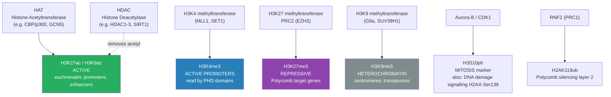
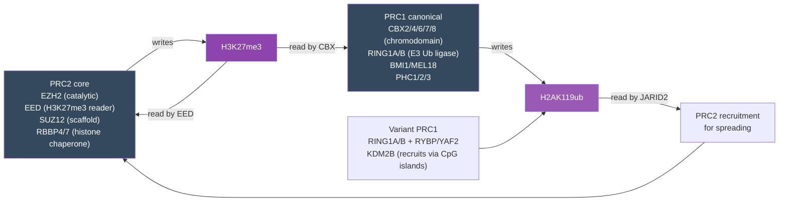
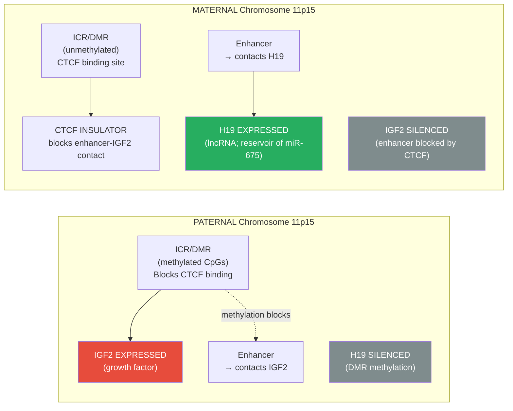
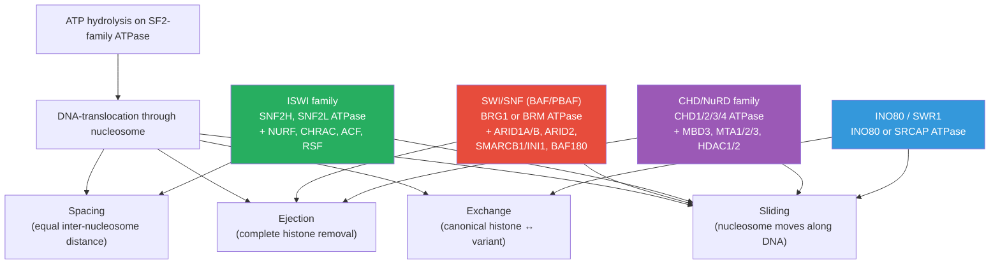
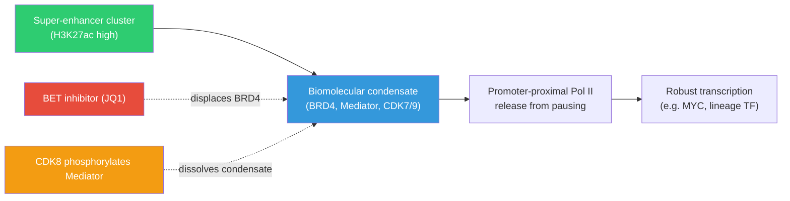
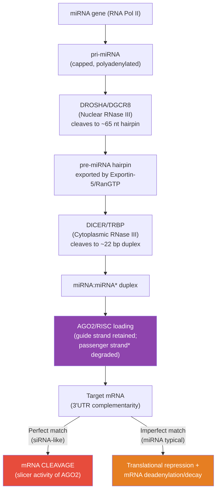
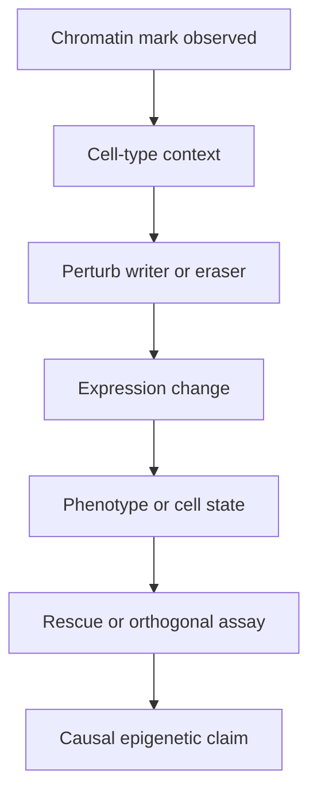

<!-- render:skip-beamer -->

# Epigenetics and Gene Regulation

\label{sec:unit_IV_epigenetics_and_gene_regulation}


<!-- chapter-metadata-badge -->
> **Ch 15** · Level 3/3 · 50 min read · 75 min lecture · Prerequisites: \cref{sec:unit_IV_gene_expression}

## Learning Objectives

1. Define [**epigenetics**](#gl:epigenetics) and distinguish epigenetic modifications from DNA sequence changes.
2. Describe [**nucleosome**](#gl:nucleosome) structure and the levels of [**chromatin**](#gl:chromatin) compaction from the 11-nm fibre to the metaphase [**chromosome**](#gl:chromosome).
3. Explain the major classes of [**histone**](#gl:histone) modifications (acetylation, methylation, phosphorylation, ubiquitination, sumoylation) and how they are written, erased, and read.
4. Describe the mechanism and function of DNA methylation, including [**CpG island**](#gl:cpg-island)s, the DNMT1/3A/3B [**enzyme**](#gl:enzyme)s, TET-mediated demethylation, and the role of methylation in [**gene**](#gl:gene) silencing.
5. Distinguish Polycomb (PRC1/PRC2) and Trithorax (MLL/COMPASS) systems and explain how they maintain repressive and activating states.
6. Compare ATP-dependent chromatin remodelling families (SWI/SNF, ISWI, CHD/NuRD, INO80) and their distinct mechanisms.
7. Explain X-chromosome inactivation (Lyonisation) and the role of the XIST lncRNA, escape genes, and skewing.
8. Describe genomic imprinting using IGF2/H19 and Prader–Willi/Angelman as paradigms.
9. Explain how 3D genome organisation — TADs, loops, compartments, and biomolecular condensates — shapes transcription.
10. Explain microRNA (miRNA \citep{fire1998}) biogenesis and the mechanism of RISC-mediated post-transcriptional silencing.
11. Model the maintenance of DNA methylation and Polycomb marks across cell divisions quantitatively, and predict the consequences of perturbing each layer.
12. Evaluate evidence for transgenerational epigenetic inheritance in humans, the mechanism of mitotic and meiotic transmission of epigenetic marks, and the clinical implications of epigenetic dysregulation in cancer and neurodevelopmental disease.

\begin{figure}[htbp]
\centering
\includegraphics[width=0.85\textwidth]{../figures/methylation_heatmap.png}
\caption{Illustrative synthetic CpG methylation heatmap across indexed loci (rows) and indexed samples (columns). The colour scale reports beta methylation fraction from 0 to 1; the lower-methylation row band is a deterministic teaching pattern, not patient or cell-line data.}
\label{fig:unit_IV_methylation_heatmap}
\end{figure}

<!-- alt: Heatmap with CpG locus index on rows and sample index on columns. Colour encodes beta methylation fraction from low to high, with a lower-methylation band across the middle loci. -->

<!-- curriculum-scaffold-start -->
### Study Blueprint

- **Big idea:** Cells create stable yet reversible expression states through chromatin, DNA marks, and regulatory circuits.
- **Core concepts:** chromatin, methylation, histone modification, enhancers.
- **Framework alignment:** Vision & Change: Information flow, exchange, and storage, Structure and function; AP Biology: Information Storage and Transmission, Systems Interactions; NGSS-style topics: Inheritance and Variation of Traits, Structure and Function.
- **Model or quantitative lens:** Regulatory-state and expression-ratio reasoning.
- **Data skill:** Interpret chromatin or expression evidence from simple regulatory datasets.
- **Practice cadence:** Concept Explanation, Questions and Methods, Argumentation.
- **Common misconception to repair:** Epigenetic does not mean independent of DNA sequence or permanently inherited.
- **Primary lab:** \cref{sec:lab_unit_IV_epigenetics_and_gene_regulation}.
- **Question bank:** \cref{sec:q_unit_IV_epigenetics_and_gene_regulation}.
- **Transfer task:** Apply regulation logic to differentiation, imprinting, cancer, or environmental responses.
- **Bridge to computation:** `biology.genetics.genetics.cpg_methylation_remaining`.
<!-- curriculum-scaffold-end -->

---

> **Opening Vignette — The Landscape That Changed Genetics**
>
> In 1942, the developmental biologist Conrad Waddington drew a diagram that would define a science. He sketched a marble rolling down a hillscape of ridges and valleys — each valley representing a stable cell fate, each ridge a threshold that once crossed was difficult to reverse. He called this the **epigenetic landscape**: the topology of developmental possibilities. Waddington coined "epigenetics" from the Greek *epi-* (above) to describe the heritable changes in gene expression that occurred *above* or *beyond* the DNA sequence — changes that could not be explained by Mendelian genetics alone. He had no idea of the molecular mechanisms. That understanding would come forty years later.
>
> In 1961, Mary Lyon \citep{lyon1961} noticed something peculiar in female mice [**heterozygous**](#gl:heterozygous) for coat-colour [**mutation**](#gl:mutation)s: their fur was a mosaic, not intermediate. She proposed that in every cell of a female mammal, one of the two X chromosomes is randomly and permanently silenced — a hypothesis proven so thoroughly that it was renamed Lyonisation. The silenced X does not have a different DNA sequence. It has a different *chemistry*: dense methylation, hypoacetylated histones, and a long non-coding RNA called XIST that coats the entire chromosome. This was the first clear demonstration that a whole chromosome could be heritably silenced without changing a single base pair. Epigenetics had found its molecular identity.
>
> Three more revolutions followed. In 2000, Strahl and Allis \citep{strahl2000} proposed that distinct combinations of histone modifications — a "histone code" — encode regulatory information beyond the DNA sequence itself, predicting an entire pharmacology of writers, erasers, and readers that has now produced FDA-approved drugs. In the 2000s, chromosome-conformation-capture (Hi-C) revealed that the genome is folded into stereotyped contact domains (TADs) where enhancers find their cognate promoters, and that disrupting these domains can mis-wire developmental control. And in the 2010s, biomolecular condensates and phase separation reframed the nucleus as a collection of liquid-like assemblies that concentrate transcriptional machinery at super-enhancers. These insights together turned epigenetics from a metaphor into a quantitative, druggable discipline.

## Chromatin Structure and Nucleosome Organisation

### The Nucleosome: Fundamental Unit

Eukaryotic DNA is not naked; it is complexed with [**protein**](#gl:protein)s to form **chromatin**. The fundamental repeating unit is the **nucleosome**:

- **Histone octamer:** 2 copies each of H2A, H2B, H3, H4 — forming a spool-like protein disk
- **DNA wrapping:** ~147 bp of DNA wound 1.65 times around the histone octamer in a left-handed superhelix
- **Linker DNA:** 10–80 bp connecting adjacent nucleosomes; associated with histone H1
- **Bead-on-a-string:** nucleosomes connected by linker DNA form an 11-nm fibre — the first level of compaction

**Core histone structure:** Each core histone has:
- A **globular domain** forming the nucleosome disc surface through the **histone fold** motif (three α-helices linked by two short loops; pairs of histones form four-helix bundles: H3–H4 and H2A–H2B)
- An unstructured **N-terminal tail** extending beyond the disc (4–35 residues depending on histone) — this is where most post-translational modifications occur
- A short **C-terminal tail** (especially prominent on H2A and H2B) that also accepts modifications including ubiquitination

**Histone variants:** In addition to canonical H2A/H2B/H3/H4, mammalian cells express variant histones that confer specialised properties on chromatin where they are deposited:

| Variant | Replaces | Deposition machinery | Function |
| ------- | -------- | -------------------- | -------- |
| H3.3 | H3 | HIRA (gene bodies); ATRX/DAXX (heterochromatin) | Replication-independent; marks transcribed/active regions |
| CENP-A (CenH3) | H3 | HJURP | Centromere identity; foundation for kinetochore assembly |
| H2A.Z | H2A | SRCAP, INO80/SWR1 | Promoter-proximal; poises genes for activation; insulates from heterochromatin |
| H2A.X | H2A | RAD51 / S139ph at DSBs | DNA-damage signalling (γH2AX); foci visible by immunofluorescence |
| macroH2A | H2A | ATRX-dependent | Inactive X enrichment; gene silencing |
| H2A.B (Bbd) | H2A | unclear | Active transcription; testis enriched |

### Higher-Order Chromatin Compaction

| Level | Structure | Diameter | Compaction factor | Mechanism |
| ----- | --------- | -------- | ----------------- | --------- |
| 0 | Naked DNA (B-form helix) | 2 nm | 1× | Watson–Crick base-pairing |
| 1 | Nucleosome fibre ("beads on a string") | 11 nm | ~6× | Histone octamer wrapping |
| 2 | 30-nm fibre (disputed *in vivo*) | 30 nm | ~40× | Nucleosome–nucleosome compaction |
| 3 | Chromatin loops / TADs | 300 nm | ~1,000× | CTCF + cohesin-defined loops; TADs |
| 4 | A/B compartments | — | variable | Active (A) vs. repressive (B) genomic neighbourhoods |
| 5 | Chromatid (mitotic chromosome) | 700 nm | ~10,000× | SMC condensin-mediated compaction |

### Topologically Associating Domains (TADs)

Chromatin organises into DNA loops of 100 kb–1 Mb delineated by **CTCF** (insulator protein) binding sites and **cohesin** ring complexes. Within TADs, enhancers preferentially contact [**promoter**](#gl:promoter)s of the same TAD. TAD boundaries are largely conserved across cell types and species. The dominant model for TAD formation is **loop extrusion**: cohesin loads on chromatin and reels DNA through its ring lumen ATP-dependently until it stalls at convergently oriented CTCF binding sites, leaving behind a chromatin loop. Quantitatively, mammalian genomes contain ~3,000–10,000 TADs (~1 Mb median), and knockdown of CTCF or cohesin (RAD21, NIPBL) blurs or abolishes most boundaries within hours.

\begin{equation}P_{\text{contact}}(s) \propto s^{-\alpha}, \quad \alpha \approx 1.0\text{–}1.2 \text{ for fractal globule (interphase)} \tag{15.1}\label{eq:hic_scaling}\end{equation}

**Hi-C methodology in detail.** Hi-C is a chromosome-conformation-capture variant that measures contact frequency between every pair of genomic loci genome-wide. The protocol:

1. **Cross-link** chromatin with formaldehyde (1 % for 10 min), preserving protein-mediated DNA contacts.
2. **Restriction digest** with a 4-cutter (DpnII, MboI) or 6-cutter (HindIII), creating sticky-ended fragments still tethered by cross-linked proteins.
3. **Fill-in with biotinylated nucleotides** to mark cleaved ends, then **proximity ligate** at low DNA concentration so that intermolecular ligations are improbable — primarily fragments held together by cross-linked proteins (i.e., physically proximal *in vivo*) ligate.
4. **Streptavidin pulldown** enriches biotinylated junction reads, paired-end Illumina sequencing identifies which genomic loci were joined.
5. **Heatmap normalisation** (ICE, KR-balanced) yields a contact matrix; diagonal-rich blocks are TADs; off-diagonal stripes identify loop anchors at convergent CTCF.

Derivative methods refine the assay: **Micro-C** uses MNase digestion to nucleosome resolution; **Capture-Hi-C** enriches for promoter-anchored contacts (4DN consortium); **HiChIP / PLAC-seq** combines ChIP for an active mark (H3K27ac) with proximity ligation; **ChIA-PET** uses paired-end tagging on antibody-immunoprecipitated chromatin; **Hi-C 3.0 / Pore-C** uses long-read multi-way contact mapping.

Disruption of TAD boundaries (e.g., by large deletions, inversions, or single-nucleotide CTCF site disruptions) can cause misregulation of developmental genes — a mechanism termed **enhancer hijacking**. Lupiáñez et al. (2015) showed that microdeletions removing TAD boundaries near *EPHA4* fuse adjacent regulatory landscapes, mis-targeting limb enhancers to *PAX3* or *WNT6* and producing congenital limb malformations (brachydactyly, syndactyly).

**Loop extrusion — the dynamic model.** Single-molecule imaging and live-cell Hi-C now support a kinetic loop-extrusion model with quantitative parameters:
- Cohesin (SMC1/SMC3 + RAD21/SCC1 + STAG1/STAG2) is loaded onto chromatin by **NIPBL/MAU2** (the loader complex).
- It extrudes DNA into a growing loop at ~0.5–2 kb/s, consuming ATP at the SMC ATPase head.
- **WAPL** unloads cohesin (residence time ~20 min unloaded by WAPL, vs. > 1 h for the **cohesin-STAG2** "stalled" form at CTCF anchors).
- CTCF binds asymmetrically (a 19-bp consensus with a defined orientation): convergent CTCF pairs trap extruding cohesin, generating loops with measured loop sizes ~100 kb to 2 Mb.
- Acute auxin-induced degron depletion of RAD21 dissolves most loops within ~15 min; restoration takes ~30–60 min — confirming that TADs and loops are dynamic, not static structures.

### A/B Compartments

At the megabase scale, the genome partitions into two interaction "compartments":

- **A compartment** — gene-rich, active (H3K4me3, H3K27ac, accessible chromatin), positioned toward the nuclear interior
- **B compartment** — gene-poor, repressed (H3K9me3, lamina-associated), positioned at the nuclear periphery

Compartment switching during cell-fate transitions correlates with replication timing changes (early-replicating ↔ late-replicating) and with large-scale gene expression remodelling. Hi-C (and its derivatives Micro-C, Capture-Hi-C, ChIA-PET) measures these contacts genome-wide.

> **Concept Check 1:** A patient harbours a balanced inversion that breaks a CTCF site at the boundary of a TAD containing the *SHH* limb enhancer (ZRS, ~1 Mb upstream of *SHH*). Predict the developmental phenotype if the inversion places ZRS into a TAD containing an unrelated proto-oncogene. What chromosome-conformation-capture experiment would confirm enhancer hijacking?

---

## Histone Modifications — The Histone Code

Histone tails are subject to a large number of post-translational modifications (PTMs). The **[histone code](#gl:histone-code) hypothesis** \citep{strahl2000} proposes that specific combinations of marks specify distinct chromatin states and downstream outcomes.


<!-- alt: Flowchart showing histone modification writers and the states they produce. Green = active marks; blue = active promoters; purple = Polycomb repression; grey = constitutive heterochromatin. -->

*Histone modification writers and the states they produce. Green = active marks; blue = active promoters; purple = Polycomb repression; grey = constitutive [**heterochromatin**](#gl:heterochromatin).*

### The Histone Code: A Comprehensive Reference Table

The histone-code reference table below systematically catalogs > 25 modifications recurrently studied in mammalian chromatin biology, paired with the **writer enzyme**, **eraser enzyme**, **reader domain** that recognises the mark, the **histone position** (nucleosome face, exposed N-terminal tail, C-terminal tail), the typical **genomic location**, and the **functional effect** (activation, repression, or context-dependent). This is the chromatin biologist's periodic table — the working vocabulary of writers, readers, and erasers that defines every targeted therapy in clinical epigenetics.

**Active methylation marks**

| Mark | Writer / eraser | Main readers | Meaning |
| ---- | --------------- | ------------ | ------- |
| H3K4me1 | MLL3/4 writes; LSD1 erases | BAF45c PHD, CHD7 | Poised or active enhancers |
| H3K4me2 | MLL1/2 and SET1 write; LSD1 erases | CHD1, BPTF PHD | Active promoters and 5-prime gene bodies |
| H3K4me3 | MLL/SET1 COMPASS writes; KDM5 removes | TAF3 PHD, ING1, BPTF | Active promoters; recruits TFIID |
| H3K36me1/2 | NSD and ASH1L write; KDM2 removes | LEDGF PWWP, MRG15 | Gene bodies and active enhancers |
| H3K36me3 | SETD2 writes; KDM2/KDM4 remove | DNMT3 PWWP, MRG15, LEDGF | Transcribed gene bodies; suppresses cryptic initiation and recruits MMR |
| H3K79me2/3 | DOT1L writes | 53BP1 Tudor, AF9, ENL | Active gene bodies; important in MLL-fusion leukaemia |

**Active acetylation and ubiquitination marks**

| Mark | Writer / eraser | Main readers | Meaning |
| ---- | --------------- | ------------ | ------- |
| H3K9ac | GCN5/PCAF/p300 write; HDAC1-3 and SIRT1/6 erase | BRD4, TAF1 | Active promoters; loosens histone-DNA contacts |
| H3K14ac | GCN5/PCAF write; HDAC1-3 erase | Bromodomains | Active promoters; cooperates with H3K4me3 |
| H3K18ac and H3K23ac | p300/CBP write; HDACs erase | Bromodomains | Promoters and enhancers; active transcription |
| H3K27ac | p300/CBP write; HDAC1-3 erase | BRD4, YEATS | Active enhancers and super-enhancers |
| H3K56ac | p300/CBP write; HDAC1/SIRT1/SIRT6 erase | no dominant reader | Newly synthesised H3; chromatin assembly |
| H4K5ac, H4K8ac, H4K12ac | HAT1/p300/CBP write; HDACs erase | Bromodomains | Replication-coupled H4 deposition |
| H4K16ac | MOF writes; SIRT1/2 erase | context-dependent | Disrupts 30-nm fibre compaction; active gene bodies |
| H2BK120ub | RNF20/40 writes; USP22 erases | crosstalk readers | Required for H3K4me3 and H3K79me deposition |

**Repressive methylation and Polycomb marks**

| Mark | Writer / eraser | Main readers | Meaning |
| ---- | --------------- | ------------ | ------- |
| H3K9me1 | G9a/GLP/SETDB1 write; KDM3 removes | weak / context-dependent | Active gene bodies; cooperates with elongation marks |
| H3K9me2 | G9a/GLP write; KDM3/LSD1 remove | HP1, CDYL | Facultative heterochromatin and silenced euchromatin |
| H3K9me3 | SUV39H and SETDB1 write; KDM4 removes | HP1 alpha/beta/gamma, CBX1/3/5 | Constitutive heterochromatin; centromeres; transposons |
| H3K27me1/2 | EZH2 writes; UTX/JMJD3 remove | EED for me2/3 contexts | Active gene bodies at low level; me2 prevents inappropriate enhancer activation |
| H3K27me3 | EZH2/PRC2 writes; UTX/JMJD3 remove | EED and CBX-PRC1 | Polycomb domains; developmental-gene repression |
| H4K20me3 | SUV4-20H writes; PHF8 erases | 53BP1 Tudor | Pericentric heterochromatin and DNA-damage response |
| H2AK119ub | RNF2/RING1B writes; BAP1 removes | JARID2-associated PRC2.2 | Stable Polycomb silencing layer |

**Dynamic damage, cell-cycle, and metabolic marks**

| Mark | Writer / eraser | Main readers | Meaning |
| ---- | --------------- | ------------ | ------- |
| H3S10ph | Aurora B/MSK write; PP1/PP2A erase | 14-3-3 proteins | Mitosis and immediate-early gene activation |
| H3T3ph | Haspin writes; PP1 erases | Survivin/CPC | Inner-centromere recruitment during mitosis |
| H2A.X-S139ph (gamma-H2AX) | ATM/ATR/DNA-PK write; PP2A/WIP1 erase | MDC1 BRCT | Double-strand-break signalling foci |
| H3T6ph | PRK1 writes; PP1 erases | context-dependent | Androgen-receptor targets; H3K4 demethylation crosstalk |
| H4K12su and H2BK34su | PIAS/MMS21 write; SENP erases | SIM-containing readers | Polycomb and DNA-damage coordination |
| H2A/H4 ADP-ribosylation | PARP1/2 write; PARG/ARH3 erase | Macrodomain proteins | Chromatin relaxation for DNA repair |
| H3K18la | p300 writes; HDAC1-3 erase | YEATS domains | Lactate-linked macrophage polarisation |
| H3K9bhb | p300 writes; HDAC1-3 erase | YEATS domains | Ketosis and fasting response |
| H3K9cr, H3K9su, H3K4but | p300 or metabolic enzymes write; HDAC/sirtuin systems erase | YEATS-family readers | Metabolism-linked activation in enhancers, promoters, and gametogenesis |

The bottom rows reflect a major recent expansion of the histone code: short-chain acyl-CoAs derived from intermediary metabolism (lactate, β-hydroxybutyrate, crotonyl-CoA, succinyl-CoA, butyryl-CoA) are deposited by the same KAT/HAT enzymes (especially p300) that write acetyl marks, directly coupling **metabolic state** to chromatin state. The lactyl mark, in particular, has become the molecular signature of the Warburg-effect–polarised tumour-associated macrophage.

### Histone Acetylation

**Writers:** Histone acetyltransferases (HATs) — CBP/p300, GCN5/PCAF, TIP60, MOF.
**Erasers:** Histone deacetylases (HDACs) — 18 human HDACs in four classes (Class I/II/III/IV, where Class III = NAD⁺-dependent sirtuins SIRT1–7).
**Readers:** Bromodomains (e.g., BRD4, TFIID subunit TAF1, BAF180 of PBAF, BPTF). YEATS domains (AF9, ENL) read both acetyl and longer acyl marks.

**Mechanism:** Acetylation of lysine ε-amino groups by transfer from acetyl-CoA. Neutralises the positive charge on lysine, **weakening histone–DNA electrostatic interactions**, loosening chromatin and facilitating [**transcription**](#gl:transcription) factor binding.

\begin{equation}\text{Lys-NH}_3^+ + \text{acetyl-CoA} \xrightarrow{\text{HAT}} \text{Lys-NH-COCH}_3 + \text{CoA-SH} + \text{H}^+ \tag{15.2}\label{eq:hat}\end{equation}

**Key active marks:**
- **H3K27ac:** Marks active enhancers (distinguishes active from poised enhancers, which carry H3K27me3)
- **H3K9ac, H3K14ac, H4K16ac:** Found at active promoters and transcribed gene bodies

> **Clinical Connection — HDAC inhibitors (full clinical profile):** Histone deacetylase inhibitors (HDACi) are FDA-approved anticancer drugs.
> - **Vorinostat (SAHA)** — FDA approved 2006 for cutaneous T-cell lymphoma (CTCL). Hydroxamate pan-HDACi. Median time to response ~2 months; objective response ~30 %.
> - **Romidepsin (Istodax)** — FDA approved 2009 for CTCL and 2011 for peripheral T-cell lymphoma. Cyclic depsipeptide; class-I selective. Distinct dose-limiting toxicities (GI, fatigue, thrombocytopenia).
> - **Panobinostat (Farydak)** — FDA approved 2015 for relapsed/refractory multiple myeloma in combination with bortezomib + dexamethasone. Pan-HDACi; superior CD138+ plasma-cell apoptosis when combined with proteasome inhibitor.
> - **Belinostat (Beleodaq)** — FDA 2014 for PTCL.
> - **Tucidinostat (Chidamide)** — China-approved 2014 for PTCL; first benzamide HDACi.
>
> Mechanism in cancer: re-activation of silenced tumour-suppressor genes (p21, gelsolin, RhoB, BCL6); accumulation of acetylation on non-histone targets (HSP90 chaperone client release, p53 stabilisation, NF-κB inhibition). Combination with **DNMT inhibitors** is being explored to reverse layered silencing, a theme developed later in the cancer-epigenetics discussion.

### Histone Methylation

**Writers:** Histone methyltransferases (HMTs) — most contain SET domains (except DOT1L, which has a 7β-strand methyltransferase fold derived from class V methyltransferases).
**Erasers:** Histone demethylases — KDM1/LSD1 (FAD-dependent; works on me1 and me2 primarily; cannot demethylate me3 because it requires a free lysine ε-amino lone pair); KDM2–7 (Jumonji-domain, Fe(II)/αKG-dependent; can remove me3 by hydroxymethyl-amine intermediate that decomposes to formaldehyde and demethylated lysine).
**Readers:** Chromodomains (HP1 reads H3K9me3; CBX2/4/6/7/8 of PRC1 read H3K27me3); PHD fingers (TAF3, BPTF, ING proteins read H3K4me3); Tudor domains (53BP1 reads H4K20me2; SMN reads symmetrical R-methylation); MBT domains; WD40 (EED reads H3K27me3); PWWP domains (read H3K36me3).

Unlike acetylation (typically activating), **methylation is context-dependent**: the same modification on different residues has opposite effects.

| Mark | Enzyme | State | Function |
| ---- | ------ | ----- | -------- |
| H3K4me1 | MLL3/4 | Active | Enhancer elements (poised or active) |
| H3K4me3 | MLL1/SET1 | Active | Active promoters; read by TAF3 PHD |
| H3K36me3 | SETD2 | Active | Transcribed gene bodies; prevents cryptic initiation |
| H3K27me3 | EZH2 (PRC2) | Repressive | Polycomb targets; poised/silent developmental genes |
| H3K9me3 | SUV39H1/H2 | Repressive | Constitutive heterochromatin; [**centromere**](#gl:centromere)s; transposons |
| H4K20me3 | SUV4-20H | Repressive | Pericentric heterochromatin; DNA damage response |

**Bivalent domains:** In embryonic stem cells, many developmental gene promoters carry **both H3K4me3 and H3K27me3** simultaneously — a "bivalent" state. These genes are poised for either rapid activation (upon H3K27me3 removal by KDM6A/UTX) or repression (upon H3K4me3 removal) during differentiation. About 2,500 promoters are bivalent in human ES cells; most resolve to monovalent during lineage commitment.

### Phosphorylation and Ubiquitination

**H3S10ph (H3 Ser10 phosphorylation):**
- Writer: Aurora B kinase ([**mitosis**](#gl:mitosis)), MSK1/2 (mitogenic signalling)
- Function: Chromosome condensation during mitosis; gene activation by 14-3-3 reader binding

**H2AX-S139ph (γH2AX):**
- Writer: ATM/ATR kinases at double-strand breaks
- Function: Marks DSB sites; recruits MDC1 and DNA repair machinery; visible as bright immunofluorescence foci at break sites

**H2AK119ub (H2A monoubiquitination):**
- Writer: RNF2/RING1B (part of PRC1 complex)
- Function: Represses transcription elongation; part of Polycomb silencing; read by Polycomb-like proteins

> **Concept Check 2:** A cancer-associated EZH2 gain-of-function mutation leads to [**genome**](#gl:genome)-wide hypermethylation of H3K27 and silencing of tumour-suppressor genes. To what extent would an HDAC inhibitor (which increases histone acetylation) be expected to re-activate these silenced loci? Explain by reference to the dependencies between acetylation, methylation, and DNA methylation described above — and argue for a rational combination therapy.

> **Concept Check 3:** Predict the genome-wide consequence of a homozygous knockout of **SETD2** (the H3K36me3 writer) in an embryonic stem cell. Consider effects on (i) cryptic intragenic transcription, (ii) DNA mismatch repair recruitment, and (iii) DNMT3B-mediated gene-body methylation. Which of these phenotypes most directly explains why *SETD2* loss-of-function is the most frequent driver mutation in clear-cell renal cell carcinoma after VHL?

---

## Polycomb and Trithorax — Cellular Memory Systems

The **Polycomb (PcG)** and **Trithorax (TrxG)** group proteins were discovered in *Drosophila* as gene families whose loss-of-function alleles cause homeotic transformations of body segments. They constitute the cell's principal **cellular memory systems**: once a developmental gene is set ON or OFF in a progenitor, PcG/TrxG complexes propagate that state through most subsequent mitotic divisions of the lineage.

### Polycomb Repressive Complexes — Structural Detail


<!-- alt: Flowchart showing polycomb silencing operates as a feedback-amplified two-mark system: PRC2 writes H3K27me3, which recruits more PRC2 (positive feedback) and recruits canonical PRC1 (via CBX) which writes H2AK119ub. Variant PRC1 acts upstream at unmethylated CpG islands and seeds H2AK119ub which itself recruits PRC2. The mutual reinforcement explains how Polycomb domains span hundreds of kilobases and persist through cell divisions. -->

*Polycomb silencing operates as a feedback-amplified two-mark system: PRC2 writes H3K27me3, which recruits more PRC2 (positive feedback) and recruits canonical PRC1 (via CBX) which writes H2AK119ub. Variant PRC1 acts upstream at unmethylated CpG islands and seeds H2AK119ub which itself recruits PRC2. The mutual reinforcement explains how Polycomb domains span hundreds of kilobases and persist through cell divisions.*

**PRC1 — comprehensive subunit inventory:**
- Catalytic core: **RING1A** (RNF1) or **RING1B** (RNF2) E3 ubiquitin ligase + a PCGF partner (PCGF1, PCGF2/MEL18, PCGF3, PCGF4/BMI1, PCGF5, PCGF6).
- **Canonical PRC1 (cPRC1):** RING1A/B + PCGF2/4 (MEL18/BMI1) + a **CBX** (CBX2/4/6/7/8) chromobox subunit + PHC1/2/3 + SCMH1/L2. The CBX chromodomain reads H3K27me3, anchoring cPRC1 onto Polycomb-marked chromatin. PHC SAM-domain polymerisation drives **chromatin compaction in cis** (head-to-tail oligomerisation creates a phase-separated Polycomb body).
- **Variant PRC1 (vPRC1):** RING1A/B + PCGF1/3/5/6 + RYBP (or YAF2) instead of CBX. Recruited to **unmethylated CpG islands** via KDM2B (PCGF1 complex, "ncPRC1.1") or via E2F6 (PCGF6). Deposits H2AK119ub *upstream* of H3K27me3 — a key insight: vPRC1 acts first, then PRC2.2 reads H2AK119ub via JARID2.

**PRC2 — comprehensive subunit inventory:**
- Catalytic core: **EZH2** (or paralog **EZH1**; SET-domain methyltransferase). EZH2 is faster but EZH1 is dominant in non-dividing cells.
- **EED** binds H3K27me3 product → allosteric activation of EZH2 (the **read-write feedback** that generates broad Polycomb domains).
- **SUZ12** scaffold links the SET-domain catalytic core to the DNA/RNA-recognition modules.
- **RBBP4/7** histone chaperone presents the H3 tail substrate.
- **Accessory subunits define context-dependent variants:**
  - **PRC2.1:** PCL1/2/3 (PHF1, MTF2, PHF19) + EPOP or PALI1. The PHF Tudor domains read H3K36me3, restricting PRC2.1 from active gene bodies.
  - **PRC2.2:** AEBP2 + JARID2. JARID2 reads H2AK119ub deposited by variant PRC1 and stimulates PRC2 activity (closing the recruitment loop).
- **Reaction kinetics:** H3K27 → H3K27me1 (k₁ ≈ 0.05 s⁻¹) → H3K27me2 (k₂ ≈ 0.02 s⁻¹) → H3K27me3 (k₃ ≈ 0.005 s⁻¹), with each step ~3-fold slower; EED-allosteric stimulation increases k₃ by ~6-fold on neighbouring nucleosomes carrying me3.
- **Recruitment hierarchy:** unmethylated CpG islands (via PRC2.2/JARID2 reading H2AK119ub from variant PRC1, *or* via PRC2.1/PCL with KDM2B); broad gene-body recognition by EED reading existing me3; lncRNA recruitment (HOTAIR, XIST repA, KCNQ1OT1, ANRIL).

**Mechanism of Polycomb–Trithorax antagonism:** PRC2.1 cannot act on H3K36-methylated chromatin (PCL Tudor reads H3K36me3 antagonistically — the CPL paradox). Conversely, **ASH1L** (the Trithorax-group H3K36 methyltransferase) deposits H3K36me2 at active gene bodies, blocking PRC2 spreading. The cell uses this as a positive/negative selection: H3K36me-active = Polycomb-restricted; H3K36me-absent = Polycomb-permissive.

### Trithorax Group (TrxG) — Antagonising Polycomb

| TrxG complex | Activity | Role |
| ------------ | -------- | ---- |
| MLL/COMPASS family (MLL1–4, SET1A/B) | H3K4 methyltransferase | Marks active and poised promoters/enhancers |
| ASH1L | H3K36 methyltransferase | Antagonises Polycomb spread into active genes |
| KDM6A/UTX, KDM6B/JMJD3 | H3K27me3 demethylases | Remove Polycomb marks during differentiation |
| SWI/SNF (BAF) | ATP-dependent remodelling | Evicts PRC1/2; opens chromatin |

**The COMPASS family — six MLL/SET1 complexes in mammals:**
- **MLL1/KMT2A** (mixed-lineage leukaemia 1) — large promoter H3K4me3 deposition; MLL1-AF4/AF9/ENL fusions cause infant acute lymphoblastic or acute myeloid leukaemia.
- **MLL2/KMT2B** — closely related to MLL1; redundant at most loci; selective at others.
- **MLL3/KMT2C** and **MLL4/KMT2D** — write enhancer H3K4me1 (poised and active enhancers); KMT2D is among the most frequently mutated chromatin-regulator genes in cancer (~10 % of B-cell lymphoma and bladder cancer).
- **SET1A/KMT2F** and **SET1B/KMT2G** — write the bulk of promoter H3K4me3 in adult tissues; SET1A loss-of-function in MDS and CHIP.

Most six complexes share a **WRAD module** (WDR5–RbBP5–ASH2L–DPY30) that allosterically activates the SET-domain catalytic subunit by ~600-fold. This makes WRAD a tractable allosteric drug target — small-molecule WDR5–MLL interface inhibitors (OICR-9429) are in early-phase trials for MLL-rearranged leukaemia.

**The Polycomb–Trithorax balance** is maintained dynamically. Differentiation cues that activate gene expression typically deploy three concurrent steps: (i) UTX/JMJD3 removes H3K27me3, (ii) MLL/COMPASS deposits H3K4me3, and (iii) BAF complexes evict residual PRC1. Conversely, lineage repression deposits PRC1/PRC2 marks at the relevant promoter.

**Clinical translation — EZH2 inhibitors:**
- **Tazemetostat (Tazverik)** is a small-molecule SET-domain inhibitor of EZH2, FDA-approved (2020) for **epithelioid sarcoma** (which loses INI1/SMARCB1 — a SWI/SNF subunit — and becomes hyper-dependent on EZH2 silencing) and **EZH2-mutant follicular lymphoma**. Mechanism: SAM-competitive small molecule occupies the EZH2 SET-domain pocket. Approved dose 800 mg BID PO. Median PFS in INI1-loss epithelioid sarcoma trial: 5.5 months vs 1.9 placebo; ORR 15 %.
- **Valemetostat** (EZH1 + EZH2 dual inhibitor) was approved in 2022 in Japan for adult T-cell leukaemia/lymphoma (ATL); ORR 48 %.
- **Ivosidenib + tazemetostat** combinations in IDH-mutant glioma are in trial, exploiting the IDH-mutant tumour's dependence on Polycomb-driven differentiation block.

The mechanism is paradigmatic of **synthetic lethality** in chromatin: tumours with SWI/SNF loss become dependent on Polycomb silencing of cell-cycle inhibitors, so EZH2 inhibition selectively re-activates suppressors primarily in the cancer cells.

> **Worked Example 1 — Polycomb Spreading Model with Read-Write Feedback**
>
> **Setup:** A naive promoter has 2 nucleosomes carrying H3K27me3 (call this "seed"), recruiting PRC2 with EED-driven allosteric activation. PRC2 deposits H3K27me3 on the next nucleosome with rate constant *k* per generation. Each cell division dilutes existing H3K27me3 by half (passive demethylation through nucleosome turnover, since newly deposited histones at the replication fork are unmethylated). The gene body comprises 50 nucleosomes.
>
> **Question:** Derive the steady-state H3K27me3 density along the gene body for *k* = 1, 2, and 5 marks per generation. What is the minimum *k* needed for the silencing mark to spread fully (≥ 90 % of nucleosomes methylated)?
>
> **Solution:** Let $m_n$ be the average number of H3K27me3-marked nucleosomes at generation $n$, with $m_0 = 2$ (seed). Each generation:
> - Half of existing marks are passively diluted: $m_{\text{post-replication}} = m_n / 2$.
> - PRC2 deposits *k* new marks at neighbouring nucleosomes (read-write spreading): $m_{n+1} = m_n / 2 + k$.
>
> Steady-state when $m_{\infty} = m_{\infty} / 2 + k$, so $m_{\infty} = 2k$ marked nucleosomes.
>
> | *k* (marks/gen) | Steady-state $m_\infty$ | Gene-body coverage |
> | --------------- | ----------------------- | ------------------ |
> | 1 | 2 | 4 % (silencing fails) |
> | 2 | 4 | 8 % |
> | 5 | 10 | 20 % |
> | 25 | 50 | 100 % (saturated) |
> | 45 | 90 | 100 % (rapid saturation) |
>
> **Insight:** For full coverage of a 50-nucleosome gene body (≥ 45 marks at steady state), *k* must exceed ~22 marks per generation — i.e., PRC2 must deposit > 11× the seed quantity each cell cycle. This is achievable primarily with the **EED–allosteric read-write loop**: each existing H3K27me3 catalytically recruits more PRC2 to neighbouring nucleosomes, creating positive feedback. Without this loop (e.g., in EED-mutant cells), Polycomb domains collapse over a few divisions. This is why **EED-binding small molecules (EED226, MAK683)** are emerging as alternative EZH2-pathway inhibitors that disrupt the feedback loop selectively.

---

## DNA Methylation

### CpG Methylation Mechanism

In mammals, DNA methylation occurs almost exclusively on cytosine in the context **5′-CpG-3′** dinucleotides (the "p" denotes the phosphodiester bond between C and G). The methylated form is [**5-methylcytosine (5mC)**](#gl:5-methylcytosine), often called the "fifth base."

\begin{equation}\text{Cytosine} + \text{S-adenosylmethionine} \xrightarrow{\text{DNMT}} \text{5-methylcytosine} + \text{S-adenosylhomocysteine} \tag{15.3}\label{eq:DNMT}\end{equation}

### The DNA Methylation Machinery — In Depth

**Maintenance methyltransferase — DNMT1:** the workhorse enzyme that ensures heritability of CpG methylation across cell divisions.
- DNMT1 has a two-domain architecture: an N-terminal regulatory domain (containing CXXC, BAH1/2, and replication-foci targeting RFTS subdomains) and a C-terminal catalytic domain.
- **Substrate specificity:** preferentially methylates **hemi-methylated CpGs** — sites where the parental strand carries 5mC but the newly synthesised daughter strand is unmodified. Affinity for hemi-methylated CpGs is ~10–40-fold higher than for unmethylated CpGs.
- **Recruitment — the UHRF1–DNMT1 axis:** the protein **UHRF1** ("ubiquitin-like with PHD and RING finger domains 1") is the molecular bridge that targets DNMT1 to replicating heterochromatin. UHRF1 has **five domains**: UBL (ubiquitin-like), TTD (Tudor — reads H3K9me2/3), PHD (reads unmethylated H3R2), SRA (reads hemi-methylated CpG via base-flipping), and RING (E3 ubiquitin ligase). The dual recognition of (a) hemi-methylated CpG (via SRA) AND (b) H3K9me2/3 (via TTD) ensures that DNMT1 propagates methylation primarily at chromatin states already marked for repression.
- **The mechanism cycle (per CpG):**
  1. UHRF1 SRA domain flips the 5mC out of the helix, exposing the unmethylated daughter cytosine.
  2. UHRF1 RING ubiquitinates H3K18 (H3 tail) — creating a docking site for DNMT1's RFTS domain.
  3. DNMT1 RFTS binds H3K18ub; DNMT1 catalytic domain transfers a methyl group from SAM to the daughter cytosine.
  4. SAH (S-adenosyl-homocysteine) released; UHRF1 dissociates; cycle repeats.
- **Quantitative parameters:** maintenance efficiency per CpG ε ≈ 0.95 in healthy cells. Each replication fork carries ~50 CpGs/s of unmethylated daughter DNA into the lumen — DNMT1 must fix them within minutes before chromatin reassembly.
- **Loss-of-function:** mouse Dnmt1-knockout embryos die at E9.5 with genome-wide demethylation, ectopic gene expression, and replication-fork instability. Conditional knockouts in tissue-specific contexts produce lineage-specific failures (haematopoietic stem-cell exhaustion; intestinal epithelial collapse).

**De novo methyltransferases — DNMT3A, DNMT3B:**
- Both have an N-terminal regulatory PWWP domain (reads H3K36me3) and an ADD domain (reads unmethylated H3K4 = H3K4me0). PWWP recognition couples *de novo* methylation deposition to gene-body H3K36me3-marked regions; ADD ensures methylation deposition is excluded from H3K4me3-marked active promoters (a fundamental safeguard against silencing active genes).
- Establish *new* methylation patterns during germline development, gametogenesis, and early embryogenesis.
- Both require **DNMT3L** (catalytically inactive; missing the SET-like motif required for SAM binding) as a regulatory partner that stimulates activity ~15-fold and itself reads H3K4me0 — coupling methylation deposition to *absence* of active marks.
- DNMT3A: predominant in oocyte, embryonic stem cells, haematopoietic stem cells; loss-of-function mutations are frequent in **clonal haematopoiesis** (~5 % of healthy individuals over age 70) and AML (~20 % of cytogenetically normal AML); also Tatton-Brown–Rahman syndrome (germline DNMT3A loss with overgrowth).
- DNMT3B: predominant in B cells, embryonic stem cells; loss-of-function causes **ICF syndrome** (immunodeficiency, centromeric instability, facial anomalies) due to demethylation of pericentromeric satellites.

**Demethylation — TET family enzymes — the active demethylation pathway:**
- TET1, TET2, TET3 are Fe(II)/α-ketoglutarate-dependent dioxygenases (each ~2,000 amino acids) with conserved C-terminal catalytic domains. They sequentially oxidise:

\begin{equation}5\text{mC} \xrightarrow{\text{TET}} 5\text{hmC} \xrightarrow{\text{TET}} 5\text{fC} \xrightarrow{\text{TET}} 5\text{caC} \xrightarrow{\text{TDG/BER}} \text{C} \tag{15.4}\label{eq:tet_oxidation}\end{equation}

- **Reaction details:** TET enzymes consume O₂ and αKG, producing CO₂ and succinate. Each oxidation step transfers an oxygen atom from O₂ to the methyl carbon of cytosine.
- **Active demethylation by base excision repair:** 5-formylcytosine (5fC) and 5-carboxylcytosine (5caC) are recognised and excised by **thymine DNA glycosylase (TDG)**, which has a 100-fold preference for 5fC/5caC over 5mC. TDG cleaves the N-glycosidic bond, leaving an abasic (AP) site. **APE1** then makes a single-nucleotide cut; **DNA Pol β** fills the gap with unmodified cytosine; **DNA ligase III + XRCC1** seal the nick. This is the canonical BER pathway adapted for methyl-cytosine erasure.
- **5hmC is itself a stable mark with distinct biology, not merely an intermediate.** Different cell types have dramatically different 5hmC/5mC ratios — embryonic stem cells ~0.1 %, neurons ~0.7 % (Purkinje cells reach ~40 % of modified cytosines as 5hmC), cardiomyocytes ~0.5 %, tumour cells often < 0.05 % (a **5hmC depletion signature** now used in liquid-biopsy diagnostics on platforms such as EpiCheck and GRAIL Galleri).
- **Tissue-specific TET expression:** TET1 in stem cells (regulates pluripotency); TET2 in haematopoietic cells (clonal haematopoiesis); TET3 in zygote and neurons (post-fertilisation paternal demethylation; neural plasticity).
- **Clinical relevance:** TET2 is the most frequently mutated epigenetic-writer gene in haematopoietic cancers — loss-of-function TET2 mutations are present in ~15 % of AML, 50 % of CMML, and define **clonal haematopoiesis of indeterminate potential (CHIP)** (~10 % of people over age 70). The oncometabolite **2-hydroxyglutarate** (produced by mutant IDH1/2) competitively inhibits TET (and other αKG-dependent dioxygenases), causing genome-wide hypermethylation in IDH-mutant gliomas and AML (the **CIMP** phenotype).

**Methodological caveat:** Bisulphite sequencing (the traditional 5mC gold standard) **cannot distinguish 5mC from 5hmC** because both resist bisulphite-induced deamination. Modern methods that resolve oxidation states:

| Method | Signal | Resolution | Distinguishes |
| ------ | ------ | ---------- | ------------- |
| Bisulphite-seq (BS-seq) | C→T primarily at unmethylated | Single-base | 5mC + 5hmC vs C |
| oxBS-seq | Chemical oxidation of 5hmC → 5fC, then BS | Single-base | 5mC alone |
| TAB-seq | Tet-assisted bisulphite (β-glucosylates 5hmC, then TET-oxidises 5mC) | Single-base | 5hmC alone |
| ACE-seq | APOBEC chemical sequencing | Single-base | 5hmC enzymatically |
| CMS-seq | Cytosine 5-methylenesulfonate | Single-base | 5fC alone |
| caMAB-seq | Carboxymethylated-cytosine antibody | ~250-bp | 5caC alone |
| EM-seq | Enzymatic methyl-seq (no bisulphite damage) | Single-base | 5mC + 5hmC vs C |

**Clinical liquid-biopsy translation:** GRAIL's Galleri test analyses cell-free DNA methylation patterns at > 100,000 CpG sites; multi-cancer early detection (MCED) sensitivity ~67 % for stage I–IV combined; tissue-of-origin localisation accuracy ~93 %. The technology exploits that each tissue has a distinct methylation pattern, and tumours shed cfDNA with their tissue-specific signature.

### CpG Islands and Gene Regulation

**CpG islands (CGIs):** ~28,000 regions in the human genome (~500 bp–2 kb) with:
- Observed/expected CpG ratio > 0.6
- CG content > 55%
- Located near ~70% of mammalian gene promoters

**Normally unmethylated** in somatic cells. Methylation at CGI promoters is strongly associated with **stable transcriptional silencing**; the illustrative methylation heatmap in \cref{fig:unit_IV_methylation_heatmap} should be read as a beta-value pattern across loci and samples, not as patient or cell-line evidence. In empirical data, silencing operates by:
1. Steric blockade of TF binding (e.g., methylation at Sp1 sites)
2. Recruitment of methyl-CpG binding proteins (MBD family: MBD1, MBD2, MBD3, MBD4; MeCP2; Kaiso)
3. MBD-associated **NuRD complex** (MBD2/3-CHD4-HDAC1/2) → deacetylation → chromatin compaction

**CpG depletion in the rest of the genome:** Methylated CpGs are mutation hotspots (5mC → T deamination produces a C→T transition). Over evolutionary time, most CpGs outside islands have been lost — explaining the genome-wide CpG suppression. CpG islands have escaped depletion because methylation is normally absent and the deamination → mutation pressure is removed.

### Quantitative Maintenance Through Replication

Let $f_n$ be the fraction of CpGs methylated after $n$ divisions in the absence of *de novo* methylation:

\begin{equation}f_n = f_0 \times \left(\frac{1-\epsilon}{2}\right)^n + f_0 \times \frac{1+\epsilon}{2} \tag{15.5}\label{eq:methyl_decay}\end{equation}

where ε is the maintenance efficiency of DNMT1 (typically ~0.95 — i.e. each hemimethylated CpG is restored 95 % of the time at the replication fork). Even high maintenance efficiency therefore produces measurable **stochastic demethylation** over many divisions, which is why constitutively silenced genes also have backup repressive marks (H3K27me3, H3K9me3, H2AK119ub).

> **Worked Example 2 — DNMT1 efficiency and the kinetics of clonal demethylation**
>
> **Setup:** A research group treats a cancer cell line with a DNMT1 small-molecule inhibitor that reduces ε from 0.95 to 0.50 (50 % maintenance per CpG per division). The cells divide every 24 h. The cancer cell line carries an aberrantly hypermethylated *MLH1* promoter at *f₀* = 0.95 (95 % CpG methylation).
>
> **Question:** How many days until methylation drops below the *f* = 0.30 threshold typically required for re-expression?
>
> **Solution:** Using \cref{eq:methyl_decay}, $f_n = f_0 \times \left(\frac{1-\epsilon}{2}\right)^n + f_0 \times \frac{1+\epsilon}{2}$ — but at ε = 0.5 the steady-state floor is $f_0 \cdot (1+0.5)/2 = 0.75 \cdot f_0 = 0.71$ for *f₀* = 0.95. The floor exceeds the 0.30 threshold, so methylation will not drop below 0.30 with ε = 0.5 alone. To re-express MLH1, you need either complete DNMT1 inhibition (ε → 0) or active demethylation (TET upregulation). With ε = 0:
>
> $f_n = f_0 / 2^n$
>
> | Generation *n* | $f_n$ |
> | --- | --- |
> | 0 | 0.95 |
> | 1 | 0.475 |
> | 2 | 0.238 |
> | 3 | 0.119 |
>
> Threshold crossed between generation 1 and 2 — i.e., **2 cell divisions ≈ 48 h** after starting full DNMT1 inhibition. This kinetic is exactly why clinical responses to azacitidine/decitabine in MDS take ~4–6 cycles (~3–4 months) of continuous suppression to manifest: maintaining ε near zero is necessary but insufficient — the cell must also divide several times to dilute the existing mark.

> **Clinical Connection:** In cancer, two genome-wide patterns are consistently found:
> 1. **Global hypomethylation**: Repetitive elements (LINE-1, SINE) become unmethylated → chromosomal instability, reactivation of transposons, mis-regulated lineage genes.
> 2. **Focal CGI hypermethylation**: Tumour-suppressor gene promoters (BRCA1, MLH1, VHL, CDKN2A/p16, MGMT, DAPK) become methylated → silencing.
>
> **DNMT inhibitors** (azacitidine, decitabine) are nucleoside analogs incorporated into DNA; trapped DNMT1 forms a covalent adduct, causing passive demethylation. Approved for myelodysplastic syndrome (MDS) and AML. Combination with **HDAC inhibitors** is actively trialled.
> **Liquid biopsies** (e.g., GRAIL Galleri, Guardant Reveal) score hundreds of methylation features in cell-free DNA to detect early-stage cancer with tissue-of-origin localisation.

> **Concept Check 4:** A patient is treated with decitabine for high-risk MDS. After 4 cycles, the bone-marrow blast count is unchanged. Bisulphite sequencing of blast DNA shows the targeted *p15/CDKN2B* CGI is now 30 % methylated (from 90 % at baseline), but transcript levels remain undetectable. Propose three independent mechanisms that could explain transcriptional silencing despite DNMT1 inhibition, and design a bench experiment to distinguish them.

---

## Genomic Imprinting — Mechanisms and Reciprocal Phenotypes

**Genomic imprinting** is a form of epigenetic regulation in which genes are expressed from a single parental [**allele**](#gl:allele) in a parent-of-origin-specific manner. ~150 genes are imprinted in humans, organised into ~30 imprinted clusters each controlled by an **imprint control region (ICR)** that is differentially methylated on the two parental chromosomes.

### Imprint Control Regions (ICRs) — The Master Switch

ICRs are **differentially methylated regions (DMRs)** that are:
1. Established in the germline in a sex-specific pattern (paternal ICRs in spermatogenesis; maternal ICRs in oogenesis).
2. Maintained throughout somatic lineages — they escape post-fertilisation reprogramming via specialised protective mechanisms (e.g., **ZFP445** + **TRIM28/KAP1** + **DPPA3** = the ICR-protection triad in early embryos).
3. Read by sequence-specific factors (e.g., **CTCF** at unmethylated maternal IGF2/H19 ICR; methyl-binding proteins at methylated paternal ICRs).

**The CTCF insulator model — the canonical mechanism at IGF2/H19:** CTCF binds CCCTC consensus motifs in the unmethylated ICR. CTCF blocks the enhancer–promoter looping interaction by recruiting cohesin to form a chromatin loop "barrier." When the ICR is methylated, CTCF cannot bind (its zinc fingers fail to recognise methylated CpGs), so the enhancer is free to loop over and contact the *IGF2* promoter.

### The IGF2/H19 Locus — Insulator-based Imprinting (Detailed Mechanism)

The canonical example is the **IGF2/H19 locus** on chromosome 11p15:


<!-- alt: Flowchart showing imprinting at the IGF2/H19 locus. Paternal allele (top): DMR is methylated, CTCF cannot bind; enhancer contacts IGF2 → IGF2 expressed, H19 silent. Maternal allele (bottom): DMR unmethylated, CTCF binds and insulates enhancer from IGF2; enhancer contacts H19 → H19 expressed, IGF2 silent. -->

*Imprinting at the IGF2/H19 locus. Paternal allele (top): DMR is methylated, CTCF cannot bind; enhancer contacts IGF2 → IGF2 expressed, H19 silent. Maternal allele (bottom): DMR unmethylated, CTCF binds and insulates enhancer from IGF2; enhancer contacts H19 → H19 expressed, IGF2 silent.*

**Functional consequences of the locus:**
- **IGF2** (insulin-like growth factor 2): paternally expressed; potent fetal growth factor (signals through IGF1R / IGF2R). Drives placental and fetal growth.
- **H19**: maternally expressed; a 2.3-kb spliced lncRNA; reservoir of miR-675 (which targets *IGF1R*, creating a feedback loop). In some tissues H19 itself acts as a tumour suppressor by inhibiting IGF1R signalling.

### The 15q11–q13 Locus — Prader–Willi / Angelman (Comprehensive Mechanism)

A different mechanism operates at the **15q11–q13** imprinted cluster:

| Gene | Imprint pattern | Mechanism |
| ---- | --------------- | --------- |
| *SNRPN, NDN, MAGEL2* | Paternally expressed | Maternal copies silenced by methylation at the SNRPN ICR |
| *UBE3A* | Maternally expressed (in neurons) | Paternal *UBE3A* silenced by an antisense lncRNA *UBE3A-ATS* expressed primarily from the paternal allele |

**Mechanism details:**
- The **SNURF-SNRPN ICR** sits ~30 kb upstream of *SNRPN* and is methylated on the maternal allele (silencing maternal *SNRPN, NDN, MAGEL2*) and unmethylated on the paternal allele (where these genes are expressed).
- The unmethylated paternal ICR drives transcription of a long polycistronic transcript that extends ~600 kb to produce *SNRPN, SNORD-cluster snoRNAs* (SNORD115, SNORD116), and *UBE3A-ATS* (the antisense to *UBE3A*).
- *UBE3A-ATS* transcription on the paternal allele suppresses paternal *UBE3A* expression — *primarily in neurons*. This is the most surprising aspect of the locus: the imprint is **brain-specific**.

**Phenotypes — the parental-conflict reciprocal:**
- **Prader–Willi syndrome**: Loss of **paternal** 15q11–q13 expression — by paternal deletion (~70%), maternal uniparental disomy (~25%), or imprinting centre defect (~3%). Phenotype: neonatal hypotonia, hyperphagia and obesity, intellectual disability, hypogonadism, growth-hormone deficiency. The hypothalamic phenotype (especially the SNORD116 loss) drives the food-intake dysregulation.
- **Angelman syndrome**: Loss of **maternal** *UBE3A* expression in the same region — by maternal deletion (~70%), paternal uniparental disomy (~5%), imprinting centre defect (~5%), or *UBE3A* point mutation (~10%). Phenotype: severe intellectual disability, seizures, ataxic gait, "happy puppet" demeanour, absence of speech. UBE3A is an E3 ubiquitin ligase critical for synaptic plasticity; loss in neurons disrupts excitatory/inhibitory balance.

**Therapeutic angle — antisense oligonucleotide reactivation:** Activation of the silenced paternal *UBE3A* by antisense oligonucleotides targeting *UBE3A-ATS* is in clinical trials for Angelman syndrome (Ionis/Biogen ION-582/GTX-102, Phase 1/2 trials underway 2024). The strategy: deplete the antisense lncRNA → de-repress paternal *UBE3A* → restore neuronal UBE3A protein. Intrathecal delivery is required because UBE3A imprinting is brain-specific.

### Beckwith–Wiedemann and Silver–Russell — Reciprocal Disorders

The IGF2/H19 ICR also produces two reciprocal phenotypes — a textbook illustration of **dosage and parental conflict**:

- **Beckwith–Wiedemann syndrome (BWS):** biallelic IGF2 expression (loss of maternal imprint, **hypermethylation** of the maternal ICR at H19) → maternal allele now expresses IGF2 like the paternal → fetal overgrowth, macrosomia (birth weight > 4 kg), macroglossia, omphalocele, hypoglycaemia, hemihyperplasia, and a 7.5 % risk of childhood embryonal tumours (Wilms tumour, hepatoblastoma, neuroblastoma, rhabdomyosarcoma). Diagnosis: methylation analysis of the H19 DMR shows hypermethylation; some cases also have paternal UPD of 11p15 (~20 %).
- **Silver–Russell syndrome (SRS):** biallelic H19 expression / no IGF2 (loss of paternal imprint, **hypomethylation** of the paternal ICR) → paternal allele now silent like the maternal → severe intrauterine growth restriction (IUGR), postnatal short stature, body asymmetry, characteristic triangular face, fifth-finger clinodactyly. Diagnosis: hypomethylation of the H19 DMR (~50 %) or maternal UPD of chromosome 7 (~10 %).

This "mirror image" pair illustrates the **parental-conflict (kinship)** theory: paternally-expressed growth factors maximise embryonic growth (paternal genes care less about maternal resources, since the same father may not father subsequent siblings); maternally-expressed antagonists restrain growth (the mother distributes resources across multiple offspring).

> **Concept Check 5:** A child is born with severe IUGR, characteristic facial features, and asymmetric limbs. Methylation analysis shows that both the paternal and maternal copies of the 11p15.5 ICR are *hypomethylated*. Predict the likely diagnosis. Explain why hypermethylation versus hypomethylation at the *same* ICR produces *opposite* phenotypes (BWS vs SRS).

---

## X-Chromosome Inactivation (Lyonisation) — In Depth

In female placental mammals, dosage compensation for ~900 X-linked genes is achieved by transcriptionally silencing one of the two X chromosomes in every somatic cell.

**Key features:**
- **Random choice:** Either the maternal or paternal X can be inactivated in each cell (choice is random in each blastomere nucleus). Imprinted paternal X-inactivation occurs in mouse extra-embryonic lineages but not in humans.
- **Clonal maintenance:** Once established (~day 4.5 in human embryo), the inactive state is mitotically heritable in most daughter cells — the same X is silenced in every descendant.
- **Barr body:** The inactive X (Xi) forms a dense heterochromatic body (Barr body) visible by interphase cytology.
- **Incomplete:** ~15–25% of X-linked genes **escape** inactivation. Most escapees lie in the **pseudoautosomal regions (PAR1, PAR2)** that recombine with the Y; others (e.g., *KDM6A*, *KDM5C*, *DDX3X*, *ZFX*) escape across the X. Escape genes contribute to female-biased autoimmune disease and to Turner syndrome haploinsufficiency phenotypes.

**Molecular mechanism — a hierarchical cascade (timing and milestones):**

| Time after initiation | Event | Molecular outcome |
| --------------------- | ----- | ----------------- |
| 0 min | Choice made; Xist transcription up-regulated on future Xi | Allele-specific Xist transcription begins |
| 0–60 min | Xist RNA spreads in cis | Coats 165 Mb Xi; entry sites at LINE-1-rich domains |
| 1–6 h | Repeat A recruits SPEN/SHARP | SPEN recruits HDAC3 → genome-wide deacetylation |
| 1–6 h | Repeat B/C/D recruits PRC2 | EZH2 deposits H3K27me3 on Xi |
| 6–24 h | Repeat E recruits PTBP1, MATR3 | Nuclear matrix tethering of Xi |
| 6–24 h | PRC1 recruited downstream | RING1B writes H2AK119ub |
| 1–7 days | DNMT3A/3B methylate CpG-island promoters | Stable maintenance of silencing |
| 2–14 days | Histone variants accumulate | macroH2A and H2A.Z reinforce heterochromatin |
| 7–21 days | LBR anchors Xi to nuclear lamina | Xi enters B compartment (nuclear periphery) |

**XIST regulation by TSIX:** The antisense lncRNA *TSIX* (transcribed across XIST in the opposite direction) keeps XIST repressed on the future active X (Xa). The mutual exclusion of XIST/TSIX between alleles enforces monoallelic XIST expression. *TSIX* itself is regulated by *XITE* (X-inactivation intergenic transcription element) and by chromatin-state asymmetries between the two alleles in early embryogenesis.

**Reactivation in iPSC reprogramming:** When somatic female cells are reprogrammed to induced pluripotent stem cells (iPSCs), the inactive X reactivates — XIST is silenced, H3K27me3 is lost, DNA methylation is removed, and both alleles express X-linked genes again. This is a unique window for studying XCI dynamics. iPSCs derived from female patients with X-linked disease may have variable X-inactivation patterns after differentiation, complicating disease modelling.

**Clinical implications — X-linked diseases in heterozygous females:**

\begin{equation}\text{P(affected)} \approx \int_0^1 g(x) \cdot \mathbf{1}[x \le x_{\text{threshold}}] \, dx \tag{15.6}\label{eq:xci_skew}\end{equation}

where $g(x)$ is the distribution of X-inactivation skewing across cells. **Skewed X-inactivation** (where one allele is silenced in >75 % of cells) explains why heterozygous female carriers of X-linked diseases (Duchenne muscular dystrophy, Rett syndrome, X-linked agammaglobulinaemia) show variable severity. Skewing arises when:
- Random inactivation by chance produces an extreme distribution
- Cell-autonomous selection eliminates clones with the active mutant allele (e.g., immunodeficiencies)
- A *XIST* or *XIC* mutation biases choice
- Skewing is age-dependent: fraction of women with > 75 % skewing rises from ~5 % at birth to ~25 % by age 60 (clonal drift in haematopoiesis).

**Lyon's evidence** \citep{lyon1961}: Female mice heterozygous for coat-colour mutations show patchy (mosaic) coat colour — a direct consequence of random X-inactivation producing patches of cells expressing one allele or the other. The same mosaicism is seen in human female carriers of X-linked albinism, X-linked anhidrotic ectodermal dysplasia (Christ–Siemens–Touraine, with patchy sweat glands), and X-linked retinoschisis (patchy retinal involvement).

> **Worked Example 3 — Predicting penetrance from XCI skewing**
>
> **Setup:** A female patient is heterozygous for a Duchenne muscular dystrophy (DMD) deletion. Muscle weakness is observed in cells where the wild-type (active) allele is on the inactivated X. Assume that DMD muscle fibres are syncytial (myofibres pool many nuclei); a fibre is dystrophic if > 50 % of its nuclei express the deleted allele.
>
> **Question:** If XCI is unbiased (mean skewing = 0.5, standard deviation σ_skew = 0.05 across mononuclear cells), what fraction of myofibres will be dystrophic? What if the patient has clonal-skewing where σ_skew = 0.20?
>
> **Solution:**
> A fibre is dystrophic if more than half its nuclei have the wild-type allele inactivated. With *N* = 20 nuclei per fibre and a per-nucleus probability *x* of expressing the deleted allele (= probability wild-type X is inactivated), the fibre is dystrophic when more than *N*/2 nuclei out of *N* express the deleted allele.
>
> For unbiased XCI, *x* per nucleus ≈ 0.5, σ_x = 0.05. Per fibre, the average fraction of mutant-expressing nuclei ≈ 0.5 ± 0.05/√20 ≈ 0.5 ± 0.011. Almost no fibres exceed 50 % (by about σ_fibre × 1 ≈ 1 %).
>
> For clonal-skewing σ_skew = 0.20 across mononuclear precursors, mean per-fibre fraction is 0.5 but with much wider variance: σ_fibre ≈ 0.20/√20 ≈ 0.045. Now ~25 % of fibres exceed 50 % mutant expression and become dystrophic.
>
> **Insight:** Manifesting Duchenne muscular dystrophy in heterozygous female carriers (~10 % show muscle weakness) is largely explained by **age-acquired XCI skewing** in haematopoietic and myogenic precursors. Treatment strategies: skewing-modulating ASOs to redirect XCI; or AAV-DMD gene therapy (rebalancing dystrophin expression).

> **Concept Check 6:** A 4-year-old girl is diagnosed with severe Rett syndrome. Sequencing reveals a heterozygous loss-of-function mutation in *MECP2*. XCI analysis shows 95 % skewing toward inactivation of the *wild-type* allele. Explain (i) why this skewing pattern produces severe disease, (ii) why some Rett patients with the same mutation are mildly affected, and (iii) whether modulating XCI skewing therapeutically could be a treatment strategy.

---

## Chromatin Remodelling Complexes — Mechanism in Detail

In addition to covalent modifications, chromatin structure is actively remodelled by ATP-dependent complexes that slide, eject, or restructure nucleosomes. Most four families share a conserved **Snf2-family ATPase** (SF2 helicase superfamily) but couple ATP hydrolysis to distinct nucleosome operations.

### The Four Major Remodeller Families


<!-- alt: Flowchart showing four ATP-dependent remodelling families, each with a distinct nucleosome operation. SWI/SNF: large bursts of sliding and ejection that expose regulatory DNA. ISWI: short, regular spacing for nucleosome arrays. CHD/NuRD: repressive sliding with HDAC coupling. INO80/SWR1: histone variant exchange (H2A.Z ↔ H2A) at promoters and DNA damage sites. -->

*Four ATP-dependent remodelling families, each with a distinct nucleosome operation. SWI/SNF: large bursts of sliding and ejection that expose regulatory DNA. ISWI: short, regular spacing for nucleosome arrays. CHD/NuRD: repressive sliding with HDAC coupling. INO80/SWR1: histone variant exchange (H2A.Z ↔ H2A) at promoters and DNA damage sites.*

| Family | Prototype complex | ATPase | Mechanism | Function | Disease |
| ------ | ----------------- | ------ | --------- | -------- | ------- |
| SWI/SNF | BAF, PBAF (mammals); SWI/SNF (yeast); BAP, PBAP (*Drosophila*) | BRG1 (SMARCA4) or BRM (SMARCA2) | Large-scale sliding and ejection | Activate transcription; prepare enhancers; required for stem cell self-renewal | ARID1A mutated in ~10% cancers; SMARCB1/INI1 lost in malignant rhabdoid tumour; SMARCA4 in lung cancer |
| ISWI | NURF, CHRAC, ACF, RSF, NoRC | SNF2H (SMARCA5), SNF2L (SMARCA1) | Nucleosome spacing — generates regular arrays | Chromatin assembly post-replication; heterochromatin maintenance; transcriptional repression | Williams syndrome (BAZ1B/WSTF deletion) |
| CHD / NuRD | NuRD (CHD3/4 + MBD3 + MTA1/2/3 + HDAC1/2 + RBBP4/7) | CHD1, CHD3 (Mi-2α), CHD4 (Mi-2β) | Nucleosome sliding coupled to histone deacetylation | Gene repression; lineage commitment; Polycomb-related silencing | CHD7 in CHARGE syndrome; CHD8 in autism |
| INO80 / SWR1 | INO80, SWR1 (yeast); SRCAP (mammals) | INO80, SRCAP | Histone variant exchange (H2A.Z ↔ canonical H2A; H2A.X ↔ H2A) | Promoter-proximal H2A.Z deposition; DSB repair (γH2AX exchange); centromere identity | Floating-Harbor syndrome (SRCAP mutations) |

**Mechanism in detail — the "wave" model of DNA translocation:** Most remodellers translocate DNA through the nucleosome by alternately gripping minor groove with two RecA-like ATPase lobes. Each ATP cycle introduces a 1-bp DNA bulge that propagates around the histone surface, effectively pulling DNA into the nucleosome from one side and ejecting it from the other. The size of the ATP-driven movement varies (1–10 bp per cycle) and explains the family-specific outcomes (single-nucleosome repositioning vs. processive slides vs. ejection). Substrate recognition differs:
- **SWI/SNF** binds at SHL-2 (superhelical location -2 from the dyad), gripping nucleosomal DNA ~20 bp from the histone–DNA boundary.
- **ISWI** binds the linker DNA flanking the nucleosome and uses an autoinhibitory AutoN domain that is released by H4-tail acetylation.
- **CHD/NuRD** binds via a tandem chromodomain that reads H3K9me3 (CHD3) or H3K4me0 (CHD4), targeting the complex to silenced chromatin.
- **INO80** binds the H2A.Z-H2B dimer for selective exchange.

### SWI/SNF Specifically — The Cancer-Most-Mutated Remodeller

The mammalian BAF complex contains 12–15 subunits, including ATPase BRG1 or BRM, ARID1A/B (DNA-binding), and SMARCB1/INI1. Its assembly is highly cell-type-specific (npBAF in neural progenitors → nBAF in post-mitotic neurons, with subunit swap at *MIR9* induction; esBAF in embryonic stem cells). BAF:
- **Evicts PRC1/PRC2 from enhancers within minutes** (this is the basis for the synthetic-lethal sensitivity of SWI/SNF-mutant tumours to EZH2 inhibitors).
- Generates nucleosome-depleted regions (NDRs) at enhancers and promoters
- Recruits transcription factors (e.g., pioneer TFs FOXA1, GATA4) by exposing their motifs
- Specific complexes:
  - **canonical BAF (cBAF):** contains ARID1A or ARID1B and DPF1/2/3
  - **polybromo BAF (PBAF):** contains BAF180/PBRM1, ARID2, and BRD7 — required for IFN response and differentiation
  - **non-canonical BAF (ncBAF/GBAF):** contains BRD9, GLTSCR1/L, and BRG1 — found in synovial sarcoma (where SS18-SSX fusions hijack ncBAF)

### Targeted Epigenome Editing with dCas9 Fusions

The CRISPR toolkit has expanded far beyond DNA cutting. A catalytically dead **dCas9** (D10A + H840A) retains its ability to be guided to a specific DNA sequence by a sgRNA but no longer cleaves — turning it into a programmable DNA-binding scaffold. Fusing dCas9 to an epigenetic enzyme creates a targeted "writer" or "eraser" of chromatin state \citep{doudna2014}:

| Fusion | Function | Experimental / clinical use |
| ------ | -------- | --------------------------- |
| dCas9–DNMT3A | Programmable DNA methylation | **CRISPRoff** (heritable silencing without cutting DNA) |
| dCas9–TET1 | Programmable DNA demethylation | Rescue of fragile-X *FMR1* silencing; reactivation of tumour suppressors |
| dCas9–p300 | Programmable H3K27 acetylation | Programmable enhancer activation |
| dCas9–KRAB | Recruits KAP1 → SETDB1 → H3K9me3 | **CRISPRi** — stable repression of any gene |
| dCas9–LSD1 | H3K4me1/2 demethylation | Enhancer decommissioning |
| dCas9–VPR (VP64-p65-Rta) | Transcriptional activation | **CRISPRa** — ~10-to-1000-fold induction |
| dCas9–PRC1 (RING1B–PCGF4) | H2AK119ub deposition | Polycomb-style silencing |

The clinical promise is substantial: a dCas9–DNMT3A targeting the *HBG1/2* promoter re-activates fetal haemoglobin in adult β-thalassaemia patients without permanent genome modification. CRISPRoff-induced silencing of *PCSK9* in liver cells is being pursued for hypercholesterolaemia. The key limitation is off-target [**epigenome**](#gl:epigenome) editing — bystander methylation at sequence-similar loci — which the field now addresses with paired-sgRNA and split-dCas9 designs.

> [!NOTE]
> Unlike Cas9-mediated gene editing, epigenome editing is **reversible**: the perturbation fades unless it is self-reinforcing through mitotic heritability of DNA methylation. This makes it attractive as a research tool (transient perturbation) and a therapy (tunable, removable), but means durable clinical effects require either continuous dCas9 expression or recruitment of self-propagating chromatin states (e.g., H3K27me3 spreading by PRC2).

> **Clinical Connection:** **SWI/SNF subunits are mutated in ~20% of human cancers**, the highest mutation frequency of any single chromatin regulator. ARID1A (~10%), SMARCA4/BRG1 (~5%), SMARCB1/INI1 (childhood rhabdoid tumours, near-almost universally biallelic loss), PBRM1 (~40% of clear-cell renal cell carcinoma). Many SWI/SNF-mutant tumours become **synthetically lethal with EZH2** (PRC2) inhibition because they over-rely on Polycomb repression of cell-cycle inhibitors when SWI/SNF cannot evict PRC1/2.

---

## Three-Dimensional Genome Organisation and Phase Separation

### TADs, Loops, and Compartments — Spatial Layers

The genome is folded across multiple length scales, and each scale contributes to gene regulation:

| Length scale | Structural unit | Marker / detection | Functional role |
| ------------ | --------------- | ------------------ | --------------- |
| 1 kb–100 kb | Promoter–enhancer loops | ChIA-PET, HiChIP, Capture-Hi-C | Direct enhancer–TSS contact for activation |
| 100 kb–1 Mb | TADs | Hi-C insulation score; CTCF/cohesin ChIP | Constrains enhancer search to local genes |
| 1 Mb–100 Mb | A/B compartments | Hi-C eigenvector | Active vs. repressed neighbourhoods |
| Chromosome | Chromosome territories | DNA FISH | Each chromosome occupies a distinct nuclear domain |
| Nuclear scale | LADs, NADs, speckles | DamID, TSA-seq | Nuclear lamina, nucleolus, nuclear speckle proximity |

**LADs (Lamina-Associated Domains):** ~1,300 genomic regions (median ~1 Mb) attached to the nuclear lamina via lamin B receptor, marked by H3K9me2/me3, gene-poor and transcriptionally repressive. Lamina detachment correlates with gene activation during differentiation.

### Biomolecular Condensates and Phase Separation

Chromatin is not a static polymer; many regulatory proteins undergo **liquid–liquid phase separation** (LLPS) or form **condensates** with elevated local concentration. Intrinsically disordered regions (IDRs) on transcription factors (e.g., **BRD4**, **Mediator** subunits, **RNA Pol II** CTD-associated factors) promote clustering at **super-enhancers** — unusually large clusters of enhancers densely occupied by Mediator, co-activators, and active histone marks (**H3K27ac**). The resulting **transcriptional condensate** concentrates the phosphorylation machinery that releases promoter-proximal paused Pol II, explaining why some loci fire at very high rates (oncogenes such as *MYC* in selected cancers).

**Quantitative criteria for LLPS in cells:**
- IDR-rich proteins above a saturation concentration $c_{\text{sat}}$
- Multivalent interactions (low-affinity, high-valency) between IDRs, with $K_d \sim 1$–$100$ μM
- Round, dynamic droplets that fuse and undergo FRAP recovery on the seconds-to-minutes timescale
- Disassembly upon 1,6-hexanediol (a hallmark, though imperfect, test)

**Examples in chromatin biology:**

| Condensate | Constituents | Function |
| ---------- | ------------ | -------- |
| Heterochromatin foci | HP1α, H3K9me3 | Concentrates H3K9 methyltransferases; phase-separated repressive compartment |
| Nucleolus | NPM1, fibrillarin, Pol I, rRNA | Ribosome biogenesis; multiphase (FC/DFC/GC sub-compartments) |
| Nuclear speckles | SRSF, SON, MALAT1 | Storage and assembly of splicing factors |
| Cajal bodies | Coilin, snRNPs | snRNP and telomerase RNP biogenesis |
| PML bodies | PML, SUMO, p53 | DNA damage response; senescence; viral defence |
| Super-enhancer condensates | BRD4, Mediator, Pol II CTD | Robust transcription of cell-identity genes |
| Polycomb bodies | CBX2 (PRC1) phase-separated | Polycomb domain compaction in *cis* |

**Conceptual link to TADs:** Condensates operate *within* TADs and at promoter–enhancer loops; disrupting CTCF boundaries can move an oncogenic enhancer adjacent to a silent proto-oncogene (**enhancer hijacking**), a structural-variant mechanism increasingly catalogued in paediatric tumours.


<!-- alt: Flowchart showing super-enhancer–associated condensate bridging enhancers to paused Pol II; BET inhibitors weaken acetyl-lysine engagement of BRD4 and dissolve the condensate; CDK8-mediated phosphorylation of Mediator disrupts condensate integrity. -->

*Super-enhancer–associated condensate bridging enhancers to paused Pol II; BET inhibitors weaken acetyl-lysine engagement of BRD4 and dissolve the condensate; CDK8-mediated phosphorylation of Mediator disrupts condensate integrity.*

**Clinical angle — drugging condensates:**
- **BET bromodomain inhibitors** (e.g., JQ1, OTX015, birabresib, molibresib, mivebresib) displace BRD4 from acetylated chromatin, collapsing condensate-associated transcription at *MYC* and other dependency genes.
- **CDK7 inhibitors** (THZ1, SY-5609) and **CDK9 inhibitors** target the kinases concentrated in transcription condensates.
- **EZH2 inhibitors** (tazemetostat) shrink PRC2-mediated repressive domains.
- **Tumour cells with super-enhancer-driven oncogenes (MYCN-amplified neuroblastoma, MLL-rearranged leukaemia, *TAL1*-driven T-cell acute lymphoblastic leukaemia) can be highly sensitive** to BET inhibition, but response depends on enhancer wiring, compensatory transcription factors, and therapeutic window rather than on super-enhancer status alone.

> **Worked Example 4 — Polymer Statistics in Hi-C:**
>
> **Setup:** A human gene at chromosome 7p15 harbours an enhancer 700 kb upstream. We model intra-chromosomal contact probability with the fractal-globule scaling \cref{eq:hic_scaling}, $P(s) \propto s^{-\alpha}$, with α = 1.1.
>
> **Question:** Estimate the probability of physical contact between enhancer and promoter (s = 700,000 bp). Compare to (a) within-TAD contact at s = 50 kb and (b) trans-chromosomal contact (genome-wide Hi-C average ≈ 10⁻⁶).
>
> **Solution:**
> Setting *P*(50 kb) ≈ 1 (within-TAD baseline), the relative *P*(700 kb) = (700/50)⁻¹·¹ = 14⁻¹·¹ ≈ 0.063. The enhancer–promoter contact probability is ~6 % of the within-TAD baseline.
>
> Compare to trans-chromosomal: 6 × 10⁻² (intra-TAD-distant) versus 1 × 10⁻⁶ (trans) = a **~60,000-fold preference** for intra-chromosomal contacts even at long distances.
>
> **Insight:** CTCF/cohesin loop extrusion concentrates this 60,000-fold enrichment of intra-TAD contacts onto specific enhancer–promoter pairs, raising effective contact probability another 10–100×. This is why disrupting a single CTCF anchor (~20 bp deletion) can completely abolish enhancer–promoter looping and silence the target gene — even though the enhancer DNA is unchanged.

---

## Non-Coding RNAs in Gene Regulation

### MicroRNAs (miRNAs)

miRNAs are ~22 nt single-stranded RNAs that direct post-transcriptional silencing. Over 2,000 annotated human miRNAs collectively regulate ~60% of protein-coding genes \citep{fire1998}.


<!-- alt: Flowchart showing miRNA biogenesis and RISC-mediated silencing. Drosha in the nucleus produces pre-miRNA; DICER in the cytoplasm generates the duplex; AGO2 incorporates the guide strand into RISC; partial 3′ UTR complementarity leads to translational repression and mRNA decay. -->

*miRNA biogenesis and RISC-mediated silencing. Drosha in the nucleus produces pre-miRNA; DICER in the [**cytoplasm**](#gl:cytoplasm) generates the duplex; AGO2 incorporates the guide strand into RISC; partial 3′ UTR complementarity leads to translational repression and mRNA decay.*

**Key oncogenic miRNA examples:**
- **miR-21** (oncomiR): Overexpressed in most cancers; targets PTEN, PDCD4, RECK (tumour suppressors)
- **miR-155** (oncomiR): Overexpressed in B-cell lymphomas; targets SHIP1 (AKT suppressor)
- **miR-34a** (tumour suppressor miR): Downstream of p53; targets CDK6, BCL2, SNAIL; methylated/silenced in many cancers

### Long Non-Coding RNAs (lncRNAs)

lncRNAs are >200 nt functional RNA transcripts with no protein-coding potential. >100,000 annotated in the human genome. Mechanisms of action are diverse:

- **XIST:** Coats the inactive X chromosome; recruits PRC2 to spread H3K27me3, as described in the X-inactivation section.
- **HOTAIR:** Transcribed from HOXC; binds PRC2 to direct H3K27me3 deposition at HOXD and other loci
- **MALAT1:** Nuclear speckle-associated; regulates alternative splicing; highly expressed in cancer
- **H19:** Reservoir for miR-675; tumour suppressor function; imprinted, as described in the genomic-imprinting section.
- **NEAT1:** Paraspeckle scaffold; regulates gene expression by nuclear retention of specific mRNAs

### Small Interfering RNAs (siRNAs) and piRNAs

**siRNAs:** 21–23 nt, perfect complementarity to target; processed by DICER from long double-stranded RNA (dsRNA). In plants and nematodes, siRNA pathways mediate transposon silencing and antiviral immunity. In mammals, dsRNA triggers interferon responses rather than siRNA pathways in somatic cells; siRNA silencing is more prominent in germ cells and stem cells.

**piRNAs (PIWI-interacting RNAs):** 26–31 nt; DICER-independent (processed by "ping-pong" amplification cycle involving PIWI clade Argonautes: PIWIL1/MILI, PIWIL4/MIWI2). Essential for silencing transposable elements in the germline. Loss of piRNA pathway in *Drosophila* or mice causes transposon derepression and infertility.

---

## Epigenetic Reprogramming and Inheritance

### Mitotic Heritability of Epigenetic Marks — Detailed Mechanism

For an epigenetic mark to be "heritable," it must survive DNA replication and cell division. Different marks have different mechanisms:

| Mark | Mitotic heritability mechanism | Half-life through divisions |
| ---- | ------------------------------ | ---------------------------- |
| 5mC at CpGs | DNMT1/UHRF1 maintenance at replication fork | High (>10 divisions, ~95% efficiency) |
| H3K27me3 | Read-write feedback (PRC2 EED reads, EZH2 writes); inherited on parental nucleosomes which are randomly distributed to both daughter strands | Medium; restored within 1–2 divisions |
| H3K9me3 | Suv39H1/H2 reads HP1 → recruits more Suv39H; DNMT3A coupling | High at constitutive heterochromatin |
| H3K4me3 | Inherited via parental nucleosomes; rapidly re-established by transcription | Medium |
| H3K27ac | Diluted by half each division; restored by transcription factor activity | Low; not stably heritable |
| H2AK119ub | Inherited via parental nucleosomes; restored by PRC1 | Medium |

**Key conceptual point — parental nucleosome recycling:** During DNA replication, parental nucleosomes are split between the two daughter strands. The histone chaperones **MCM2** (binds H3-H4 dimers via its H3-H4 binding domain), **ASF1** (general H3-H4 chaperone), and **FACT** (Spt16-SSRP1, helps recycle H2A-H2B during transcription and replication) mediate this recycling. The current model:

1. **Parental nucleosome split:** As the replisome opens, parental histones are transiently released from DNA.
2. **Asymmetric recycling:** H3-H4 tetramers preferentially deposit on the **leading strand** (via Polε/MCM2 interaction) or **lagging strand** (via Polα/MCM2-7 helicase-associated MCM2). Recent work shows this is biased toward the leading strand in proliferating cells (~60:40), explaining strand-asymmetric mark inheritance.
3. **CAF-1 deposits new H3.1-H4:** The chromatin assembly factor CAF-1 (CHAF1A/B + RBBP4) is recruited by PCNA at the replication fork. CAF-1 deposits **new** H3.1-H4 tetramers (synthesized from S-phase histone gene bursts).
4. **Newly synthesised histones are deposited UNMODIFIED.** Daughter chromatin starts at half-density of any given mark.
5. **Restoration to full density depends on the read-write feedback loop** — the existing parental marks recruit the writer enzyme, which copies the mark onto neighbouring new histones.

**PRC2 propagation through replication.** EED reads H3K27me3 on a parental nucleosome → allosterically activates EZH2 → EZH2 deposits H3K27me3 on a neighbouring (newly assembled) nucleosome. Quantitative imaging shows that PRC2 activity at recently replicated chromatin is ~3-fold higher than at established chromatin — explaining how the mark "fills in" the daughter strand within ~6 hours of fork passage.

**DNMT1/UHRF1 mechanism in detail at the fork.** UHRF1 is loaded onto the replication fork by PCNA. UHRF1 SRA binds hemi-methylated CpG (the parental strand carries 5mC; the daughter strand has unmodified C). The UHRF1 RING domain ubiquitinates H3K18 — creating a docking site for DNMT1's RFTS domain. DNMT1 transfers a methyl group from SAM to the daughter cytosine. This coupled mechanism ensures methylation is restored within seconds of fork passage at active replication.

### Germline Reprogramming

Somatic epigenetic marks must be erased and re-established in each generation to prevent transmission of acquired somatic states:

1. **Post-fertilisation reprogramming:** After fertilisation, the paternal genome undergoes rapid active demethylation (TET3-mediated 5mC oxidation) within hours. The maternal genome is demethylated more slowly (replication-dependent passive demethylation). Both reach a methylation minimum at the blastocyst stage.
2. **Primordial germ cell (PGC) reprogramming:** PGCs migrate to the gonads (~E7.5–E10.5 in mouse; ~weeks 3–5 in human). They erase CpG methylation genome-wide (including imprint control regions) — the most complete demethylation in the mammalian life cycle.
3. **Re-establishment:** DNMT3A/3B with DNMT3L re-methylate the genome in a sex-specific pattern during gametogenesis (prospermatogonia in males; oocyte growth in females). Imprinted loci are methylated in a sex-specific order: paternal imprints in spermatogonia (before meiosis); maternal imprints in growing oocytes (after meiosis I arrest, prior to ovulation).

### Evidence for Transgenerational Epigenetic Inheritance in Humans

The Dutch Hunger Winter (Hongerwinter, 1944–1945) provides the most studied human evidence. Dutch civilians subjected to severe famine (500–1,000 kcal/day) during WWII German occupation showed:

- **F1 offspring** (exposed in utero): Increased rates of obesity, diabetes, schizophrenia, and CVD in adult life — consistent with developmental programming via altered methylation.
- **F2 offspring** (children of F1): Increased rates of obesity and metabolic syndrome — suggesting transmission across one germline generation.
- **Mechanism:** Reduced methylation at IGF2 differentially methylated regions (DMRs) persists for decades in blood cells of F1 individuals, detectable compared to unexposed siblings.

**Other lines of evidence:**
- Överkalix cohort (Sweden): Paternal grandfather's food supply during slow-growth period correlates with grandsons' diabetes mortality.
- *Agouti* viable yellow ($A^{vy}$) mouse model: Maternal methyl-donor diet (folate, B12, methionine, choline) during pregnancy shifts coat-colour distribution by altering methylation of an upstream IAP retrotransposon.
- piRNA-mediated transposon silencing: piRNAs in sperm carry information about active transposons across generations.

> [!NOTE]
> The evidence for true transgenerational epigenetic inheritance in humans (affecting F2 and beyond without continued environmental exposure) is suggestive but not yet definitive. Confounding by shared post-natal environment and direct exposure of the F1 germline (the F2 was a primordial germ cell in the F0 grandmother during the F1 in utero exposure) remains difficult to exclude. Mechanistically, piRNA-mediated transposon silencing and small-RNA transmission in sperm provide plausible vehicles, but a clean causal chain in humans has not been established.

> **Concept Check 7:** Imagine a dCas9 fusion protein is targeted to the *BRCA1* promoter in a breast-cancer cell line, carrying a DNMT3A catalytic domain. Over several cell divisions, the promoter becomes hypermethylated and transcription drops. Once dCas9 is withdrawn, does the methylation persist, relax over mitoses, or become heritable between cells? Explain in terms of DNMT1 maintenance methylation, passive demethylation during S-phase, and the absence of active demethylation by TET enzymes under these conditions.

> **Concept Check 8:** A scientist treats cells with the DNMT inhibitor decitabine for 48 hours, then washes it out. Predicting that DNMT1 will resume normal activity after washout, will the demethylation persist, partially recover, or fully recover over the subsequent 10 cell generations? Sketch a quantitative model assuming ε returns to 0.95 instantaneously after washout and starting *f₀* = 0.10 (10 % methylated post-decitabine).

---

## Cancer Epigenetics and Clinical Translation — Comprehensive

Cancer cells display **systemic epigenetic dysregulation**: typically global DNA hypomethylation (especially of repetitive elements), focal hypermethylation of tumour-suppressor CGI promoters, broad H3K27me3/H3K9me3 redistribution, and aberrant chromatin remodelling complex composition. The therapeutic implication is that, unlike genetic mutations, epigenetic states are **reversible** — and several drug classes now target each layer.

### The Cancer Epigenome — Two Concurrent Patterns

**Pattern 1: Global hypomethylation.** Repetitive elements (LINE-1, SINE, IAP, satellite repeats), normally heavily methylated, lose methylation in nearly most cancers. Consequences:
- **Chromosomal instability:** demethylation of pericentromeric satellite-2 sequences disrupts heterochromatin, leading to chromosome bridges, lagging chromosomes, and aneuploidy.
- **LINE-1 reactivation:** transposition of L1 elements can disrupt tumour-suppressor genes (e.g., L1 insertion in *APC* contributes to colorectal cancer).
- **Mis-regulated lineage genes:** demethylation of normally repressed germline genes (e.g., MAGE, NY-ESO-1) creates **cancer-testis antigens** that can be exploited for immunotherapy (e.g., NY-ESO-1 TCR-T cells).
- **Mechanism:** likely loss of DNMT1 maintenance (UHRF1 dysregulation) and/or genome-wide TET2-mediated demethylation in CHIP-derived clones.

**Pattern 2: Focal CGI hypermethylation.** Tumour-suppressor gene promoters become hypermethylated, silencing them. Examples and clinical relevance:

| Gene | Hypermethylated in | Functional consequence | Therapeutic angle |
| ---- | ------------------ | ---------------------- | ----------------- |
| *MLH1* | CIMP-high colorectal cancer | Microsatellite instability | Pembrolizumab in MSI-high tumours |
| *BRCA1* | Triple-negative breast cancer | Homologous-recombination deficiency | PARP inhibitors |
| *VHL* | Renal cell carcinoma | HIF stabilisation | HIF-2α inhibitors (belzutifan) |
| *CDKN2A/p16* | Many cancers | RB1 pathway loss → unrestrained G1/S | CDK4/6 inhibitors |
| *MGMT* | Glioblastoma | DNA repair loss | Temozolomide (sensitivity) |
| *DAPK* | Lung, head/neck cancer | Apoptosis loss | Combination with TRAIL agonists (clinical trials) |

The two patterns can coexist — a single tumour can have global hypomethylation of repeats AND focal hypermethylation of tumour suppressors. The mechanism appears to be partial: CGI-targeted DNMT3A/B activity becomes mis-localised to actively transcribed regions, while genome-wide DNMT1 maintenance fails at heterochromatin.

### Approved and Investigational Epigenetic Drugs — Comprehensive Table

| Class | Examples | Targets | Approved Indications | Clinical-trial highlights |
| ----- | -------- | ------- | -------------------- | ------------------------- |
| **DNMT inhibitors** | Azacitidine (Vidaza), decitabine (Dacogen); oral cedazuridine/decitabine (Inqovi) | DNMT1 (covalent trap) | MDS, AML (low-intensity), CMML | Aza + venetoclax: ORR 70 % in elderly AML (VIALE-A); decitabine-cedazuridine in CMML |
| **HDAC inhibitors** | Vorinostat (SAHA), romidepsin, panobinostat, belinostat, tucidinostat | Pan-HDAC or class-selective | CTCL, PTCL, multiple myeloma (panobinostat) | Romidepsin ORR 34 % in PTCL; panobinostat-bortezomib-dex in MM |
| **EZH2 / PRC2 inhibitors** | Tazemetostat, valemetostat | EZH2 SET domain (and EZH1) | Epithelioid sarcoma (INI1-loss); EZH2-mut follicular lymphoma; ATL (valemetostat) | Tazemetostat: median PFS 5.5 mo in INI1-loss ES |
| **IDH1/IDH2 inhibitors** | Ivosidenib (IDH1), enasidenib (IDH2), vorasidenib | Mutant IDH neomorphic activity (2-HG) | IDH-mut AML; IDH-mut grade-2 glioma (vorasidenib, 2024) | Vorasidenib INDIGO trial: median PFS 27 vs 11 mo |
| **BET inhibitors** | OTX015 (birabresib), molibresib, mivebresib, BMS-986158 | BRD2/3/4 bromodomains | Investigational: NUT carcinoma, MYC-driven tumours | NUT-carcinoma ORR ~35 %; pancreatic cancer combination trials |
| **LSD1 inhibitors** | Tranylcypromine, iadademstat, bomedemstat | KDM1A/LSD1 demethylase | Investigational: AML, SCLC, MPN | Iadademstat + azacitidine in AML; bomedemstat in essential thrombocythaemia |
| **Menin–MLL inhibitors** | Revumenib (FDA 2024) | Menin–MLL/KMT2A interface | Approved KMT2A-rearranged AML | Revumenib AUGMENT-101 trial: ORR 53 %, CR 23 % |
| **PROTAC bromodomain degraders** | ARV-771, dBET6, ARV-825 | BRD4 (degradation) | Investigational | Targets most three BET family members; deeper BRD4 depletion than inhibition |
| **DOT1L inhibitors** | Pinometostat (EPZ-5676) | H3K79 methyltransferase | Investigational MLL-rearranged AML | Phase 2 ORR ~10 % monotherapy; combination strategies in trial |
| **CDK7/9 inhibitors** | THZ1, SY-5609 (CDK7); AZD4573 (CDK9) | Transcription-cycle CDKs | Investigational | Disrupts super-enhancer-driven oncogene transcription |
| **Combination DNMTi + HDACi or DNMTi + venetoclax** | Aza + venetoclax (FDA 2018) | DNMT1 + BCL2 | Standard-of-care AML in unfit patients | Aza-venetoclax: median OS 14.7 mo vs 9.6 mo aza alone |

### Clinical Trial Vignettes — Three Paradigm Therapies

**(1) Tazemetostat for INI1-loss epithelioid sarcoma.** In 2020, tazemetostat became the first epigenetic-pathway-defined targeted therapy. INI1/SMARCB1-loss epithelioid sarcoma has no chemotherapy or surgical option in metastatic setting; the agent reactivates SWI/SNF-suppressed targets via EZH2 inhibition. Pivotal trial (NCT02601950): 62 patients enrolled, ORR 15 %, median time to response 3.6 mo, median PFS 5.5 mo. The slow response kinetics reflect epigenetic reprogramming requiring multiple cell divisions. FDA approval (Jan 2020) was a landmark for synthetic-lethal epigenetic therapy \citep{fda2020tazverik}.

**(2) Vorasidenib for IDH1-mutant grade-2 glioma.** In 2024, vorasidenib became the first targeted therapy approved for grade-2 glioma. IDH1-R132H mutation produces oncometabolite 2-HG, which inhibits TET demethylases → CIMP+ phenotype → genome-wide hypermethylation → differentiation block. Vorasidenib is a brain-penetrant mutant-IDH1 inhibitor. INDIGO trial (NCT04164901): 331 patients with grade-2 IDH-mut glioma post-surgery, median PFS 27.7 mo (vorasidenib) vs 11.1 mo (placebo); 85 % reduction in time-to-next-intervention. The trial demonstrated that depleting 2-HG is sufficient to restore demethylation and slow tumour growth without cytotoxicity.

**(3) Revumenib for KMT2A-rearranged AML.** In 2024, revumenib became the first menin–MLL inhibitor approved by FDA. KMT2A-rearranged (ex-MLL-rearranged) AML accounts for ~10 % of paediatric AML and ~5 % of adult AML; menin is required for MLL-fusion-driven HOXA9 expression. AUGMENT-101 trial (NCT04065399): ORR 53 % in relapsed/refractory KMT2Ar AML, CR 23 %, median DoR 6.4 mo. The drug demonstrated that targeting protein–protein interaction (menin-MLL) within an aberrant chromatin complex is therapeutically viable.

### A Checklist for Interpreting Cancer Epigenomes

When you encounter a tumour **multi-omics** report, integrate:

1. **DNA methylation** — focal CGI hypermethylation (TSG silencing) vs. global hypomethylation (genomic instability); CIMP (CpG island methylator phenotype) as a class.
2. **Histone marks** — **H3K27me3** (PRC2 silencing), **H3K4me3** (promoter activity), **H3K27ac** (active enhancers), **H3K36me3** (transcribed gene bodies; loss in renal cell carcinoma with SETD2 mutation).
3. **Chromatin accessibility** (ATAC-seq) — nucleosome-depleted regions at enhancers; super-enhancers identified by Mediator/H3K27ac density.
4. **3D genome** (Hi-C) — TAD boundary loss, **enhancer hijacking**.
5. **Histone mutations (oncohistones)** — H3K27M (paediatric DIPG), H3G34R/V (paediatric high-grade glioma), H3K36M (chondroblastoma): these are *gain-of-function* mutants that act as PRC2 / SETD2 inhibitors in trans, producing genome-wide chromatin redistribution despite occurring in about 5–10 % of nucleosomes.
6. **Chromatin-remodeller mutations** — ARID1A, SMARCA4, SMARCB1, PBRM1 (SWI/SNF); KMT2C/D, EZH2 (PRC2).
7. **RNA** — fusion oncoproteins that recruit aberrant chromatin complexes (**MLL** fusions to AF4/AF9/ENL, **SS18–SSX** in synovial sarcoma, **BRD4–NUT** in NUT carcinoma).

This checklist mirrors how clinicians and trialists rationalise **DNMT + HDAC** combinations, **EZH2** monotherapy in defined molecular subtypes, and emerging **BET + BCL2** regimens in haematological malignancies.

> **Worked Example 5 — CpG Island Methylation and Transcriptional Silencing**
>
> **Problem:** A molecular biologist treats cancer cells with 5-azacytidine (azacitidine), a DNMT inhibitor. They observe re-expression of the tumour suppressor gene *CDKN2B* (p15). Before treatment, bisulfite sequencing showed 90% CpG methylation at the *CDKN2B* promoter CGI. The drug is incorporated into DNA during replication and forms a covalent adduct with DNMT1, preventing maintenance methylation.
>
> **(a)** After 3 cell divisions with the drug present, what methylation level would you predict at the CGI if no de novo methylation occurs?
>
> **(b)** Why do HDAC inhibitors (e.g., vorinostat) often synergise with DNMT inhibitors in cancer treatment?
>
> **Solution:**
>
> **(a)** Maintenance methylation requires DNMT1 to copy hemi-methylated CpGs after replication. With DNMT1 blocked, after each division sister strands receive no methylation:
>
> \begin{equation}f_n = f_0 \times \left(\frac{1}{2}\right)^n \tag{15.7}\label{eq:f_n}\end{equation}
>
> \begin{equation}f_3 = 0.90 \times \left(\frac{1}{2}\right)^3 = 0.90 \times 0.125 = 0.1125 \approx 11\% \tag{15.8}\label{eq:f_3}\end{equation}
>
> After 3 divisions: ~11% methylation (down from 90%). Since ~50% methylation is the threshold for silencing at most CGIs, *CDKN2B* should be significantly re-expressed.
>
> **(b)** Two distinct repressive layers maintain CGI-silenced genes:
> 1. **CpG methylation** → methyl-CpG binding proteins (MBD2) recruit HDAC → deacetylated histones
> 2. **Deacetylated histones** → compact chromatin, transcription factor exclusion
>
> DNMT inhibition removes layer 1 but may not immediately open chromatin if deacetylated histones persist. HDAC inhibitors (remove layer 2) accumulate acetylation independently of methylation. **Together**, both layers are removed simultaneously → synergistic re-activation of silenced tumour suppressors.

> **Worked Example 6 — IDH1 Mutation and the Methylator Phenotype**
>
> **Problem:** A glioma tumour carries the IDH1-R132H mutation. The mutant enzyme converts α-ketoglutarate (αKG) to 2-hydroxyglutarate (2-HG), which competitively inhibits αKG-dependent dioxygenases including TET demethylases, KDM Jumonji-domain demethylases, and prolyl hydroxylases. Predict three genome-wide chromatin consequences of IDH1-R132H, and explain why vorasidenib is therapeutic.
>
> **Solution:**
> 1. **Global hypermethylation of CpG islands** (CIMP+): TET inhibition prevents demethylation → progressive CpG accumulation.
> 2. **H3K27me3 and H3K9me3 accumulation**: Jumonji KDM6A/B and KDM4 inhibition prevents demethylation of repressive marks → genome-wide silencing of differentiation genes (the "differentiation block" of IDH-mut AML and glioma).
> 3. **HIF-1α stabilisation**: prolyl hydroxylase inhibition stabilises HIF-1α → pseudohypoxia → angiogenesis, glycolysis upregulation.
>
> Vorasidenib (FDA 2024 for IDH1-mut grade-2 glioma) crosses the blood–brain barrier and inhibits mutant IDH1, depleting 2-HG and partially reversing TET/KDM/PHD inhibition — restoring demethylation and re-engaging differentiation. Median progression-free survival doubled (27 vs. 11 months) in the INDIGO trial.

---

## Computational Bridge

Promoter CpG islands are GC-rich; summarising composition links chromatin biology to sequence statistics:

```python
from biology.genetics import gc_content

cgi_like = "CGCGCGCGCGATATATAT"
print(round(gc_content(cgi_like), 3))
```

Methylation decay through cell divisions is a one-line simulation:

```python
def methylation_decay(f0: float, generations: int, eps: float = 0.95) -> list[float]:
    """Predict CpG methylation fraction over `generations` divisions
    given maintenance efficiency `eps`.

    f_{n+1} = (eps + (1 - eps) / 2) * f_n  (per-CpG approximation)
    """
    factor = eps + (1 - eps) / 2
    return [f0 * factor ** n for n in range(generations + 1)]

print([round(v, 3) for v in methylation_decay(0.90, 5, eps=0.0)])  # DNMT1-null
# [0.9, 0.45, 0.225, 0.113, 0.056, 0.028]
```

Setting ε = 0 simulates a DNMT1-null (or azacitidine-trapped) cell — the fraction halves each generation.

A Polycomb-spreading simulator with the EED–allosteric read-write feedback:

```python
def polycomb_spread(seeds: int, generations: int, k: float, n_nucleosomes: int = 50) -> list[float]:
    """Simulate H3K27me3 occupancy over generations.

    seeds: initial number of H3K27me3-marked nucleosomes
    k: marks deposited per generation per existing mark (read-write coupling)
    n_nucleosomes: total nucleosomes available
    """
    history = [seeds]
    m = seeds
    for _ in range(generations):
        m = m / 2 + k          # passive halving + spreading
        m = min(m, n_nucleosomes)  # saturation
        history.append(m)
    return history

print(polycomb_spread(seeds=2, generations=5, k=10))
# [2, 11.0, 16.5, 18.25, 19.125, 19.5625]  → reaches ~20 marked nucleosomes
```

> **Clinical / systems note:** Azacitidine/decitabine and HDAC inhibitors are approved where malignant clones depend on silenced differentiation programmes — therapies that **reverse layers of repression** rather than mutating oncogenes. Newer entries (tazemetostat for EZH2; menin–MLL inhibitors for KMT2A-rearranged AML; vorasidenib for IDH-mut glioma) extend the same logic to writers, readers, and metabolic upstream regulators.

---

## Current Evidence and Frontier Biology

For **Epigenetics and Gene Regulation**, frontier biology belongs inside the evidence logic of
the chapter. Molecular genetics now spans single-reference sequences, telomere-to-telomere assemblies, pangenome graphs, long-read sequencing, CRISPR medicines, and ethical deployment. The core reading question is this: epigenetic claims require causal perturbation, cell-type specificity, timing, and inheritance controls.

**Single-cell and spatial genomics boundary:** Single-cell RNA-seq, single-cell ATAC-seq, immune profiling, and spatial transcriptomics now let students ask which cell type and tissue neighbourhood carries a regulatory claim rather than averaging the whole organ. The Human Cell Atlas framed the goal as a reference map of human cell types, states, locations, and lineages \citep{regev2017humancellatlas}; newer multi-omic atlas work integrates single-cell modalities with spatial transcriptomics across many tissues \citep{pan2024singlecellatlas}. The evidence boundary is essential: a cluster marker or spatial neighbourhood is a hypothesis about cell identity and interaction unless validated by perturbation, orthogonal markers, sampling design, and disease-relevant tissue context.

- **What to verify:** identify the observation, model, assay, or dataset that
  would make the claim stronger or weaker.
- **What to qualify:** state the scale, organism, cell type, environmental
  condition, or population where the claim is expected to hold.
- **What to compare:** test at least one alternative explanation, baseline, or
  null model before treating the pattern as causal.
- **What to cite:** distinguish primary evidence, review synthesis, public
  dataset, and institutional guidance; for recent or numeric claims, prefer
  the source closest to the measurement and state what has changed since it was
  published.

When a genomic claim depends on a reference, ask whether short reads, structural variants, ancestry representation, phasing, or clinical validation could change the interpretation \citep{humanpangenome2023,fda2023casgevy,fda2024casgevythalassemia}.

**Source practice:** For genomics and editing claims, distinguish discovery from clinical actionability, and cite reference resources, regulatory records, or primary editing studies close to the claim \citep{humanpangenome2023,fda2026casgevy,chalumeau2025primeediting}.

### Current Evidence Map: Epigenetic Causality Ladder


<!-- alt: Flowchart showing an epigenetic mark is not automatically a cause; causal claims need perturbation, timing, cell-type specificity, expression readout, and rescue or orthogonal evidence. -->

*An epigenetic mark is not automatically a cause; causal claims need perturbation, timing, cell-type specificity, expression readout, and rescue or orthogonal evidence.*

## Summary

- **Chromatin** is organised around the nucleosome (147 bp DNA + histone octamer H2A/H2B/H3/H4). Histone variants (H3.3, CENP-A, H2A.Z, H2A.X, macroH2A) define specialised chromatin states. Higher-order compaction creates TADs (CTCF/cohesin) and A/B compartments.
- **Histone acetylation** (HATs; activating, e.g., H3K27ac, H3K9ac, H4K16ac) and **deacetylation** (HDACs; repressive) regulate accessibility. Newer acyl marks (lactylation, β-hydroxybutyrylation, crotonylation, butyrylation) couple chromatin to metabolism.
- **Histone methylation** has context-dependent effects. H3K4me3 = active promoters; H3K36me3 = gene bodies; H3K27me3 = Polycomb (PRC2) silencing; H3K9me3 = constitutive heterochromatin (HP1); H4K20me3 = pericentric heterochromatin. Bivalent domains (H3K4me3 + H3K27me3) mark poised developmental genes in ES cells.
- **Polycomb / Trithorax cellular memory:** PRC2 (EZH2) writes H3K27me3 → recruits PRC1 (RING1B → H2AK119ub). MLL/COMPASS writes H3K4me3; UTX/JMJD3 erase H3K27me3; SWI/SNF evicts PRC1/2 — together antagonising Polycomb at active genes.
- **DNA methylation** at CpG islands (DNMT3A/3B *de novo*; DNMT1+UHRF1 maintenance) causes stable gene silencing. **TET enzymes** oxidise 5mC → 5hmC → 5fC → 5caC for active demethylation; 5hmC is itself a stable mark. IDH1/2 mutations produce 2-HG, blocking TET and creating the CIMP phenotype.
- **Genomic imprinting:** ~150 genes from ~30 ICR-controlled clusters expressed monoallelically by parent of origin. IGF2/H19 (CTCF-insulator), 15q11–q13 (Prader–Willi/Angelman), 11p15 BWS/SRS exemplify mechanisms and reciprocal phenotypes.
- **X-chromosome inactivation:** XIST lncRNA (cis-coating) → SPEN-HDAC3 + PRC2 → H3K27me3 + DNMT3 → CGI methylation; ~15–25 % escape genes (mostly PAR). Skewed XCI explains variable X-linked disease in heterozygous females. iPSC reprogramming reactivates Xi.
- **Chromatin remodellers:** SWI/SNF (BAF/PBAF — slide+eject; mutated in ~20 % cancers), ISWI (spacing), CHD/NuRD (repressive sliding + HDAC), INO80/SWR1 (H2A.Z exchange).
- **3D genome:** TADs by loop extrusion (CTCF + cohesin); A/B compartments; LADs at the lamina; phase-separated condensates at super-enhancers (BRD4, Mediator, Pol II CTD); CDK8 dissolves condensates by phosphorylating Mediator.
- **miRNA / lncRNA / piRNA:** DROSHA → DICER → RISC for miRNA; lncRNAs (XIST, HOTAIR, MALAT1, NEAT1) scaffold complexes; piRNAs silence transposons in germline.
- **Mitotic / germline reprogramming:** Maintenance via DNMT1+UHRF1 (H3K18ub-coupled) and read-write feedback for histone marks. CAF-1 deposits new histones at the fork. Two waves of epigenetic erasure (post-fertilisation; PGC). Imprints protected from PGC erasure and re-set sex-specifically during gametogenesis.
- **Cancer epigenetics & clinical translation:** Approved drugs target each layer — DNMTi, HDACi, EZH2i, IDH-mut inhibitors, BET inhibitors, menin–MLL inhibitors, oncohistone H3K27M biology, condensate-targeting agents.
- **Connections:** See \cref{sec:unit_IV_gene_expression} for transcriptional output, \cref{sec:unit_IV_mutations_and_genomics} for CRISPR-based epigenome editing, Unit V for imprinting and pedigree patterns, and Unit IX for nuclear receptor chromatin targeting.

---

## Key Terms

| Term | Definition |
| ---- | ---------- |
| **Epigenetics** | Heritable changes in gene expression that do not alter the DNA sequence |
| **Nucleosome** | 147 bp DNA + histone octamer (H2A, H2B, H3, H4 × 2); fundamental chromatin unit |
| **Histone variant** | Non-canonical histone (H3.3, CENP-A, H2A.Z, H2A.X, macroH2A) deposited at specialised loci |
| **Histone code** | Combinatorial histone modifications specify chromatin states and downstream regulatory outcomes |
| **HAT / HDAC** | Histone acetyltransferase (writer) / deacetylase (eraser); regulate H3K9/H3K14/H3K27/H4K16 acetylation |
| **H3K27me3** | PRC2/EZH2-deposited Polycomb repressive mark |
| **H3K4me3** | MLL/SET1-deposited active promoter mark |
| **H3K9me3** | SUV39H/SETDB1-deposited constitutive heterochromatin mark; HP1 reader |
| **H3K36me3** | SETD2-deposited transcribed gene body mark |
| **PRC1 / PRC2** | Polycomb complexes; PRC2 writes H3K27me3 (EZH2), PRC1 writes H2AK119ub (RING1B) |
| **Trithorax (TrxG)** | MLL/COMPASS, KDM6A/B, BAF — antagonise Polycomb |
| **CpG island** | ~500 bp–2 kb region of high CpG density; methylation at promoter CGIs silences genes |
| **DNMT1** | Maintenance DNA methyltransferase; copies hemimethylated CpGs at replication fork (UHRF1-recruited) |
| **DNMT3A/3B** | De novo methyltransferases; require DNMT3L cofactor |
| **UHRF1** | Hemi-methyl-CpG reader (SRA); H3K9me reader (TTD); recruits DNMT1 to fork |
| **TET enzymes** | Fe(II)/αKG-dependent dioxygenases; oxidise 5mC → 5hmC → 5fC → 5caC for active demethylation |
| **5-methylcytosine** | The "fifth base"; methylated cytosine at CpG dinucleotides |
| **5hmC** | 5-hydroxymethylcytosine; TET oxidation product; stable mark in neurons |
| **Genomic imprinting** | Parent-of-origin-specific monoallelic gene expression; ~150 human genes |
| **ICR / DMR** | Imprint control region / differentially methylated region |
| **XIST** | X-inactive specific transcript; 17 kb lncRNA; coats inactive X chromosome in cis |
| **Skewed XCI** | Non-50/50 X-inactivation distribution; explains variable X-linked disease in females |
| **miRNA** | ~22 nt RNA; DROSHA → DICER pathway; AGO2/RISC → translational repression/mRNA decay |
| **piRNA** | 26–31 nt germline RNA; PIWI pathway; silences transposable elements |
| **TAD** | Topologically Associating Domain; chromatin loop defined by CTCF/cohesin; enhancer-promoter contacts |
| **A/B compartment** | Megabase-scale active vs. repressed chromatin neighbourhoods |
| **LAD** | Lamina-Associated Domain; gene-poor regions tethered to nuclear periphery |
| **LLPS / condensate** | Liquid-liquid phase separation; concentrates IDR-containing regulators at hubs |
| **Super-enhancer** | Large enhancer cluster with dense Mediator/BRD4/H3K27ac; drives high transcriptional output |
| **Bivalent domain** | Simultaneous H3K4me3 + H3K27me3 at developmental gene promoters in ES cells |
| **SWI/SNF (BAF)** | ATP-dependent remodeller; mutated in ~20 % cancers (ARID1A, SMARCB1, PBRM1) |
| **ISWI / CHD/NuRD / INO80** | Other remodeller families: spacing / repressive sliding+HDAC / H2A.Z exchange |
| **CAF-1** | Chromatin assembly factor 1; deposits new H3.1-H4 at replication fork via PCNA |
| **Azacitidine / decitabine** | DNMT inhibitors; trap DNMT1; approved for MDS/AML |
| **Vorinostat (SAHA)** | HDAC inhibitor; approved CTCL; synergises with DNMT-i |
| **Tazemetostat** | EZH2 inhibitor; FDA-approved for SMARCB1-loss epithelioid sarcoma and EZH2-mut FL |
| **BET inhibitor** | Blocks bromodomain–acetyl-lysine engagement (e.g., BRD4); collapses oncogenic transcriptional condensates |
| **Vorasidenib** | Mutant-IDH1 inhibitor; FDA-approved 2024 for grade-2 glioma; depletes 2-HG, restores TET activity |
| **Revumenib** | Menin–MLL inhibitor; FDA-approved 2024 for KMT2A-rearranged AML |
| **Oncohistone** | Recurrent gain-of-function histone mutation (H3K27M, H3G34R/V, H3K36M) acting in trans |
| **CIMP** | CpG-island methylator phenotype; cluster of hypermethylated CGIs (IDH-mut glioma, MLH1-silent CRC) |

---

## Discussion Questions

These open-ended questions require integration across multiple sections and connection to clinical or experimental practice. Suitable for graduate-style discussion or take-home essay.

1. **Cellular memory under perturbation.** PRC2 (H3K27me3) is regularly described as a "cellular memory" system. Experimentally, how would you distinguish whether Polycomb memory at a developmental gene is maintained by (a) the read-write feedback loop alone, (b) the parental nucleosome inheritance mechanism, or (c) DNA methylation acting downstream? Propose two CRISPR-based perturbations that would discriminate between these mechanisms.

2. **Aging and the epigenetic clock.** Steve Horvath's epigenetic clock predicts chronological age from CpG methylation patterns at ~353 sites with median error of 3.6 years. Why should DNA methylation drift with age? Propose three biological mechanisms (mitotic-error, oxidative-stress, lineage-replacement). What therapeutic implications would follow if epigenetic age could be reversed (e.g., via Yamanaka factors, partial reprogramming)?

3. **The "junk DNA" reckoning and 80 % functional ENCODE claim.** ENCODE (2012) claimed ≥ 80 % of the human genome has biochemical activity (chromatin accessibility, TF binding, histone marks, RNA transcription). Critics argue most of these activities are "noise" — neutral binding to GC-rich sequences. Take a position: design an experiment that would distinguish biologically functional enhancer activity from "spurious" biochemical activity at a candidate non-coding region.

4. **Synthetic biology with phase separation.** Engineering programmable transcription factors with IDR-mediated condensate formation could provide programmable control over transcription rate. Propose three design principles — and three failure modes — for an engineered IDR–dCas9 fusion that would create a tunable super-enhancer-like condensate.

5. **Trans-generational epigenetic inheritance: real or artefact?** Critique the human evidence (Dutch Hunger Winter, Överkalix, Holocaust trauma cohorts). What four experimental designs would conclusively demonstrate transgenerational inheritance through sperm/oocyte (rather than direct exposure of F1 germline)? Why is this question particularly difficult in mammals compared to *C. elegans* or *Arabidopsis*?

6. **Clinical sequencing and the epigenome.** A 70-year-old woman has DNMT3A R882H clonal-haematopoiesis (CHIP) detected on routine whole-exome sequencing. She has no AML and no cytopenia. As her physician, what counselling would you provide regarding: (i) AML risk, (ii) cardiovascular risk (CHIP elevates CHD risk independent of AML), (iii) lifestyle modifications, (iv) whether prophylactic treatment should be considered, and (v) what monitoring frequency you would recommend?

---

## Review Questions

1. A gene has 95% CpG methylation at its promoter CGI. A researcher applies 5-azacytidine for 5 cell divisions with no de novo methylation. Using the formula $f_n = f_0 / 2^n$, what methylation level remains? If the transcription threshold is 30%, at which division does the gene first become potentially active?
2. Explain why H3K27me3 is a **repressive** mark while H3K4me3 is an **activating** mark, even though both involve lysine methylation on histone H3. Include the relevant enzymes (HMT and KDM) and reader proteins for each.
3. Draw and annotate the IGF2/H19 imprinting mechanism. Explain why a maternal deletion at the ICR/DMR causes Beckwith-Wiedemann syndrome (biallelic IGF2 expression), while a paternal deletion causes Silver-Russell syndrome (biallelic IGF2 silencing).
4. A female patient presents with Rett syndrome. Genetic testing shows a missense mutation in *MECP2* (methyl-CpG binding protein 2) on one X chromosome. Explain why Rett syndrome shows variable severity between affected females, using the concept of X-chromosome inactivation skewing.
5. A cancer biopsy shows the following ChIP-seq results at a tumour-suppressor gene promoter: H3K27me3 high, H3K4me3 absent, H3K27ac absent, and 85% CpG methylation. A second tumour from the same patient shows H3K27me3 low, H3K27ac present, H3K4me3 high, and 5% methylation — with the tumour-suppressor gene transcribed. Propose two mechanisms by which the epigenetic state could have switched, and describe the specific enzymes involved.
6. Compare piRNAs and miRNAs in terms of: (a) size, (b) biogenesis pathway (DICER-dependent vs. independent), (c) primary biological function in mammals, and (d) what happens when the pathway is disrupted genetically.
7. A developmental biologist shows that a *Drosophila* gene is in a "bivalent domain" in neural stem cells (H3K4me3 + H3K27me3). After neural differentiation, H3K27me3 is removed by KDM6A. What molecular events would you expect at this gene promoter? What histone remodelling complex would facilitate nucleosome repositioning for full activation?
8. The Dutch Hunger Winter cohort shows that caloric restriction in pregnant women led to measurable methylation differences at the IGF2 DMR in their children, persisting for 60 years. Critically evaluate this as evidence for transgenerational epigenetic inheritance, noting the key confounders and what additional data would conclusively demonstrate germline transmission.
9. A clinical trial combines azacitidine (DNMT inhibitor) with vorinostat (HDAC inhibitor) for treating a myeloid cancer. Using your knowledge of the two repressive layers at silenced CGI promoters, predict which order of drug administration would be more effective. Support your reasoning with the molecular mechanism.
10. CRISPR-dCas9 (catalytically dead Cas9) fused to DNMT3A can write DNA methylation at specific genomic loci. Design an experiment using this tool to test whether the methylation at the *BRCA1* promoter in a cancer cell line is the **cause** of silencing (not merely a consequence). Describe the expected result if methylation is causal vs. if there is an upstream histone modification driving silencing.
11. Explain how a **BET bromodomain inhibitor** might reduce *MYC* transcription without mutating the *MYC* locus. How would you test whether the drug acts via loss of BRD4 at super-enhancers rather than a global transcription shutdown?
12. A paediatric tumour harbours a **CTCF** site deletion that fuses two **TADs**. Propose how this structural variant could activate an oncogene — and one experiment (Hi-C, CRISPR excision rescue, or luciferase reporter) to support enhancer hijacking.
13. A patient with myelodysplastic syndrome has a TET2 loss-of-function mutation. Predict the genome-wide methylation phenotype, and explain why this patient might respond to azacitidine *better* than a TET2-wild-type patient.
14. A diffuse intrinsic pontine glioma harbours an H3K27M oncohistone. Explain why ~10 % of nucleosomes carrying this mutation can produce a genome-wide H3K27me3 reduction (gain-of-function effect on PRC2 in trans). What is the rationale for EZH2 inhibitors in this setting?
15. Quantitatively compare the half-lives of H3K27ac and 5mC marks across cell divisions. Why does this difference imply that long-term cellular memory is encoded primarily in DNA methylation and Polycomb marks, not acetylation?
16. A glioma is diagnosed with IDH1-R132H mutation. Plasma 2-HG is 200 µM (vs. < 10 µM in healthy individuals). The patient is treated with vorasidenib (mutant-IDH1 inhibitor). After 3 months, plasma 2-HG drops to 12 µM. Predict the time-course of DNA methylation reversal at CIMP+ loci. Why does clinical response (radiographic improvement) typically lag 6–12 months behind 2-HG normalisation?
17. A laboratory generates a mouse with a homozygous deletion of the *Cbx7* gene (encoding a PRC1 chromobox subunit). Predict the haematopoietic phenotype. Would you expect the phenotype to be more or less severe than a *Bmi1* (PCGF4) homozygous deletion? Justify your answer in terms of redundancy among canonical-PRC1 paralogs.
18. A 35-year-old woman is found to have CHIP with a *DNMT3A* R882H mutation at 15 % VAF. Three years later she develops AML. Sequencing of the AML shows the same DNMT3A R882H plus a new *FLT3-ITD* mutation. Discuss the implications: (i) why is DNMT3A loss often a CHIP-precursor mutation rather than the AML-driver itself? (ii) How does R882H differ from a complete loss-of-function? (iii) What treatment would target both the epigenetic and signalling layers?

---

## Further Reading and Source Notes

- Strahl & Allis (2000). The language of covalent histone modifications. *Nature*, 403.
- Lyon (1961). Gene action in the X-chromosome of the mouse (*Mus musculus L.*). *Nature*, 190.
- Fire et al. (1998). Potent and specific genetic interference by double-stranded RNA in *Caenorhabditis elegans*. *Nature*, 391.
- Doudna & Charpentier (2014). The new frontier of genome engineering with CRISPR-Cas9. *Science*, 346.*Figures: `src/visualization/plots.py` — `plot_methylation_heatmap()`*

---

### Companion Source Module

**Epigenetics and Gene Regulation** should leave a reproducible trail from a biological claim to
the code, figure, diagram, or paper-based activity that can test it. Use the
surfaces below to inspect the chapter's assumptions, rerun the relevant model,
or compare the manuscript explanation with companion labs and figures.

| Surface | Use it for |
| --- | --- |
| `src/biology/genetics/genetics.py` (`cpg_methylation_remaining`, `histone_modification_state`) | Convert methylation maintenance and histone-mark claims into explicit state checks. |
| `src/visualization/plots.py` (`plot_methylation_heatmap`) | Inspect whether heatmap interpretation depends on color alone or includes labels. |
| `src/mermaid/biology_diagrams.py` (`mirna_biogenesis_diagram`, `x_inactivation_diagram`) | Compare RNA-mediated and chromatin-mediated regulation. |

**Reproducibility check:** require cell type, developmental time, perturbation evidence, and inheritance control before calling a mark causal. **Cross-reference:** use \cref{sec:unit_IV_gene_expression}, \cref{sec:unit_IV_mutations_and_genomics}, and \cref{sec:unit_V_chromosomal_inheritance}.
