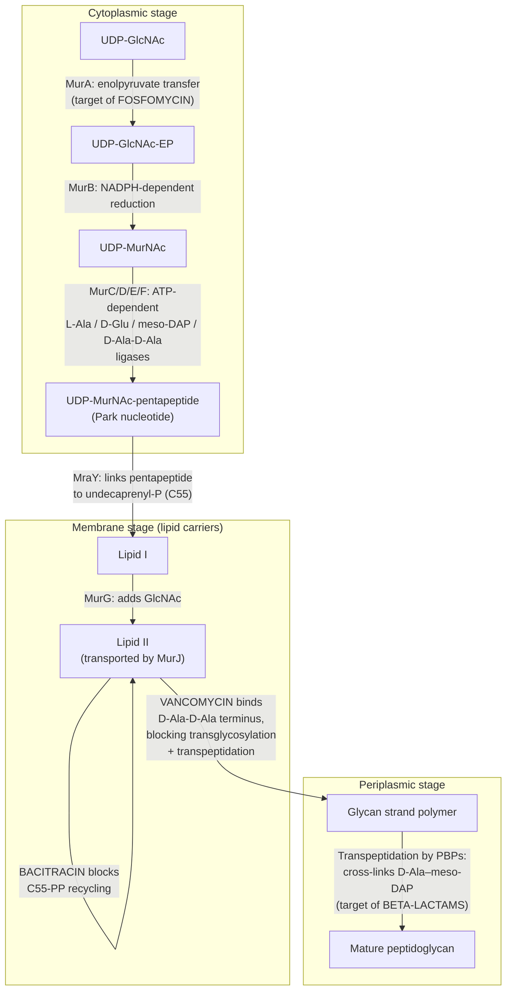
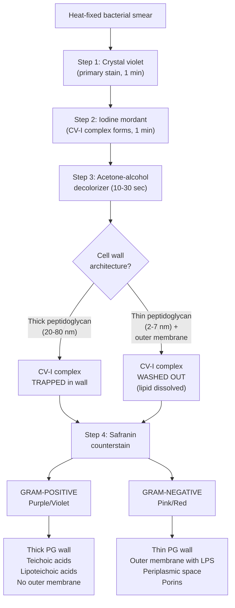
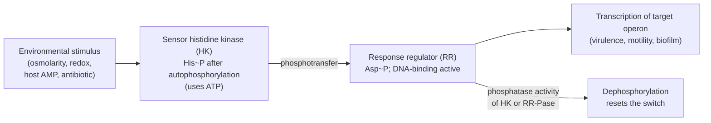
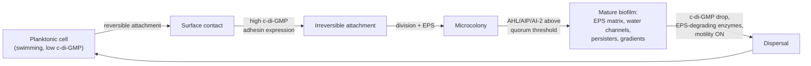
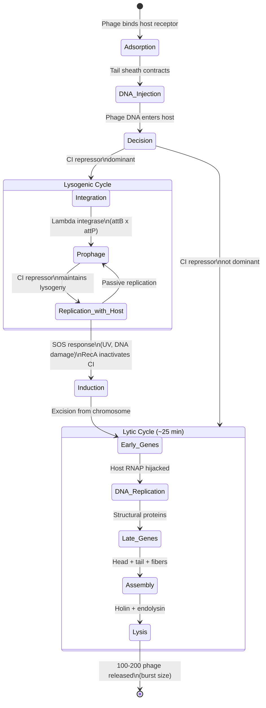
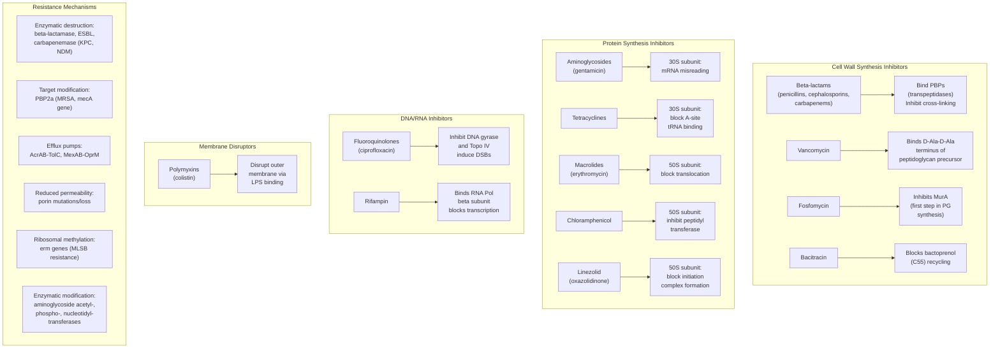
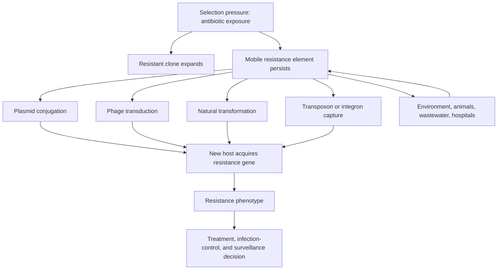
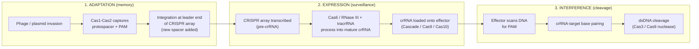
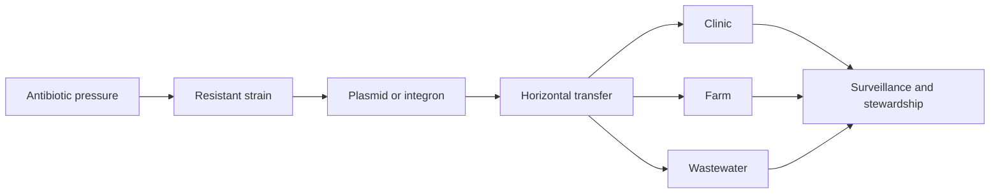

<!-- render:skip-beamer -->

# Bacteria, Archaea, and Viruses

\label{sec:unit_VII_bacteria_archaea_viruses}


<!-- chapter-metadata-badge -->
> **Ch 22** · Level 2/3 · 65 min read · 75 min lecture · Prerequisites: \cref{sec:unit_II_cell_structure}

## Learning Objectives

By the end of this chapter, you should be able to:

1. Compare the three domains \citep{woese1977} of life and explain how rRNA phylogeny established the Bacteria-[**Archaea**](#gl:archaea)-Eukarya classification.
2. Describe bacterial cell structure including peptidoglycan architecture, Gram staining outcomes, and the clinical significance of LPS.
3. Trace the **peptidoglycan biosynthesis pathway** through MurA-MurF, lipid I, and lipid II, identifying the antibiotic targeting each step and the resistance mechanism that defeats it.
4. Classify bacteria by morphology, arrangement, and metabolic type, and identify major pathogenic groups.
5. Explain horizontal [**gene**](#gl:gene) transfer mechanisms (transformation, transduction, conjugation) and their role in bacterial evolution and antibiotic resistance \citep{lawrence1998}.
6. Describe **two-component signal transduction**, **biofilm** formation, and **quorum sensing** as the molecular basis of bacterial sociality, and link them to chronic infections and device-associated disease.
7. Distinguish Archaea from Bacteria at the molecular level, including ether-linked isoprenoid lipids and tetraether monolayers, and describe the significance of Asgard archaea for eukaryotic origins.
8. Compare the Baltimore classification of viruses, contrast lytic and lysogenic cycles, and describe the HIV life cycle and its drug targets.
9. Explain CRISPR-Cas as a bacterial adaptive immune system, compare Types I/II/III, and assess **phage therapy** as a clinical alternative to antibiotics.
10. Apply the bacterial growth equation $N(t) = N_0 \cdot 2^{t/t_d}$ to predict cell densities from generation time and infer doubling time from optical-density data.

<!-- curriculum-scaffold-start -->
### Study Blueprint

- **Big idea:** Microbial diversity reflects different cell architectures, genomes, metabolisms, and evolutionary histories.
- **Core concepts:** prokaryotic structure, archaea, viruses, horizontal gene transfer.
- **Framework alignment:** Vision & Change: Evolution, Systems, Structure and function; AP Biology: Evolution, Systems Interactions; NGSS-style topics: Structure and Function, Interdependent Relationships in Ecosystems.
- **Model or quantitative lens:** Growth-rate, genome-size, and dilution calculations.
- **Data skill:** Interpret microbial observations from growth, sequence, or structural evidence.
- **Practice cadence:** Questions and Methods, Representing and Describing Data, Argumentation.
- **Common misconception to repair:** Viruses are not simply tiny bacteria; they use fundamentally different replication logic.
- **Primary lab:** \cref{sec:lab_unit_VII_bacteria_archaea_viruses}.
- **Question bank:** \cref{sec:q_unit_VII_bacteria_archaea_viruses}.
- **Transfer task:** Apply microbial diversity reasoning to antibiotics, biotechnology, ecology, and outbreaks.
- **Bridge to computation:** `biology.microbiology.microbiology.bacterial_growth_curve`.
<!-- curriculum-scaffold-end -->

---

> **Opening Vignette — The Rebel Biologist Who Turned Bacteria into [**Organelle**](#gl:organelle)s**
> 
> In 1966, Lynn Margulis — an unknown 28-year-old junior faculty member at Boston University — submitted a paper proposing that mitochondria and [**chloroplast**](#gl:chloroplast)s were once free-living bacteria engulfed by a host cell \citep{margulis1967}. The serial [**endosymbiosis**](#gl:endosymbiosis) hypothesis was rejected by more than fifteen journals before *Journal of Theoretical Biology* finally published it. Her evidence: the matching size and [**ribosome**](#gl:ribosome) type of mitochondria and bacteria, their independent division by binary fission, and the circular DNA they share with prokaryotes. When molecular sequencing arrived in the 1970s, it confirmed everything — mitochondria are phylogenetically embedded within the α-Proteobacteria, and chloroplasts within the Cyanobacteria. Margulis had been completely right. The bacterial origin of eukaryotic organelles is now foundational to cell biology, and stands as one of the most important corrections to the naive view that bacteria are too simple to matter for complex life.

## Bacteria -- Domain Overview and Cell Structure


\begin{figure}[htbp]
\centering
\includegraphics[width=0.85\textwidth]{../figures/bacterial_growth.png}
\caption{Bacterial growth curve: four phases (lag, exponential, stationary, death) plotted as $\log(\text{cell number})$ versus time.}
\label{fig:unit_VII_bacterial_growth}
\end{figure}
<!-- alt: Semi-log plot of bacterial cell number (log y-axis) against time (x-axis), showing four distinct phases: flat lag phase, linear exponential growth, plateau at stationary phase, and declining death phase. -->


### The Three Domains of Life

In 1977, Carl Woese and George Fox revolutionized our understanding of life's diversity by analyzing ribosomal RNA (rRNA) sequences across organisms \citep{woese1977}. Their phylogenetic analysis revealed that life comprises three fundamental domains: **Bacteria**, **Archaea**, and **Eukarya**. This replaced the older five-kingdom system that had grouped bacteria and archaea together as "Monera."

The 16S rRNA gene (in prokaryotes) and 18S rRNA gene (in [**eukaryote**](#gl:eukaryote)s) serve as molecular chronometers because they are:

- Almost universally present in most cellular life
- Functionally constrained (slow evolutionary rate in conserved regions)
- Sufficiently variable in hypervariable regions (V1-V9) for taxonomic resolution
- Rarely subject to horizontal gene transfer

### Prokaryotic Cell Features

Bacteria and Archaea share the prokaryotic cell plan, which differs fundamentally from the eukaryotic organization:

| Feature | Prokaryotes | Eukaryotes |
|---------|-------------|------------|
| Nucleus | No membrane-bound nucleus; nucleoid region | Membrane-bound nucleus with nuclear pores |
| Ribosomes | 70S (30S + 50S subunits) | 80S (40S + 60S subunits) |
| [**Chromosome**](#gl:chromosome) | Typically circular; nucleoid-associated [**protein**](#gl:protein)s (HU, H-NS, IHF) | Linear chromosomes; [**histone**](#gl:histone) octamer packaging |
| Cell division | Binary fission (FtsZ ring) | [**Mitosis**](#gl:mitosis) with spindle apparatus |
| Internal membranes | Rare (thylakoids in cyanobacteria) | Extensive endomembrane system |
| Flagella | Proton motive force-driven rotation (not ATP) | Dynein-powered 9+2 microtubule arrangement |

The bacterial flagellum is a remarkable molecular machine. Unlike eukaryotic flagella, which bend in a wave-like motion powered by ATP-dependent dynein motors, the bacterial flagellum rotates like a propeller. The basal body contains a rotary motor driven by the proton motive force (or Na$^+$ gradient in some marine species), spinning at up to 1,700 revolutions per second in some species. The flagellar motor can reverse direction, enabling the "run and tumble" chemotaxis behavior in *E. coli*.

### Bacterial Cell Wall: Peptidoglycan

The bacterial cell wall is composed of **peptidoglycan** (also called murein), a mesh-like polymer unique to bacteria. Its structure consists of:

- **Glycan strands**: Alternating units of N-acetylglucosamine (NAG) and N-acetylmuramic acid (NAM) linked by β-1,4 glycosidic bonds
- **Tetrapeptide side chains**: Attached to NAM; typically L-Ala -- D-Glu -- meso-DAP (or L-Lys) -- D-Ala
- **Cross-links**: Peptide bridges connecting adjacent glycan strands, catalyzed by transpeptidases (penicillin-binding proteins, PBPs)

The presence of **D-amino acids** (D-glutamate, D-alanine) is unusual in biology -- most proteins use exclusively L-amino acids. D-amino acids confer resistance to host proteases, which evolved to cleave L-amino acid [**peptide bond**](#gl:peptide-bond)s.

### Peptidoglycan Biosynthesis: A Step-by-Step Antibiotic Atlas

Peptidoglycan biosynthesis proceeds in three spatial compartments — cytoplasm, inner-membrane interface, and periplasm — and nearly every step has a clinically deployed antibiotic that targets it. Understanding the pathway is therefore equivalent to understanding the chemotherapy of bacterial infection. The pathway begins with the housekeeping sugar **UDP-N-acetylglucosamine (UDP-GlcNAc)** and ends with a covalently cross-linked sacculus surrounding the entire cell.


<!-- alt: Flowchart showing cytoplasm-to-periplasm peptidoglycan biosynthesis with five major antibiotic targets — fosfomycin (MurA), D-cycloserine (D-Ala–D-Ala ligase / Alr), bacitracin (C55 carrier recycling), vancomycin (D-Ala–D-Ala terminus of Lipid II), and β-lactams (PBP transpeptidation). -->

*Cytoplasm-to-periplasm peptidoglycan biosynthesis with five major antibiotic targets — fosfomycin (MurA), D-cycloserine (D-Ala–D-Ala ligase / Alr), bacitracin (C55 carrier recycling), vancomycin (D-Ala–D-Ala terminus of Lipid II), and β-lactams (PBP transpeptidation).*

| Step | Enzyme / process | Drug | Mechanism of inhibition | Spectrum |
|------|------------------|------|-------------------------|----------|
| 1 | MurA (UDP-GlcNAc enolpyruvyl transferase) | **Fosfomycin** | Phosphoenolpyruvate analog; covalently inhibits MurA active-site Cys via epoxide ring opening | Broad (UTIs, *E. coli*, *Enterococcus*) |
| 2 | MurB (UDP-GlcNAc-EP reductase) | (No clinical drug; preclinical leads) | Reduces enolpyruvyl ether to D-lactate | — |
| 3 | MurC, MurD, MurE, MurF (amino-acid ligases) | (Preclinical pyrazolopyrimidines, hydrazides) | Block ATP-dependent ligation of L-Ala, D-Glu, meso-DAP/L-Lys, and D-Ala–D-Ala | Investigational |
| 4 | Alr / Ddl (D-Ala racemase, D-Ala-D-Ala ligase) | **D-cycloserine** | D-Ala structural analog; covalently traps both racemase and ligase active-site residues | Anti-TB (second-line) |
| 5 | MraY (phospho-MurNAc-pentapeptide translocase) | **Tunicamycin** (research primarily); muraymycins (preclinical) | Blocks attachment of pentapeptide to C55 lipid carrier (Lipid I formation) | Toxic to humans (also blocks N-glycosylation) |
| 6 | MurG (UDP-GlcNAc:Lipid I GlcNAc transferase) | (Preclinical) | Blocks Lipid I → Lipid II conversion | Investigational |
| 7 | C55-PP recycling (BacA/UppP phosphatase) | **Bacitracin** | Sequesters undecaprenyl-pyrophosphate, blocking dephosphorylation; bactoprenol pool exhausted | Topical (Gram-positive) |
| 8 | Lipid II flipping (MurJ flippase) | **Lysobactin** family (preclinical) | Trap Lipid II in cytoplasm | Investigational |
| 9 | Lipid II (D-Ala-D-Ala terminus) | **Vancomycin, teicoplanin, dalbavancin, oritavancin** | Glycopeptide H-bonds to D-Ala-D-Ala; sterically blocks PBP access and transglycosylation | MRSA, *C. difficile*, VRE-susceptible enterococci |
| 10 | Transglycosylation + transpeptidation by PBPs | **Penicillins, cephalosporins, carbapenems, monobactams** | β-lactam ring acylates PBP active-site serine (suicide substrate; mimics D-Ala–D-Ala) | Broad |
| 11 | Lipid II / membrane | **Daptomycin** (membrane), **lipoglycopeptides**, **nisin** (lantibiotic) | Bind Lipid II / depolarize membrane | MRSA, VRE |

**Resistance recapitulates the pathway.** Each drug elicits a corresponding resistance trick: VanA-type vancomycin resistance in enterococci (VRE) replaces D-Ala-D-Ala with D-Ala-D-Lac, abolishing one of the five hydrogen bonds that vancomycin exploits (≥ 1000-fold MIC increase; the binding free-energy loss is ~12 kJ/mol per H-bond); MRSA expresses **PBP2a** (encoded by *mecA*) with low β-lactam affinity (K$_i$ rises ~ 1000×); β-lactamases hydrolyse the β-lactam ring before it reaches its PBP target, with extended-spectrum β-lactamases (ESBLs) and carbapenemases (KPC, NDM, OXA-48) progressively defeating each new generation of β-lactams. The pathway thus serves as a unifying framework — biosynthetic step, drug, and resistance mechanism are three views of the same chemistry.

> **Clinical Connection: Why Vancomycin Stopped Working — and How Daptomycin Took Over**
> Vancomycin was introduced in 1958 and remained dependable for almost 30 years. The first VRE isolates appeared in 1986–1988 in European and US hospitals, driven by agricultural use of avoparcin (a glycopeptide growth promoter in livestock); by the early 2000s VRE had spread globally. The molecular trick is elegant: a single ester linkage (D-Ala-D-Lac instead of the D-Ala-D-Ala amide) costs the bacterium nothing but eliminates one of the five H-bonds anchoring vancomycin. Daptomycin (FDA-approved 2003) bypasses the resistance entirely — it inserts into the cell membrane in a Ca$^{2+}$-dependent manner, depolarising it without requiring a peptidoglycan binding site. Daptomycin resistance is now emerging too (mprF and yycG mutations alter membrane charge), continuing the arms race.

### Gram Staining: The Foundational Diagnostic Test

The [**Gram stain**](#gl:gram-stain), developed by Hans Christian Gram in 1884, remains the single most important initial test in clinical microbiology. The procedure exploits differences in cell wall architecture:


<!-- alt: Flowchart showing gram-stain decision tree producing purple (Gram-positive) versus pink (Gram-negative) results from differences in peptidoglycan thickness and outer-membrane architecture. -->

*Gram-stain decision tree producing purple (Gram-positive) versus pink (Gram-negative) results from differences in peptidoglycan thickness and outer-membrane architecture.*

- **Lipid A**: The toxic moiety; embedded in the outer membrane; activates TLR4 on innate immune cells
- **Core oligosaccharide**: Short sugar chain linking Lipid A to the O-antigen
- **O-antigen**: Variable polysaccharide extending outward; serotype-specific; target of antibodies

When Gram-negative bacteria lyse during infection, released LPS triggers massive innate immune activation through the TLR4-MD2 receptor complex. This can lead to a cytokine cascade (TNF-α, IL-1β, IL-6), systemic inflammation, disseminated intravascular coagulation (DIC), and septic shock -- a life-threatening condition with mortality rates of 30-50%.

> **Clinical Connection: Gram Staining in Diagnosis**
> The Gram stain is typically the first test performed on clinical specimens (blood cultures, cerebrospinal fluid, sputum). Results within 15 minutes guide empirical antibiotic therapy before culture results are available (24-72 hours). For bacterial meningitis, Gram-positive diplococci suggest *Streptococcus pneumoniae* (treat with ceftriaxone + vancomycin), while Gram-negative diplococci suggest *Neisseria meningitidis* (treat with ceftriaxone alone). This rapid distinction can be life-saving in an emergency where hours matter.

> **Concept Check 1:**
> A novel bacterium is isolated from a deep-sea hydrothermal vent. Gram staining produces a pink result. Predict the cell wall architecture and explain why the alcohol decolorization step removed the crystal violet-iodine complex from this organism.

> **Concept Check 1b:**
> A clinical microbiology lab tests a bacterial isolate against six wall-targeted antibiotics. The isolate is resistant to vancomycin (MIC > 256 μg/mL) but susceptible to ampicillin, fosfomycin, and bacitracin. Sequencing reveals a *vanA* operon. Using the peptidoglycan biosynthesis pathway, explain (a) which step is altered, (b) why vancomycin fails, and (c) why ampicillin still works.

> **Concept Check 1c:**
> Fosfomycin is a phosphoenolpyruvate (PEP) analog that covalently inactivates MurA. *Pseudomonas aeruginosa* is intrinsically resistant to fosfomycin despite having a functional MurA. Hypothesise two non-target-based resistance mechanisms (think about how the drug enters the cell) and propose an experiment using a *P. aeruginosa* MurA-knockout complemented with the *E. coli* allele to test whether MurA is responsible.

---

## Bacterial Diversity and Metabolic Types

### Morphology and Arrangement

Bacterial cells exhibit characteristic shapes that aid in identification:

| Shape | Description | Examples |
|-------|-------------|----------|
| Coccus | Spherical | *Staphylococcus aureus*, *Streptococcus pyogenes* |
| Bacillus | Rod-shaped | *Escherichia coli*, *Bacillus subtilis* |
| Spirillum | Rigid spiral | *Campylobacter jejuni*, *Helicobacter pylori* |
| Spirochete | Flexible helix with axial filaments | *Treponema pallidum*, *Borrelia burgdorferi* |
| Vibrio | Comma-shaped | *Vibrio cholerae*, *Vibrio parahaemolyticus* |
| Pleomorphic | Variable shape | *Mycoplasma pneumoniae* (no cell wall) |

Cell arrangements reflect division plane and post-division adhesion patterns:

- **Diplo-** (pairs): *Diplococcus*, *Neisseria*
- **Strepto-** (chains): *Streptococcus* -- divides in one plane, cells remain attached
- **Staphylo-** (grape-like clusters): *Staphylococcus* -- divides in multiple planes
- **Tetrad** (groups of 4): *Micrococcus* -- divides in two perpendicular planes
- **Sarcina** (cuboidal packets of 8): *Sarcina ventriculi* -- divides in three planes

### Metabolic Diversity

Bacteria exhibit unparalleled metabolic diversity -- far exceeding that of eukaryotes combined. This diversity is classified by energy source (photo- vs chemo-) and carbon source (auto- vs hetero-):

**Photoautotrophs** use light energy to fix CO$_2$:

- *Cyanobacteria* (oxygenic [**photosynthesis**](#gl:photosynthesis)): Use water as electron donor; produce O$_2$; responsible for the Great Oxidation Event (~2.4 Ga); ancestors of chloroplasts
- Purple and green sulfur bacteria (anoxygenic): Use H$_2$S or S$^0$ as electron donor; no O$_2$ production; bacteriochlorophyll absorbs at longer wavelengths (800-1050 nm)

**Chemoautotrophs (lithotrophs)** derive energy from inorganic chemical oxidation:

- *Nitrosomonas*: NH$_3$ -> NO$_2^-$ (ammonia oxidation; [**nitrification**](#gl:nitrification) step 1)
- *Nitrobacter*: NO$_2^-$ -> NO$_3^-$ (nitrite oxidation; nitrification step 2)
- *Thiobacillus*: S$^0$ -> SO$_4^{2-}$ (sulfur oxidation)
- *Acidithiobacillus ferrooxidans*: Fe$^{2+}$ -> Fe$^{3+}$ (iron oxidation; used industrially in bioleaching of copper and gold ores)

**Heterotrophs** (the vast majority) obtain carbon from organic compounds. They are further classified by oxygen relationship:

| Type | O$_2$ Requirement | Example |
|------|-------------------|---------|
| Obligate aerobe | Requires O$_2$ | *Mycobacterium tuberculosis* |
| Obligate anaerobe | Killed by O$_2$ | *Clostridium botulinum* |
| Facultative anaerobe | Grows with or without O$_2$ | *Escherichia coli* |
| Aerotolerant anaerobe | Does not use O$_2$ but tolerates it | *Lactobacillus* |
| Microaerophilic | Requires low O$_2$ (2-10%) | *Campylobacter jejuni*, *Helicobacter pylori* |

### Major Pathogenic Groups

| Phylum | Key Pathogens | Gram Stain | Clinical Significance |
|--------|---------------|------------|----------------------|
| Proteobacteria | *E. coli*, *Salmonella*, *Helicobacter*, *Vibrio*, *Neisseria*, *Pseudomonas* | Gram-negative | UTIs, enteric infections, peptic ulcers, cholera, meningitis, nosocomial infections |
| Firmicutes | *Streptococcus*, *Staphylococcus*, *Clostridium*, *Enterococcus* | Gram-positive | Pharyngitis, skin infections, tetanus, botulism, hospital-acquired infections |
| Actinobacteria | *Mycobacterium tuberculosis*, *M. leprae*, *Corynebacterium* | Gram-positive (acid-fast) | Tuberculosis, leprosy, diphtheria |
| Spirochaetes | *Treponema pallidum*, *Borrelia burgdorferi*, *Leptospira* | Poorly staining | Syphilis, Lyme disease, leptospirosis |

*Mycobacterium* species deserve special mention: their cell walls contain **mycolic acids** -- long-chain ($C_{60}$-$C_{90}$) branched fatty acids that form a waxy, hydrophobic barrier. This barrier makes them resistant to Gram staining (they are classified as **acid-fast** bacteria, stained with the Ziehl-Neelsen method using carbol fuchsin), resistant to many antibiotics, and resistant to desiccation -- contributing to *M. tuberculosis* survival in aerosolized droplet nuclei for hours.

> **Concept Check 2:**
> *Helicobacter pylori* \citep{marshall1984} is a microaerophilic, spiral-shaped, Gram-negative bacterium that colonizes the human stomach. Explain how its oxygen requirement and morphology are adaptive for its ecological [**niche**](#gl:niche), and predict what would happen if you tried to culture it under standard [**aerobic**](#gl:aerobic) conditions on a typical agar plate.

---

## Bacterial Genetics, Signalling and Sociality

### Binary Fission

Bacteria reproduce asexually by binary fission: the circular chromosome is replicated bidirectionally from a single origin of replication (*oriC*), the cell elongates, a septum forms at mid-cell (coordinated by the FtsZ ring -- a tubulin homolog), and two daughter cells separate. Generation times vary enormously:

- *Escherichia coli*: ~20 minutes under optimal conditions (37 degrees C, rich media)
- *Mycobacterium tuberculosis*: 12-24 hours (contributing to slow disease progression and prolonged treatment)
- *Treponema pallidum*: ~33 hours (cannot be cultured in vitro)

Population growth during exponential phase follows the **bacterial growth equation**:

\begin{equation}
N(t) = N_0 \cdot 2^{t/t_d}
\label{eq:unit_VII_bacterial_growth}
\end{equation}

where $N_0$ is the initial population, $t$ is time, and $t_d$ is the doubling (generation) time. Equivalently, the natural-log form $\ln N(t) = \ln N_0 + \mu t$ with $\mu = (\ln 2)/t_d$ (the **specific growth rate**, units of $\text{time}^{-1}$) gives a linear plot of $\ln N$ versus $t$ during exponential phase, whose slope is the experimentally measured μ.

*(Note: the exponent $t/t_d$ is often represented as $n$, the number of generations).*

### Worked Example: Calculating Bacterial Growth

**Problem:**
A microbiologist inoculates a broth with $N_0 = 100$ cells of *Vibrio natriegens*, which has a generation time of $t_d = 15$ minutes under optimal conditions. Assuming the culture immediately enters the exponential growth phase and maintains it without nutrient depletion, how many cells will be present after 2 hours?

**Solution:**

1. **Calculate the total time ($t$) in consistent units:**
   $$ t = 2 \text{ hours} = 120 \text{ minutes}  \label{eq:unit_VII_bacteria_archaea_viruses_item_1}$$


2. **Calculate the number of generations ($n$):**
   $$ n = \frac{t}{t_d} = \frac{120}{15} = 8 \text{ generations}  \label{eq:unit_VII_bacteria_archaea_viruses_item_2}$$


3. **Calculate the final population size $N(t)$ from \cref{eq:unit_VII_bacterial_growth}:**
   $$ N(t) = 100 \cdot 2^8  \label{eq:unit_VII_bacteria_archaea_viruses_item_3}$$

   $$ N(t) = 100 \cdot 256 = 25,600 \text{ cells}  \label{eq:unit_VII_bacteria_archaea_viruses_item_4}$$

   
After 2 hours, the population will reach **25,600 cells**. The rapid doubling of bacteria means that even a small initial inoculum can quickly reach high densities in favorable environments. After 4 hours (16 generations), the same culture would reach $\approx 6.5 \times 10^6$ cells; after 6 hours (24 generations), $\approx 1.7 \times 10^9$ cells — at which point nutrient limitation forces the culture into stationary phase.

### Worked Example: Inferring Generation Time from an OD Growth Curve

**Problem:**
A microbiology student grows *E. coli* in LB broth at 37 °C and reads optical density at 600 nm ($\mathrm{OD}_{600}$) every 30 minutes:

| Time (min) | 0 | 30 | 60 | 90 | 120 | 150 |
|------------|---|----|----|----|-----|-----|
| $\mathrm{OD}_{600}$ | 0.05 | 0.10 | 0.20 | 0.40 | 0.80 | 1.60 |

Estimate the generation time $t_d$ during exponential growth.

**Solution:**

During exponential phase, $\mathrm{OD}_{600}$ is proportional to cell density, so $\mathrm{OD}(t) = \mathrm{OD}_0 \cdot 2^{t/t_d}$. Take the natural log of both sides:

$$ \ln \mathrm{OD}(t) = \ln \mathrm{OD}_0 + \frac{t}{t_d}\ln 2  \label{eq:unit_VII_bacteria_archaea_viruses_item_5}$$


A plot of $\ln \mathrm{OD}$ versus $t$ has slope $\mu = (\ln 2)/t_d$. Using the first and last points,

$$ \mu = \frac{\ln(1.60) - \ln(0.05)}{150 - 0} = \frac{0.470 - (-2.996)}{150} = \frac{3.466}{150} \approx 0.0231\ \mathrm{min}^{-1}.  \label{eq:unit_VII_bacteria_archaea_viruses_item_6}$$


Therefore,

$$ t_d = \frac{\ln 2}{\mu} = \frac{0.693}{0.0231} \approx 30\ \mathrm{minutes}.  \label{eq:unit_VII_bacteria_archaea_viruses_item_7}$$


The doubling time is **about 30 minutes**, consistent with rich-media growth at 37 °C. Inspection of the table confirms the answer: $\mathrm{OD}_{600}$ doubles every 30 min from $t = 30$ onwards. Real growth curves deviate at the extremes (lag at the start, stationary plateau at the end), as the full four-phase curve in \cref{fig:unit_VII_bacterial_growth} shows; the linear-on-log-plot region is the main window where $t_d$ is well defined.

### Horizontal Gene Transfer

While binary fission produces clonal offspring, **horizontal gene transfer (HGT)** is the major driver of bacterial evolution and genetic diversity \citep{lawrence1998}. Three mechanisms operate:

**Transformation** involves the uptake of naked DNA from the environment. Some species are naturally competent -- they express surface proteins that bind, import, and integrate exogenous DNA. *Streptococcus pneumoniae* was the organism in Griffith's famous 1928 experiment demonstrating transformation (the "transforming principle," later identified as DNA by Avery, MacLeod, and McCarty in 1944). In molecular biology, artificial competence is induced by treating *E. coli* with CaCl$_2$ and heat shock (42 degrees C for 45 seconds), which transiently increases membrane permeability.

**Transduction** is phage-mediated DNA transfer between bacteria:

- *Generalized transduction*: During lytic replication, bacterial DNA fragments are accidentally packaged into phage capsids instead of phage DNA. These defective phage particles inject bacterial DNA into new host cells, where it can recombine into the chromosome.
- *Specialized transduction*: A lysogenic phage (e.g., bacteriophage λ) excises imprecisely from the host chromosome, carrying flanking bacterial genes (*gal* or *bio* genes flanking the λ *attB* site). These hybrid phage particles transduce specific genes at high frequency.

**Conjugation** requires direct cell-to-cell contact via a sex pilus encoded by the **F factor** (fertility [**plasmid**](#gl:plasmid)). The F$^+$ donor cell extends an F pilus that contacts an F$^-$ recipient, retracting to bring cells together. A single strand of the F plasmid is transferred and replicated in the recipient, converting it to F$^+$. When the F factor integrates into the chromosome, the cell becomes **Hfr** (high frequency [**recombination**](#gl:recombination)), and conjugation can transfer chromosomal genes to the recipient at high frequency.

**R-factor plasmids** (resistance plasmids) carry multiple antibiotic resistance genes and are transferred by conjugation -- this is the primary mechanism by which antibiotic resistance spreads among bacterial populations, including between different species.

### Plasmids and Mobile Genetic Elements

| Plasmid Type | Example | Significance |
|--------------|---------|--------------|
| R-plasmids | NDM-1 (New Delhi metallo-β-lactamase) | Carbapenem resistance; global spread |
| [**Virulence**](#gl:virulence) plasmids | pINV (*Shigella*) | Encode invasion machinery |
| Ti plasmid | *Agrobacterium tumefaciens* | Crown gall disease; used in plant biotechnology for gene transfer |
| Col plasmids | ColE1 | Encode bacteriocins (antimicrobial peptides) |
| Metabolic plasmids | TOL (*Pseudomonas putida*) | Toluene degradation; bioremediation |

**Transposons** (mobile genetic elements) contribute to [**genome**](#gl:genome) plasticity. Insertion sequences (IS elements) are the simplest, encoding primarily transposase flanked by inverted repeats. Composite transposons (e.g., Tn3 carrying ampicillin resistance) consist of a resistance gene flanked by IS elements. Transposons can "jump" between chromosome and plasmid, facilitating the assembly of multi-drug resistance cassettes.

### Two-Component Signal Transduction

Bacteria sense their environment through ubiquitous **two-component systems (TCS)** — the prokaryotic equivalent of receptor-tyrosine-kinase + transcription-factor cascades in eukaryotes. Each system is built from just two proteins:

1. A membrane-anchored **sensor histidine kinase** (HK) with an extracellular sensing domain and a cytoplasmic kinase domain. Stimulus binding induces ATP-dependent **autophosphorylation** of a conserved histidine residue in the HK dimer (the phosphate is transferred from the γ-phosphate of ATP to the imidazole nitrogen of the histidine sidechain — a high-energy phospho-amide bond, $\Delta G \approx -50$ kJ/mol on hydrolysis).
2. A cytoplasmic **response regulator** (RR) with a receiver domain and an output (usually DNA-binding) domain. The HK transfers its phosphate to a conserved aspartate on the RR (a phospho-anhydride; faster hydrolysis kinetics, $t_{1/2} \sim$ seconds to minutes), activating it as a transcription factor (or, less commonly, as an enzyme or motor regulator).


<!-- alt: Flowchart showing two-component signal transduction. Stimulus → HK autophosphorylation on histidine → phosphotransfer to RR aspartate → DNA binding and gene regulation; intrinsic phosphatase activity resets the system. -->

*Two-component signal transduction. Stimulus → HK autophosphorylation on histidine → phosphotransfer to RR aspartate → DNA binding and gene regulation; intrinsic phosphatase activity resets the system.*

The two-component circuit is therefore a **molecular switch** with three states (off / phosphorylated / phosphatase-reset), tunable by the relative kinase versus phosphatase activities of the HK. Some HKs ("classical" HKs like EnvZ and PhoQ) act as kinase under stimulus and phosphatase otherwise — a single protein computing both ON and OFF, with the stimulus ratio shifting the equilibrium. This bifunctionality makes the steady-state level of RR~P a near-linear readout of the input — exactly what is wanted for analog signal processing inside a cell.

| Two-component system | Stimulus | Output | Clinical/biological significance |
|----------------------|----------|--------|----------------------------------|
| **EnvZ–OmpR** (*E. coli*) | Osmolarity | Switches porin expression OmpC ↔ OmpF | Outer-membrane permeability; β-lactam entry |
| **PhoQ–PhoP** (*Salmonella*) | Low Mg²⁺, antimicrobial peptides, low pH (phagosome) | Lipid A modification; *pmrHFIJKLM* | Resistance to host defensins and polymyxins |
| **AgrC–AgrA** (*S. aureus*) | Autoinducing peptide AIP (quorum) | RNAIII; toxin production | Switches biofilm OFF, virulence ON |
| **VraS–VraR** (*S. aureus*) | Cell-wall stress (β-lactams, vancomycin) | Cell-wall stimulon | Vancomycin tolerance |
| **CheA–CheY** (chemotaxis) | Attractants/repellents | Flagellar motor switching (CW ↔ CCW) | Run-and-tumble swimming |
| **WalK–WalR** (*B. subtilis*, *S. aureus*) | Cell-wall integrity | Autolysin and PG-synthesis genes | Essential — drug target lead |

Key features that make TCSs central to bacterial biology: they are **modular** (HKs and RRs from one organism often work with components from another), they are **fast** (sub-second response), and there are **typically 30–80 systems per genome**, allowing combinatorial integration of many environmental signals. The minimal *Mycoplasma genitalium* genome has 0 TCSs (it lives in a stable host environment); free-living soil bacteria like *Myxococcus xanthus* encode > 100. Several recent antibacterial leads (e.g., walkmycin against the WalK kinase, an essential cell-wall TCS) target HKs precisely because they are absent from human cells.

### Biofilms and Quorum Sensing

Most bacteria in nature do not live as solitary planktonic cells; they live in **biofilms** — surface-attached, matrix-encased communities that behave more like a tissue than a free-swimming population. Biofilm formation proceeds through a stereotyped life cycle, coordinated by **quorum sensing (QS)** — cell-density-dependent communication via diffusible **autoinducers** (AHLs in Gram-negatives, AIPs in Gram-positives, AI-2 across species).


<!-- alt: Flowchart showing biofilm life cycle from planktonic cell through reversible/irreversible attachment, microcolony, mature biofilm, and quorum-triggered dispersal — coordinated by intracellular c-di-GMP and intercellular autoinducers. -->

*Biofilm life cycle from planktonic cell through reversible/irreversible attachment, microcolony, mature biofilm, and quorum-triggered dispersal — coordinated by intracellular c-di-GMP and intercellular autoinducers.*

- **Exopolysaccharides** (PIA in *S. aureus*; alginate, Pel, Psl in *P. aeruginosa*; cellulose and PNAG in enterics) — provide structural cohesion and protection.
- **Extracellular DNA (eDNA)** — released by autolysis; a major load-bearing component and a substrate for horizontal gene transfer at frequencies up to 1000× higher than in planktonic cells.
- **Matrix proteins** — amyloid-like curli fibres (*E. coli*), Bap proteins, type IV pili.
- **Lipids and outer-membrane vesicles** — concentrate hydrolytic enzymes and signalling molecules.

**Quorum sensing molecules.**

| QS class | Signal molecule | Producers | Receptor | Output |
|----------|-----------------|-----------|----------|--------|
| **AHLs** | N-acyl-homoserine-lactones (e.g., 3-oxo-C₁₂-HSL) | Gram-negatives (*P. aeruginosa* LasI/LasR, *V. fischeri* LuxI/LuxR) | LuxR-family TF | Bioluminescence, virulence, biofilm |
| **AIPs** | Cyclic autoinducing peptides (5–10 aa, thiolactone bridge) | Gram-positives (*S. aureus* Agr, *S. pneumoniae* ComD) | Membrane HK (TCS) | Virulence/biofilm switch |
| **AI-2** | Furanosyl-borate diester (LuxS) | Cross-species | LuxP/LsrB | Inter-species coordination |
| **PQS** | Pseudomonas quinolone signal (2-heptyl-3-hydroxy-4-quinolone) | *P. aeruginosa* | PqsR | Iron acquisition, virulence |
| **DSF** | cis-2-unsaturated fatty acids | *Xanthomonas*, *Burkholderia* | RpfC HK | Biofilm dispersal, virulence |

**Why biofilms matter clinically.** The CDC estimates that **~65–80 % of chronic and device-associated human infections involve biofilms**. They are 10–1000× more antibiotic tolerant than planktonic cells because of (1) reduced antibiotic penetration through EPS — vancomycin diffusion can be retarded by 100×; (2) **persister cells** — metabolically dormant subpopulations not killed by growth-dependent antibiotics, comprising 0.001–1 % of biofilm cells; (3) localised enzyme accumulation (e.g., β-lactamase concentrated 100–1000× in matrix); and (4) anaerobic interior microenvironments where aminoglycosides (which require an electrochemical gradient for uptake) are inactive. Canonical clinical biofilms include cystic fibrosis lung infections (*P. aeruginosa* alginate biofilms), prosthetic joint and heart-valve infections (*S. aureus*, *S. epidermidis*), catheter-associated UTIs (*E. coli*, *P. mirabilis*), chronic wounds, and dental plaque (*Streptococcus*, *Porphyromonas*, *Fusobacterium*).

**Quorum quenching as therapy.** Because most virulence factors are quorum-regulated, blocking QS *attenuates* virulence without killing bacteria — sidestepping the strong selection for resistance that lytic antibiotics impose. Strategies include: **(1)** lactonases (AiiA from *Bacillus*, AhlD) and acylases that hydrolyse AHLs; **(2)** synthetic AIP analogs that competitively inhibit AgrC; **(3)** halogenated furanones (originally from the seaweed *Delisea pulchra*) that destabilise LuxR-family receptors; **(4)** PqsR antagonists (e.g., M64); **(5)** c-di-GMP signalling disruptors. Several are in early clinical trials (notably for *P. aeruginosa* in cystic fibrosis), though "anti-virulence" compounds face the challenge that they do not directly clear infection — they must work synergistically with antibiotics or host immunity.

### Endospores

Certain Firmicutes -- primarily *Bacillus* (central or subterminal spores) and *Clostridium* (terminal spores) -- produce **endospores** in response to nutrient depletion. The endospore is the most resistant biological structure known:

- **Core**: Dehydrated [**cytoplasm**](#gl:cytoplasm); calcium-dipicolinic acid complex stabilizes DNA; small acid-soluble spore proteins (SASPs) protect DNA from UV and desiccation
- **Resistance**: Survives boiling (100 degrees C), desiccation, UV radiation, and chemical disinfectants
- **Sterilization**: Requires autoclaving at 121 degrees C, 15 psi pressure, for 15-20 minutes
- **Germination**: Triggered by favorable conditions (nutrients, water); rapid return to vegetative growth

> **Clinical Connection: Endospores and Hospital Infection Control**
> *Clostridioides difficile* endospores persist on hospital surfaces for months, resisting alcohol-based hand sanitizers (which are effective against vegetative bacteria). Healthcare workers must use soap and water (physical removal) and bleach-based surface disinfectants to prevent *C. difficile* transmission. *Bacillus anthracis* spores were used as a bioterrorism agent in the 2001 U.S. anthrax letter attacks, contaminating postal facilities and requiring years of decontamination.

> **Concept Check 2b:**
> A research lab knocks out the *agrA* gene (response regulator of the Agr quorum-sensing TCS) in *S. aureus*. The mutant forms thicker, more persistent biofilms in vitro but is dramatically less virulent in a mouse skin-abscess model. Reconcile these two observations using the AgrA on/off switch between biofilm and toxin production.

> **Concept Check 2c:**
> A patient develops a *Pseudomonas aeruginosa* bloodstream infection following indwelling-catheter placement. Blood cultures show vancomycin-susceptible cells with MIC = 1 μg/mL, yet the patient fails 4 weeks of intravenous vancomycin while the catheter remains in place. Explain — using biofilm penetration kinetics, persister biology, and oxygen gradients — why the planktonic MIC is a poor predictor of clinical efficacy in catheter-associated infection. What therapeutic action almost typically succeeds where antibiotic monotherapy fails?

---

## Archaea

### Distinguishing Features

Archaea are prokaryotes that were long classified with bacteria but differ fundamentally at the molecular level:

| Feature | Bacteria | Archaea | Eukarya |
|---------|----------|---------|---------|
| Membrane lipids | Ester-linked fatty acids | **Ether-linked isoprenoid (phytanyl) chains**; some form tetraether monolayers | Ester-linked fatty acids |
| Cell wall | Peptidoglycan (murein) | **No peptidoglycan**; pseudomurein (methanogens), S-layer protein, or none | No peptidoglycan; cellulose/chitin in plants/fungi |
| RNA polymerase | Single, simple (4-5 subunits) | **Multiple subunits (12+), resembles eukaryotic Pol II** | Three RNA polymerases (Pol I, II, III) |
| Initiator tRNA | Formyl-methionine | **Methionine** (like eukaryotes) | Methionine |
| Histones | HU, H-NS (not true histones) | **True histone homologs** | Histone octamers (H2A, H2B, H3, H4) |
| [**Intron**](#gl:intron)s | Rare | Present in some tRNA genes | Abundant |

### Archaeal Lipid Biochemistry: Why Hot Vents Don't Melt Membranes

The single most diagnostic biochemical feature of Archaea is the architecture of their membrane lipids. Three differences from bacterial/eukaryotic phospholipids are simultaneously present, and most three contribute to extreme stability:

1. **Ether linkages** instead of ester linkages between glycerol and the hydrocarbon chains. Ether bonds (C–O–C) are far more chemically inert than ester bonds (C–O–C(=O)) — they resist acid hydrolysis, base hydrolysis, oxidation, and high-temperature cleavage.
2. **Isoprenoid (phytanyl) chains** (built from C5 isoprene units, with branched methyl groups every 4 carbons) instead of straight-chain fatty acids. Methyl branches cause kinks that prevent tight chain crystallization at low temperatures (preventing membrane gelling) while van-der-Waals interactions between branches stiffen the membrane against fluidization at high temperatures.
3. **Glycerol stereochemistry**: archaeal glycerol is *sn*-glycerol-1-phosphate (G-1-P); bacterial/eukaryotic glycerol is *sn*-glycerol-3-phosphate (G-3-P). The two are enantiomers — a deep, "lipid divide" between archaea and the rest of cellular life that probably reflects independent invention of phospholipid biosynthesis after the LUCA.

Hyperthermophilic archaea (*Sulfolobus*, *Thermococcus*, *Pyrodictium*) take this further by linking two phytanyl chains end-to-end, forming **glycerol-dialkyl-glycerol-tetraether (GDGT)** lipids. Two GDGT molecules then span the entire membrane as a **monolayer** (rather than a bilayer), with two glycerol headgroups (one on each surface) and one continuous hydrocarbon block in the middle. The covalent backbone makes the membrane behave mechanically like a single rigid sheet — it cannot delaminate, leak, or peel apart even at 113 °C.

Quantitatively: a typical bacterial membrane fluidizes (loses lipid order) above ~60 °C and disintegrates above ~100 °C; *Pyrodictium* GDGT monolayers retain integrity at 113 °C and pH 1, conditions that hydrolyse most ester-linked lipids in seconds. **Cyclopentane rings** within the GDGT chains can be added or removed on the fly to fine-tune membrane fluidity to growth temperature — a remarkable example of biochemical homeoviscous adaptation. Because eukaryotic and bacterial membranes lack these adaptations, penicillin-class and polymyxin-class antibiotics that act on bacterial cell envelopes are generally ineffective against archaea.

### Major Archaeal Groups

**Euryarchaeota** encompasses the broadest metabolic diversity:

- **Methanogens**: Strict anaerobes that produce methane as a metabolic end product. The key reaction is: $\text{CO}_2 + 4\text{H}_2 \rightarrow \text{CH}_4 + 2\text{H}_2\text{O}$. Methanogens inhabit [**anaerobic**](#gl:anaerobic) environments including wetlands, rice paddies, landfills, and the rumen of cattle. *Methanobrevibacter smithii* is the [**dominant**](#gl:dominant) archaeon in the human gut. Globally, methanogenesis produces approximately 1 billion tonnes of CH$_4$ annually, contributing approximately 10% of anthropogenic greenhouse gas emissions.

- **Extreme halophiles**: *Halobacterium salinarum* thrives in saturated salt solutions (~5 M NaCl). It maintains osmotic balance by accumulating intracellular KCl to equimolar concentrations. Its purple membrane contains **bacteriorhodopsin**, a light-driven proton pump that generates ATP via [**chemiosmosis**](#gl:chemiosmosis) -- a form of phototrophy independent of [**chlorophyll**](#gl:chlorophyll). The salt flats visible from space (pink/red coloration in San Francisco Bay salt ponds) owe their color to halophilic archaea.

- **Thermoacidophiles**: *Thermoplasma acidophilum* grows optimally at 59 degrees C and [**pH**](#gl:ph) 2. Notably, it lacks a cell wall entirely, surviving in hot acid through a reinforced lipid membrane.

**Crenarchaeota** includes the most extreme hyperthermophiles:

- *Sulfolobus solfataricus*: 80 degrees C, pH 2-3; model organism for archaeal molecular biology
- *Pyrodictium occultum*: Grows at 113 degrees C -- among the highest known temperatures for life
- *Thermoproteus tenax*: Autotrophic sulfur metabolism at 85 degrees C
- These organisms possess **reverse gyrase**, an [**enzyme**](#gl:enzyme) that introduces positive supercoils into DNA, stabilizing the double helix at extreme temperatures

### Asgard Archaea: The Closest Living Relatives of Eukaryotes

**Asgard Archaea** represent perhaps the most important discovery in evolutionary biology of the past decade. In 2015, Ettema and colleagues identified novel archaeal lineages in metagenomic data from deep-sea sediments near Loki's Castle hydrothermal vent field in the Arctic Mid-Ocean Ridge. The clade has since expanded into a large superphylum named for Norse mythology:

- **Lokiarchaeota** (Loki's Castle, 2015) — the founding lineage; > 100 published MAGs.
- **Thorarchaeota** (named for Thor) — abundant in marine sediments.
- **Odinarchaeota**, **Heimdallarchaeota**, **Helarchaeota**, **Hermodarchaeota**, **Wukongarchaeota** — discovered in successive metagenomic surveys 2017–2024.

**Eukaryotic signature proteins (ESPs).** What makes Asgard archaea revolutionary is that they encode an unprecedented cluster of proteins previously thought to be eukaryote-specific:

| ESP class | Asgard homolog | Eukaryotic role |
|-----------|----------------|-----------------|
| **Actin** | Lokiactin (~ 60 % identity to eukaryotic actin) | Cytoskeleton, cell shape |
| **Profilin / gelsolin** | Loki-profilin | Actin polymerization control |
| **Rab / Arf GTPases** | Lokirhabs | Membrane trafficking, vesicle coats |
| **ESCRT-I/II/III** | Lokiarchaeal ESCRT homologs | Membrane scission, multivesicular bodies |
| **Tubulin (sometimes)** | Heimdall artubulins | Microtubule cytoskeleton (eukaryotes primarily) |
| **Ubiquitin-like modifiers** | Loki SAMPs/Ub-like | Protein degradation tagging |
| **Eukaryotic-style ribosomal proteins** | Several rps homologs | Translation |

**Phylogenetic placement.** Maximum-likelihood and Bayesian analyses of conserved markers consistently place Asgard archaea (especially Heimdallarchaeota) as the **sister group to most eukaryotes**, supporting the **"two-domain tree"** of life (Bacteria as one domain; Archaea + Eukarya as a single, rooted-from-within-Archaea clade). This is the **eocyte hypothesis** validated at high resolution. The evolutionary inference: eukaryotes arose by **endosymbiosis between an Asgard-like archaeal host** (which contributed the cytoplasm, cytoskeleton, and information-processing genes) **and an α-proteobacterial endosymbiont** (which became the mitochondrion).

**Cultivation breakthrough.** In 2020, *Candidatus Prometheoarchaeum syntrophicum* — the first cultured Asgard archaeon — was reported by Imachi *et al.* (*Nature*) after 12 years of effort using extremely slow-growth bioreactor cultures fed with peptides and hydrogen. The organism grows obligately syntrophically with *Halodesulfovibrio* (sulfate-reducing) and a methanogenic archaeon (consuming H$_2$ produced by *Prometheoarchaeum*). Its doubling time is ~ 14–25 days; cells are tiny (~ 0.5 μm) and **extend long branching tentacle-like protrusions** thought to deliver hydrogen to syntrophic partners. The remarkable observation is that those tentacles morphologically resemble what one might predict for an archaeal cell preparing to engulf a bacterial endosymbiont — the **"E$^3$ model" of eukaryogenesis** (Entangle, Engulf, Endogenise) directly suggested by *Prometheoarchaeum* morphology.

**Implications.** The discovery of Asgard archaea has narrowed the "evolutionary gap" between prokaryotes and eukaryotes from a vast unbridgeable distance to a graded continuum. Many of the molecular machines once thought to be uniquely eukaryotic (membrane-trafficking ESCRTs, actin cytoskeleton, ubiquitin signalling) were already present in the archaeal common ancestor of eukaryotes. Eukaryogenesis was a *combinatorial* event: pre-existing archaeal ESPs + acquisition of a mitochondrion + nucleus + later innovations. Two outstanding questions remain: (1) how exactly did the first eukaryotic cell engulf the proto-mitochondrion (phagocytosis-first, syntrophy-first, or virus-mediated?); (2) which Asgard subgroup is the closest living relative — Heimdallarchaeota (current consensus) or a yet-undiscovered lineage?

### Archaeal Biotechnology

Archaeal enzymes, evolved for extreme conditions, have enormous biotechnological value:

- **Taq polymerase** from *Thermus aquaticus* (technically a bacterium, but often discussed alongside thermophilic archaea): 70 degrees C optimum; enabled the [**polymerase chain reaction (PCR)**](#gl:polymerase-chain-reaction) -- arguably the single most important technique in molecular biology; Kary Mullis, Nobel Prize 1993
- **Pfu polymerase** from *Pyrococcus furiosus*: 3'-to-5' proofreading exonuclease activity; higher fidelity than Taq; used when accuracy is critical (cloning, mutagenesis)
- **Vent polymerase** from *Thermococcus litoralis*: thermostable with proofreading
- Industrial applications: archaeal proteases, lipases, and amylases for high-temperature industrial processes; extremophilic enzymes for detergents, food processing, and biofuel production

> **Concept Check 3:**
> Explain why antibiotics that target peptidoglycan synthesis (e.g., penicillin, vancomycin) are ineffective against archaea. What does this tell us about the evolutionary relationship between bacterial and archaeal cell walls?

> **Concept Check 3b:**
> Hyperthermophiles use GDGT tetraether monolayers; mesophilic archaea use diether bilayers. Predict, qualitatively, how membrane permeability to small molecules (water, protons, ATP) should differ between the two architectures and what this implies for chemiosmotic ATP synthesis at 100 °C.

> **Concept Check 3c:**
> Asgard archaea encode actin homologs that function in vitro indistinguishably from eukaryotic actin. If the proto-eukaryote inherited actin from an archaeal ancestor, what testable prediction does this make about the timing of cytoskeletal evolution relative to the mitochondrial endosymbiosis? Design a comparative-genomic experiment that could distinguish between the alternatives.

---

## Viruses

### General Features

Viruses are obligate intracellular [**parasite**](#gl:parasite)s that cannot carry out metabolism independently. They lack ribosomes, cannot generate ATP, and require host cell machinery for replication. Whether viruses are "alive" remains a philosophical and definitional question -- they exhibit heredity and evolution but not autonomous metabolism or cellular organization.

A complete virus particle (virion) consists of:

- **Genome**: DNA or RNA (rarely both); single-stranded or double-stranded; linear or circular; segmented or non-segmented
- **Capsid**: Protein shell assembled from capsomeres; icosahedral (20 triangular faces -- *adenovirus*), helical (*tobacco mosaic virus*), or complex (*bacteriophage T4*)
- **Envelope** (some viruses): Lipid bilayer derived from host cell membrane during budding; contains viral glycoproteins essential for host cell attachment and entry

### Baltimore Classification

David Baltimore (Nobel Prize 1975) classified viruses by genome type and replication strategy into seven classes:

| Class | Genome | Replication Strategy | Examples |
|-------|--------|---------------------|----------|
| I | dsDNA | DNA -> mRNA (host RNA Pol) | Herpesviruses, adenoviruses, poxviruses, bacteriophage T4 |
| II | ssDNA | ssDNA -> dsDNA -> mRNA | Parvoviruses, bacteriophage φX174 |
| III | dsRNA | dsRNA -> mRNA (viral RdRp) | Reoviruses, rotaviruses |
| IV | (+)ssRNA | RNA serves directly as mRNA | Poliovirus, rhinovirus, SARS-CoV-2, hepatitis C |
| V | (-)ssRNA | RNA -> mRNA (viral RdRp) | Influenza, rabies, Ebola, measles |
| VI | (+)ssRNA-RT | RNA -> DNA (reverse transcriptase) -> mRNA | HIV, HTLV |
| VII | dsDNA-RT | dsDNA -> RNA -> dsDNA (reverse transcriptase) | Hepatitis B |

### Bacteriophage Life Cycles


<!-- alt: State diagram of the phage lambda lytic / lysogenic decision and the SOS-induced switch from lysogeny to lytic growth. -->

*State diagram of the phage lambda lytic / lysogenic decision and the SOS-induced switch from lysogeny to lytic growth.*

1. **Adsorption**: Tail fibers (long tail fibers recognize LPS; short tail fibers make irreversible contact) bind the surface of *E. coli*
2. **DNA injection**: The tail sheath contracts like a syringe, driving the tail tube through the outer membrane and injecting ~169 kb of linear dsDNA
3. **Early gene expression**: Host RNA polymerase is hijacked; phage-encoded anti-sigma factors redirect [**transcription**](#gl:transcription); host DNA is degraded by phage nucleases (recycling [**nucleotide**](#gl:nucleotide)s)
4. **DNA replication**: Phage DNA replicates using phage-encoded DNA polymerase; hydroxymethylcytosine replaces cytosine (protecting phage DNA from its own restriction enzymes)
5. **Late gene expression**: Structural proteins (head, tail, tail fibers, baseplate) are synthesized
6. **Assembly**: Heads are filled with DNA (headful packaging); tails are assembled separately; components join spontaneously
7. **Lysis**: Holin creates pores in the inner membrane; endolysin (lysozyme) degrades peptidoglycan; ~100-200 progeny phage released per cell; entire cycle takes ~25 minutes

**Bacteriophage lambda (λ) lysogeny** represents a molecular decision switch:

- After infection, λ integrase catalyzes site-specific recombination between phage *attP* and bacterial *attB* sites, inserting the phage genome into the host chromosome
- The **CI repressor** (λ repressor) binds operator sequences, repressing lytic genes and maintaining lysogeny -- the prophage replicates passively with the host
- Upon DNA damage (UV exposure, mitomycin C), the SOS response activates **RecA**, which stimulates CI repressor autocleavage, derepressing lytic genes and initiating the lytic cycle
- Imprecise excision during induction can produce specialized transducing phage carrying *gal* or *bio* genes

### Animal Virus Replication

Animal viruses follow a general replication strategy with virus-specific variations:

1. **Attachment**: Viral surface protein binds specific host receptor (tropism determinant)
   - Influenza: hemagglutinin (HA) binds sialic acid residues
   - HIV: gp120 binds CD4 + CCR5 or CXCR4 coreceptor
   - SARS-CoV-2: spike protein binds ACE2 receptor
2. **Penetration**: Receptor-mediated [**endocytosis**](#gl:endocytosis) (most non-enveloped viruses) or membrane fusion (enveloped viruses)
3. **Uncoating**: Capsid disassembly releases genome into cytoplasm (or nucleus)
4. **Biosynthesis**: Genome replication and protein synthesis (location depends on virus type)
5. **Assembly**: New virions assembled in cytoplasm or nucleus
6. **Release**: Budding through host membrane (enveloped viruses -- acquiring lipid envelope) or cell lysis (non-enveloped viruses)

### The HIV Life Cycle

HIV (human immunodeficiency virus) is a Class VI retrovirus with a complex life cycle and multiple drug targets:

1. **Attachment and fusion**: gp120 binds CD4 on T helper cells, then undergoes conformational change to bind coreceptor (CCR5 in early infection, CXCR4 in late infection); gp41 mediates membrane fusion
2. **Reverse transcription**: ssRNA genome -> dsDNA via reverse transcriptase (RT); RT lacks proofreading ($\sim 10^{-4}$ errors per base per cycle), generating enormous genetic diversity
3. **Nuclear import**: Pre-integration complex enters nucleus through nuclear pores
4. **Integration**: Integrase inserts viral dsDNA into host chromosome, creating the **provirus** -- a permanent part of the host genome; preferentially integrates into actively transcribed regions
5. **Transcription and [**translation**](#gl:translation)**: Host RNA Pol II transcribes viral mRNA; Tat protein enhances transcription 100-fold; Rev protein exports unspliced mRNA from nucleus
6. **Assembly and budding**: Gag and Gag-Pol polyproteins assemble at plasma membrane; budding acquires lipid envelope with gp120/gp41 spikes
7. **Maturation**: Viral protease cleaves Gag-Pol polyprotein into functional proteins; immature virion becomes infectious

**Antiretroviral therapy (ART)** targets multiple steps:

| Drug Class | Target | Examples |
|-----------|--------|----------|
| NRTIs (nucleoside RT inhibitors) | Reverse transcriptase | Tenofovir, emtricitabine, zidovudine (AZT) |
| NNRTIs (non-nucleoside RT inhibitors) | RT [**allosteric**](#gl:allosteric) site | Efavirenz, rilpivirine |
| Protease inhibitors | Viral protease | Ritonavir, darunavir |
| Integrase inhibitors | Integrase | Dolutegravir, raltegravir |
| Entry inhibitors | CCR5 coreceptor | Maraviroc |
| Fusion inhibitors | gp41 | Enfuvirtide |

### Prions

**Prions** are infectious agents composed entirely of misfolded protein -- they contain no nucleic acid. The normal cellular prion protein (PrP$^C$, predominantly α-helical) is converted to the pathogenic scrapie form (PrP$^{Sc}$, predominantly β-sheet) through templated conformational change. PrP$^{Sc}$ serves as a seed, converting neighboring PrP$^C$ molecules in a chain reaction that produces amyloid fibrils.

Prion diseases (transmissible spongiform encephalopathies) include:

- **Creutzfeldt-Jakob disease (CJD)**: Sporadic (most common), familial, or iatrogenic
- **Variant CJD (vCJD)**: Transmitted from bovine spongiform encephalopathy (BSE/"mad cow disease") via contaminated beef
- **Fatal familial insomnia**: Autosomal dominant; progressive insomnia leading to death
- **Kuru**: Transmitted among the Fore people of Papua New Guinea through ritual endocannibalism; studied by Gajdusek (Nobel Prize 1976)
- **Chronic wasting disease (CWD)**: Affects cervids (deer, elk); spreading across North America

Stanley Prusiner received the Nobel Prize in 1997 for his prion hypothesis -- initially controversial because it challenged the central dogma that most infectious agents require nucleic acid for replication.

> **Clinical Connection: Bacteriophage Therapy**
> With the rise of antibiotic-resistant infections, bacteriophage therapy is experiencing a renaissance. The UC San Diego Center for Innovative Phage Applications and Therapeutics (IPATH) has treated patients with life-threatening multidrug-resistant infections using personalized phage cocktails. In 2016, Tom Patterson was rescued from a pan-resistant *Acinetobacter baumannii* infection using phages sourced from sewage. Engineered phages can be designed to target specific bacterial species while sparing beneficial [**microbiota**](#gl:microbiota) -- a precision antimicrobial approach unfeasible with conventional antibiotics.

### Phage Therapy: A Pre-Antibiotic Idea Returns to the Clinic

Phage therapy was discovered by Félix d'Hérelle in 1917, deployed widely in the Soviet Union and Eastern Europe through the 20th century, and largely abandoned in the West after the introduction of penicillin. The antibiotic-resistance crisis has driven a global resurgence: as of 2024, more than 30 phage therapy clinical trials are registered worldwide.

**Why phages are appealing as therapeutics:**

- **Self-amplification at the site of infection** — every successful infection produces ~50–500 progeny, so dose increases where the target bacterium is densest, then declines as the infection clears.
- **Narrow host range** — most phages target a single species or strain, sparing the resident [**microbiota**](#gl:microbiota) (a rare property; conventional broad-spectrum antibiotics decimate commensals).
- **Co-evolution with bacteria** — the same evolutionary force that creates antibiotic resistance also creates new phages; phage banks can be updated continuously.
- **Engineerability** — synthetic biology now enables host-range expansion, removal of toxin-encoding genes, addition of CRISPR-Cas payloads to specifically target resistance genes, and lytic/lysogenic switching.

**Clinical milestones (2016–2026):**

| Year | Patient / trial | Pathogen | Outcome |
|------|-----------------|----------|---------|
| 2016 | Tom Patterson (UCSD/IPATH compassionate use) | Pan-resistant *Acinetobacter baumannii* | Recovery; first US success |
| 2019 | Cystic fibrosis lung transplant rescue | *Mycobacterium abscessus* | Survival; engineered phage cocktail |
| 2020–2024 | CYPHY, Phagoburn-2, Tailor-X | *P. aeruginosa* burn / UTI | Mixed efficacy; safety established |
| 2023 | Compassionate-use registry > 200 patients | Multiple ESKAPE | ~70 % response in salvage settings |
| 2024–26 | Locus Biosciences crPhage (CRISPR-Cas3 phage) | *E. coli* UTI | Phase II/III readouts |

**Phage pharmacokinetics — why they break the small-molecule rules.** Conventional antibiotics follow first-order pharmacokinetics: $C(t) = C_0 e^{-k_e t}$, with linear AUC/dose relationships. Phages do the opposite. The phage population grows where bacterial density is high (auto-dosing) and crashes when the bacteria are gone (auto-clearance). The simplest model is a Lotka–Volterra-like coupled ODE:

$$ \frac{dB}{dt} = rB - kBP, \qquad \frac{dP}{dt} = bkBP - mP  \label{eq:unit_VII_bacteria_archaea_viruses_item_8}$$


where $B$ = bacterial density, $P$ = phage density, $r$ = bacterial growth rate, $k$ = adsorption rate constant (typically $10^{-9}$–$10^{-7}$ mL min⁻¹), $b$ = burst size (50–500), $m$ = phage clearance rate. The system has a **proliferation threshold** at $B^* = m / (bk)$: above $B^*$, phage replicate faster than they are cleared and amplify; below $B^*$, they are diluted out. This means low-dose phage **will not work** against a sub-threshold infection — clinicians must dose above the minimum proliferating concentration. It also means a single phage dose can clear orders-of-magnitude more bacteria than its initial titer, making "dose" a misleading concept.

**Pharmacokinetic and regulatory challenges that distinguish phages from small molecules:**

1. **Bacterial resistance is rapid** — phage receptors mutate at $10^{-6}$–$10^{-8}$ per cell per generation. Cocktails of 3–5 phages targeting non-overlapping receptors slow this; estimated escape probability $\approx \prod_i 10^{-7} = 10^{-21}$ for a 3-phage cocktail with independent receptors.
2. **Immune neutralization** — IgG against phage capsid emerges within ~10 days, lowering blood titres and limiting repeated systemic dosing.
3. **Pharmacokinetics are non-linear** — phage concentration depends on bacterial density (replication > clearance below threshold; opposite above) — classical AUC/MIC concepts do not apply.
4. **Manufacturing & regulation** — purified, endotoxin-free phage preparations require GMP processes designed for biologicals; the FDA has issued personalized/compassionate-use pathways while broad regulatory frameworks are still developing.
5. **Lysogenic phages can transduce virulence/resistance genes** (Shiga toxin in STEC came from a lambdoid phage); therapeutic phages must be obligately lytic and toxin-free.

The pragmatic clinical role emerging by 2026 is **adjunctive phage therapy** — phages combined with antibiotics for biofilm-associated and multi-drug-resistant infections (prosthetic joints, CF lungs, complicated UTIs, infective endocarditis), where phage-driven dispersal of biofilm matrix re-sensitizes persisters to antibiotics and the antibiotic suppresses phage-resistant escapees. This combination logic mirrors HIV ART and TB DOTS — the lesson that single-agent antimicrobial therapy invites resistance is now being applied to phages too.

> **Concept Check 4:**
> HIV reverse transcriptase lacks proofreading activity, producing approximately one [**mutation**](#gl:mutation) per genome per replication cycle. Explain why this high mutation rate is both advantageous for the virus (immune evasion, drug resistance) and why it also constrains the maximum genome size of retroviruses compared to DNA viruses like herpesviruses (~150 kb genome).

> **Concept Check 4b:**
> A patient with chronic *Pseudomonas aeruginosa* lung infection in cystic fibrosis is treated with a phage cocktail. Within 5 days, the bacterial load drops 100-fold, but by day 14, *P. aeruginosa* has rebounded with mutations in *galU* (LPS biosynthesis). Explain (a) why galU mutants escape the phage, (b) why the rebound strain may actually be less fit *in vivo* than the parent, and (c) why combining phages with tobramycin can suppress this rebound.

---

## Antibiotic Mechanisms and Resistance

### Antibiotic Classes by Mechanism

Antibiotics exploit the structural and biochemical differences between prokaryotic and eukaryotic cells. Each class targets a specific essential process:


<!-- alt: Flowchart showing antibiotic targets organised by cellular process (cell-wall synthesis, protein synthesis, nucleic-acid synthesis, membrane disruption) alongside the principal resistance mechanisms. -->

*Antibiotic targets organised by cellular process (cell-wall synthesis, protein synthesis, nucleic-acid synthesis, membrane disruption) alongside the principal resistance mechanisms.*

### Selective Toxicity

The foundation of antibiotic therapy is **selective toxicity** -- targeting structures present in bacteria but absent or sufficiently different in human cells:

- Peptidoglycan (absent in human cells) -> beta-lactams, vancomycin
- 70S ribosomes (vs. human 80S) -> aminoglycosides, tetracyclines, macrolides
- Bacterial DNA gyrase (vs. human topoisomerase II) -> fluoroquinolones
- Bacterial RNA polymerase (structurally distinct from human Pol II) -> rifampin
- LPS outer membrane (absent in human cells) -> polymyxins

### Resistance Mechanisms in Detail

**Beta-lactamases** are the most clinically important resistance mechanism. These enzymes hydrolyze the beta-lactam ring, inactivating the antibiotic before it reaches its PBP target. Evolution of beta-lactamases tracks the history of antibiotic development:

- Penicillinase (TEM-1, SHV-1) -> resistance to penicillins
- Extended-spectrum beta-lactamases (ESBLs: CTX-M, TEM variants) -> resistance to 3rd-generation cephalosporins
- Carbapenemases (KPC, NDM-1, OXA-48) -> resistance to carbapenems (last-resort beta-lactams)

**MRSA** (*methicillin-resistant Staphylococcus aureus*) carries the **mecA** or **mecC** gene encoding PBP2a/PBP2c, altered penicillin-binding proteins with low affinity for most traditional beta-lactam antibiotics. The gene resides on SCC*mec* (staphylococcal cassette chromosome), acquired by horizontal gene transfer. Treatment depends on syndrome and susceptibility: vancomycin, daptomycin, linezolid, or ceftaroline/ceftobiprole in settings where anti-MRSA cephalosporins are appropriate.

**Efflux pumps** actively transport antibiotics out of the cell. The AcrAB-TolC system in *E. coli* and MexAB-OprM in *Pseudomonas aeruginosa* are tripartite pumps spanning the inner membrane, periplasm, and outer membrane, conferring resistance to multiple drug classes simultaneously.


<!-- alt: Flowchart showing AMR horizontal-gene-transfer map. Resistance spreads by both clonal expansion and mobile genetic elements, so stewardship must be paired with infection control, wastewater/environmental surveillance, and organism-resistance-pair reporting . -->

*AMR horizontal-gene-transfer map. Resistance spreads by both clonal expansion and mobile genetic elements, so stewardship must be paired with infection control, wastewater/environmental surveillance, and organism-resistance-pair reporting \citep{who2024bppl,cdc2025antibioticuse}.*

### WHO Priority Pathogens (ESKAPE)

The WHO 2024 Bacterial Priority Pathogens List keeps AMR triage grounded in public-health burden, resistance trend, transmissibility, treatability, and pipeline scarcity \citep{who2024bppl}. The **ESKAPE** mnemonic remains a useful bedside memory aid, but the WHO list is broader: it separately prioritises carbapenem-resistant *Acinetobacter baumannii*, carbapenem- or third-generation-cephalosporin-resistant Enterobacterales, drug-resistant *Mycobacterium tuberculosis*, and other pathogen-resistance pairs.

| Pathogen | Key Resistance | Clinical Setting |
|----------|---------------|-----------------|
| *Enterococcus faecium* | VRE (vancomycin-resistant) | Bloodstream infections, UTIs |
| *Staphylococcus aureus* | MRSA (methicillin-resistant) | Skin, soft tissue, bacteremia |
| *Klebsiella pneumoniae* | ESBL, KPC carbapenemase | Pneumonia, UTIs, sepsis |
| *Acinetobacter baumannii* | Pan-resistant; OXA carbapenemases | Ventilator-associated pneumonia |
| *Pseudomonas aeruginosa* | Intrinsic resistance; efflux pumps | Burn wounds, CF lung infections |
| *Enterobacter* spp. | AmpC beta-lactamase (inducible) | Nosocomial infections |

> **Clinical Connection: The Antibiotic Resistance Crisis**
> The WHO has declared antimicrobial resistance one of the top 10 global public health threats. An estimated 1.27 million deaths were directly attributable to bacterial AMR in 2019, with many more associated deaths \citep{murray2022amr}. The O'Neill review's 10-million-deaths-per-year scenario remains a warning about unchecked resistance rather than a forecast that must occur \citep{oneill2016amr}. Major drivers include unnecessary human antibiotic prescribing, incomplete access to diagnostics, antibiotic use in food-animal production, and a thin discovery pipeline in which truly novel antibacterial classes are rare rather than absent \citep{cdc2025antibioticuse,who2024bppl}.

> **Concept Check 5:**
> A hospital isolate of *Klebsiella pneumoniae* is resistant to most beta-lactams including carbapenems, aminoglycosides, and fluoroquinolones. Primarily colistin (polymyxin) remains effective. Explain why colistin resistance, which has recently emerged via the plasmid-borne mcr-1 gene (encoding a phosphoethanolamine transferase that modifies lipid A), is particularly alarming from a public health perspective.

---

## CRISPR-Cas: Bacterial Adaptive Immunity

**CRISPR** (Clustered Regularly Interspaced Short Palindromic Repeats) arrays provide bacteria and archaea with an adaptive, heritable immune system against phages and plasmids. Discovered in 2007 (Barrangou *et al.*, *Science* 2007), the system has three functional stages — **adaptation, expression (biogenesis), and interference** — that map cleanly onto the three steps of any immune system: memory formation, surveillance, and effector action.


<!-- alt: Flowchart showing three-stage CRISPR-Cas immune mechanism: adaptation (Cas1-Cas2 captures and integrates new spacers), expression (pre-crRNA processed and loaded onto effector), and interference (target dsDNA cleavage). -->

*The three-stage CRISPR-Cas immune mechanism: adaptation (Cas1-Cas2 captures and integrates new spacers), expression (pre-crRNA processed and loaded onto effector), and interference (target dsDNA cleavage).*

### Stage 1 — Spacer Acquisition (Adaptation)

When a bacterium survives phage infection, the **Cas1-Cas2 integrase complex** captures a short fragment (~30 bp) of phage DNA — called a **protospacer** — adjacent to a **PAM** (protospacer adjacent motif). Cas1-Cas2 integrates this as a new **spacer** at the leader end of the CRISPR array between two direct repeats. This constitutes an immunological memory: the spacer sequence is now permanently encoded in the bacterial chromosome and inherited by most daughter cells.

\begin{equation}
\text{Cas1-Cas2} + \text{protospacer-PAM} \rightarrow \text{pre-spacer} \xrightarrow{\text{integration}} \text{CRISPR array expanded}
\label{eq:bacteria_archaea_viruses_2}
\end{equation}

**PAM recognition** ensures self vs non-self discrimination: the PAM sequence is not present in the CRISPR array itself (repeat sequences flank spacers, not PAMs), so the bacterium does not attack its own CRISPR locus. The specific PAM depends on the system: NGG (SpCas9, Type II), 5'-AAT-3' or 5'-CTT-3' (Type I-E), etc.

### Stage 2 — crRNA Biogenesis

The CRISPR array is transcribed as a long pre-CRISPR RNA (pre-crRNA). Repeat sequences are cleaved by:

- **Type I and III**: The *Cas6* endoribonuclease (recognizes stem-loop structure in repeats)
- **Type II**: RNase III + *tracrRNA* (trans-activating crRNA) hybridises with the repeat; Cas9 is then loaded with a single-guide RNA (sgRNA = crRNA + tracrRNA scaffold)

### Stage 3 — Interference (Targeting)

The crRNA guides the effector complex to matching sequences in foreign nucleic acid. The CRISPR-Cas systems are now classified into 6 types (I–VI) and over 30 subtypes; the three most important types are summarised below:

| Feature | **Type I** | **Type II** | **Type III** |
| ------- | ---------- | ----------- | ------------ |
| Effector | Multi-subunit **Cascade** complex (Cas5–Cas8) + Cas3 helicase-nuclease | Single **Cas9** nuclease | **Cas10**-Csm/Cmr complex |
| Target | dsDNA | dsDNA | ssRNA + transcribed DNA |
| Cleavage mechanism | Cas3 unwinds and **degrades dsDNA processively** | Cas9 makes blunt-ended **double-strand break** 3 bp upstream of PAM | Co-transcriptional ssRNA cleavage by Csm/Cmr; signalling output |
| PAM requirement | Yes (recognised by Cas8 of Cascade) | Yes (NGG for SpCas9; varies by ortholog) | None for RNA target; protospacer-flanking-sequence (PFS) for DNA |
| Guide RNA | crRNA primarily | crRNA + tracrRNA (or fused sgRNA) | crRNA primarily |
| Signal molecule | — | — | **cyclic oligoadenylate (cA₄, cA₆)** activates non-specific RNase Csm6 |
| Genome distribution | ~ 50 % of CRISPR-bearing genomes | ~ 5 % | ~ 25 % |
| Subtypes | I-A through I-G | II-A, II-B, II-C | III-A through III-F |
| Anti-CRISPR susceptibility | Yes (AcrIF, AcrIE families) | Yes (AcrIIA, AcrIIC families) | Yes (AcrIIIA, anti-cA₄) |
| Clinical / biotech use | Cas3 large-deletion editing; phage therapy design (Locus crPhage) | **Genome editing (Cas9)**; base editors; prime editors | Biosensing (cA₄ readout); SHERLOCK-style RNA detection |

**Type II (Cas9)** was repurposed for genome editing by Doudna, Charpentier, and colleagues in 2012 (*Science* 2012), work recognised with the 2020 Nobel Prize in Chemistry. A synthetic sgRNA directs Cas9 to any genomic target (specified by a 20-nt spacer sequence + NGG PAM), where it makes a site-specific DSB. The cell repairs the break by NHEJ (creating indels — gene knockout) or HDR (with a provided template — precise edit). Variants now include base editors (cytosine → thymine, adenine → guanine without DSBs), prime editors (programmable insertions/deletions guided by an extended pegRNA), and Cas12/Cas13 systems for DNA/RNA targeting respectively. The same RNA-guided programmability that powers genome editing also underlies the **RNA-interference-like** specificity by which bacteria neutralize phage genomes — a striking parallel to eukaryotic small-RNA defense systems first dissected with C. elegans \citep{fire1998}.

### Anti-CRISPR Proteins

Phages have evolved **anti-CRISPR (Acr)** proteins that counteract bacterial CRISPR immunity — an evolutionary arms race. Over 50 Acr families have been identified (Pawluk *et al.*, *Nature Microbiology* 2016; Davidson *et al.*, *Science* 2020 cryo-EM structures):

- **AcrIF1 (Type I-F inhibitor)**: Binds Cas8f subunit of Cascade; blocks crRNA-guided dsDNA binding
- **AcrIIA2/IIA4 (Type II inhibitors)**: Bind and occlude the PAM-recognition domain of Cas9; prevents target engagement
- **AcrIIIA4**: Degrades the cA₄ second messenger; blocks Csm6 activation

> **Clinical Connection: CRISPR-Based Therapies (2023–2026)**
> The first CRISPR-based medicines have now been approved. **Casgevy** (exagamglogene autotemcel), developed by Vertex and CRISPR Therapeutics, received FDA approval in December 2023 for sickle cell disease and January 2024 approval for transfusion-dependent β-thalassemia; FDA's 2026 product page lists both indications for patients 12 years of age and older \citep{fda2023casgevy,fda2024casgevythalassemia,fda2026casgevy}. The ex vivo approach edits patient HSCs to reactivate fetal haemoglobin (HbF) by disrupting the BCL11A erythroid enhancer, compensating for defective adult haemoglobin. Simultaneously, Bluebird Bio's lentiviral gene therapy Lyfgenia was approved for SCD. By 2026, CRISPR therapies for transthyretin amyloidosis (intellia NTLA-2001, in vivo hepatic editing) and [**heterozygous**](#gl:heterozygous) familial hypercholesterolaemia are in Phase III trials.

**Concept Check 6:**
> A Type II CRISPR-Cas9 system fails to cleave a target sequence despite perfect spacer-target complementarity. List three molecular explanations for this failure, relating each to a specific step in the CRISPR mechanism (adaptation, biogenesis, or interference).

> **Concept Check 6b:**
> A bacterial population is challenged with a phage cocktail. After 5 generations, surviving bacteria are sequenced — 70% have new spacers in their CRISPR array matching the phage; 20% have escape mutations in essential phage genes (no new spacer); 10% have constitutively expressed Cas9 with broader PAM specificity. Explain which adaptation strategy is most evolutionary stable, and predict the population dynamics if a second, immunologically distinct phage is then introduced.

---

## Computational Bridge

Batch culture kinetics follow the logistic-like curve encoded in `bacterial_growth_curve`:

```python
from biology.microbiology import bacterial_growth_curve

curve = bacterial_growth_curve(N0=1e5, doubling_time_hr=0.5, t_end_hr=6.0)
print(curve.populations[-1] > curve.populations[0])
```

> **Clinical / systems note:** Time-kill curves and $\mathrm{MIC}$ testing in the clinic are empirical cousins of these growth models; combination therapy is designed to keep effective populations below invasion thresholds.

---

### SARS-CoV-2 Variant Evolution: Real-Time Darwin in a Global Population

The four-year trajectory of SARS-CoV-2 (late 2019 – present) is the best-documented example of **adaptive viral evolution** in biological history. Public sequencing through GISAID now archives > 16 million viral genomes, enabling phylogenetic tracking at daily resolution. The lineage diversification follows a textbook evolutionary pattern: **(1) a narrow founder bottleneck** (Wuhan-Hu-1 reference, December 2019); **(2) geographic diffusion** with local [**founder effect**](#gl:founder-effect)s (D614G rose to global dominance by June 2020, conferring ~20 % higher infectivity via an allosteric receptor-binding-domain (RBD) "open" state); **(3) escape-driven positive selection** as population immunity accumulated, favouring RBD mutations that evade neutralising antibodies without compromising ACE2 binding.

Five variants of concern (VOCs) illustrate distinct evolutionary forces. **Alpha (B.1.1.7, late 2020)** carried N501Y — a single RBD mutation increasing ACE2 affinity ~10×. **Beta (B.1.351)** and **Gamma (P.1)** added E484K, which partially escapes antibodies. **Delta (B.1.617.2, mid-2021)** carried L452R + T478K and doubled transmissibility. **Omicron (B.1.1.529, November 2021)** was the punctuated-evolution event of the pandemic — **32 spike mutations at once**, not a gradual lineage from Delta but a sudden saltation, likely from a long-term infection in an immunocompromised host (a natural "mutator" environment). Omicron escaped most pre-existing neutralising antibodies but attenuated lung tropism via reduced TMPRSS2-mediated entry, shifting the disease toward upper respiratory infection. Subsequent sub-lineages (BA.2, BA.5, XBB, JN.1, KP.3) follow continuous antigenic drift — the **"influenza-like future"** of SARS-CoV-2 is now the expected trajectory.

Quantitatively: **Ka/Ks ratios** on the RBD exceed 1.5 across the pandemic (positive selection), versus ~0.1 for housekeeping ORFs (purifying selection); **estimated substitution rate** is ~2 × 10⁻³ per site per year (2× SARS-CoV-1), consistent with RNA-virus fidelity limits and increased by population-scale chronic infections. Public-health surveillance now runs phylogenetic tools (Nextstrain, Pango) in near-real-time; [**vaccine**](#gl:vaccine) reformulation (WHO TAG-CO-VAC) follows the influenza-flu-shot paradigm. The pandemic has transformed biology teaching: evolution is no longer a fossil-record inference but a live, observable process with weekly GenBank updates.

---

## Current Evidence and Frontier Biology

For **Bacteria, Archaea, and Viruses**, frontier biology belongs inside the evidence logic of
the chapter. Microbiology and infectious disease now require One Health reasoning across people, animals, environments, genomics, and antimicrobial stewardship. The core reading question is this: microbial claims should identify taxonomy, genome architecture, metabolism, resistance mechanism, and environment.

- **What to verify:** identify the observation, model, assay, or dataset that
  would make the claim stronger or weaker.
- **What to qualify:** state the scale, organism, cell type, environmental
  condition, or population where the claim is expected to hold.
- **What to compare:** test at least one alternative explanation, baseline, or
  null model before treating the pattern as causal.
- **What to cite:** distinguish primary evidence, review synthesis, public
  dataset, and institutional guidance; for recent or numeric claims, prefer
  the source closest to the measurement and state what has changed since it was
  published.

For AMR and pathogen claims, name the organism-resistance pair, the selection pressure, the transmission route, and the surveillance evidence that would change triage \citep{who2024bppl,cdc2025antibioticuse,murray2022amr}.

**Source practice:** For pathogen, AMR, and intervention claims, tie statements to organism-resistance pairs, surveillance evidence, official guidance, and trial/regulatory status \citep{who2024bppl,who2025tb,who2025malaria,cdc2025lenacapavirprep,cdc2026candidaauris}.

### Current Evidence Map: AMR Movement Across One Health


<!-- alt: Flowchart showing WHO priority lists are most useful when students connect the organism-resistance pair to selection pressure, transmission route, and stewardship action . -->

*WHO priority lists are most useful when students connect the organism-resistance pair to selection pressure, transmission route, and stewardship action \citep{who2024bppl,murray2022amr}.*

## Summary

- **Three domains of life** (Bacteria, Archaea, Eukarya) were established by Woese's rRNA phylogeny \citep{woese1977}. Bacteria and Archaea share the prokaryotic cell plan but differ fundamentally in membrane lipids, cell wall chemistry, and transcriptional machinery.
- **Bacterial cell walls** contain peptidoglycan, built in an 11-step pathway (MurA → MurB → MurC–F → MraY → MurG → MurJ flipping → transglycosylation → PBP transpeptidation) that is the target of fosfomycin, D-cycloserine, bacitracin, vancomycin, daptomycin, and β-lactams. Gram-positive bacteria have thick peptidoglycan with teichoic acids; Gram-negative bacteria have thin peptidoglycan plus an outer membrane with LPS (endotoxin, activates TLR4, causes septic shock).
- **Bacterial growth equation** $N(t) = N_0 \cdot 2^{t/t_d}$ (\cref{eq:unit_VII_bacterial_growth}) describes exponential phase; the natural-log form gives a linear plot whose slope is the specific growth rate $\mu = (\ln 2)/t_d$.
- **Bacterial metabolic diversity** exceeds most eukaryotes: photoautotrophs, chemoautotrophs (lithotrophs), and heterotrophs with varied oxygen relationships.
- **Two-component systems** (sensor histidine kinase + response regulator, His→Asp phosphotransfer) are the dominant prokaryotic signal-transduction architecture; **biofilms** (matrix + persisters, c-di-GMP master regulator) and **quorum sensing** (AHL/AIP/AI-2) underpin chronic infections and 65–80 % of clinical infections.
- **Horizontal gene transfer** (transformation, transduction, conjugation) drives bacterial evolution \citep{lawrence1998} and antibiotic resistance spread via R-plasmids and transposons.
- **Archaea** differ from bacteria in ether-linked isoprenoid lipids (with G-1-P stereochemistry; tetraether monolayers in hyperthermophiles), lack of peptidoglycan, and eukaryote-like transcription. **Asgard archaea** are the closest living relatives of eukaryotes and encode actin, ESCRT, and ubiquitin-like machinery.
- **Viruses** (Baltimore classes I-VII) are obligate intracellular parasites; bacteriophage lytic/lysogenic cycles and the HIV life cycle illustrate replication strategies and drug targets. **Phage therapy** is re-emerging as a clinical adjunct for multi-drug-resistant infections, with engineering, cocktail design, and antibiotic combination addressing rapid resistance and immune neutralization \citep{doub2022phagepseudomonas}. Phage pharmacokinetics are non-linear with a proliferation threshold $B^* = m/(bk)$.
- **CRISPR-Cas** is a heritable bacterial adaptive immune system (adaptation–expression–interference); Types I (Cas3), II (Cas9), and III (Cas10) differ in effector architecture, target nucleic acid, and PAM requirements. Type II Cas9 has been repurposed as the dominant genome-editing technology and now drives FDA-approved therapeutics (Casgevy, 2023–2026 FDA records).
- **Antibiotic resistance** mechanisms (enzymatic inactivation, target modification, efflux, reduced permeability) spread via HGT; ESKAPE organisms remain a useful mnemonic, but current AMR triage should use pathogen-resistance pairs and WHO BPPL priority categories rather than a single threat list.
- **Connections:** See \cref{sec:unit_VI_phylogenetics} for phylogeny of mobile elements, \cref{sec:unit_VII_infectious_disease} for host immunity, and Unit III for metabolic targets of antibiotics.

---

## Key Terms

| Term | Definition |
|------|-----------|
| **Peptidoglycan** | Bacterial cell wall polymer of NAG-NAM glycan strands cross-linked by tetrapeptide chains; target of beta-lactam antibiotics |
| **Lipid II** | Lipid-anchored peptidoglycan precursor (undecaprenyl-PP-MurNAc-pentapeptide-GlcNAc); target of vancomycin, nisin, daptomycin |
| **Lipopolysaccharide (LPS)** | Gram-negative outer membrane component (lipid A + core + O-antigen); endotoxin that activates TLR4 and can cause septic shock |
| **Gram stain** | Differential staining technique distinguishing thick-walled (Gram-positive, purple) from thin-walled (Gram-negative, pink) bacteria |
| **Two-component system (TCS)** | Sensor histidine kinase + response regulator pair that converts an environmental stimulus into a transcriptional output via His→Asp phosphotransfer |
| **Biofilm** | Surface-attached, EPS-encased microbial community; 10–1000× more antibiotic tolerant than planktonic cells |
| **c-di-GMP** | Cyclic-di-guanosine-monophosphate; master second messenger that switches between motile (low) and biofilm (high) lifestyles |
| **Quorum sensing** | Cell-density-dependent gene regulation via secreted autoinducer molecules (AHL, AIP, AI-2) |
| **Persister cells** | Metabolically dormant subpopulations within a biofilm that survive antibiotic exposure without genetic resistance |
| **Binary fission** | Asexual bacterial reproduction; chromosome replication followed by septum formation and cell division |
| **Specific growth rate (μ)** | $\mu = (\ln 2)/t_d$; instantaneous fractional growth rate in exponential phase, units of $\text{time}^{-1}$ |
| **Horizontal gene transfer** | Transfer of genetic material between organisms by mechanisms other than vertical (parent-to-offspring) inheritance |
| **Transformation** | Uptake of free DNA from the environment by competent bacteria |
| **Transduction** | Bacteriophage-mediated transfer of bacterial DNA between cells |
| **Conjugation** | Direct cell-to-cell DNA transfer via F pilus; primary mechanism for R-plasmid spread |
| **Endospore** | Dormant, highly resistant structure formed by Bacillus and Clostridium; contains calcium-dipicolinic acid |
| **Bacteriophage** | Virus that infects bacteria; follows lytic (cell lysis) or lysogenic (genome integration) cycle |
| **Lysogeny** | Integration of phage DNA into host chromosome as a prophage; maintained by CI repressor |
| **Phage therapy** | Therapeutic use of bacteriophages (often as cocktails) to treat bacterial infections, especially multi-drug-resistant ones |
| **Phage proliferation threshold** | Minimum bacterial density $B^* = m/(bk)$ above which a phage population can self-amplify rather than dilute out |
| **Baltimore classification** | System classifying viruses into seven classes based on genome type and replication strategy |
| **Reverse transcriptase** | RNA-dependent DNA polymerase; used by retroviruses (HIV) to convert RNA genome to dsDNA |
| **Prion** | Infectious misfolded protein (PrP$^{Sc}$) that templates conversion of normal PrP$^C$; no nucleic acid |
| **MRSA** | Methicillin-resistant *Staphylococcus aureus*; carries mecA gene encoding PBP2a with low beta-lactam affinity |
| **ESKAPE pathogens** | Six priority antibiotic-resistant organisms: Enterococcus, S. aureus, Klebsiella, Acinetobacter, Pseudomonas, Enterobacter |
| **Asgard archaea** | Deep-branching archaeal lineages (Loki, Thor, Odin, Heimdall, Hela, Hermod) containing eukaryotic signature proteins; closest known relatives of eukaryotes |
| **Eukaryotic signature proteins (ESPs)** | Proteins (actin, ESCRT, ubiquitin-like, Rab GTPases) encoded by Asgard archaea that were once thought to be eukaryote-specific |
| **GDGT lipids** | Glycerol-dialkyl-glycerol-tetraether monolayer lipids that span the entire archaeal membrane; confer extreme thermostability |
| **CRISPR-Cas** | Bacterial/archaeal RNA-guided adaptive immune system (adaptation–expression–interference); repurposed for genome editing |
| **PAM** | Protospacer adjacent motif; short sequence flanking the target that licenses CRISPR-Cas cleavage and ensures self/non-self discrimination |

---

## Review Questions

1. Compare the cell wall structure of Gram-positive and Gram-negative bacteria. Explain why Gram-negative sepsis is often more dangerous than Gram-positive sepsis, focusing on the role of LPS and TLR4 signaling.

2. A researcher isolates a bacterium from a hot spring (85 degrees C, pH 3) that has ether-linked lipids, no peptidoglycan, and an RNA polymerase with 12 subunits. To which domain does this organism most likely belong? Justify your classification using at least three molecular features.

3. Explain how a single conjugation event involving an R-plasmid carrying genes for beta-lactamase (bla), aminoglycoside acetyltransferase (aac), and a tetracycline efflux pump (tet) can convert a susceptible bacterium into a multidrug-resistant pathogen in a single step. Why is this more concerning than resistance arising through chromosomal mutation?

4. Compare generalized and specialized transduction. For each, describe the molecular error that leads to bacterial DNA being packaged in phage particles, and explain why specialized transduction transfers primarily specific genes while generalized transduction can transfer any gene.

5. The HIV provirus can remain latent in resting memory CD4$^+$ T cells for decades, even in patients on suppressive ART. Explain why this latent reservoir prevents cure and why the "shock and kill" strategy (reactivating latent virus with latency-reversing agents while the patient is on ART) has been proposed.

6. Draw the lytic cycle of bacteriophage T4 and calculate the following: if a single T4 phage infects an *E. coli* culture containing $10^6$ cells, the burst size is 150, and the lytic cycle takes 25 minutes, how many phage particles will be present after 3 complete lytic cycles (assuming most released phage successfully infect new cells)?

7. Explain why *Mycobacterium tuberculosis* is neither truly Gram-positive nor Gram-negative despite being classified in the Gram-positive phylum Actinobacteria. What cell wall component is responsible for this anomaly, and what alternative staining method is used?

8. The discovery of Asgard archaea has strengthened support for the "two-domain tree" of life over the traditional "three-domain tree." Explain the key evidence supporting this model, including the eukaryotic signature proteins found in Asgard genomes and what this implies about the origin of eukaryotic cells.

9. A hospital laboratory reports that a *Klebsiella pneumoniae* isolate is resistant to meropenem (a carbapenem) with an MIC of 32 μg/mL. The resistance is mediated by a plasmid-borne KPC-2 carbapenemase. Describe three infection control measures that should be implemented immediately, and explain why carbapenem resistance is considered a "sentinel event" in infectious disease.

10. Compare the replication strategies of influenza virus (Class V, segmented (-)ssRNA) and SARS-CoV-2 (Class IV, non-segmented (+)ssRNA). Explain why influenza can undergo antigenic shift through reassortment while coronaviruses cannot, and discuss the implications for pandemic preparedness.
11. **Growth-curve calculation.** Apply \cref{eq:unit_VII_bacterial_growth}: a culture of *Streptococcus pneumoniae* ($t_d = 30$ min) starts at $N_0 = 5 \times 10^3$ CFU/mL. (a) After how many minutes will the density reach $10^9$ CFU/mL — the typical density at which sepsis becomes hemodynamically significant? (b) If the patient receives a single dose of ceftriaxone that reduces the population by 4 log$_{10}$ instantly, and if the residual bacteria resume growth at the same rate 1 hour later, when does the density return to $10^9$?
12. Estimate phage amplification after three rounds if burst size $B=150$ and every virion infects --- relate to the logistic assumptions that break down in real cultures.
13. Why are archaeal antibiotics rare compared with bacterial antibiotics, given clinical need?
14. **Peptidoglycan pathway integration.** Place fosfomycin, D-cycloserine, bacitracin, vancomycin, and ampicillin on the peptidoglycan biosynthesis pathway and explain why a single resistance mutation generally confers resistance to a single of them — but VanA-type vancomycin resistance and PBP2a (mecA) MRSA evade two by altering different parts of the same step.
15. **Two-component systems and antibiotic stewardship.** PhoQ-PhoP modifies lipid A in response to host antimicrobial peptides. Explain how this TCS contributes to colistin resistance and why a PhoQ inhibitor would be expected to "re-sensitize" *Salmonella* to polymyxins.
16. **Biofilm pharmacology.** A patient with a *S. aureus* prosthetic-knee infection fails six weeks of vancomycin. Explain four distinct biofilm-related reasons for this failure and design a combination strategy targeting at least two of them.
17. **Phage therapy resistance.** A clinical phage cocktail uses three phages with non-overlapping receptors (LPS O-antigen, OmpC, type IV pilus). Estimate the probability that a single bacterium escapes most three by independent mutation and explain why cocktails have outperformed single-phage therapies in trials.
18. **CRISPR types comparison.** A biotech company wants to develop a phage-therapy product that itself targets multi-drug-resistant *E. coli* CRISPR-immune to the original phage. Compare Type I (Cas3, processive degradation) and Type II (Cas9, blunt DSB) approaches for this application, and justify your choice based on (a) target size, (b) delivery, and (c) likelihood of bacterial escape.## Further Reading and Source Notes

- Woese & Fox (1977). Phylogenetic structure of the prokaryotic domain: The primary kingdoms. *Proceedings of the National Academy of Sciences*, 74.
- COVID-19} (2022). The Lancet Commission on lessons for the future from the COVID-19 pandemic. *The Lancet*, 400.
- Sagan (1967). On the origin of mitosing cells. *Journal of Theoretical Biology*, 14.
- Madigan et al. (latest ed.). *Brock Biology of Microorganisms*. Pearson.
- Jinek, Chylinski, Fonfara, Hauer, Doudna & Charpentier (2012). A programmable dual-RNA-guided DNA endonuclease in adaptive bacterial immunity. *Science*, 337.
- Barrangou et al. (2007). CRISPR provides acquired resistance against viruses in prokaryotes. *Science*, 315.
- Spang et al. (2015). Complex archaea that bridge the gap between prokaryotes and eukaryotes. *Nature*, 521.

---

### Companion Source Module

**Bacteria, Archaea, and Viruses** should leave a reproducible trail from a biological claim to
the code, figure, diagram, or paper-based activity that can test it. Use the
surfaces below to inspect the chapter's assumptions, rerun the relevant model,
or compare the manuscript explanation with companion labs and figures.

| Surface | Use it for |
| --- | --- |
| `src/biology/microbiology/microbiology.py` (`bacterial_growth_curve`, `doubling_time`, `ViralReplicationResult`) | Check growth, doubling, and viral-replication assumptions. |
| `src/visualization/plots.py` (`plot_bacterial_growth`) | Inspect growth phases and axis scaling. |
| `src/mermaid/biology_diagrams.py` (`viral_replication_cycle_diagram`) | Link genome strategy to replication cycle. |

**Reproducibility check:** specify taxon, environment, growth phase, genome type, and measurement method before generalising microbial claims. **Cross-reference:** connect with \cref{sec:unit_VII_microbial_ecology} and \cref{sec:unit_VII_infectious_disease}.
