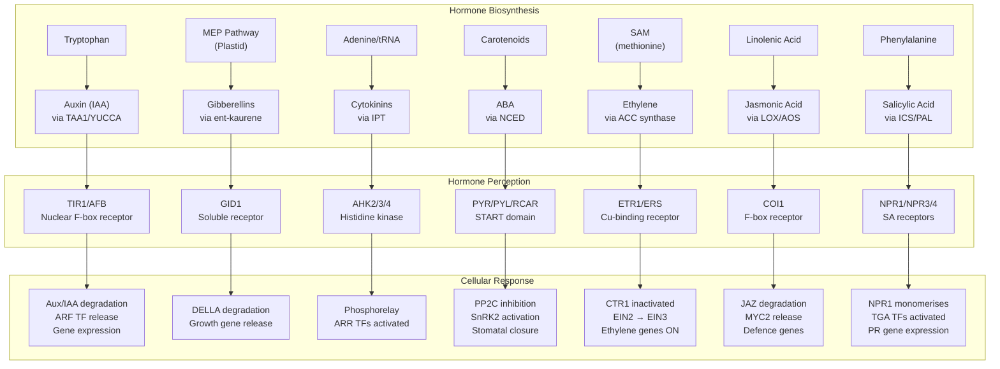
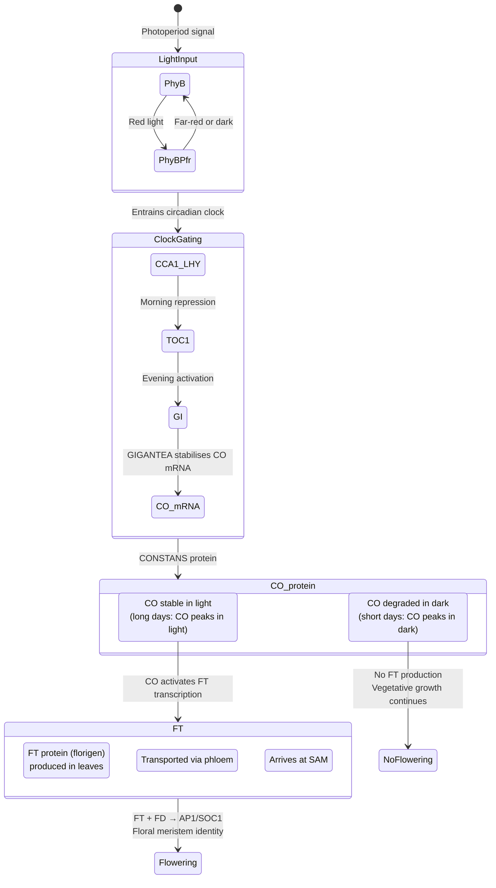
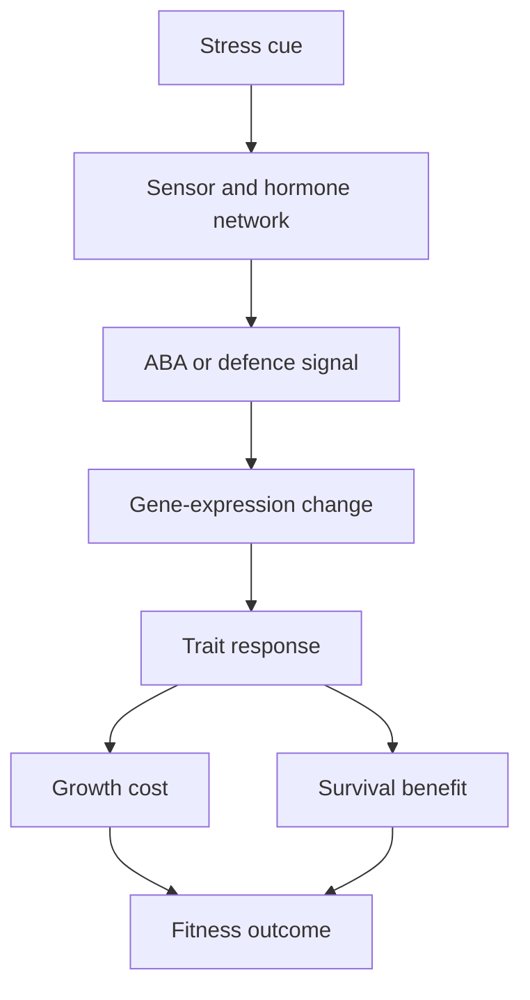

<!-- render:skip-beamer -->

# Plant Responses to the Environment

\label{sec:unit_VIII_plant_responses}


<!-- chapter-metadata-badge -->
> **Ch 27** · Level 2/3 · 55 min read · 75 min lecture · Prerequisites: \cref{sec:unit_VIII_plant_reproduction}

## Learning Objectives

By the end of this chapter, you should be able to:

1. Describe tropisms and how plants sense and respond to directional stimuli, including the molecular pathway for phototropism \citep{went1926}.
2. Explain the major plant [**hormone**](#gl:hormone)s (auxin, gibberellin, cytokinin, ABA, ethylene, brassinosteroids, jasmonates, salicylate, strigolactones) and their signalling pathways.
3. Describe photomorphogenesis: phytochrome biochemistry (Pr/Pfr photoconversion), cryptochrome FAD signalling, and shade avoidance.
4. Explain gravitropism in roots and shoots, including amyloplast settling and PIN [**protein**](#gl:protein) relocalisation.
5. Describe [**photoperiodism**](#gl:photoperiodism), the role of [**phytochrome**](#gl:phytochrome), florigen (FT), and the molecular basis of flowering time control via vernalisation (FLC silencing).
6. Explain the plant circadian clock molecular architecture (morning loop CCA1/LHY/TOC1; evening loop PRR5/7/9) and how it gates growth, flowering, and [**photosynthesis**](#gl:photosynthesis).
7. Describe drought (ABA pathway), cold (CBF-COR pathway), heat (HSP response), salt, flooding, and [**herbivory**](#gl:herbivory) (jasmonate) stress responses.
8. Describe plant immunity (PTI, ETI), the hypersensitive response, systemic acquired resistance (SAR), and JA/SA antagonism.
9. Evaluate agricultural applications of plant hormone biology: ethylene inhibitors, gibberellin dwarfing genes, and auxin herbicides.

<!-- curriculum-scaffold-start -->
### Study Blueprint

- **Big idea:** Plants sense environmental signals and respond through growth, hormones, and physiological regulation.
- **Core concepts:** tropisms, hormones, photoperiodism, stress responses.
- **Framework alignment:** Vision & Change: Structure and function, Pathways and transformations of energy and matter, Systems; AP Biology: Energetics, Systems Interactions; NGSS-style topics: Structure and Function, Matter and Energy in Organisms and Ecosystems.
- **Model or quantitative lens:** Dose-response, water-use-efficiency, and hormone-interaction reasoning.
- **Data skill:** Interpret plant response data across light, gravity, water, and hormone treatments.
- **Practice cadence:** Visual Representations, Questions and Methods, Argumentation.
- **Common misconception to repair:** A plant response is not passive; plants actively regulate development and physiology without neurons.
- **Primary lab:** \cref{sec:lab_unit_VIII_plant_responses}.
- **Question bank:** \cref{sec:q_unit_VIII_plant_responses}.
- **Transfer task:** Transfer response logic to shade avoidance, drought, flowering, and crop management.
- **Bridge to computation:** `biology.botany.botany.photosynthesis_rate`.
<!-- curriculum-scaffold-end -->

---

> **Opening Vignette — Darwin's Love Affair with Carnivorous Plants**
> 
> "I care more about Drosera than the origin of species in the world," Darwin wrote to his friend Asa Gray in 1860. For fifteen years he systematically experimented on sundews and Venus flytraps, weighing morsels of meat to 1/78,000 of a grain, timing trap closure, and testing with hundreds of chemical solutions — establishing that carnivorous plants actively respond to nitrogenous stimuli, not merely mechanical touch. His 1875 book *Insectivorous Plants* described hormone-like chemical signals in plants decades before the word "hormone" existed. In those experiments lurked the seed of plant hormone biology: auxin, gibberellins, abscisic acid, cytokinin, ethylene — the five classical plant hormones whose discovery unfolded over the next century. Darwin rarely found them by name, but his insight that plants sense and respond to their environment through diffusible chemical signals laid much of the groundwork that followed.

## Plant Hormones Overview

Plant hormones (phytohormones) are small organic molecules produced in low concentrations that regulate virtually every aspect of plant growth, development, and stress responses. Unlike animal hormones, plant hormones are often produced at many sites throughout the plant and can act locally.


<!-- alt: Flowchart showing overview of major plant hormone signalling pathways from biosynthesis through perception to cellular response Each pathway follows a general scheme: stimulus triggers hormone biosynthesis, the hormone is perceived by a specific receptor, and downstream signalling leads to gene expression changes. -->

*Overview of major plant hormone signalling pathways from biosynthesis through perception to cellular response Each pathway follows a general scheme: stimulus triggers hormone biosynthesis, the hormone is perceived by a specific receptor, and downstream signalling leads to [**gene**](#gl:gene) expression changes.*

### Auxin (Indole-3-Acetic Acid, IAA)

**Biosynthesis:** Primarily from tryptophan via the TAA1/YUCCA pathway. Produced in young leaves, shoot apical meristem, and developing embryos.

**Transport:** Auxin moves by **polar auxin transport** (PAT), unique among plant hormones:
- **PIN efflux carriers** (PIN1-8): Localised to specific faces of the plasma membrane; their polar distribution determines the direction of auxin flow. PIN proteins cycle between plasma membrane and endosomal compartments; their localisation is regulated by phosphorylation (PID kinase) and vesicle trafficking.
- **AUX1/LAX influx carriers:** Import auxin into cells; less polar than PIN proteins
- Polar transport rate: ~1 cm/h in stems (basipetal in shoots, acropetal in roots)

**Signalling mechanism (TIR1 pathway):**
1. Auxin binds TIR1/AFB F-box proteins (nuclear receptors)
2. Auxin acts as "molecular glue" between TIR1 and Aux/IAA transcriptional repressors
3. Aux/IAA proteins are ubiquitinated by SCF$^{TIR1}$ complex and degraded by 26S proteasome
4. **ARF (Auxin Response Factor)** [**transcription**](#gl:transcription) factors are released from Aux/IAA repression
5. ARF activates auxin-responsive genes

**Key functions:**
- **Apical dominance:** High auxin from the apex suppresses lateral bud outgrowth; removal of apex (decapitation) releases lateral buds
- **Phototropism:** Asymmetric auxin distribution bends shoots toward light.
- **Gravitropism:** Asymmetric auxin distribution in response to gravity
- **Root initiation:** High auxin promotes adventitious and lateral root formation
- **Fruit development:** Auxin from developing seeds promotes fruit growth

### Gibberellins (GAs)

**Biosynthesis:** From the MEP pathway in plastids; active forms include GA$_1$, GA$_3$, GA$_4$. Produced in young leaves, root tips, and developing seeds.

**Signalling mechanism:**
1. GA binds the soluble receptor **GID1**
2. GA-GID1 complex interacts with **DELLA proteins** (transcriptional repressors: GAI, RGA, RGL1-3 in *Arabidopsis*)
3. DELLA proteins are ubiquitinated by SCF$^{SLY1}$ E3 ligase and degraded
4. Release of DELLA repression allows growth-promoting transcription factors to act

**Key functions:**
- **Stem elongation:** Promotes internodal elongation; GA-deficient mutants are dwarf plants (basis of "Green Revolution" semi-dwarf wheat: *Rht* gene encodes GA-insensitive DELLA)
- **Seed germination:** GA induces α-amylase synthesis in cereal aleurone layer, mobilising starch reserves
- **Fruit development:** Can induce parthenocarpy (seedless fruit production without fertilisation; seedless grapes)
- **Flowering:** In some long-day plants, GA can substitute for the long-day photoperiod requirement

### Cytokinins

**Biosynthesis:** From adenine derivatives via IPT (isopentenyltransferase). Primarily synthesised in **root tips** and transported to shoots via [**xylem**](#gl:xylem).

**Key functions:**
- **Cell division:** Essential for cytokinesis; cytokinin + auxin together drive cell proliferation
- **Shoot promotion:** Antagonise auxin's apical dominance; promote lateral bud outgrowth
- **Delay of senescence:** Maintain [**chlorophyll**](#gl:chlorophyll) and protein levels in leaves; SAUR (senescence-associated ubiquitin-related) pathway
- **Tissue culture:** Auxin:cytokinin ratio determines organogenesis -- high auxin = roots; high cytokinin = shoots; equal = callus (undifferentiated cell mass)

### Abscisic Acid (ABA)

**Biosynthesis:** From carotenoid cleavage (NCED3 [**enzyme**](#gl:enzyme), 9-*cis*-epoxycarotenoid dioxygenase). Produced in roots under soil drying and in leaves under dehydration stress.

**Key functions:**
- **Stomatal closure:** The primary drought response hormone, detailed in the abscisic-acid discussion.
- **Seed dormancy:** Maintains dormancy until conditions favour germination; antagonised by GA
- **Stress gene expression:** Activates LEA (Late Embryogenesis Abundant) protein genes; dehydrins; osmolyte synthesis

**Signalling:** ABA binds PYR/PYL/RCAR receptors, which inhibit PP2C phosphatases, activating SnRK2 kinases. SnRK2 phosphorylates SLAC1 (stomatal closure), AREB/ABF transcription factors (stress genes), and ion channels.

### Ethylene

**Biosynthesis:** From methionine via SAM (S-adenosylmethionine) to ACC (1-aminocyclopropane-1-carboxylic acid) by ACC synthase, then to ethylene by ACC oxidase. Ethylene is a **gas** -- it diffuses freely between cells and even between plants.

**Key functions:**
- **Fruit ripening:** Climacteric fruits (banana, tomato, apple, avocado) show a burst of ethylene production triggering ripening. Non-climacteric fruits (strawberry, grape, citrus) do not show this burst.
- **Senescence:** Promotes leaf yellowing and abscission (leaf drop); petal senescence in cut flowers
- **Triple response:** In dark-grown seedlings, ethylene causes: (1) shortened, thickened hypocotyl, (2) exaggerated apical hook, (3) horizontal growth. This protects the seedling apex as it pushes through soil.
- **Flooding response:** Submerged roots accumulate ACC (cannot oxidise to ethylene without O$_2$); when ACC reaches shoots, aerenchyma formation is triggered (programmed cell death creates air channels)
- **Abscission:** Ethylene activates cellulase and pectinase in the abscission zone at the leaf petiole base

> **Clinical Connection:** The commercial fruit industry manipulates ethylene extensively. Bananas are picked green, shipped under ethylene-suppressed conditions (using KMnO$_4$ as an ethylene scrubber or 1-MCP as an ethylene perception inhibitor), and then ripened on demand by ethylene gas treatment at distribution centres. This enables global tropical fruit supply chains.

### Jasmonates (JA)

**Biosynthesis:** From linolenic acid (membrane lipid) via the LOX (lipoxygenase) pathway. The active form is **JA-Ile** (jasmonyl-isoleucine conjugate, produced by JAR1).

**Signalling:** JA-Ile binds **COI1** (F-box protein of the SCF^COI1^ E3 ubiquitin ligase), which recruits **JAZ** (Jasmonate ZIM-domain) repressor proteins into the SCF complex:

\begin{equation}
\text{JA-Ile} + \text{COI1-JAZ} \xrightarrow{\text{SCF}^{\text{COI1}}} \text{Ub-JAZ} \xrightarrow{\text{26S proteasome}} \text{MYC2/3/4 activation}
\label{eq:plant_responses_1}
\end{equation}

Pre-wounding, JAZ proteins recruit **TOPLESS** corepressor via the **NINJA** adaptor, forming a trimeric JAZ-NINJA-TOPLESS complex that represses MYC2 through [**histone**](#gl:histone) deacetylase recruitment. Post-wounding JA-Ile surge displaces this complex by directing SCF^COI1^ to ubiquitinate JAZ via the **SLY degron** motif (Jas domain). 2024 cryo-EM structures ([**allosteric**](#gl:allosteric) lid closure model) show COI1 undergoes a conformational switch upon JA-Ile binding, with ASK1-CUL1-RBX1 forming the catalytic core (Sheard *et al.*, *Nature* 2010; Xu *et al.*, *bioRxiv* 2024). COI1 paralogs (COI1a/b) fine-tune JAZ subtype specificity across defence/development contexts.

**Key functions:**
- **Wound/herbivore defence:** Protease inhibitors, alkaloids (nicotine in tobacco), glucosinolates, terpene volatiles
- **UV damage response:** Accumulation of UV-absorbing flavonoids
- **Mycorrhizal signalling:** JA promotes mycorrhizal colonisation
- **Pollen development:** Required for stamen maturation and pollen release

### Salicylic Acid (SA)

**Biosynthesis:** From phenylalanine (PAL pathway) or chorismate (ICS pathway; [**dominant**](#gl:dominant) in *Arabidopsis*).

**Key functions:**
- **Systemic Acquired Resistance (SAR):** After local pathogen infection, SA signals spread systemically, priming distant tissues for enhanced defence in the plant-immunity response.
- **PR protein induction:** Pathogenesis-related proteins (PR-1, β-1,3-glucanase, thaumatin-like proteins)

**Concept Check:** Aspirin (acetylsalicylic acid) is derived from salicylic acid, originally extracted from willow bark (*Salix*). Why might plants produce SA in response to pathogens, and what does this tell us about the evolutionary age of this defence pathway?

### Strigolactones

**Biosynthesis:** From carotenoid precursors via D27 isomerase and CCD7/CCD8 cleavage. Produced primarily in roots.

**Key functions:**
- **Branch suppression:** Inhibit lateral bud outgrowth; work with auxin in apical dominance
- **Mycorrhizal recruitment:** Secreted into rhizosphere to attract AM fungi
- **Root architecture:** Promote lateral root elongation
- **Parasitic plant germination:** *Striga* (witchweed) seeds germinate in response to strigolactones from host roots, a devastating crop [**parasite**](#gl:parasite) in Africa

---

## Phototropism

The molecular pathway for phototropism in *Arabidopsis thaliana* is one of the best-characterised plant signalling cascades:

1. **Blue light** (390-500 nm) illuminates the shoot asymmetrically
2. **PHOT1** or **PHOT2** (LOV1/LOV2-domain photoreceptors; LOV = Light Oxygen Voltage) absorbs blue light. Photochemical covalent FMN-cysteine adduct forms, causing conformational change and autophosphorylation (Ser849 of PHOT1, kinase domain released).
3. PHOT1/2 phosphorylate **NPH3** (Non-Phototropic Hypocotyl 3). NPH3 interacts with ARF7/ARF19 and reorganises.
4. **Auxin lateral redistribution** (the Cholodny-Went hypothesis, quantified by \citet{went1926} *Avena* coleoptile bioassay):
   - PHOT1/2 triggers **PIN3** (auxin efflux carrier) relocalisation from the bottom to the lateral face of shoot endodermal cells
   - More auxin (IAA) is transported to the shaded side; less to the illuminated side
5. **Acid growth hypothesis** \citep{hager1971}:
   - High [IAA] on shaded side activates plasma membrane **H$^+$-ATPase** (AHA1/2). Proton extrusion acidifies the cell wall ([**pH**](#gl:ph) 5.5 to 4.5).
   - Acidic pH activates **expansins** (proteins that disrupt H-bonding between cellulose microfibrils and hemicellulose) causing wall loosening. Turgor-driven elongation follows.
6. Differential elongation (shaded side elongates more than lit side) causes the shoot to bend toward light. Phototropic curvature is completed within 30-60 minutes.

> Historical note: Darwin and Darwin (*Power of Movement in Plants*, 1880) first demonstrated that the phototropic signal originates in the coleoptile tip. \citet{went1926} isolated auxin using agar blocks. The molecular receptors (PHOTs) were identified in 1997 by Briggs and colleagues.

### Worked Example: Phototropic Curvature from a Lateral Auxin Gradient

**Problem:**
A coleoptile segment is illuminated from one side. Following Cholodny-Went redistribution, the shaded flank receives more auxin and, via acid growth, elongates 30% while the illuminated flank elongates 10%. Each flank starts at length $L_0 = 10$ mm and the coleoptile diameter (distance between the two flanks) is $w = 1.5$ mm. Calculate the phototropic bending angle.

**Solution:**

1. **Elongation of each flank.** Apply the relative growth fractions to the initial length:
$$ \Delta s_{\text{shaded}} = L_0 \times 0.30 = 10 \times 0.30 = 3.0 \text{ mm}, \qquad \Delta s_{\text{lit}} = L_0 \times 0.10 = 10 \times 0.10 = 1.0 \text{ mm} \label{eq:unit_VIII_plant_responses_item_5}$$

2. **Differential elongation.** The bend is driven by the difference in arc length between the two flanks:
$$ \Delta s_{\text{shaded}} - \Delta s_{\text{lit}} = 3.0 - 1.0 = 2.0 \text{ mm} \label{eq:unit_VIII_plant_responses_item_6}$$

3. **Bending angle.** When an organ of width $w$ bends through angle θ (radians), the arc-length difference between its two surfaces equals $w\theta$, so $\theta = (\Delta s_{\text{shaded}} - \Delta s_{\text{lit}})/w$:
$$ \theta = \frac{2.0 \text{ mm}}{1.5 \text{ mm}} = 1.33 \text{ rad} = 1.33 \times \frac{180^\circ}{\pi} \approx 76.4^\circ \label{eq:unit_VIII_plant_responses_item_7}$$

**Interpretation:** A 3:1 ratio of differential flank elongation over a 1.5 mm-wide coleoptile produces about a 76 degree bend toward the light — quantitatively illustrating how a modest lateral auxin gradient, amplified by acid-growth wall loosening, generates the large directional curvature characteristic of phototropism.

---

## Gravitropism


<!-- alt: Graph showing gravitropism in roots and shoots In both organs, amyloplast settling triggers asymmetric auxin redistribution via PIN protein relocalisation. The critical difference: root cells are INHIBITED by high auxin concentrations (causing the lower side to grow less, bending the root downward), while shoot cells are PROMOTED by high auxin (causing the lower side to grow more, bending the shoot upward). -->

*Gravitropism in roots and shoots In both organs, amyloplast settling triggers asymmetric auxin redistribution via PIN protein relocalisation. The critical difference: root cells are INHIBITED by high auxin concentrations (causing the lower side to grow less, bending the root downward), while shoot cells are PROMOTED by high auxin (causing the lower side to grow more, bending the shoot upward).*

**Key molecular details — statoliths and PIN asymmetry:**

- **Statocytes:** Specialised gravity-sensing cells. In roots, these are the **columella cells** of the root cap (a few central cells just behind the meristem). In shoots, they are the **endodermal cells** (starch sheath surrounding the vascular cylinder).
- **Amyloplasts (statoliths):** Starch-filled plastids (1–10 µm diameter) that sediment under gravity within seconds of reorientation. Their settling pulls on the actin cytoskeleton and ER membranes, generating mechanical signals that are transduced via **TOC (translocon of outer chloroplast) complex** to the LAZY1/IGT proteins on the new lower face of the cell.
- **PIN auxin transporter asymmetry:**
  - In root columella cells, **PIN3** is initially symmetrically localised at the plasma membrane. Within minutes of gravity stimulation, PIN3 relocalises to the **new lower (now downward-facing) face** of the cell.
  - In the elongation zone, **PIN2** is permanently localised on the upper face of cortical and epidermal cells; PIN2 is critical for transporting auxin from the root tip back along the upper side of the elongation zone toward the shoot. Relocalisation of PIN3 in columella cells biases auxin export toward the lower side, where PIN2 then carries it acropetally, accumulating auxin on the lower side of the elongation zone.
- **Lateral auxin redistribution:** In *Arabidopsis* roots, the asymmetry develops within ~5 min of gravity stimulation; bending is visible by 20 min and complete within 1–2 hours.
- **LAZY1 protein:** Required for normal gravitropism. *lazy1* mutants show reversed gravitropic responses (shoots grow down, branches grow at unusual angles). LAZY1 relocalises to the lower side of the cell after gravity stimulation and facilitates PIN relocalisation.
- **Root vs shoot dose-response difference:** The same auxin redistribution (more auxin on the lower side) has opposite effects because root cells have a much **lower optimal auxin concentration** (~$10^{-9}$ M for root elongation) than shoot cells (~$10^{-5}$ M for stem elongation). Above the root optimum, auxin **inhibits** elongation via the stabilisation of Aux/IAA repressors and ethylene production; thus the lower side of the gravity-stimulated root grows less than the upper, and the root bends downward.

---

## Photomorphogenesis: Phytochromes and Cryptochromes

Plants integrate diverse light signals — wavelength, intensity, direction, duration, timing — through a constellation of photoreceptors. The two most studied families are phytochromes (red/far-red sensors) and cryptochromes (blue/UV-A sensors).

### Phytochrome Biochemistry

Phytochromes are dimeric ~125 kDa chromoproteins. Each monomer carries a bilin chromophore (phytochromobilin) covalently attached to a conserved cysteine in the photosensory module. The chromophore exists in two photointerconvertible forms:

- **Pr (red-absorbing form, $\lambda_{max} = 660$ nm):** Inactive form; synthesised in the dark; primarily cytoplasmic
- **Pfr (far-red-absorbing form, $\lambda_{max} = 730$ nm):** Active form; translocates to the nucleus where it interacts with PIFs (Phytochrome Interacting Factors); triggers physiological responses

**Photoconversion:**

\begin{equation}
\text{Pr} \xrightarrow{\text{red 660 nm}} \text{Pfr}
\qquad
\text{Pfr} \xrightarrow{\text{far-red 730 nm or dark reversion}} \text{Pr}
\label{eq:unit_VIII_phytochrome_photoconversion}
\end{equation}

Red light (660 nm) converts Pr to Pfr; far-red light (730 nm) converts Pfr back to Pr. In darkness, Pfr slowly reverts to Pr (thermal reversion, half-life ~hours) and is also degraded by the COP1 ubiquitin-proteasome pathway. The R/FR reversibility of physiological responses (Borthwick and Hendricks, 1952) is the diagnostic signature of phytochrome involvement.

**Phytochrome diversity:**

*Arabidopsis* has five phytochromes (PhyA–PhyE), each with distinct light-stability and physiological roles:

- **PhyA:** Light-labile (degraded rapidly in light). Mediates very-low-fluence and far-red-high-irradiance responses (FR-HIR). PhyA is the principal sensor for **shade-avoidance under deep shade** (where FR predominates) and for **de-etiolation in dim light**.
- **PhyB:** Light-stable. Mediates the classic R/FR reversible (low-fluence) responses. PhyB is the **principal sensor of canopy shade** via the **R:FR ratio** (high R:FR = open sun; low R:FR = under leaf canopy because chlorophyll absorbs red and transmits far-red). Loss-of-function *phyB* mutants are constitutively shade-avoiding (elongated, pale, early-flowering).
- **PhyC, PhyD, PhyE:** Specialised roles in flowering time, leaf angle, and modulating the responses of PhyA/B.

**Shade avoidance via R:FR ratio:** Sun-grown plants typically experience R:FR ratios of ~1.2; under a leaf canopy, the ratio drops to 0.1–0.4 because chlorophyll preferentially absorbs red. PhyB Pfr is destabilised under low R:FR (returning to Pr); this releases PIF4/5/7 from PhyB-mediated degradation, activating YUCCA-driven auxin synthesis and triggering hypocotyl elongation, petiole elongation, and accelerated flowering — the **shade avoidance syndrome**.

### Cryptochrome Signalling — Blue Light and FAD

**Cryptochromes (CRY1/CRY2)** are blue/UV-A photoreceptors with two cofactors: a **FAD** (flavin adenine dinucleotide) chromophore for blue light absorption (~450 nm) and an MTHF antenna pigment that broadens absorption.

**Photoactivation mechanism:**
1. Blue light reduces FAD from oxidised (FAD$_{ox}$) to neutral semiquinone (FADH•)
2. Reduction triggers conformational change in the C-terminal extension of CRY
3. Activated CRY interacts with multiple downstream targets:
   - **COP1 (CONSTITUTIVE PHOTOMORPHOGENIC 1):** an E3 ubiquitin ligase; CRY binding inhibits COP1, thereby stabilising COP1 substrates (HY5, HFR1, CO, LAF1) — bZIP and bHLH transcription factors that drive photomorphogenic gene expression
   - **SPA proteins:** COP1 partners; CRY binding disrupts COP1-SPA interaction
   - **PIFs:** CRY can also directly modulate PIF activity

**Key blue-light responses:**
- **Hypocotyl growth inhibition:** Light-grown seedlings have short hypocotyls; *cry1 cry2* double mutants show etiolated (long-hypocotyl) phenotype in blue light despite normal red light response
- **Anthocyanin biosynthesis:** Blue light induces phenylpropanoid pathway genes (PAL, CHS, CHI) producing UV-protective and pigment compounds
- **Photoperiodic flowering:** CRY2 stabilises CONSTANS protein in long days
- **Stomatal opening:** Cooperatively with phototropins (covered in \cref{sec:unit_VIII_plant_structure_and_water})

**CRY-COP1-HY5 module:** The COP1/SPA E3 ubiquitin ligase complex is the master "darkness" enforcer. In darkness, COP1-SPA ubiquitinates HY5 and other photomorphogenic TFs, targeting them for degradation. Light activates CRYs and PhyB, which physically interact with COP1 and disrupt the COP1-SPA complex; HY5 accumulates and drives photomorphogenic gene expression (chlorophyll biosynthesis, anthocyanin synthesis, hypocotyl growth arrest). Loss-of-function *cop1* mutants are constitutively photomorphogenic in darkness — confirming the central role of this regulator.

---

## The Plant Circadian Clock — Molecular Architecture

Plants maintain an endogenous **~24-hour oscillator** (circadian clock) that anticipates dawn/dusk and gates downstream processes including photosynthesis, growth, flowering, and stress responses. The plant clock comprises interlocked transcriptional feedback loops with morning, evening, and intermediate components.

### Morning Loop: CCA1/LHY Repressors and TOC1 Activator

- **CCA1 (Circadian Clock Associated 1) and LHY (Late Elongated Hypocotyl):** Single-MYB transcription factors expressed at dawn (peak ~ZT0, where ZT0 is dawn). They function as a heterodimer and act as **repressors** of evening-expressed genes (TOC1, ELF3, ELF4, LUX, GI).
- **TOC1 (Timing of CAB expression 1; pseudo-response regulator PRR1):** Expressed at dusk (peak ~ZT12). TOC1 binds and represses the *CCA1* and *LHY* promoters, closing the negative feedback loop. TOC1 also activates morning genes after dusk through PIF interactions.

The morning loop is the "central oscillator": CCA1/LHY repress TOC1 in the morning; as CCA1/LHY decay through the day, TOC1 rises; TOC1 then represses CCA1/LHY through the night until they rise again at dawn.

### Evening Loop: PRR9 → PRR7 → PRR5 → TOC1

A cascade of **pseudo-response regulators (PRRs)** sequentially repress CCA1/LHY through the day:

- **PRR9:** Peaks ~4 h after dawn (ZT4); repressed by CCA1/LHY; represses CCA1/LHY transcription
- **PRR7:** Peaks ~8 h after dawn (ZT8); repressed by PRR9 partially; represses CCA1/LHY
- **PRR5:** Peaks at midday (ZT10–12); activates downstream targets including CO
- **TOC1/PRR1:** Peaks at dusk (ZT12); closes morning loop

This PRR cascade creates a wave of repression sweeping across the day, with each successive PRR repressing the previous one's targets. The molecular result is a robust ~24 h oscillation despite individual gene half-lives of primarily hours.

### Evening Complex: ELF3-ELF4-LUX

The **Evening Complex (EC)** comprises ELF3, ELF4, and LUX (LUX ARRHYTHMO; a Myb-domain TF). ELF3 is a scaffold protein; LUX provides DNA binding. The EC peaks at ZT12–16 and represses morning genes (PRR9, PIF4, GI) — gating early-night growth. *elf3* mutants are arrhythmic.

### Temperature Compensation

A defining property of the circadian clock is **temperature compensation**: the period remains ~24 h across a wide temperature range (10–30 °C) despite the underlying biochemical reactions accelerating with temperature (Q$_{10}$ ~ 2). Mechanisms include:
- **Alternative splicing of CCA1:** at lower temperature, an alternative splice form (CCA1β) acts as a repressor of CCA1α, slowing the loop
- **Temperature-dependent protein stability of PRR proteins:** PRR9/7 are more rapidly degraded at higher temperatures
- **JMJ30 demethylase:** counters temperature effects on chromatin marks at clock loci

### Clock Outputs

The clock gates numerous physiological processes by regulating downstream gene expression:
- **Stomatal opening:** Anticipatory opening before dawn; controlled by clock-gated H$^+$-ATPase activity
- **Photosynthesis genes:** CAB (chlorophyll a/b binding protein), Rubisco activase peak at dawn
- **Flowering:** GI-CO-FT pathway is clock-gated through photoperiodic hormone signalling.
- **Growth:** Hypocotyl elongation peaks in the late night/early morning (gated by PIF4-driven YUCCA expression)
- **Defence:** Many pathogen resistance genes (e.g., *PR1*) show circadian regulation, anticipating bacterial infections that peak at midday

---

## Photoperiodism, Flowering Time, and Vernalisation

### Photoperiodic Categories

Plants are classified by their flowering response to day/night length:

- **Short-day plants** (SDPs): Flower when nights are **longer** than a critical length. Examples: chrysanthemum, rice, *Pharbitis* (Japanese morning glory), tobacco (*Nicotiana tabacum* Maryland Mammoth), soybean. Despite the name, it is **night length** that matters -- a brief flash of red light during the long night breaks the inductive dark period (the **night-break experiment**).
- **Long-day plants** (LDPs): Flower when nights are **shorter** than a critical length. Examples: spinach, *Arabidopsis*, barley, wheat, radish.
- **Day-neutral plants:** Flower after sufficient vegetative growth regardless of photoperiod. Examples: tomato, cucumber, maize.

### Night-Length Measurement and Circadian Gating

**Phytochrome** is the primary photoreceptor for photoperiodism. During a long night, Pfr levels decline below a threshold via thermal reversion and proteolysis. In short-day plants, this decline is required for flowering. A brief red-light pulse during the night converts Pr back to Pfr, resetting the clock and preventing flowering. This **night break** effect can be reversed by an immediately subsequent far-red light pulse — classic evidence for phytochrome involvement.

Photoperiod is measured not by simply timing dark intervals but by **circadian gating** — the clock provides a window during which light is permissive for flowering. The molecular mechanism (the "external coincidence model") is: CO mRNA is rhythmically expressed by the clock (peaks in late afternoon), but CO protein is stable primarily in light. Coincidence of light + CO protein → FT activation → flowering.

### The CONSTANS-FT (Florigen) Pathway


<!-- alt: State diagram showing molecular pathway of photoperiodic flowering in long-day plants The circadian clock gates CONSTANS (CO) protein stability so that in long days, CO is present in the light (when it is stabilised), activating FLOWERING LOCUS T (FT). FT protein (florigen) moves from leaves to the SAM, triggering flower development. -->

*Molecular pathway of photoperiodic flowering in long-day plants The circadian clock gates CONSTANS (CO) protein stability so that in long days, CO is present in the light (when it is stabilised), activating FLOWERING LOCUS T (FT). FT protein (florigen) moves from leaves to the SAM, triggering flower development.*

**Florigen — FT as the mobile flowering signal:**

1. In long-day plants, the circadian clock ensures that **CONSTANS (CO)** mRNA peaks in the late afternoon
2. CO protein is stabilised by light (blue light via CRY2; far-red light via PhyA) but degraded in darkness via COP1 ubiquitin ligase
3. In long days: CO mRNA peaks coincide with daylight, CO protein is stable, CO binds the **FT (FLOWERING LOCUS T)** [**promoter**](#gl:promoter), activating transcription
4. **FT protein** — the long-sought "florigen" first hypothesised by Chailakhyan in 1937 — is produced in **companion cells of leaf phloem** and moves systemically via sieve tubes to the SAM. FT is a small (~20 kDa) globular protein structurally related to mammalian RAF kinase inhibitors; it is loaded into phloem via plasmodesmata and unloaded at the SAM.
5. At the SAM, FT interacts with **FD** (bZIP transcription factor) to activate **AP1** (floral meristem identity) and **SOC1** (flowering pathway integrator). The FT-FD-14-3-3 floral activation complex (FAC) was crystallographically resolved in 2011 (Taoka *et al.*, *Nature* 2011).
6. The vegetative meristem transitions irreversibly to a floral meristem — the moment of "evocation"

**Diversity of FT homologues:** Most plants have multiple FT paralogues with distinct functions. Some act as floral activators (FT in *Arabidopsis*, Hd3a in rice — the rice florigen); some as floral repressors (TFL1, BFT). The balance of activator and repressor FT-family proteins fine-tunes flowering time.

### Vernalisation: Epigenetic Silencing of FLC

Prolonged cold exposure (weeks at 4 °C) promotes flowering in winter annuals (*Arabidopsis* ecotype Ler, accessions from northern latitudes) and biennials (carrots, foxglove, sugar beet). The molecular mechanism is a paradigmatic example of **epigenetic memory**:

**The FLC repressor (MADS-box):**

**FLC (FLOWERING LOCUS C)** is a MADS-box transcription factor that represses *FT* and *SOC1*, blocking the floral transition. In winter annuals before vernalisation, FLC is highly expressed, preventing flowering. Vernalisation silences FLC, releasing FT/SOC1 and permitting flowering.

**Mechanism of cold-induced FLC silencing — the VRN2-PRC2 H3K27me3 mark:**

1. Extended cold (>4 weeks at 4 °C) induces **VIN3** (VERNALISATION INSENSITIVE 3), a PHD-domain protein. VIN3 expression depends on a cold-memory element (CME) upstream of the *VIN3* promoter; VIN3 transcript accumulates primarily after sustained cold (not pulses).
2. VIN3 joins **PRC2** (Polycomb Repressive Complex 2: catalytic subunit CLF/SWN, MSI1, FIE, VRN5) at the **FLC** [**chromatin**](#gl:chromatin) via the **VRN2** subunit (a vernalisation-specific PRC2 partner).
3. PRC2 catalyses the trimethylation of histone H3 at lysine 27:

\begin{equation}
\text{H3} \xrightarrow{\text{PRC2 (CLF/SWN, VRN2, FIE, MSI1, VIN3)}} \text{H3K27me3 at FLC}
\label{eq:unit_VIII_vernalisation}
\end{equation}

4. H3K27me3 marks initially appear at a discrete nucleation region within the *FLC* locus (a 1.5 kb cold-memory region spanning exon 1 and intron 1) during cold exposure; mark spreading across the entire *FLC* locus occurs after return to warm.
5. **After return to warm:** VIN3 expression fades, but H3K27me3 is **maintained** by VRN2-PRC2 (which lacks VIN3 in the warm but retains the catalytic core), creating a **mitotically stable memory** of cold exposure (Finnegan & Dennis, *Plant J.* 2007; Sheldon *et al.*, 2009).
6. **Mitotic inheritance:** As cells divide during spring growth, H3K27me3 is faithfully copied to daughter chromatin, propagating FLC silencing throughout the vernalised plant. The memory is gradually erased by demethylases in the offspring generation, resetting *FLC* for the next winter.
7. **Result:** FLC (MADS-box repressor) can no longer repress **FT** and **SOC1** → flowering proceeds in spring

\begin{equation}
\text{Cold} \xrightarrow{\text{VIN3}} \text{PRC2-VRN2} \xrightarrow{\text{H3K27me3 at FLC}} \downarrow \text{FLC} \rightarrow \uparrow \text{FT} \rightarrow \text{Flowering}
\label{eq:unit_VIII_vernalisation_summary}
\end{equation}

**Concept Check:** Why does vernalisation require weeks rather than days of cold? What happens if prolonged cold is given in pulses of a few days each, separated by warm intervals?

---

## Gravitropism, Touch Responses, and Other Tropisms

### Gravitropism — Statolith and PIN Asymmetry (deep dive)

The detailed molecular mechanism of root gravitropism integrates statolith sedimentation, PIN protein relocalisation, and the dose-response asymmetry between root and shoot:

1. **Gravity perception** by amyloplast sedimentation in columella cells (~30 s after reorientation)
2. **Mechanical signal transduction** via actin cytoskeleton and ER membrane interactions; LAZY1 family proteins relocalise to the new lower face
3. **PIN3 asymmetric relocalisation** to the new lower face of columella cells (~3–5 min)
4. **Lateral auxin transport** out the new lower face into the cortex below
5. **PIN2 acropetal transport** of auxin in the elongation zone, biased toward the lower side
6. **Differential elongation:** auxin inhibits elongation on the lower side (root); the upper side grows faster, bending the root downward
7. **Bending complete** in 1–2 hours; PIN proteins reset to symmetric distribution

### Touch Responses (Thigmomorphogenesis)

Plants respond to mechanical stimuli — wind, rain, animal contact — through **thigmomorphogenesis**, often resulting in shorter, sturdier growth. The molecular pathway:

1. **TCH (TOUCH) genes** — first identified in *Arabidopsis* by Janet Braam (1990). The four classical TCH genes are:
   - **TCH1 (CAM2):** calmodulin
   - **TCH2 (CML24):** calmodulin-like
   - **TCH3 (CML12):** calmodulin-like
   - **TCH4 (XTH22):** xyloglucan endotransglucosylase/hydrolase (cell-wall modifier)
2. **Mechanism:** Mechanical perturbation triggers Ca$^{2+}$ influx via mechanosensitive channels (MCA1, MSL2, OSCA1; piezo-like). Cytosolic [Ca$^{2+}$] rises within seconds.
3. **Calmodulin (TCH1) and CMLs (TCH2/3)** bind Ca$^{2+}$ and translate the calcium signal to downstream targets — kinases, transcription factors, cell-wall enzymes.
4. **Jasmonate production:** Mechanical wounding activates JA biosynthesis via the LOX pathway, mobilising defence responses in the herbivory and plant-immunity network.
5. **Phenotypic consequences:** Shorter internodes, thicker stems, increased lignin, smaller leaves. Brushed *Arabidopsis* plants are 30–40% shorter than unbrushed controls; the response is adaptive in windy environments.

**Tendril coiling:** Climbing plants like peas, grapes, and cucumbers produce **tendrils** that exhibit **thigmonastic** coiling on contact with a support. The mechanism involves:
- Differential elongation: cells on the contact side stop elongating; cells on the opposite side continue
- Jasmonate signalling: JA mediates the coiling response; *Bryonia* tendrils require JA for coiling
- Within minutes of contact, tendril coils a complete 360° around the support

### Other Tropisms

- **Hydrotropism:** Roots grow toward moisture; mediated by ABA and MIZ1 (mizu-kussei 1) protein in root cap. *miz1* mutants lack hydrotropism but retain gravitropism.
- **Thigmotropism in roots:** Roots growing along a substrate exhibit obstacle avoidance, mediated by mechanosensitive channels.
- **Heliotropism (solar tracking):** Sunflowers track the sun across the sky (East to West during the day; reverse to East at night). Driven by differential growth rates on east vs west sides of the stem, gated by the circadian clock.

---

## Abiotic Stress Responses

### Drought -- ABA Signalling Cascade

ABA is the primary drought stress hormone:

1. Soil water deficit detected. Root ABA synthesis increases (NCED3 upregulated). ABA moves via xylem to leaves.
2. [**Guard cell**](#gl:guard-cell): ABA binds **PYR/PYL/RCAR receptors** (14 paralogs in *Arabidopsis*)
3. ABA-PYR complex inhibits **PP2C phosphatases** (ABI1, ABI2, HAB1)
4. **SnRK2 kinases** (especially OST1/SnRK2.6) are freed from PP2C inhibition and phosphorylate:
   - **SLAC1** anion channel: Cl$^-$ efflux depolarises guard cell membrane
   - **GORK** K$^+$ outward-rectifying channel opens: K$^+$ efflux
   - Water follows osmotically: guard cells shrink, [**stomata**](#gl:stomata) close
   - **AREB/ABF** transcription factors: activate drought-responsive genes (dehydrins, LEA proteins, osmolyte synthesis)

**Water use efficiency (WUE):**

\begin{equation}
WUE = \frac{A_{net}}{g_s} = \frac{\text{Net CO}_2 \text{ assimilation}}{\text{stomatal conductance}}
\label{eq:plant_responses_4}
\end{equation}

Plants under water stress maximise WUE by partially closing stomata.

### Worked Example: Calculating Water Use Efficiency (WUE)

**Problem:**
An agronomist is evaluating a new drought-tolerant wheat cultivar. Using a portable photosynthesis system, the researcher measures a net CO$_2$ assimilation rate ($A_{net}$) of $15 \mu\text{mol CO}_2 \text{ m}^{-2} \text{ s}^{-1}$. At the same time, the stomatal conductance to water vapour ($g_s$) is measured at $0.15 \text{ mol H}_2\text{O m}^{-2} \text{ s}^{-1}$. 
1. Calculate the intrinsic Water Use Efficiency (WUE).
2. If ABA treatment causes the stomata to partially close, decreasing $g_s$ by 50% but primarily decreasing $A_{net}$ by 20%, what is the new WUE?

**Solution:**

1. **Calculate the initial WUE:**
   It is standard to express $g_s$ in $\mu\text{mol}$ or $A_{net}$ in $\mu\text{mol}$ so units match. 
   First, convert $g_s$ from mol to $\mu\text{mol}$:
   $$ g_s = 0.15 \text{ mol} = 150,000 \mu\text{mol H}_2\text{O m}^{-2} \text{ s}^{-1}  \label{eq:unit_VIII_plant_responses_item_1}$$

   Now, apply the WUE formula:
   $$ WUE_{initial} = \frac{A_{net}}{g_s} = \frac{15}{150,000} = 0.0001 \frac{\mu\text{mol CO}_2}{\mu\text{mol H}_2\text{O}}  \label{eq:unit_VIII_plant_responses_item_2}$$

   Alternatively, keeping $g_s$ in mol:
   $$ WUE = \frac{15 \mu\text{mol CO}_2 \text{ m}^{-2} \text{ s}^{-1}}{0.15 \text{ mol H}_2\text{O m}^{-2} \text{ s}^{-1}} = 100 \frac{\mu\text{mol CO}_2}{\text{mol H}_2\text{O}}  \label{eq:unit_VIII_plant_responses_item_3}$$


2. **Calculate the new rates after ABA treatment:**
   New $g_s$: $0.15 \cdot (1 - 0.50) = 0.075 \text{ mol H}_2\text{O m}^{-2} \text{ s}^{-1}$
   New $A_{net}$: $15 \cdot (1 - 0.20) = 12 \mu\text{mol CO}_2 \text{ m}^{-2} \text{ s}^{-1}$

3. **Calculate the new WUE:**
   $$ WUE_{new} = \frac{12}{0.075} = 160 \frac{\mu\text{mol CO}_2}{\text{mol H}_2\text{O}}  \label{eq:unit_VIII_plant_responses_item_4}$$

   The partial stomatal closure significantly improved the water use efficiency (from 100 to 160), demonstrating how plants optimize carbon gain against water loss during drought conditions.

**Root architecture changes under drought:** ABA and auxin promote deeper root growth. Lateral root emergence is suppressed while primary root elongation continues, shifting the root system to access deeper soil water.

### Cold Stress -- CBF-COR Pathway

**Cold acclimation** (hardening at 4 degrees C for 1-3 weeks) increases freezing tolerance:

1. Temperature drop triggers membrane rigidification (gel-state transition) and Ca$^{2+}$ influx (MCA1/MCA2 mechanosensitive channels)
2. **ICE1** (Inducer of CBF Expression 1; bHLH transcription factor) activates **CBF1/CBF2/CBF3** (C-repeat Binding Factors; AP2/ERF TFs) within minutes
3. CBFs bind CRT/DRE elements in promoters, activating **COR (Cold-Regulated) genes:**
   - **COR15:** [**Chloroplast**](#gl:chloroplast) outer envelope protein; prevents membrane vesiculation
   - **KIN1/KIN2:** Dehydrins; cryoprotectants that prevent protein aggregation
   - **FAD2/FAD3:** Fatty acid desaturases that increase membrane unsaturated fatty acid content, maintaining membrane fluidity
4. **Extracellular ice management:** Ice nucleates in the apoplast (lower solute concentration than [**cytoplasm**](#gl:cytoplasm)). Water is drawn osmotically from cells, producing controlled dehydration rather than lethal intracellular ice formation.

**Antifreeze proteins:** Some cold-tolerant plants (rye, carrots) express proteins that bind ice crystal surfaces and inhibit crystal growth (thermal hysteresis), protecting membranes.

### Heat Stress -- HSP Response

Above 35-42 degrees C, the heat shock response is activated:
- **HSFA1** transcription factors activate **HSP70, HSP90, HSP101** chaperones that prevent protein aggregation and refold misfolded proteins
- **Small HSPs** (sHSPs, 15-40 kDa): ATP-independent holdases that accumulate in cytoplasmic aggregates
- **Thermomemory:** H3K4me3 epigenetic marks at HSP loci persist for several days, allowing faster response to subsequent heat episodes

### Salt Stress

High soil salinity (NaCl) causes both osmotic stress and ion toxicity:
- **SOS pathway** (Salt Overly Sensitive): SOS3 (Ca$^{2+}$ sensor) activates SOS2 (kinase), which activates **SOS1** (Na$^+$/H$^+$ antiporter) to expel Na$^+$ from roots
- **Vacuolar sequestration:** NHX1 antiporter pumps Na$^+$ into vacuole
- **Compatible osmolytes:** Proline, glycine betaine, mannitol accumulate to lower $\psi_s$ without enzyme inhibition

### Flooding Response

Submergence deprives roots of O$_2$:
- **ERFVII transcription factors** (RAP2.2, RAP2.12): Stabilised under hypoxia (normally degraded by the N-end rule pathway when O$_2$ is present -- direct O$_2$ sensing)
- ERFVIIs activate **[anaerobic](#gl:anaerobic) genes:** ADH (alcohol dehydrogenase) for [**fermentation**](#gl:fermentation), PDC (pyruvate decarboxylase)
- **Aerenchyma formation:** Ethylene (accumulates because ACC oxidase requires O$_2$) triggers programmed cell death in cortical cells, creating gas-filled channels for O$_2$ transport from aerial parts to submerged roots
- **Escape strategy:** Deepwater rice varieties elongate internodes rapidly (up to 25 cm/day) via GA and ethylene signalling to keep leaves above water

---

## Plant Immunity — A Two-Layer Defence System

Plants lack circulating immune cells but possess a sophisticated cell-autonomous immune system organised into two layers. The Jones–Dangl "zigzag model" (2006) is the canonical framework.

### Layer 1: PAMP-Triggered Immunity (PTI)

Plants recognise broadly conserved molecular signatures of pathogens — **PAMPs** (Pathogen-Associated Molecular Patterns) or **MAMPs** (Microbe-Associated Molecular Patterns) — via cell-surface **pattern recognition receptors (PRRs)**:

- **FLS2** (Flagellin Sensitive 2): A leucine-rich repeat receptor kinase (LRR-RK) that binds **flg22** (a 22 amino acid epitope of bacterial flagellin). FLS2-flg22 binding recruits **BAK1** co-receptor, activating intracellular kinase signalling.
- **EFR**: Recognises bacterial elongation factor Tu (epitope **elf18**)
- **CERK1** and **LYK** receptors: Recognise fungal chitin oligomers (mostly tetra- and pentamers of N-acetylglucosamine)
- **PEPR1/2**: Recognise plant-derived danger signals (PEPs)

**PTI signalling cascade:**
1. PRR ligand binding → BAK1 co-receptor recruitment
2. **BIK1** receptor-like cytoplasmic kinase activated
3. **RBOHD** NADPH oxidase produces apoplastic ROS burst (reactive oxygen species; H$_2$O$_2$ within minutes)
4. **MPK3/MPK6** MAP kinase cascade activated; transcription of defence genes (PR1, WRKY TFs)
5. **Stomatal closure** via SLAC1 (preventing bacterial entry through stomata)
6. **Callose deposition** at cell wall (papillae) limiting pathogen ingress

PTI provides broad-spectrum, modest resistance to most non-specialist pathogens.

### Layer 2: Effector-Triggered Immunity (ETI)

Successful pathogens deliver **effector proteins** into host cells (via type III secretion systems in bacteria, haustoria in fungi/oomycetes) to suppress PTI. Plants in turn evolved intracellular **NBS-LRR proteins** (also called R proteins or NLRs) that recognise these effectors:

- **NBS-LRR** (Nucleotide-Binding Site, Leucine-Rich Repeat): Intracellular immune receptors. *Arabidopsis* has ~150 NBS-LRR genes. Two structural classes: TIR-NLRs (with N-terminal Toll/Interleukin-1 Receptor domain) and CC-NLRs (coiled-coil).
- **Recognition modes:**
  - **Direct binding:** R protein binds effector directly (e.g., RPP1 binds *Hyaloperonospora* ATR1)
  - **Indirect "guard" model:** R protein guards a host target of effector; effector modification of the target triggers R activation (e.g., RPS2 guards RIN4; *Pseudomonas* AvrRpt2 cleaves RIN4, activating RPS2)
  - **Decoy model:** Plant evolves a non-functional mimic of an effector target as a "decoy" to bait R protein activation

**ETI signalling and the hypersensitive response (HR):**

1. NLR activation → oligomerisation (resistosome formation; ZAR1 forms a pentameric "resistosome" channel; Wang *et al.*, *Science* 2019)
2. Resistosome inserts into plasma membrane and conducts Ca$^{2+}$ → cytosolic [Ca$^{2+}$] surge
3. **EDS1/PAD4 hub** activates downstream signalling
4. **Hypersensitive response (HR):** Programmed cell death at the infection site; sacrificial necrotic lesion that prevents pathogen spread. HR is morphologically similar to animal apoptosis but molecularly distinct (involves vacuolar processing enzymes, autophagy components, and ROS).
5. **Salicylic acid (SA) accumulation** locally and systemically

ETI is faster and stronger than PTI — typically resulting in the visible **hypersensitive lesion** within 24–48 hours of infection.

### Systemic Acquired Resistance (SAR)

Local infection triggers a long-lasting, systemic defence priming throughout the plant — **systemic acquired resistance (SAR)**. The mobile signal includes:
- **Methyl salicylate (MeSA)**: volatile, can travel through phloem and air
- **Pipecolic acid (Pip)** and N-hydroxy-pipecolic acid (NHP): essential systemic mobile signals (Bernsdorff *et al.*, *PNAS* 2016)
- **Glycerol-3-phosphate (G3P)** and azelaic acid

In distal tissues, SA accumulates and activates **NPR1** (Non-expressor of PR genes 1):

1. NPR1 in the cytoplasm exists as oligomers (inactive) due to disulfide bonds
2. SA accumulation alters cellular redox; NPR1 is reduced to monomers
3. Monomeric NPR1 enters nucleus and binds **TGA** transcription factors
4. NPR1-TGA complex activates **PR1 (Pathogenesis-Related 1)** and other PR genes — antimicrobial proteins, β-1,3-glucanases, chitinases
5. SAR provides 1–2 weeks of broad-spectrum resistance to subsequent infections

### JA/SA Antagonism

The two major immune hormones — **salicylic acid (SA)** for biotrophic pathogens and **jasmonic acid (JA)** for chewing herbivores and necrotrophic pathogens — exhibit pervasive **antagonism**:

- **SA suppresses JA:** SA-induced NPR1 represses *MYC2* (master JA TF) and JA-responsive genes; high SA → low JA defences
- **JA suppresses SA:** JA-induced *WRKY70* and *MYC2* repress SA biosynthesis (ICS1) and PR1; high JA → low SA defences

**Why antagonism?** Different pathogens require different defence chemistries: biotrophs (powdery mildew, rust fungi) feed on living tissue and are best controlled by SA-induced HR; necrotrophs (*Botrytis*, *Pythium*) and herbivores benefit from cell death and are best controlled by JA-induced toxins/proteases. Allocating to both is metabolically expensive; antagonism enables prioritisation.

**Pathogen exploitation of antagonism:** *Pseudomonas syringae* pv. *tomato* produces **coronatine** (COR), a structural mimic of JA-Ile. COR activates the JA pathway, suppressing the SA pathway and stomatal-closure-mediated immunity. The bacterium uses this to enter through normally-closed stomata. *Arabidopsis coi1* mutants (insensitive to JA) are resistant to COR-mediated stomatal reopening.

---

## Herbivory and Wound Defence -- Jasmonate Signalling

Physical insect damage triggers the JA signalling cascade:

1. Membrane damage releases linolenic acid
2. **13-LOX** (lipoxygenase) pathway in plastids produces 12-OPDA
3. Peroxisomal β-oxidation produces JA
4. **JAR1** conjugates JA with isoleucine to form **JA-Ile**
5. JA-Ile binds **COI1** (F-box protein), recruiting JAZ repressors for ubiquitin-mediated degradation
6. **MYC2/MYC3/MYC4** transcription factors are released, activating:
   - **Protease inhibitors:** Reduce digestibility of plant proteins in insect gut
   - **Alkaloids:** Nicotine in tobacco, glucosinolates in Brassicaceae
   - **Volatile terpenes:** (E)-β-ocimene, linalool attract predatory insects and parasitic wasps (indirect defence)

> **Clinical Connection:** The wound response in plants is remarkably fast. Within 30 seconds of *Manduca sexta* (tobacco hornworm) feeding on *Nicotiana attenuata*, JA-Ile accumulates. Within 1 hour, systemic protease inhibitor expression is detected. Within 24 hours, volatile terpenoids attract predatory *Geocoris* bugs. This multi-layered defence system has inspired "push-pull" agricultural strategies where companion plants emit volatiles to repel pests and attract their natural enemies.

---

## Shade Avoidance Syndrome

In canopy shade, the R:FR (red:far-red) ratio decreases because chlorophyll absorbs red light but transmits far-red:

- **PhyB** converts from active Pfr to inactive Pr form
- **PIF4, PIF5, PIF7** (Phytochrome Interacting Factors) freed from PhyB repression
- PIF4/5 activate **YUCCA** genes, increasing auxin synthesis in hypocotyls
- Rapid hypocotyl and petiole elongation (shade avoidance)
- Accelerated flowering (via PIF4 activation of FT promoter)
- Reduced branching, leaf area, and root investment

This shade avoidance syndrome represents a competitive strategy: grow taller to overtop neighbours and reproduce before being shaded out. However, it comes at a cost of reduced root investment and mechanical stability.

---

## Epigenetic Stress Memory in Plants

Plants lack a germline-soma separation and can transmit epigenetic marks trans-generationally:

- **Somatic priming:** SA treatment deposits H3K4me3 marks at WRKY promoters, maintained for weeks. Subsequent pathogen attack triggers faster and stronger PR gene induction.
- **Trans-generational immunity:** Pathogen-stressed parents produce offspring with enhanced resistance via DNA methylation changes at transposable element loci (RdDM pathway -- RNA-directed DNA methylation).
- **Heat stress memory:** H3K4me3 at HSP genes persists for several days after heat episode.

**Concept Check:** Why might trans-generational epigenetic stress memory be particularly advantageous in plants compared to animals?

---

## Agricultural Applications of Plant Hormone Biology

Decades of basic research on plant hormones have generated transformative agricultural technologies:

The strongest applications now combine hormone biology with genotype, microbiome, water status, and field context. Drought tolerance, heat tolerance, salinity tolerance, and pathogen resistance often trade off against growth or yield, so breeders increasingly stack traits and test them across environments rather than searching for a single comprehensive "stress gene." Hormone interventions should be evaluated by phenotype, resource cost, reproductive outcome, and performance under realistic combined stresses.

### Ethylene Inhibitors — Postharvest Storage

**1-MCP (1-methylcyclopropene):** A small gaseous molecule that competitively binds the ethylene receptor ETR1, blocking ethylene perception. Commercial product *SmartFresh* applied to apples, pears, kiwifruit, and avocados:
- Apples treated with 1-MCP can be stored 6–9 months (vs 2–3 months untreated) with retained firmness, sugar content, and flavour
- The North American apple industry is essentially built on 1-MCP storage
- Other ethylene management: **AVG** (aminoethoxyvinylglycine; ACS inhibitor) used pre-harvest in stone fruits to delay ripening; **silver thiosulfate (STS)** in cut flowers to preserve vase life

### Gibberellin Biology — The Green Revolution

The semi-dwarf wheat varieties that catalysed the Green Revolution carry mutations in **gibberellin signalling**:
- **Rht-B1b and Rht-D1b** in wheat: encode gain-of-function alleles of *DELLA* genes that produce stable, GA-insensitive DELLA proteins. Plants do not respond to GA → reduced internodal elongation → semi-dwarf stature → no lodging under heavy grain heads.
- **sd1** in rice (the IR8 "miracle rice" of 1966): loss-of-function mutation in *GA20ox-2* (a GA biosynthesis enzyme) → reduced GA levels → semi-dwarf
- Both mutations enable plants to support large grain heads, harvest more nitrogen-fertiliser into seed, and resist storm damage. Together they account for >50% of global wheat and rice acreage.

**GA application:** Exogenous GA$_3$ is sprayed on:
- Seedless table grapes (induces parthenocarpy and elongates clusters)
- Sugarcane (increases stem length and sugar yield)
- Hybrid rice seed production (activates female lines)

### Auxin Herbicides

**2,4-D (2,4-dichlorophenoxyacetic acid)** and related compounds (dicamba, MCPA) are synthetic auxin analogues used as selective broadleaf herbicides:
- Mechanism: synthetic auxins activate the same TIR1-Aux/IAA-ARF pathway as natural IAA, but at much higher and sustained concentrations
- Sustained activation triggers ethylene biosynthesis, ABA accumulation, and ultimately growth abnormalities and death in dicots
- Monocots (grasses, including cereal crops) tolerate 2,4-D because they have lower TIR1 binding affinity, faster auxin metabolism, and morphology that limits leaf retention of spray
- 2,4-D was developed in WWII as part of biological warfare research; declassified post-war and adopted for agricultural use in 1946. It became the most-used herbicide globally for decades.
- Glyphosate-resistance now dominates, but 2,4-D and dicamba have re-emerged in stacked-trait crops (Enlist E3 soybean, Xtend cotton)

### Other Hormone-Based Technologies

- **Cytokinin sprays:** maintain green leaves in cut flowers; delay senescence
- **ABA analogues:** in development for drought-priming of crop seedlings
- **Strigolactone analogues (e.g., GR24):** induce suicidal germination of *Striga* parasitic weeds in absence of host, reducing field infestation
- **Plant growth retardants:** uniconazole, paclobutrazol — GA biosynthesis inhibitors used to keep ornamentals compact

> **Clinical Connection:** Plant hormone biology supplies an extraordinary fraction of agricultural innovation. The Green Revolution (semi-dwarf GA-insensitive wheat and rice), modern fruit storage (1-MCP), and the largest herbicide markets (2,4-D, dicamba — synthetic auxins) most derive directly from understanding hormone signalling pathways characterised in *Arabidopsis* and other model species.

---

## Current Evidence and Frontier Biology

For **Plant Responses to the Environment**, frontier biology belongs inside the evidence logic of
the chapter. Plant biology links molecular regulation to climate stress, water limitation, crop resilience, phenology, and ecosystem feedbacks. The core reading question is this: plant response claims should connect signal perception, hormone network, gene expression, phenotype, and tradeoff.

- **What to verify:** identify the observation, model, assay, or dataset that
  would make the claim stronger or weaker.
- **What to qualify:** state the scale, organism, cell type, environmental
  condition, or population where the claim is expected to hold.
- **What to compare:** test at least one alternative explanation, baseline, or
  null model before treating the pattern as causal.
- **What to cite:** distinguish primary evidence, review synthesis, public
  dataset, and institutional guidance; for recent or numeric claims, prefer
  the source closest to the measurement and state what has changed since it was
  published.

A strong plant explanation names the tissue, signal, environmental driver, measurable trait, and tradeoff between growth, reproduction, defence, and water use.

**Source practice:** For plant-stress and crop claims, name the tissue, environmental driver, field context, and growth-reproduction tradeoff; separate laboratory potential from agronomic adoption.

### Current Evidence Map: Plant Stress Response Decision


<!-- alt: Flowchart showing stress tolerance is not free: the same response that improves survival can reduce growth or reproduction depending on timing and environment. -->

*Stress tolerance is not free: the same response that improves survival can reduce growth or reproduction depending on timing and environment.*

### Field Translation: Stress Circuits Are Not Field Proof

Synthetic response circuits and hormone interventions should be read as hypotheses about a controllable decision point, not as proof of agronomic benefit. A moisture-responsive stomatal circuit must show that closure occurs before damaging xylem tension but does not depress carbon gain enough to reduce yield. An inducible defence promoter must show low leakiness, fast activation under natural herbivory, and minimal cost to growth or beneficial insects. A flowering-time circuit must be tested against local chilling, photoperiod, heat, and pollinator windows. The field claim becomes credible when mechanism, expression stability, off-target phenotypes, gene flow, management context, and multi-season yield or fitness data point in the same direction.

## Key Terms

| Term | Definition |
| ---- | ---------- |
| **Tropism** | Directional growth response to an environmental stimulus |
| **Phototropin (PHOT1/2)** | Blue-light photoreceptor kinases; LOV domains; autophosphorylate upon blue light absorption |
| **Auxin (IAA)** | Indole-3-acetic acid; major growth hormone; polar transport via PIN efflux carriers |
| **PIN proteins** | Auxin efflux carriers; polar localisation determines transport direction; PIN2 for root gravitropism |
| **Acid growth hypothesis** | Auxin activates H$^+$-ATPase, acidifying cell wall, activating expansins, enabling elongation |
| **DELLA proteins** | Transcriptional repressors degraded by GA-GID1 signalling; growth suppressors |
| **Phytochrome** | Dual R/FR photoreceptors (PhyA-E); Pr (inactive) and Pfr (active) conformers |
| **Cryptochrome** | Blue/UV-A photoreceptor; FAD chromophore; CRY1/CRY2 in *Arabidopsis* |
| **COP1** | E3 ubiquitin ligase; "darkness enforcer"; targets HY5, CO, HFR1 for degradation |
| **PIFs** | Phytochrome Interacting Factors; bHLH TFs degraded by Pfr; mediate shade avoidance |
| **Photoperiodism** | Regulation of developmental events (especially flowering) by day/night length |
| **CONSTANS (CO)** | bZIP transcription factor; activator of FT in long-day flowering |
| **Florigen (FT)** | Mobile protein produced in leaf companion cells; travels to SAM via phloem to trigger flowering |
| **FLC** | MADS-box repressor of flowering; silenced by vernalisation (H3K27me3 by VRN2-PRC2) |
| **Vernalisation** | Cold-mediated epigenetic silencing of FLC enabling flowering |
| **Circadian clock** | Endogenous ~24 h oscillator; CCA1/LHY-TOC1-PRR interlocked loops |
| **CCA1/LHY** | Morning-expressed MYB TFs; repress evening genes |
| **TOC1/PRR1** | Evening-expressed pseudo-response regulator; represses CCA1/LHY |
| **PRR9/7/5** | Sequential daytime PRRs in evening loop |
| **Evening Complex (ELF3-ELF4-LUX)** | Repressor complex peaking at ZT12-16; gates early-night growth |
| **Statolith** | Starch-filled amyloplast in columella cells; sediments under gravity |
| **LAZY1** | Protein required for normal gravitropism; relocalises to lower face after gravity stimulation |
| **TCH genes** | Touch-induced genes (CAM2, CML24, CML12, XTH22); calmodulin-related |
| **Thigmomorphogenesis** | Mechanical-stimulus-induced morphology change (shorter, sturdier plants) |
| **ABA** | Abscisic acid; stress hormone; PYR/PYL receptors activate SnRK2 kinases |
| **CBF/DREB** | C-repeat Binding Factors; AP2/ERF TFs; cold-induced, activate COR genes |
| **JA-Ile** | Jasmonyl-isoleucine conjugate; active jasmonate; ligand for COI1 receptor |
| **COI1** | Coronatine Insensitive 1; F-box protein; JA-Ile receptor; degrades JAZ repressors |
| **PTI** | PAMP-Triggered Immunity; first-layer defence via cell-surface PRRs |
| **ETI** | Effector-Triggered Immunity; second-layer defence via intracellular NBS-LRR proteins |
| **NBS-LRR (NLR)** | Nucleotide-Binding Site, Leucine-Rich Repeat; intracellular immune receptors |
| **HR (Hypersensitive Response)** | Programmed cell death at infection site; ETI hallmark |
| **SAR** | Systemic Acquired Resistance; SA-mediated whole-plant defence priming |
| **NPR1** | SA-induced master regulator of PR gene expression |
| **Strigolactone** | Carotenoid-derived hormone; suppresses branching; recruits mycorrhizae |
| **1-MCP** | 1-methylcyclopropene; ethylene receptor antagonist; postharvest storage |
| **2,4-D** | Synthetic auxin herbicide; selective for dicots |

---

## Review Questions

1. An *Arabidopsis phot1 phot2* double mutant is grown under asymmetric blue light. Predict the [**phenotype**](#gl:phenotype). Would this mutant show any phototropic response under high-intensity white light? (Hint: consider cryptochromes.)

2. Explain why the same auxin redistribution (accumulation on the lower side) causes opposite growth responses in roots vs shoots during gravitropism. Include the concepts of optimal auxin concentration, dose-response curves, and PIN2 vs PIN3 localisation.

3. A farmer notices that long-day wheat varieties flower prematurely when grown near street lights that extend the day length. Explain the molecular mechanism, starting from phytochrome and proceeding through the CO-FT pathway. Include the role of CRY2 in stabilising CO protein.

4. Compare the ABA-mediated drought response with the CBF-COR cold acclimation pathway. What do they share in common? How do the final cellular protective mechanisms differ?

5. *Pseudomonas syringae* produces coronatine (COR), a JA-Ile mimic. Explain how COR suppresses stomatal immunity (PTI) and promotes bacterial entry. Design a crop plant with COR-insensitive COI1 that resists this strategy without compromising wound response.

6. A researcher discovers that a particular *Arabidopsis* accession shows enhanced cold tolerance without prior cold acclimation. The line has constitutively high expression of CBF3. What are the likely growth penalties of constitutive CBF expression, and why?

7. Explain the molecular basis of the "night break" experiment in short-day plants. Why does a brief pulse of red light in the middle of a long night prevent flowering, and why does an immediately subsequent far-red pulse restore the flowering response?

8. Compare ethylene's role in fruit ripening vs flooding response. How is the same hormone adapted for such different functions?

9. Sample three points from `light_response_curve()` and identify roughly where the curve saturates for default C3-like parameters.

10. Explain how **phyB** thermosensing can decouple flowering time from true photoperiod in warming climates.

11. Describe the molecular memory of vernalisation in *Arabidopsis*. How is the VRN2-PRC2-mediated H3K27me3 mark at *FLC* maintained through cell division and erased between generations?

12. Distinguish PTI and ETI in the Jones–Dangl zigzag model. What is the role of resistosome formation? How does the SA-NPR1 pathway translate local infection into systemic acquired resistance?

13. Explain why 2,4-D selectively kills broadleaf weeds in cereal crops. At the molecular level, how does sustained synthetic auxin signalling cause death in dicots but not monocots?

14. Trace the *Arabidopsis* circadian clock through one full day starting at dawn (ZT0). Identify which genes are expressed at ZT0, ZT4, ZT8, ZT12, and ZT16, and explain the negative-feedback architecture.

15. Tendril coiling in cucumber requires touch and JA. A *coi1* loss-of-function mutant cucumber is challenged with a thin string. Predict the response, and explain why JA signalling is downstream of mechanical perception.

---


## Further Reading and Source Notes

- Hager (1971). Acid growth theory of auxin action. *Planta*, 100.
- \citet{went1926} — On diffusion and the stimulation of growth by auxins. *Recueil des Travaux Botaniques Néerlandais*, 33.

---

## Computational Bridge

Photosynthetic light response is tabulated for any PAR grid:

```python
from biology.botany import light_response_curve

curve = light_response_curve(n_points=8, max_par=1600.0)
print(round(curve[-1][1], 2))
```

> **Clinical / systems note:** Shade-intolerant crops under hospital-city light pollution mirror the long-day wheat problem --- photoperiod pathways wired to yield stability.

---

## Summary

- **Plant hormones:** Nine major classes (auxin, GA, cytokinin, ABA, ethylene, JA, SA, brassinosteroids, strigolactones) regulate most aspects of growth, development, and stress responses through receptor-mediated signalling pathways.
- **Phototropism \citep{went1926}:** PHOT1/2 (LOV-domain kinases) trigger asymmetric PIN3 relocalisation, creating a lateral auxin gradient. Acid growth (H$^+$-ATPase to expansins) drives differential elongation \citep{hager1971}.
- **Photomorphogenesis:** Phytochromes (Pr/Pfr photoconversion at 660/730 nm) sense R:FR ratio for shade avoidance; cryptochromes (CRY1/CRY2 with FAD) sense blue light for photomorphogenesis. PhyA mediates FR-HIR; PhyB is the canopy-shade sensor. CRY-COP1-HY5 module enforces light/dark choice.
- **Circadian clock molecular architecture:** Morning loop (CCA1/LHY repressors of evening genes; TOC1 activator); evening loop (PRR9/7/5/TOC1 cascade repressing CCA1/LHY); evening complex (ELF3-ELF4-LUX). Temperature-compensated.
- **Photoperiodism:** Night length is the true signal. Phytochrome (Pr/Pfr) measures dark duration. The CO-FT-AP1 pathway integrates circadian clock and light signals. FT protein moves from leaf companion cells to SAM as the long-sought florigen.
- **Vernalisation:** Cold-induced VIN3 joins VRN2-PRC2; H3K27me3 deposition at *FLC* silences this MADS-box repressor of flowering. Memory is mitotically stable but reset between generations.
- **Gravitropism:** Amyloplast settling in statocytes triggers PIN3 relocalisation. Same auxin redistribution causes opposite responses in roots (PIN2 carries auxin acropetally; high auxin inhibits root cells) vs shoots (high auxin promotes shoot cells).
- **Touch responses:** TCH genes (calmodulins, XTH22) mediate Ca$^{2+}$-driven thigmomorphogenesis; jasmonate links wound perception to defence and tendril coiling.
- **Drought:** ABA activates PYR-PP2C-SnRK2-SLAC1 cascade for stomatal closure plus AREB/ABF for stress gene expression.
- **Cold:** CBF1/2/3 activated by ICE1 within minutes of cold exposure; COR genes produce dehydrins, desaturases, and cryoprotective proteins.
- **Flooding:** ERFVII transcription factors sense O$_2$ via the N-end rule; ethylene promotes aerenchyma formation.
- **Plant immunity (Jones–Dangl zigzag):** PTI via cell-surface PRRs (FLS2/BAK1, CERK1) recognising PAMPs. ETI via intracellular NBS-LRR (NLR) proteins recognising effectors; resistosome formation triggers HR. NPR1-mediated SAR provides systemic broad-spectrum priming via SA. JA-SA antagonism partitions defences; *Pseudomonas* coronatine exploits this.
- **Herbivory:** JA-Ile triggers COI1-JAZ degradation, releasing MYC2 to activate protease inhibitors, alkaloids, and volatile-mediated indirect defence.
- **Shade avoidance:** Low R:FR frees PIF4/5 from PhyB repression, increasing auxin and accelerating flowering.
- **Agricultural applications:** Ethylene inhibitors (1-MCP for postharvest); GA-insensitive DELLA mutations (*Rht*, *sd1*) underlie Green Revolution semi-dwarf wheat and rice; synthetic auxin herbicides (2,4-D, dicamba) selectively kill broadleaf weeds.
- **Connections:** See \cref{sec:unit_III_photosynthesis} for light reactions, \cref{sec:unit_II_cell_signaling} for receptor signalling parallels, and Unit X for phenology under climate change.

---

### Companion Source Module

**Plant Responses to the Environment** should leave a reproducible trail from a biological claim to
the code, figure, diagram, or paper-based activity that can test it. Use the
surfaces below to inspect the chapter's assumptions, rerun the relevant model,
or compare the manuscript explanation with companion labs and figures.

| Surface | Use it for |
| --- | --- |
| `src/biology/botany/botany.py` (`photosynthesis_rate`, `light_response_curve`, `transpiration_flux`) | Quantify how light, CO2, water, and temperature shape response curves. |
| `src/visualization/plots.py` (`plot_light_response_curve`) | Check saturation and stress interpretation visually. |
| `src/mermaid/biology_diagrams.py` (`photosynthesis_light_dark_diagram`, `hormone_signaling_diagram`) | Link environmental sensing to pathway response. |

**Reproducibility check:** name the signal, receptor/tissue, hormone network, phenotype, and tradeoff before claiming adaptive response. **Cross-reference:** use \cref{sec:unit_VIII_plant_structure_and_water}, \cref{sec:unit_VIII_plant_reproduction}, and \cref{sec:unit_III_photosynthesis}.
