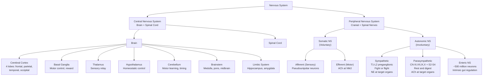
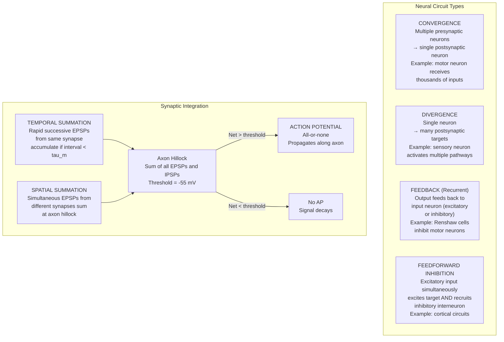
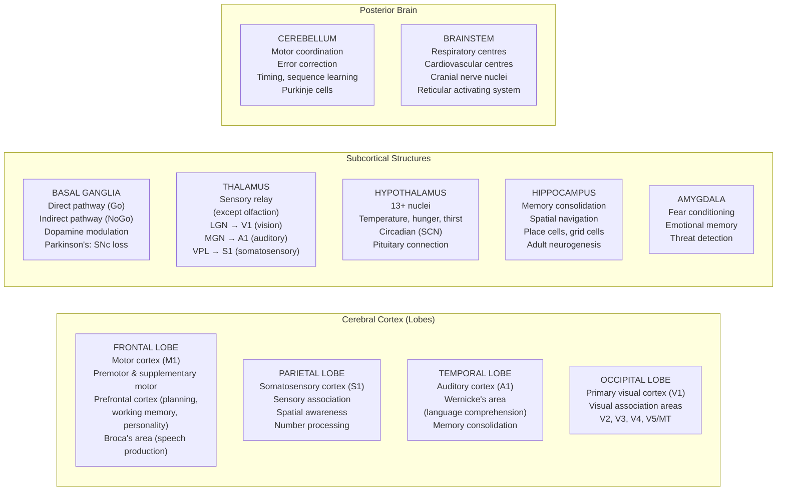

<!-- render:skip-beamer -->

# Nervous System and Neural Signalling

\label{sec:unit_IX_nervous_system}


<!-- chapter-metadata-badge -->
> **Ch 29** · Level 3/3 · 55 min read · 75 min lecture · Prerequisites: \cref{sec:unit_IX_circulation_respiration_homeostasis}

## Learning Objectives

1. Describe the organisation of the vertebrate nervous system (CNS, PNS) and the roles of glial cells.
2. Explain [**neuron**](#gl:neuron) structure and classify neuron types by function and morphology.
3. **Analyse** how the [**axon hillock**](#gl:axon-hillock) integrates competing excitatory and inhibitory synaptic inputs to determine whether the neuron fires.
4. Describe graded potentials, synaptic summation, and how the [**axon hillock**](#gl:axon-hillock) integrates inputs.
5. Compare the sympathetic and parasympathetic divisions of the autonomic nervous system.
6. Describe the major brain regions and their functions.
7. Describe sensory systems and neural plasticity.
8. **Calculate** the resting membrane potential from ion concentrations and relative permeabilities using the Goldman-Hodgkin-Katz equation.
9. **Predict** the direction and approximate magnitude of the $V_m$ shift produced by a stated change in K$^+$ permeability.

<!-- curriculum-scaffold-start -->
### Study Blueprint

- **Big idea:** Nervous systems compute with cells whose structure shapes information flow and behaviour.
- **Core concepts:** neurons, glia, circuits, sensory processing.
- **Framework alignment:** Vision & Change: Structure and function, Systems; AP Biology: Systems Interactions, Energetics; NGSS-style topics: Structure and Function.
- **Model or quantitative lens:** Cable-length, conduction, and simple circuit calculations.
- **Data skill:** Interpret neural data from anatomy, timing, or lesion evidence.
- **Practice cadence:** Visual Representations, Statistical Tests and Data Analysis, Argumentation.
- **Common misconception to repair:** The brain is not only neurons; glia and circuit context are essential to function.
- **Primary lab:** \cref{sec:lab_unit_IX_nervous_system}.
- **Question bank:** \cref{sec:q_unit_IX_nervous_system}.
- **Transfer task:** Transfer circuit reasoning to reflexes, sensory systems, learning, and disease.
- **Bridge to computation:** `biology.neuroscience.neuroscience.cable_voltage_attenuation`.
<!-- curriculum-scaffold-end -->

---

> **Opening Vignette — The Reflex That Revealed the Synapse**
> 
> In 1897, Charles Scott Sherrington coined the word "synapse" — from the Greek for "clasp" — to describe the morphological gap between neurons. Over four decades, working with decerebrate cats and dogs whose spinal cord reflexes could be studied in isolation, Sherrington showed that reflexes were not simple mechanical responses but involved integration: competing signals converged on motor neurons, inhibiting some pathways while exciting others, with the outcome depending on the algebraic summation of hundreds of inputs. His 1906 masterwork, *The Integrative Action \citep{sherrington1906} of the Nervous System*, established the principles of convergence, divergence, summation, inhibition, and the motor neuron as the "final common pathway." The electrical basis of these phenomena — [**action potential**](#gl:action-potential)s, EPSPs, IPSPs — was not known until Hodgkin, Huxley, and Eccles worked it out in the 1950s. Sherrington and Adrian shared the 1932 Nobel Prize; Eccles, Hodgkin, and Huxley shared the 1963 Nobel Prize. The synapse Sherrington named launched two Nobel Prizes' worth of discoveries.

## Nervous System Organisation

The human nervous system comprises approximately **86 billion neurons** and ~85 billion non-neuronal cells (Azevedo et al., 2009). It is organised hierarchically into two major divisions.


<!-- alt: Graph showing organisation of the vertebrate nervous system. The CNS (brain and spinal cord) integrates information. The PNS (somatic and autonomic divisions) connects the CNS to the body. The autonomic NS has sympathetic, parasympathetic, and enteric subdivisions. -->

*Organisation of the vertebrate nervous system. The CNS (brain and spinal cord) integrates information. The PNS (somatic and autonomic divisions) connects the CNS to the body. The autonomic NS has sympathetic, parasympathetic, and enteric subdivisions.*

- Blood-brain barrier (BBB): Tight junctions between endothelial cells + astrocyte endfeet
- Three meningeal layers: dura mater (tough outer), arachnoid mater (middle; CSF-filled subarachnoid space), pia mater (thin; adheres to brain surface)
- Bone: Cranium and vertebral column

**Peripheral nervous system (PNS):** Most nervous tissue outside the CNS. Includes 12 cranial nerves and 31 spinal nerve pairs.

---

## Neuron Types and Structure

### Neuron Classification

**By function:**
- **Sensory (afferent) neurons:** Carry information from sensory receptors toward CNS. Most are pseudounipolar (cell body off to one side of a single process that bifurcates).
- **Motor (efferent) neurons:** Carry commands from CNS to effectors (muscles, glands). Multipolar with long axons.
- **Interneurons:** Integration and processing within the CNS. Most numerous (~99% of neurons). Diverse morphologies.

**By morphology:**
- **Multipolar:** Multiple dendrites + one axon (most CNS neurons, most motor neurons)
- **Bipolar:** One dendrite + one axon (retinal bipolar cells, olfactory receptor neurons)
- **Pseudounipolar:** Single process that splits into peripheral and central branches (most sensory neurons in DRG)
- **Anaxonic:** No distinguishable axon (amacrine cells of retina; some interneurons)

### Neuron Structure

A typical neuron comprises:

- **Soma (cell body):** Contains nucleus, rough ER (Nissl substance), Golgi apparatus. Site of most [**protein**](#gl:protein) synthesis and metabolic activity. Diameter: 5-100 um.
- **Dendrites:** Receive synaptic inputs. Dendritic spines (0.5-2 um protrusions) increase surface area and compartmentalise Ca$^{2+}$ signals. A single cortical pyramidal neuron may have 10,000-30,000 dendritic spines.
- **Axon hillock:** Junction between soma and axon. Highest density of voltage-gated Na$^+$ channels (~800-1200/um$^2$). Lowest threshold for action potential initiation. The "decision-making" node.
- **Axon:** Signal conduction pathway. Myelinated or unmyelinated. Can extend >1 m (motor neurons to foot muscles). Axoplasmic transport: fast anterograde (kinesin, 200-400 mm/day for vesicles), slow anterograde (0.5-5 mm/day for cytoskeletal proteins), fast retrograde (dynein, 200-300 mm/day for recycled materials and trophic signals).
- **Axon terminal (bouton):** Contains synaptic vesicles (40-50 nm diameter, each containing ~5,000-10,000 neurotransmitter molecules). Active zone: specialised region of presynaptic membrane where vesicles dock and fuse.

---

## Glial Cells

| Glial type | Location | Key functions |
| ---------- | -------- | ------------ |
| **Astrocytes** | CNS | Metabolic support (lactate shuttle to neurons); BBB construction; K$^+$ spatial buffering; glutamate-glutamine recycling; tripartite synapse (modulate synaptic transmission); scar formation after injury |
| **Oligodendrocytes** | CNS | Myelination (one cell can myelinate segments on up to 50 axons simultaneously) |
| **Schwann cells** | PNS | Myelination (one cell per axon segment, ~1 mm internode); nerve repair via Bands of Bungner |
| **Microglia** | CNS | Resident macrophages; synaptic pruning (complement C1q/C3-tagged synapses phagocytosed); neuroinflammation; activated in Alzheimer's, TBI, MS |
| **Ependymal cells** | CNS | Line ventricles; ciliated surface moves CSF; produce CSF (together with choroid plexus; 450-500 mL/day; total CSF volume ~150 mL, replaced ~3 times/day) |
| **Radial glia** | Developing CNS | Neural stem cells; scaffold for neuronal migration (inside-out cortical layering); give rise to both neurons and glia |
| **Satellite cells** | PNS | Surround cell bodies in ganglia; analogous to astrocytes |

> **Clinical Connection:** Microglia-mediated synaptic pruning is essential during development (eliminating ~50% of synapses during adolescence). Dysregulated pruning has been linked to schizophrenia: the complement component C4A [**gene**](#gl:gene) is the strongest genetic risk factor for schizophrenia (Sekar et al., 2016, *Nature*). Individuals with high C4A expression show excessive synaptic pruning in prefrontal cortex during adolescence, correlating with symptom onset.

### Astrocytes — More Than Glue

Astrocytes were once considered passive support cells but are now recognised as active partners in synaptic transmission, brain metabolism, and homeostasis. A single cortical astrocyte contacts ~100,000–2,000,000 synapses through its fine processes ("perisynaptic astrocyte processes" or PAPs) — forming the third element of the **tripartite synapse** (presynaptic terminal + postsynaptic spine + astrocyte process).

**Key astrocyte functions:**

- **K$^+$ spatial buffering:** Following synaptic activity, extracellular K$^+$ rises locally. Astrocytes express high densities of inwardly-rectifying Kir4.1 channels and aquaporin-4 (AQP4) at endfeet on capillaries. K$^+$ enters astrocytes locally and exits at sites of low K$^+$ via the panastrocytic syncytium (gap junctions formed by connexin 43/30) — preventing extracellular K$^+$ accumulation that would depolarise neurons and disrupt firing.
- **Glutamate clearance:** EAAT1 and EAAT2 transporters (the "glutamate-aspartate transporters") on astrocytes clear ~90% of synaptically released glutamate. EAAT2/GLT-1 dysfunction is implicated in ALS (mutations) and excitotoxicity in stroke.
- **Glutamate-glutamine cycle:** Astrocytes convert glutamate to glutamine via glutamine synthetase, then export glutamine to neurons, where neurons reconvert it back to glutamate via glutaminase. This metabolically traps glutamate within neurons (glutamate is itself a metabolic intermediate that cannot be allowed to accumulate in extracellular space).
- **Astrocyte-neuron lactate shuttle:** Astrocytes preferentially perform glycolysis (express PFK1 and LDH-A) and export lactate. Active neurons take up lactate via MCT2 and use it as a major energy substrate during sustained activity. This "ANLS hypothesis" (Pellerin and Magistretti, 1994) explains the glucose-lactate metabolic coupling underlying fMRI BOLD signals.
- **Gliotransmission:** Activated astrocytes release glutamate, ATP, D-serine (an NMDA receptor co-agonist), and other transmitters via Ca$^{2+}$-dependent vesicle exocytosis or channel-mediated release — modulating synaptic transmission and plasticity.
- **Reactive astrogliosis:** After CNS injury, astrocytes hypertrophy, upregulate GFAP, and form glial scars. This both contains damage and inhibits axonal regeneration (chondroitin sulphate proteoglycans). Modulating reactive astrogliosis is a target for spinal cord injury therapeutics.

### Oligodendrocytes and Myelin

Oligodendrocytes wrap layers of plasma membrane around axons in the CNS. A single oligodendrocyte myelinates segments on up to **50 different axons** simultaneously (contrast with Schwann cells in PNS: one cell, one axon). The myelin sheath is up to **100 layers** thick, formed by repeated wrapping with extrusion of cytoplasm. The major proteins are:
- **Myelin basic protein (MBP):** Compaction of cytoplasmic faces. Major autoantigen in multiple sclerosis.
- **Proteolipid protein (PLP):** Compaction of extracellular faces. Mutations cause Pelizaeus-Merzbacher disease.
- **Myelin oligodendrocyte glycoprotein (MOG):** Outer surface; minor protein but major autoantigen in some demyelinating diseases (e.g., MOG antibody disease).

Myelin development continues into the third decade of life, particularly in prefrontal cortex — coinciding with maturation of executive function. Adult oligodendrocyte progenitor cells (OPCs, NG2+ cells) maintain a regenerative capacity, but it is incomplete after demyelinating injury.

### Microglia — Resident Macrophages of the CNS

Microglia derive from yolk-sac primitive macrophages that colonised the developing CNS before formation of the blood-brain barrier. They are **self-renewing** (independent of blood monocytes) and constitute ~10% of CNS cells.

**States and functions:**
- **Resting (surveillance):** Highly ramified processes constantly sample the parenchyma; turnover of most brain volume every few hours.
- **Activated (M1-like, pro-inflammatory):** Upon detection of pathogens (TLR ligands), tissue damage (DAMPs: ATP, HMGB1), or aggregated proteins (Aβ, α-synuclein) — retract processes, become amoeboid, secrete TNF-α, IL-1β, IL-6, NO; phagocytose debris.
- **Alternatively activated (M2-like, repair):** Secrete IL-10, TGF-β; promote tissue repair.
- **Synaptic pruning:** Microglia tag underused synapses with complement (C1q → C3) for phagocytic engulfment. Critical during development; pathological in Alzheimer's (excessive pruning in hippocampus) and schizophrenia (excessive pruning in prefrontal cortex during adolescence).

### Blood-Brain Barrier — Molecular Architecture

The **blood-brain barrier (BBB)** is a selective barrier between blood and brain parenchyma that excludes most polar molecules, ions, large molecules, and pathogens, while allowing essential nutrients to enter. It is formed by:

1. **Tight junctions** between brain capillary endothelial cells, sealed by claudin-5, occludin, JAM-1, and zonula occludens (ZO-1, ZO-2). Transendothelial electrical resistance is ~1500 Ω·cm$^2$ — orders of magnitude higher than peripheral capillaries (~10 Ω·cm$^2$).
2. **Pericytes** ensheathing the abluminal endothelial surface — regulate capillary diameter, BBB integrity, and angiogenesis.
3. **Astrocyte endfeet** with AQP4 channels — form a near-continuous covering of capillaries and signal to maintain endothelial tight junction integrity.
4. **Basement membrane** between endothelial cells and astrocyte endfeet.

**Transport mechanisms across the BBB:**
- **Diffusion:** Small lipophilic molecules (O$_2$, CO$_2$, ethanol, anaesthetics) cross freely.
- **Carrier-mediated transport:** GLUT1 (glucose); LAT1 (large neutral amino acids — competition explains why high-protein meals can affect L-DOPA delivery); MCT1 (lactate, ketone bodies).
- **Receptor-mediated transcytosis:** Insulin, transferrin (iron), leptin — receptors mediate endocytosis on the luminal side and exocytosis on the abluminal side. This is exploited to deliver therapeutics: a "Trojan horse" strategy fuses drugs to anti-transferrin-receptor antibodies.
- **Active efflux pumps:** **P-glycoprotein (P-gp/ABCB1)** and **BCRP/ABCG2** on the luminal surface actively pump substrates back into blood. Many lipophilic drugs that should enter the brain by passive diffusion are pumped out — explaining the limited brain penetration of many chemotherapies and the role of P-gp polymorphisms in inter-individual drug response.

**BBB-bypassing structures (circumventricular organs):** Subfornical organ, area postrema (chemotrigger zone), median eminence, neurohypophysis, OVLT, pineal gland — lack tight junctions and have fenestrated capillaries to allow hormones and circulating signals to reach specialised neurons (e.g., AT$_1$ on subfornical neurons → thirst).

> **Clinical Connection:** BBB breakdown contributes to many CNS diseases. In multiple sclerosis, autoreactive T cells must first cross the BBB (via VLA-4/VCAM-1 interaction); the monoclonal antibody **natalizumab** blocks VLA-4 and dramatically reduces relapses. In Alzheimer's, BBB pericyte dysfunction precedes overt neurodegeneration. In ischaemic stroke, BBB breakdown produces vasogenic oedema and haemorrhagic transformation. Pharmacologically, the BBB is the major obstacle to CNS drug delivery — about 2% of small molecules and 0% of biologics readily cross.

---

## Resting Membrane Potential


\begin{figure}[htbp]
\centering
\includegraphics[width=0.85\textwidth]{../figures/action_potential.png}
\caption{Hodgkin--Huxley action-potential simulation showing membrane voltage over time, resting potential, and threshold.}
\label{fig:unit_IX_action_potential}
\end{figure}
<!-- alt: Time-course plot of neuronal membrane potential in millivolts, rising rapidly from rest to a positive spike, repolarising below rest, and returning toward resting voltage with threshold and resting-potential reference lines. -->


### Ion Distribution and the Nernst Equation

The resting membrane potential (~$-70$ mV) arises from unequal ion distributions maintained by the Na$^+$/K$^+$-ATPase and selective membrane permeability.

**Typical neuronal ion concentrations:**

| Ion | Intracellular (mM) | Extracellular (mM) | Equilibrium Potential |
| --- | ------------------- | ------------------- | -------------------- |
| K$^+$ | 140 | 5 | $-89$ mV |
| Na$^+$ | 12 | 145 | $+67$ mV |
| Cl$^-$ | 7 | 110 | $-74$ mV |
| Ca$^{2+}$ | 0.0001 | 2 | $+132$ mV |

**Nernst equation** for a single ion:

\begin{equation}
E_X = \frac{RT}{zF} \ln\frac{[X]_o}{[X]_i} = \frac{61.5 \text{ mV}}{z} \log_{10}\frac{[X]_o}{[X]_i} \quad \text{(at 37°C)}
\label{eq:nervous_system_1}
\end{equation}

### Goldman-Hodgkin-Katz (GHK) Equation

The [**resting potential**](#gl:resting-potential) is a weighted average of equilibrium potentials, determined by relative membrane permeability to each ion:

\begin{equation}
V_m = \frac{RT}{F} \ln\frac{P_K[K^+]_o + P_{Na}[Na^+]_o + P_{Cl}[Cl^-]_i}{P_K[K^+]_i + P_{Na}[Na^+]_i + P_{Cl}[Cl^-]_o}
\label{eq:nervous_system_2}
\end{equation}

At rest, $P_K : P_{Na} : P_{Cl} \approx 1 : 0.04 : 0.45$, giving $V_m \approx -68$ mV.

The resting potential is dominated by **K$^+$** (highest resting conductance via KCNK leak channels). The Na$^+$/K$^+$-ATPase (3 Na$^+$ out, 2 K$^+$ in per ATP) is electrogenic, contributing ~$-3$ mV directly, but its main role is maintaining the concentration gradients.

**Concept Check:** If you suddenly doubled the extracellular K$^+$ concentration from 5 mM to 10 mM, what would happen to E$_K$ and the resting membrane potential? Calculate using the Nernst equation.

---

## Cable Properties and Passive Signal Spread

Before a graded potential can trigger an action potential at the axon hillock, it must travel electrotonically from the synapse. This passive spread is governed by the **cable properties** of the dendrite, modelled as a leaky electrical cable.

### Length Constant (λ)

The **space constant** (or length constant) λ determines how far a steady-state voltage change spreads along a dendrite or axon:

\begin{equation}
\lambda = \sqrt{\frac{r_m}{r_i}}
\label{eq:nervous_system_3}
\end{equation}

where $r_m$ = membrane resistance per unit length (Ω·cm) and $r_i$ = axial (cytoplasmic) resistance per unit length (Ω/cm).

\begin{equation}
V(x) = V_0 \, e^{-x/\lambda}
\label{eq:nervous_system_4}
\end{equation}

At distance $x = \lambda$, the voltage has decayed to $V_0/e \approx 37\%$ of its peak value.

**Typical values:**

| Structure | Diameter (µm) | λ (mm) | Implication |
| --------- | ------------- | -------------- | ----------- |
| Thin dendrite | 0.5 | ~0.1–0.2 | Distal synapses attenuate strongly before reaching soma |
| Large dendrite | 5 | ~0.5–1.0 | Better passive integration |
| Squid giant axon | 500 | ~5–7 | Enables long-distance spread in unmyelinated axon |
| Myelinated axon | 10 | ~2–5 | Myelin increases $r_m$, dramatically increasing λ |

**Key determinants of λ:**
- **Myelin** increases $r_m$ ~100-fold (reduces current leak) → λ increases ~10-fold
- **Larger diameter** reduces $r_i$ (more conducting cross-section) → λ increases
- **GABA$_A$ receptor activation** opens Cl$^-$ channels, reducing $r_m$ → λ decreases — a quantitative mechanism for **shunting inhibition** (nearby inhibitory synapses drastically reduce the effective length constant, terminating EPSP integration before reaching the hillock)

### Time Constant (τ_m)

The **membrane time constant** determines how fast the membrane voltage changes in response to a current:

\begin{equation}
\tau_m = r_m \cdot C_m
\label{eq:nervous_system_5}
\end{equation}

where $C_m \approx 1$ µF/cm² (specific membrane capacitance — nearly constant across cell types). Typical $\tau_m \approx 10$–$20$ ms for neurons.

\begin{equation}
V(t) = V_\infty \left(1 - e^{-t/\tau_m}\right)\quad \text{(voltage rising in response to a step current)}
\label{eq:nervous_system_6}
\end{equation}

**Significance:** $\tau_m$ governs the time window for **temporal summation** in neuronal membrane integration. If two EPSPs arrive within $\tau_m$ of each other at the same synapse, the second EPSP begins before the membrane has fully repolarized from the first, and the [**depolarisation**](#gl:depolarisation)s summate.

## Worked Example: Dendritic Length Constant

A cortical pyramidal neuron has $r_m = 40{,}000\;\Omega\text{·cm}$ and $r_i = 200\;\Omega/\text{cm}$ for a typical basal dendrite (diameter ~1 µm). What is the length constant?

\begin{equation}
\lambda = \sqrt{\frac{40{,}000}{200}} = \sqrt{200} \approx 14.1\;\text{cm?}
\label{eq:nervous_system_7}
\end{equation}

Wait — the formula uses *specific* membrane resistance per unit **length** for a cylinder. For a dendrite of radius $a$:

\begin{equation}
r_m(\text{per unit length}) = \frac{R_m}{2\pi a}, \quad r_i(\text{per unit length}) = \frac{R_i}{\pi a^2}
\label{eq:nervous_system_8}
\end{equation}

where $R_m$ = specific membrane resistance (~20{,}000 Ω·cm²) and $R_i$ = cytoplasmic resistivity (~100 Ω·cm). For $a = 0.5\;\mu$m $= 0.5 \times 10^{-4}$ cm:

\begin{equation}
r_m = \frac{20{,}000}{2\pi \times 5 \times 10^{-5}} \approx 6.37 \times 10^7\;\Omega/\text{cm}
\label{eq:nervous_system_9}
\end{equation}

\begin{equation}
r_i = \frac{100}{\pi \times (5 \times 10^{-5})^2} \approx 1.27 \times 10^{10}\;\Omega/\text{cm}
\label{eq:nervous_system_10}
\end{equation}

\begin{equation}
\lambda = \sqrt{\frac{r_m}{r_i}} = \sqrt{\frac{6.37 \times 10^7}{1.27 \times 10^{10}}} = \sqrt{0.00501} \approx 0.071\;\text{cm} = 0.71\;\text{mm}
\label{eq:nervous_system_11}
\end{equation}

This means a synapse on a thin distal dendrite 1.4 mm from the soma delivers primarily $e^{-2} \approx 13.5\%$ of its peak voltage to the hillock — illustrating how **dendritic location profoundly affects synaptic efficacy**, and why proximal synapses (closer to the hillock) have disproportionate influence.

> **Clinical Connection:** Peripheral neuropathy (e.g., from diabetes, chemotherapy, or Guillain-Barré syndrome) reduces $r_m$ in peripheral axons by disrupting myelin or causing axonal damage. The resulting decrease in λ causes voltage signals to decay faster along the axon, slowing conduction and reducing EPSP efficacy at nerve-muscle junctions — producing the characteristic distal-to-proximal weakness and sensory loss of a length-dependent neuropathy.

---

## Graded Potentials and Synaptic Integration

### Graded Potentials

**Excitatory postsynaptic potentials (EPSPs):** Depolarising events (typically caused by Na$^+$ or mixed cation influx through ionotropic receptors like AMPA). Amplitude proportional to stimulus strength. Decay with distance (electrotonic spread governed by the length constant λ).

**Inhibitory postsynaptic potentials (IPSPs):** Hyperpolarising events (Cl$^-$ influx through GABA$_A$ receptors or K$^+$ efflux through GABA$_B$-activated K$^+$ channels). Shunting inhibition: even if IPSP does not change $V_m$ much, opening Cl$^-$ channels increases membrane conductance, reducing the effectiveness of nearby EPSPs.

### Summation at the Axon Hillock


<!-- alt: Flowchart showing neural circuit types and synaptic integration. Convergence allows integration of multiple inputs; divergence allows signal distribution. At the axon hillock, temporal and spatial summation of EPSPs and IPSPs determine whether threshold is reached. -->

*Neural circuit types and synaptic integration. Convergence allows integration of multiple inputs; divergence allows signal distribution. At the axon hillock, temporal and spatial summation of EPSPs and IPSPs determine whether threshold is reached.*

If the net depolarisation at the axon hillock exceeds threshold (~$-55$ mV), an most-or-none action potential is generated, with the stereotyped Na$^+$- and K$^+$-driven waveform of rise, peak, and hyperpolarisation shown in \cref{fig:unit_IX_action_potential}. The axon hillock has the highest density of Nav1.2 and Nav1.6 channels, making it the lowest-threshold site.

**Strategic placement of inhibition:** Inhibitory synapses (GABA$_A$) are preferentially located on the soma and proximal dendrites, positioned to maximally dampen axon hillock depolarisation.

---

## Autonomic Nervous System

The [**autonomic nervous system (ANS)**](#gl:autonomic-nervous-system) regulates involuntary functions through two antagonistic divisions:

### Sympathetic Division ("Fight or Flight")

- **Preganglionic neurons:** T1-L2 spinal cord (thoracolumbar outflow). Short preganglionic fibres to paravertebral (sympathetic chain) or prevertebral ganglia.
- **Preganglionic neurotransmitter:** ACh at nicotinic receptors
- **Postganglionic neurotransmitter:** Norepinephrine (NE) at α and β adrenergic receptors on target organs
- **Exception:** Adrenal medulla -- preganglionic sympathetic fibres synapse directly on chromaffin cells (modified postganglionic neurons) that release epinephrine (80%) and NE (20%) into blood as [**hormone**](#gl:hormone)s

**Sympathetic effects:** Increased HR ($\beta_1$), bronchodilation ($\beta_2$), pupil dilation (mydriasis), inhibited GI motility, glycogenolysis in liver ($\beta_2$), vasoconstriction ($\alpha_1$) in skin/viscera, vasodilation ($\beta_2$) in skeletal muscle.

### Parasympathetic Division ("Rest and Digest")

- **Preganglionic neurons:** Brainstem (CN III, VII, IX, X) and sacral spinal cord (S2-S4; craniosacral outflow). Long preganglionic fibres to terminal ganglia near or within target organs.
- **Both neurotransmitters:** ACh. Preganglionic: nicotinic receptors. Postganglionic: muscarinic receptors (M1-M5) on target organs.
- **Vagus nerve (CN X):** Carries ~75% of parasympathetic fibres; innervates heart, lungs, GI tract to splenic flexure.

**Parasympathetic effects:** Decreased HR (M$_2$), bronchoconstriction (M$_3$), pupil constriction (miosis), increased GI motility and secretion, bladder contraction.

### Enteric Nervous System

- ~500 million neurons in the gut wall (more than in the spinal cord)
- **Myenteric (Auerbach's) plexus:** Between longitudinal and circular muscle layers; controls motility
- **Submucosal (Meissner's) plexus:** Controls secretion and blood flow
- Uses many neurotransmitters: ACh, NO, serotonin, substance P, VIP
- Can function autonomously but is modulated by sympathetic (generally inhibitory) and parasympathetic (generally excitatory) input

> **Clinical Connection:** Understanding ANS pharmacology is fundamental to medicine. Beta-blockers ($\beta_1$ antagonists: metoprolol, atenolol) are first-line treatments for hypertension, heart failure, and arrhythmias. Atropine (muscarinic antagonist) treats bradycardia. Prazosin ($\alpha_1$ antagonist) treats hypertension and PTSD nightmares. Pilocarpine (muscarinic agonist) treats glaucoma by promoting aqueous humour drainage.

---

## Brain Anatomy and Function


<!-- alt: Graph showing major brain regions and their functions. The cerebral cortex is divided into four lobes with specialised functions. Subcortical structures handle motor control (basal ganglia), sensory relay (thalamus), homeostasis (hypothalamus), memory (hippocampus), and emotion (amygdala). The cerebellum coordinates movement, and the brainstem controls vital functions. -->

*Major brain regions and their functions. The cerebral cortex is divided into four lobes with specialised functions. Subcortical structures handle motor control (basal ganglia), sensory relay (thalamus), [**homeostasis**](#gl:homeostasis) (hypothalamus), memory (hippocampus), and emotion (amygdala). The cerebellum coordinates movement, and the brainstem controls vital functions.*

### Cerebral Cortex

The cortex is ~3 mm thick, contains ~20 billion neurons, and has a surface area of ~2,500 cm$^2$ (increased by folding into gyri and sulci).

- **Motor homunculus:** Topographic representation of body parts on the primary motor cortex (precentral gyrus). Hands and face have disproportionately large representations (fine motor control).
- **Sensory homunculus:** Topographic representation on the primary somatosensory cortex (postcentral gyrus). Hands, lips, and tongue are overrepresented (high receptor density).
- **Broca's area** (left inferior frontal gyrus): Speech production. Damage causes non-fluent (expressive) aphasia -- comprehension intact but speech production impaired.
- **Wernicke's area** (left posterior superior temporal gyrus): Language comprehension. Damage causes fluent (receptive) aphasia -- speech flows but is nonsensical.

### Basal Ganglia

The basal ganglia (caudate, putamen, globus pallidus, subthalamic nucleus, substantia nigra) modulate cortical motor output:

- **Direct pathway (Go):** Cortex excites striatum; striatum inhibits GPi/SNr (GABAergic); GPi/SNr normally inhibit thalamus. Net effect: disinhibition of thalamus, promoting movement.
- **Indirect pathway (NoGo):** Cortex excites striatum; striatum inhibits GPe; GPe normally inhibits STN; STN excites GPi/SNr. Net effect: increased GPi/SNr inhibition of thalamus, suppressing movement.
- **Dopamine:** Substantia nigra pars compacta (SNc) neurons release dopamine onto striatal neurons. D1 receptors excite direct pathway neurons; D2 receptors inhibit indirect pathway neurons. Net: dopamine facilitates movement.

**Parkinson's disease:** Degeneration of SNc dopaminergic neurons (>60% loss before symptoms appear). Loss of dopamine removes facilitation of movement, causing: bradykinesia (slow movement), rigidity, resting tremor, postural instability. Treatment: L-DOPA (dopamine precursor crosses BBB); deep brain stimulation of STN.

### Other Key Structures

**Cerebellum:** Contains more neurons than the rest of the brain combined (~70 billion granule cells). Functions: motor coordination, error correction (compares intended vs actual movement), timing, motor learning, balance. Damage causes ataxia (uncoordinated movement) but not paralysis.

**Hippocampus:** Essential for consolidating declarative (episodic and semantic) memories from short-term to long-term storage. Contains place cells (fire at specific locations; O'Keefe, Nobel 2014) and grid cells (fire in a hexagonal spatial pattern; Moser and Moser, Nobel 2014). One of few brain regions with confirmed adult neurogenesis (dentate gyrus).

**Hypothalamus:** Homeostatic control centre with 13+ nuclei controlling: temperature, hunger/satiety, thirst, circadian rhythms (suprachiasmatic nucleus, SCN), autonomic output, and endocrine function (connects to pituitary via the hypothalamo-hypophyseal portal system).

**Spinal cord:** Grey matter (butterfly-shaped, contains neuronal cell bodies): dorsal horn (sensory processing), ventral horn (motor neuron cell bodies), lateral horn (T1-L2: sympathetic preganglionic neurons). White matter (surrounding, myelinated tracts): ascending (sensory, e.g., spinothalamic tract for pain/temperature) and descending (motor, e.g., corticospinal tract for voluntary movement).

---

## Sensory Systems

### Somatosensation

| Receptor Type | Stimulus | Adaptation | Modality |
| ------------- | -------- | ---------- | -------- |
| Meissner's corpuscle | Light touch, texture | Rapidly adapting | Fine touch discrimination |
| Merkel's disc | Sustained pressure | Slowly adapting | Shape, edge detection |
| Pacinian corpuscle | Vibration, deep pressure | Rapidly adapting | Vibration detection |
| Ruffini ending | Skin stretch | Slowly adapting | Joint position, stretch |
| Free nerve endings | Pain, temperature | Variable | Nociception, thermoreception |

**Nociception:** Two fibre types carry pain signals:
- **A-delta fibres:** Thinly myelinated (5-30 m/s). Sharp, well-localised "first pain"
- **C fibres:** Unmyelinated (0.5-2 m/s). Dull, diffuse "second pain"

### Visual Pathway

Retina (photoreceptors: rods for dim light/peripheral vision; cones for colour/acuity) to optic nerve to optic chiasm (nasal fibres cross) to **lateral geniculate nucleus (LGN)** of thalamus to primary visual cortex (V1, striate cortex) in occipital lobe.

Beyond V1, visual processing splits into:
- **Dorsal stream** ("where/how"): V1 to posterior parietal cortex. Motion, spatial relationships, visually guided action.
- **Ventral stream** ("what"): V1 to inferotemporal cortex. Object recognition, face recognition, colour.

### Proprioception

Muscle spindles (detect muscle length and stretch velocity), Golgi tendon organs (detect muscle tension), and joint receptors provide unconscious awareness of body position. Information travels via dorsal column-medial lemniscal pathway (proprioception, fine touch) or spinocerebellar tracts (to cerebellum for motor coordination).

### Musculoskeletal Control and Behaviour

Skeletal movement is a loop, not a one-way command. Alpha motor neurons release acetylcholine at the neuromuscular junction; muscle fibres depolarise, release Ca$^{2+}$ from the sarcoplasmic reticulum, and contract by the sliding-filament mechanism in which myosin heads cyclically bind actin, pull, detach, and reset \citep{huxley1954sliding}. Sensory feedback closes the loop: muscle spindles report length, Golgi tendon organs report tension, cutaneous mechanoreceptors report contact, and vestibular inputs report head acceleration. Reflexes are therefore local control policies embedded in a larger behavioural system, not primitive leftovers.

Behavioural biology adds four levels of explanation that should not be collapsed: mechanism (the neural and hormonal circuit), development (how the behaviour changes across life), function (what fitness problem it solves), and evolutionary history (how related species differ) \citep{tinbergen1963aims}. A startle reflex, bird song, courtship display, or human reaching movement can be read through those four levels. The organismal habit is to ask which sensory cue, motor effector, motivational state, developmental window, and ecological payoff are actually supported by the evidence.

---

## Brain Imaging — Reading Activity Through Indirect Signals

Modern neuroscience and clinical neurology rely on a portfolio of imaging modalities, each measuring a different physical correlate of neural activity.

### fMRI and the BOLD signal

**Functional MRI (fMRI)** measures the **blood-oxygen-level-dependent (BOLD)** signal, which exploits a magnetic-resonance peculiarity of haemoglobin: oxyhaemoglobin is **diamagnetic**, while deoxyhaemoglobin is **paramagnetic** and distorts the local T2*-weighted MR signal. Active brain regions paradoxically *increase* local oxyhaemoglobin (and decrease deoxyhaemoglobin) within seconds, because the **neurovascular coupling** response over-supplies blood relative to the metabolic demand. The mismatch between blood-flow increase (~50%) and O$_2$ extraction increase (~5–20%) produces the **BOLD signal rise**, peaking ~5 s after activity onset.

The neurovascular coupling that drives BOLD is mediated largely by astrocytes (recall the astrocyte tripartite synapse): synaptic glutamate elevates astrocytic Ca$^{2+}$, which releases vasoactive arachidonic acid metabolites (PGE$_2$, EETs) onto local arterioles. The astrocyte-neuron lactate shuttle (ANLS) is the metabolic coupling underlying fMRI BOLD signals.

BOLD does *not* measure spike rates directly; it measures the haemodynamic response to recent local-field-potential activity. fMRI excels at spatial localisation (~1–3 mm) but trades temporal resolution (seconds) — the inverse trade-off compared with EEG.

### EEG and oscillation bands

**Electroencephalography (EEG)** measures the summed extracellular electrical potentials produced by synchronised cortical pyramidal-neuron currents. EEG has millisecond temporal resolution but limited spatial localisation (~1–2 cm). Brain rhythms occupy distinct frequency bands tied to behavioural states:

| Band | Frequency (Hz) | Dominant state | Generator / function |
| ---- | -------------- | -------------- | -------------------- |
| **Delta (δ)** | 0.5–4 | Deep NREM sleep (N3); coma; infancy | Thalamocortical bursts; slow-wave sleep; memory consolidation |
| **Theta (θ)** | 4–8 | Drowsiness; REM; hippocampal navigation | Hippocampal "theta rhythm"; encoding of new memories |
| **Alpha (α)** | 8–13 | Awake, eyes-closed, relaxed (occipital) | Posterior cortical idling; suppressed by visual attention |
| **Beta (β)** | 13–30 | Awake, focused; anxious; motor tasks | Cortical activation; motor planning (sensorimotor cortex) |
| **Gamma (γ)** | 30–80+ | Sensory binding; conscious perception | Local cortical inhibitory networks (PV interneurons) |

Clinical EEG is the bedside tool for diagnosing **epilepsy** (interictal spikes; rhythmic ictal patterns), **encephalopathy** (generalised slowing), and **brain death** (electrocerebral silence). MEG (magnetoencephalography) measures the same neuronal currents via tiny magnetic fields with better localisation than EEG.

### Connectivity, MEG, NIRS, PET

- **Diffusion tensor imaging (DTI):** Maps white-matter tracts by measuring water diffusion anisotropy along axons. Used in stroke, traumatic axonal injury, neurosurgical planning.
- **Resting-state fMRI:** Identifies networks of co-fluctuating brain regions (default mode network, salience network, frontoparietal control). Disturbances correlate with depression, schizophrenia, Alzheimer's.
- **PET (positron emission tomography):** Tracer-based metabolic or receptor-binding imaging; FDG-PET shows glucose uptake (epilepsy localisation, dementia patterns); amyloid-PET (florbetapir) and tau-PET enable Alzheimer's disease characterisation.
- **NIRS (near-infrared spectroscopy):** Optical analogue of fMRI; portable; used in neonatal monitoring and bedside cerebral oximetry.

### Neural Prosthetics and Brain-Computer Interfaces

Brain-computer interfaces (BCIs) and neural prosthetics convert neural activity into an external action or stimulation pattern. The strongest current speech demonstrations are still experimental implants, not consumer mind-reading devices: 2023 intracortical speech neuroprostheses decoded attempted speech into text or avatar control at high performance in single-participant research settings \citep{willett2023speechneuroprosthesis,metzger2023avatarneuroprosthesis}. The scientific claim is therefore bounded: motor and speech cortices contain decodable intention signals, but clinical translation requires stable implants, calibration, infection and tissue-response management, privacy safeguards, and evidence that performance generalises beyond highly supported trials.

---

## Pain Pathways

Pain is the body's most clinically important sensory modality and serves both protective and pathological roles.

### Nociceptors and transduction

Free nerve endings of A-delta and C fibres express **molecular sensors** that transduce noxious stimuli into membrane depolarisation:

- **TRPV1:** Capsaicin- and heat-activated (>43 °C); also activated by acidic pH and inflammatory lipids. Resiniferatoxin and lidocaine-soaked TRPV1 agonist patches deplete nociceptors of substance P.
- **TRPM8:** Cold- and menthol-activated (15–25 °C).
- **TRPA1:** Mustard oil, cinnamaldehyde, environmental irritants; cold-activated in some species.
- **ASICs (acid-sensing ion channels):** Activated by tissue acidosis (ischaemia, inflammation).
- **Nav1.7 (SCN9A):** Voltage-gated Na$^+$ channel essential for nociceptor excitability. *Loss-of-function* mutations cause **congenital insensitivity to pain (CIP)** — patients fail to detect injuries and self-mutilate. *Gain-of-function* mutations cause **inherited erythromelalgia** (severe burning pain). Nav1.7-selective inhibitors are in clinical development as non-opioid analgesics.

### Ascending pathway — the spinothalamic tract

A-delta and C fibres release glutamate **and substance P** into the dorsal horn of the spinal cord (lamina I, II, V). Second-order neurons cross the midline (anterior white commissure), ascend in the contralateral **spinothalamic tract**, and synapse in the ventral posterolateral (VPL) nucleus of the thalamus. Third-order neurons project to primary somatosensory cortex (S1), insula (interoceptive), and anterior cingulate (affective dimension of pain). Substance P binds NK1 receptors on second-order neurons; the combined glutamate-Substance P transmission distinguishes pain from innocuous somatosensation.

### Descending modulation

The brain actively **suppresses** ongoing pain signalling through descending circuits:

- **Periaqueductal grey (PAG)** in the midbrain receives input from cortex, hypothalamus, and amygdala
- PAG activates the **rostral ventromedial medulla (RVM)**
- RVM serotonergic neurons project to the **dorsal horn (DH)**, where they release serotonin, noradrenaline, and endogenous opioids onto pain-transmission neurons

This **PAG → RVM → DH** axis is the substrate for **stress-induced analgesia** (hand-on-flame reflex without pain in life-or-death situations) and for the placebo effect. Endogenous opioids (β-endorphin, enkephalin, dynorphin) acting on μ-, δ-, and κ-opioid receptors are released along this axis. **Morphine and other opioid analgesics** exploit the same descending pathway.

**Gate control theory** (Melzack & Wall, 1965): A-β fibres (mechanoreceptors, "innocuous touch") activate inhibitory interneurons in the dorsal horn that "gate" C-fibre transmission — the basis for **rubbing a stubbed toe** to reduce pain, and the rationale for **TENS (transcutaneous electrical nerve stimulation)** therapy.

> **Clinical Connection:** Chronic neuropathic pain (post-herpetic neuralgia, diabetic neuropathy) reflects maladaptive central sensitisation — peripheral nerve injury upregulates Nav1.7/1.8 in nociceptors, expands receptive fields, and reduces descending inhibition. Treatments include gabapentinoids (target α$_2\delta$ subunits of voltage-gated Ca$^{2+}$ channels), SNRIs (boost descending serotonin/noradrenaline), and topical lidocaine (Nav blocker).

---

## Sleep — Two-Process Model

Sleep is not the absence of brain activity but a structured succession of states with distinct functions.

### Architecture

Adult sleep cycles between **NREM** (further divided into N1, N2, N3) and **REM** stages, each cycle ~90 minutes:

- **N1 (light):** Theta activity; transition from waking
- **N2:** Sleep spindles (12–14 Hz thalamic bursts) and K-complexes; ~50% of total sleep
- **N3 (slow-wave / deep):** Delta-dominant; "homeostatic" sleep restoring tissue and consolidating declarative memory; **glymphatic clearance** of brain metabolites including amyloid-β
- **REM (paradoxical):** Low-amplitude desynchronised EEG resembling waking; rapid eye movements; **muscle atonia** (mediated by glycinergic inhibition of motor neurons by sublateral dorsal nucleus); vivid dreams; consolidation of procedural and emotional memory

REM proportion is maximal in infancy (~50% of sleep) and declines with age. Sleep deprivation produces a "REM rebound" — REM disproportionately recovers after deprivation, suggesting it serves a critical function.

### The two-process model (Borbély, 1982)

Sleep timing is regulated by two interacting processes:

- **Process C (Circadian):** Sinusoidal drive from the suprachiasmatic nucleus (SCN) of the hypothalamus, entrained by light via the retinohypothalamic tract. Promotes wakefulness during the day and sleep at night; mediated by hypothalamic circuits including the ventrolateral preoptic nucleus (VLPO, sleep-promoting) and orexin/hypocretin neurons of the lateral hypothalamus (wake-promoting).
- **Process S (Sleep homeostasis):** Increases monotonically during waking and dissipates exponentially during sleep. Its molecular substrate is largely **adenosine**, which accumulates in basal forebrain during sustained activity (from local ATP catabolism). Adenosine acting on A$_1$ receptors inhibits wake-promoting neurons; acting on A$_{2A}$ receptors in the ventral striatum, it promotes sleep. **Caffeine** (an adenosine A$_1$/A$_{2A}$ antagonist) blocks Process S — this is its mechanism for reducing sleep pressure.

Sleep occurs when Process C (low) coincides with Process S (high). Disruption of either process produces sleep disorders: SCN damage (or shift work) disrupts Process C, producing irregular sleep timing; insomnia often reflects elevated arousal that overrides Process S.

### Functions of sleep

- **Memory consolidation:** Slow-wave sleep replays hippocampal place-cell sequences; REM consolidates emotional and procedural memory.
- **Glymphatic clearance:** During NREM, the brain's glymphatic (glial-lymphatic) system expands extracellular space ~60% and accelerates CSF–ISF exchange, clearing amyloid-β, tau, and other metabolites. Chronic sleep deprivation is a recognised risk factor for Alzheimer's disease.
- **Synaptic homeostasis (Tononi-Cirelli hypothesis):** Wake-time learning produces net synaptic potentiation; sleep allows broad synaptic downscaling, restoring information capacity.
- **Metabolic and immune restoration:** GH and prolactin peak during deep sleep; cytokine cycling supports immune surveillance.

> **Clinical Connection:** Narcolepsy type 1 results from loss of orexin/hypocretin neurons (autoimmune destruction in genetically susceptible individuals). Without orexin, Process C cannot stably maintain wakefulness, producing daytime sleepiness, REM intrusion into wake (cataplexy, sleep paralysis, hallucinations). Treatment includes modafinil (wake-promoting), sodium oxybate (consolidates sleep), and emerging orexin receptor agonists.

---

## Neural Plasticity

**Hebbian learning:** "Neurons that fire together wire together" \citep{hebb1949}. Correlated pre- and postsynaptic activity strengthens synaptic connections.

**Long-term potentiation (LTP):** Activity-dependent, long-lasting increase in synaptic efficacy. At Schaffer collateral to CA1 synapses in hippocampus:
1. High-frequency stimulation depolarises postsynaptic membrane enough to relieve Mg$^{2+}$ block of NMDA receptors
2. Ca$^{2+}$ influx through NMDA receptors activates CaMKII
3. CaMKII phosphorylates AMPA receptors (increased conductance) and promotes AMPA receptor insertion into synapse
4. Structural plasticity: Dendritic spine enlargement, new spine formation

**Long-term depression (LTD):** Opposite of LTP. Low-frequency stimulation activates protein phosphatases (PP1, calcineurin) that dephosphorylate AMPA receptors and promote their [**endocytosis**](#gl:endocytosis). Weakens synaptic connections.

**Homeostatic plasticity:** Synaptic scaling adjusts the overall strength of most synapses on a neuron to maintain a stable firing rate. If a neuron's activity is chronically reduced, it scales up most synaptic strengths; if chronically increased, it scales them down. This prevents runaway excitation or silencing.

**Critical periods \citep{beggs2003}:** Windows during development when experience has maximal impact on neural circuit formation. Monocular deprivation during the visual critical period (~birth to age 5 in humans) permanently reduces cortical responsiveness to the deprived eye (amblyopia). Molecular brakes on plasticity include perineuronal nets (PNNs), myelin-associated inhibitors, and GABA maturation.

**Concept Check:** Explain why the NMDA receptor is called a "coincidence detector" and why this property makes it ideal for Hebbian learning.

---

## Worked Example

**Problem:**
Calculate the equilibrium potential for potassium ($E_K$) in a mammalian neuron at $37^\circ\text{C}$, given an intracellular potassium concentration $[K^+]_i$ of $140\text{ mM}$ and an extracellular concentration $[K^+]_o$ of $5\text{ mM}$.

The Nernst equation for a monovalent cation at $37^\circ\text{C}$ is:
$$E_K = 61.5\text{ mV} \times \log_{10}\left(\frac{[K^+]_o}{[K^+]_i}\right) \label{eq:unit_IX_nervous_system_item_1}$$


**Solution:**

**Step 1. Identify the given variables.**
- $[K^+]_o = 5\text{ mM}$
- $[K^+]_i = 140\text{ mM}$

**Step 2. Substitute the values into the Nernst equation.**
$$E_K = 61.5\text{ mV} \times \log_{10}\left(\frac{5}{140}\right) \label{eq:unit_IX_nervous_system_item_2}$$


**Step 3. Calculate the logarithm.**
$$\frac{5}{140} \approx 0.0357 \label{eq:unit_IX_nervous_system_item_3}$$

$$\log_{10}(0.0357) \approx -1.447 \label{eq:unit_IX_nervous_system_item_4}$$


**Step 4. Determine the final potential.**
$$E_K = 61.5\text{ mV} \times (-1.447) \approx -89\text{ mV} \label{eq:unit_IX_nervous_system_item_5}$$


**Answer:**
The equilibrium potential for potassium is approximately **$-89\text{ mV}$**.

---

## Worked Example: Resting Potential from the Goldman-Hodgkin-Katz Equation

**Problem:**
Calculate the resting membrane potential of a mammalian neuron at $37^\circ\text{C}$ using the Goldman-Hodgkin-Katz (GHK) equation, given the ion concentrations $[K^+]_o = 5\text{ mM}$, $[K^+]_i = 140\text{ mM}$, $[Na^+]_o = 145\text{ mM}$, $[Na^+]_i = 12\text{ mM}$, $[Cl^-]_o = 110\text{ mM}$, $[Cl^-]_i = 7\text{ mM}$, and the resting permeability ratio $P_K : P_{Na} : P_{Cl} = 1 : 0.04 : 0.45$.

The GHK voltage equation, written in base-10 form for a $37^\circ\text{C}$ neuron, is:
$$V_m = 61.5\text{ mV} \times \log_{10}\left(\frac{P_K[K^+]_o + P_{Na}[Na^+]_o + P_{Cl}[Cl^-]_i}{P_K[K^+]_i + P_{Na}[Na^+]_i + P_{Cl}[Cl^-]_o}\right)$$

Note that the Cl$^-$ terms are inverted relative to the cations (a consequence of the $z = -1$ charge): the outside-flux numerator carries $[Cl^-]_i$ and the inside-flux denominator carries $[Cl^-]_o$.

**Solution:**

**Step 1. Form the numerator (outward-driving terms), in mM.**
$$P_K[K^+]_o + P_{Na}[Na^+]_o + P_{Cl}[Cl^-]_i = (1)(5) + (0.04)(145) + (0.45)(7) = 5 + 5.8 + 3.15 = 13.95$$

**Step 2. Form the denominator (inward-driving terms), in mM.**
$$P_K[K^+]_i + P_{Na}[Na^+]_i + P_{Cl}[Cl^-]_o = (1)(140) + (0.04)(12) + (0.45)(110) = 140 + 0.48 + 49.5 = 189.98$$

**Step 3. Take the ratio and its base-10 logarithm.**
$$\frac{13.95}{189.98} \approx 0.0734, \qquad \log_{10}(0.0734) \approx -1.134$$

**Step 4. Scale by the $37^\circ\text{C}$ Nernst slope.**
$$V_m = 61.5\text{ mV} \times (-1.134) \approx -69.7\text{ mV}$$

**Answer:**
The resting membrane potential is approximately **$-70\text{ mV}$** — close to $E_K$ ($-89$ mV) but depolarised relative to it because the finite Na$^+$ and Cl$^-$ permeabilities pull $V_m$ toward their (more positive) equilibrium potentials. The K$^+$ term dominates because $P_K$ is the largest permeability.

**Concept Check:** If $P_{Na}$ rose tenfold (from 0.04 to 0.40) while $P_K$ and $P_{Cl}$ were unchanged, predict the new sign of the numerator-vs-denominator imbalance and whether $V_m$ moves toward $E_{Na}$ or $E_K$.

**Concept Check:** At rest, which single term in the GHK numerator and denominator contributes the most to $V_m$, and predict how $V_m$ changes if $P_K$ is doubled while most concentrations are held fixed.

---

## Current Evidence and Frontier Biology

For **Nervous System and Neural Signalling**, frontier biology belongs inside the evidence logic of
the chapter. Physiology now blends mechanism with allostasis, immune-endocrine-neural coupling, wearable data, and individualized risk without reducing bodies to simple machines. The core reading question is this: neural explanations should separate circuit architecture, glial support, plasticity, behaviour, and evidence scale.

- **What to verify:** identify the observation, model, assay, or dataset that
  would make the claim stronger or weaker.
- **What to qualify:** state the scale, organism, cell type, environmental
  condition, or population where the claim is expected to hold.
- **What to compare:** test at least one alternative explanation, baseline, or
  null model before treating the pattern as causal.
- **What to cite:** distinguish primary evidence, review synthesis, public
  dataset, and institutional guidance; for recent or numeric claims, prefer
  the source closest to the measurement and state what has changed since it was
  published.

Interpret physiological data by separating baseline variation, perturbation response, compensation, and the threshold where compensation becomes pathology.

**Source practice:** For physiology claims, cite the measurement context and distinguish baseline variation, compensation, pathophysiology, and treatment evidence.

## Key Terms

| Term | Definition |
| ---- | ---------- |
| **Resting membrane potential** | Electrochemical potential across neuronal membrane at rest; ~$-70$ mV |
| **Nernst potential** | Voltage at which net flux of a single ion species = 0 |
| **GHK equation** | Multi-ion extension of Nernst; weights each ion by membrane permeability |
| **EPSP** | Excitatory postsynaptic potential: depolarisation toward threshold |
| **IPSP** | Inhibitory postsynaptic potential: hyperpolarisation or shunting inhibition |
| **Axon hillock** | Lowest threshold region; highest Nav channel density; AP initiation site |
| **Tripartite synapse** | Presynaptic + postsynaptic + astrocyte glial process |
| **Sympathetic NS** | Thoracolumbar outflow; fight or flight; NE on adrenergic receptors |
| **Parasympathetic NS** | Craniosacral outflow; rest and digest; ACh on muscarinic receptors |
| **Basal ganglia** | Subcortical nuclei modulating motor output; direct (Go) and indirect (NoGo) pathways |
| **LTP** | Long-term potentiation; Hebbian strengthening of synaptic connections |
| **LTD** | Long-term depression; weakening of synaptic connections |
| **Broca's area** | Left inferior frontal gyrus; speech production |
| **Wernicke's area** | Left superior temporal gyrus; language comprehension |
| **Place cells** | Hippocampal neurons firing at specific spatial locations |
| **Microglia** | CNS resident macrophages; synaptic pruning; neuroinflammation |
| **Myelin** | Lipid-rich insulation produced by oligodendrocytes (CNS) or Schwann cells (PNS) |
| **Na$^+$/K$^+$-ATPase** | Pump maintaining ion gradients; 3 Na$^+$ out, 2 K$^+$ in per ATP |

---

## Review Questions

1. Calculate E$_K$ using the Nernst equation for a neuron with [K$^+$]$_{in}$ = 150 mM and [K$^+$]$_{out}$ = 4 mM at 37 degrees C. How does this compare to the resting potential of $-70$ mV, and what accounts for the difference?

2. Compare the sympathetic and parasympathetic divisions in terms of: (a) spinal cord origin, (b) preganglionic fibre length, (c) neurotransmitters at ganglia and target organs, (d) receptor types, and (e) effects on heart rate.

3. A patient presents with non-fluent speech but intact comprehension. Which brain region is likely damaged? What would you expect on MRI? How does this differ from damage to Wernicke's area?

4. Explain the direct and indirect pathways of the basal ganglia. How does loss of dopaminergic input from SNc (as in Parkinson's disease) shift the balance between these pathways, and why does this cause bradykinesia?

5. Explain synaptic pruning and its relationship to microglia and complement proteins. What evidence links synaptic pruning dysregulation to schizophrenia risk? (Sekar et al. 2016, *Nature*: C4A).

6. A researcher applies a blocker of KCNK leak potassium channels to a neuron. Predict the effect on (a) resting membrane potential, (b) the relative contribution of Na$^+$ to the resting potential, and (c) neuronal excitability.

7. Compare ionotropic and metabotropic receptors in terms of structure, speed, ionic selectivity, and role in modulating synaptic gain. Give one clinical example for each class.

8. Explain why inhibitory synapses are strategically placed on the soma and proximal dendrites rather than on distal dendrites. How does the concept of shunting inhibition differ from hyperpolarising inhibition?

9. A dendrite has specific membrane resistance $R_m = 25{,}000\;\Omega\text{·cm}^2$, cytoplasmic resistivity $R_i = 80\;\Omega\text{·cm}$, and radius $a = 1\;\mu$m. Calculate the length constant λ. If a synapse is located 2 mm from the soma, what fraction of the original EPSP amplitude reaches the soma? How would myelination of the dendrite change your answer qualitatively?

10. A patient with chronic inflammatory demyelinating polyradiculoneuropathy (CIDP) has reduced conduction velocity in peripheral sensory nerves and complains of "glove-and-stocking" numbness. Using the cable properties framework, explain: (a) why demyelination slows conduction velocity, (b) why sensory deficits are worse distally (length-dependent), and (c) why IVIG treatment (suppressing antibody-mediated myelin attack) can restore sensation.
11. Estimate λ from `cable_voltage_attenuation` defaults and compare to the hand-calculated λ in Question 9.
12. Why does **ephaptic coupling** complicate the independence assumption of parallel dendritic inputs?

---


## Further Reading and Source Notes

- Sherrington (1906). *The Integrative Action of the Nervous System*. Yale University Press.
- Hebb (1949). *The Organization of Behavior: A Neuropsychological Theory*. Wiley.
- Beggs & Plenz (2003). Neuronal avalanches in neocortical circuits. *Journal of Neuroscience*, 23.

---

## Computational Bridge

Passive cable length constant is returned with the attenuation profile:

```python
from biology.neuroscience import cable_voltage_attenuation

c = cable_voltage_attenuation(2.0, max_distance_µm=800.0, n_points=20)
print(round(c.lambda_µm, 2))
```

> **Clinical / systems note:** Local anaesthetics shorten the depolarisation segment that electrotonic spread must bridge --- functionally shrinking λ until synaptic input fails to reach threshold.

---

### Optogenetics: Light-Gated Ion Channels as Tools for Mapping Neural Circuits

Until 2005, neuroscience had two experimental tools for probing neural circuits: **electrical stimulation** (fast, but indiscriminate — excites every cell and axon within a ~100 μm radius) and **pharmacological inactivation** (specific, but slow and diffuse). **Optogenetics** — introduced by Boyden, Deisseroth, and colleagues (*Nat. Neurosci.* 2005) — merged genetic specificity with millisecond temporal precision by transplanting light-gated ion channels from microbes into mammalian neurons.

The core tools: **Channelrhodopsin-2 (ChR2)**, a blue-light-gated non-selective cation channel from the green alga *Chlamydomonas reinhardtii*, opens in ~1 ms on 470 nm illumination and drives neurons to fire action potentials with up to 40 Hz fidelity. **Halorhodopsin (NpHR)** from *Natronomonas pharaonis* is a yellow-light-driven inward Cl⁻ pump that hyperpolarises neurons and silences firing. **Archaerhodopsin (Arch)** is a green-light-driven outward H⁺ pump with similar inhibitory effect. Transgene expression via AAV with cell-type-specific [**promoter**](#gl:promoter)s (Thy1 for cortical pyramidal neurons, PV-Cre × ChR2 for parvalbumin interneurons, DAT-Cre for dopamine neurons) delivers the channel primarily to genetically defined populations. Combined with implanted optical fibres (for deep structures) or surface-mounted LEDs (for cortex), the experimenter can turn specific cell types on or off in milliseconds.

Landmark findings enabled by optogenetics: **(1) Memory engrams** — Tonegawa and colleagues (*Nature* 2012, *Science* 2014) showed that optogenetic reactivation of the specific hippocampal neurons active during fear conditioning is sufficient to recall the fear memory in a neutral context, proving engram cells are *the* physical substrate of memory. **(2) Parkinson's disease circuit dissection** — Kravitz et al. (*Nature* 2010) showed that direct-pathway (D1) striatal neuron optogenetic activation rescues motor deficits in parkinsonian mice, while indirect-pathway (D2) activation mimics them, confirming the 1990s pharmacological model. **(3) Basis of deep brain stimulation** — optogenetic DBS mimics in rodents has clarified which STN cell types produce the therapeutic benefit in Parkinson's patients. **Clinical [**translation**](#gl:translation)**: RST-001 (jSAM for retinitis pigmentosa, GenSight Biologics) uses ChrimsonR delivered by AAV to retinal ganglion cells and specialised goggles to convert images to patterned light. A 2021 *Nature Medicine* report documented partial restoration of visual function in a blind patient — optogenetics' first human therapeutic success.

---

## Summary

- **NS organisation:** CNS (brain + spinal cord) + PNS (somatic + autonomic + enteric). 86 billion neurons; glia provide myelin, BBB, metabolic support, immune surveillance.
- **Neuron types:** Sensory (afferent, pseudounipolar), motor (efferent, multipolar), interneurons (integration). Axon hillock has highest Nav channel density.
- **Resting potential:** E$_K$ = $-89$ mV dominates; Na$^+$/K$^+$-ATPase maintains gradients; GHK equation weights by permeabilities; $V_m \approx -70$ mV.
- **Synaptic integration:** EPSPs (depolarising) and IPSPs (hyperpolarising/shunting) summate temporally and spatially at the axon hillock. Threshold at ~$-55$ mV triggers most-or-none AP.
- **ANS:** Sympathetic (T1-L2, NE, fight-or-flight) vs parasympathetic (craniosacral, ACh, rest-and-digest). Enteric NS: semi-autonomous gut control.
- **Brain:** Cortex (4 lobes, motor/sensory homunculi, language areas); basal ganglia (direct/indirect pathways, dopamine); thalamus (sensory relay); hippocampus (memory, place cells); hypothalamus (homeostasis); cerebellum (coordination); brainstem (vital functions).
- **Sensory systems:** Mechanoreceptors (Meissner, Pacinian, Ruffini, Merkel), nociceptors (A-delta, C fibres), proprioceptors; visual pathway (retina to LGN to V1 to dorsal/ventral streams).
- **Neural plasticity:** LTP (NMDA-Ca$^{2+}$-CaMKII-AMPA), LTD, homeostatic scaling, critical periods, synaptic pruning.
- **Connections:** See \cref{sec:unit_IX_action_potential_synapses} for active propagation, \cref{sec:unit_II_cell_signaling} for second messengers, and \cref{sec:unit_0_active_inference} for active inference themes.

---

### Companion Source Module

**Nervous System and Neural Signalling** should leave a reproducible trail from a biological claim to
the code, figure, diagram, or paper-based activity that can test it. Use the
surfaces below to inspect the chapter's assumptions, rerun the relevant model,
or compare the manuscript explanation with companion labs and figures.

| Surface | Use it for |
| --- | --- |
| `src/biology/neuroscience/neuroscience.py` (`cable_voltage_attenuation`, `hebbian_weight_update`, `action_potential_hh`) | Connect circuit architecture, passive spread, spiking, and plasticity. |
| `src/visualization/plots.py` (`plot_action_potential`) | Check timing and amplitude of neural signals. |
| `src/mermaid/biology_diagrams.py` (`nervous_system_reflex_diagram`) | Keep stimulus, integration, motor output, and feedback distinct. |

**Reproducibility check:** specify cell type, circuit level, recording method, and behavioural readout before linking neural mechanism to outcome. **Cross-reference:** use \cref{sec:unit_IX_action_potential_synapses} and \cref{sec:unit_0_active_inference}.
